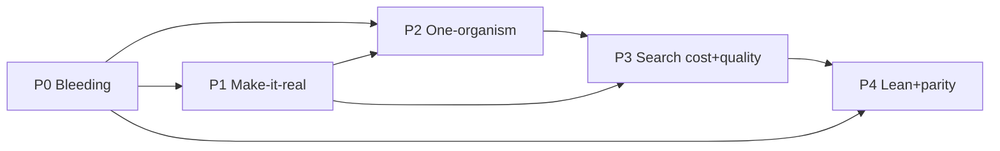
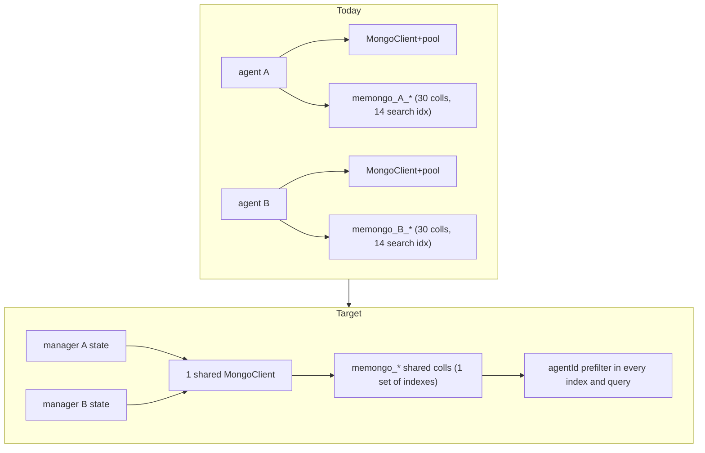

# Memongo Master Fix Plan — 2026-08-03

**Status:** Approved by Rom 2026-08-03. Advisory — no code changes until Rom approves execution per phase.
**Author:** Agent B (winning review) as plan orchestrator, with 5 verification sub-agents.

## Provenance and method

This plan merges and de-duplicates:

- Three independent code reviews (orchestrator 8-perspective review in `/tmp/memongo-review/00-08`, Agent A harmony audit, Agent B 9-perspective review in `.tmp-review/`) — all code-only, no docs read.
- Three adjudications (`09-adjudication.md`, `10-three-way-adjudication.md`, `11-dogfood-vs-code-reviews.md`).
- The dogfood audit (`docs/research/dogfood-audit-2026-08-02.md`).
- Official-docs research (`web-01` MongoDB multitenancy, `web-02` rank/score fusion, `web-03` Vercel middleware, `web-04` Docker security, `web-05` idempotency) plus MongoDB changelog audit (`12-mongodb-changelog-gaps.md`) and targeted lookups (MCP transports, Hono errors, TTL indexes).
- **Independent re-verification of every finding against source code** by 5 sub-agents (files `/tmp/memongo-fixplan/verified-*.md`, `fix-sites-*.md`). Verdicts: 125 CONFIRMED, 10 PARTIAL, 6 OVERSTATED, 0 fully REFUTED. All corrections are registered in Appendix B and baked into the line numbers below.

**Line numbers were re-verified on 2026-08-03 against `main`.** Where a review cited stale lines, this plan uses the corrected ones.

## Locked decisions (Rom + delegated)

| # | Decision | Choice |
|---|----------|--------|
| 1 | Tenancy model | Shared-collection-with-discriminator for BOTH modes; single-tenant = one agentId value (official MongoDB guidance) |
| 2 | Per-agent partitioning default | **Flip default to shared `memongo_` prefix** (delegated to plan author; per-agent prefix stays as opt-in hard isolation) |
| 3 | Idempotency | Client-supplied key (reuse `customId`) + unique partial index + upsert. NOT content hash |
| 4 | Consolidator gate | Mirror the job-queue lease pattern (findOneAndUpdate + leaseToken + fencing) |
| 5 | TTL | Both `structured_mem` and `events`, opt-in per write; session-scope default TTL configurable, off |
| 6 | Contradiction | Wire `mongodb-contradiction.ts` INTO the consolidation loop, flag-gated, default on |
| 7 | Post-CE boosts | Hindsight multiplicative formula now (conservative defaults), calibrate via benchmark after |
| 8 | Auto-trigger | Layered: Pi lifecycle hooks + middleware reliability + MCP prompt policy |
| 9 | KB fusion | `$scoreFusion` with `minMaxScaler` (8.3+); rank + score fusion as first-class options |
| 10 | Docker | Bind 127.0.0.1, no default key, MongoDB auth, dev/prod separation |
| 11 | Vercel cache | Full canonical identity + SHA-256 digest, per-request via providerOptions |
| 12 | Search index degradation | Fail visibly (ready endpoint + boot banner + strict env) |
| 13 | Dead code | Deletions confirmed, proceed |

## How to read this plan

- Phases are dependency-ordered. Items inside a phase are ordered by risk-then-value; items with no dependency note can start immediately.
- Each item: **What** (issue + code site) / **How** (concrete approach + official pattern) / **Deps** / **Risk** / **Effort** (S < 0.5d, M 0.5-2d, L > 2d) / **Validation**.
- Coding standards: TypeScript ESM, Biome (tabs, double quotes), files under ~500 LOC, colocated Vitest tests, repo-root-relative references.
- Every fix that changes behavior ships behind a flag or config knob with the new behavior as default only where stated.

## Phase map

- **P0 Stop the bleeding** — data-integrity bugs, security defaults, pending publishes. Days, small diffs.
- **P1 Make it real** — the dogfood phase: installability, auto-trigger, SDK contract. This is what makes all other quality visible to users.
- **P2 One organism** — shared runtime, one contract source, identity unification, remaining concurrency.
- **P3 Search cost & quality** — embedding amplification, search storm, MongoDB feature adoptions, boosts, indexes.
- **P4 Lean & parity** — cut list, god-file split, tests rebalance, competitor adoptions, release hygiene.

---

# P0 — Stop the bleeding

## P0.1 End-to-end write idempotency

**What:** Retried writes duplicate memories. `customId` is declared in `MemongoAddInput` (`packages/client/src/types.ts:13`) but never serialized (`packages/client/src/client.ts:451-460`); the engine mints a fresh `randomUUID` per attempt (`packages/memory-engine/src/mongodb-manager.ts:8839`); the API accepts no idempotency key (`apps/api/src/routes/v1.ts:1494-1518,1530-1603`); and `writeConversationEvent` can throw AFTER the event is committed (`packages/memory-engine/src/mongodb-manager.ts:8984`, "failed to release staged extraction job"). Correction vs original review: the client retries only 429/503, never 500, so the client's own retry does not fire on the throw-after-commit path — but proxy/network-level 503s and 429-after-commit do duplicate, and the API has no dedup defense at all.

**How (IETF draft-ietf-httpapi-idempotency-key-header-07 + Stripe + MongoDB unique-upsert):**
1. Client: `add`/`writeEvent` serialize `customId`; when absent, generate a UUIDv4 per logical write and reuse it across retries of that call. Stripe guidance: client-generated V4 UUIDs, opaque, no sensitive data.
2. API: accept the key from the `Idempotency-Key` request header (IETF/Stripe convention) or the `customId` body field; forward to bridge/engine.
3. Engine: store `idempotencyKey` on the event document; create a **unique partial index** `{ idempotencyKey: 1 }` with `partialFilterExpression: { idempotencyKey: { $type: "string" } }` (avoids the single-null trap documented for unique indexes; legacy keyless writes unaffected).
4. Write path: key the upsert on the idempotency key with all immutable fields under `$setOnInsert` ("if the update does not result in an insert, `$setOnInsert` does nothing" — official docs; `writeEvent` is already `$setOnInsert`-idempotent on `eventId` at `packages/memory-engine/src/mongodb-events.ts:191-200` — reuse that shape). `returnDocument: "after"` so retries get the original receipt (Stripe: "subsequent requests with the same key return the same result"). E11000 on a lost race → re-read and return the existing receipt.
5. Delete the throw-after-commit at `mongodb-manager.ts:8984`: log the release failure and let `repairExtractionOutbox` recover (it already exists for exactly this).
6. Key reused with a different payload → `422` (IETF §2.7; Stripe `idempotency_error`). Optional later: server fingerprint per IETF §2.4.
7. Migration note: unique index build must tolerate existing data — partial index on string-typed keys only, so no backfill needed.

**Deps:** none. **Risk:** medium (write path). **Effort:** M.
**Validation:** unit — duplicate POST with same key yields one event and identical receipts; e2e — client retry storm against 503-injecting proxy; regression — `mongodb-memory-jobs.e2e.test.ts` stays green.

## P0.2 Consolidator atomic lease

**What:** Phase-0 gate is `findOne` then `insertOne` with no lease, unique index, or fencing (`packages/memory-engine/src/mongodb-consolidator.ts:312-333`). Two replicas both pass and double-run: duplicate fact promotion racing the near-real-time `$vectorSearch` NOOP gate, 2x LLM spend, racing prune. Crashed runs stay `status:"running"` forever.

**How (Rom: mirror the job-queue lease):** replicate `claimMemoryJob` (`packages/memory-engine/src/mongodb-memory-jobs.ts:81-141`) on `consolidationRuns`: `findOneAndUpdate` filter `{ agentId, scope, scopeRef, $or: [ { status: "completed", startedAt: { $lte: cutoff } }, { status: "running", leaseExpiresAt: { $lte: now } }, { status: "running", leaseExpiresAt: { $exists: false } }, { no doc } ] }` with pipeline update setting `status: "running"`, `leaseToken: randomUUID()`, `leaseExpiresAt: { $add: ["$$NOW", leaseMs] }`, `startedAt: "$$NOW"`, `writeConcern: DURABLE_JOB_WRITE_CONCERN` (`:15-18`). Completion mirrors the fence at `:205-237` (`updateOne` filtered by leaseToken + unexpired lease). Stale runs self-reap: the claim filter treats expired-lease running rows as claimable. Upsert the gate doc so first-run works atomically.

**Deps:** none. **Risk:** medium. **Effort:** M.
**Validation:** concurrency test — two parallel `consolidateMemory` calls, exactly one proceeds; crash test — insert stale running row with expired lease, verify re-claim; fencing test — completion with wrong token no-ops.

## P0.3 Sync partial-failure hash masking

**What:** `upsertChunks` logs `writeErrors` and returns `applied` (`packages/memory-engine/src/mongodb-sync.ts:204-212`); the non-transactional branch then writes file metadata with the NEW content hash (`:299-311`), so all future syncs skip the file and the missing chunks are never retried — permanent silent recall gaps.

**How:** on `writeErrors.length > 0`: retry the failed ops individually (ordered, one by one); ops still failing → do NOT write the new metadata hash (write the old hash or skip metadata), so the next sync re-attempts; add `filesFailed` to sync stats so the failure is visible. Transactional path (`:313-347`) is already all-or-nothing — unchanged.

**Deps:** none. **Risk:** low. **Effort:** S.
**Validation:** unit with injected duplicate-key/oversized-doc bulk error → metadata hash unchanged, next sync retries; stats expose the failure.

## P0.4 Episode materialization set divergence

**What:** `checkAutoEpisodeTriggers` selects a window (`packages/memory-engine/src/mongodb-episodes.ts:755-760`), then `materializeEpisode` re-queries events by time range (`:771-781`), absorbing events written mid-flight into `sourceEventIds`/hash, while `markEventsConsolidated` (`:785-790`) marks only the original subset — late events get re-summarized into a second episode (different hash defeats the dedupe at `uq_episodes_source_events`).

**How:** pass the selected `episodeEvents` into `materializeEpisode` (no re-query); `sourceEventIds` = exactly that set; mark exactly that set. Note (not fixed here): the rate-limit check at `:707-726` is also read-then-write; acceptable — worst case is an extra episode, tracked as low-priority follow-up.

**Deps:** none. **Risk:** low. **Effort:** S.
**Validation:** unit — inject an event between selection and materialization (fake clock); assert it is neither in `sourceEventIds` nor marked consolidated; e2e trigger test stays green.

## P0.5 NUL bytes make two critical files invisible to grep

**What:** one literal NUL (0x00) byte in each of `packages/memory-engine/src/mongodb-consolidator.ts:894` and `packages/memory-engine/src/mongodb-episodes.ts:176` (used as string separators). ripgrep/grep classify both files as binary and skip them — verified byte-level during adjudication; audits silently miss these files.

**How:** replace the literal NUL characters with the escape sequence `"\0"` (produces the identical byte at runtime; source is text-safe).

**Deps:** none. **Risk:** none. **Effort:** S.
**Validation:** `rg "conflict" packages/memory-engine/src/mongodb-consolidator.ts` returns matches; `file` reports text; full suite green.

## P0.6 Default credential removal (harmonized with the dogfood 401 lesson)

**What:** `local-dev-secret` is baked into `packages/pi-extension/extensions/index.ts:31` and defaulted in `docker/docker-compose.full.yml:31` and `.env.example`. Security reviews (all three) rate it critical/high. BUT the dogfood proved the baked default is a functional necessity: Pi does not inherit `~/.zshrc` exports, so without it the extension got 401s for days.

**How (both truths at once):**
- Compose: `MEMONGO_API_KEY=${MEMONGO_API_KEY:?set MEMONGO_API_KEY}` (compose-spec required-variable syntax) — copy-paste deploys fail closed.
- `.env.example`: obviously-fake placeholder (`change-me-generate-a-long-random-token`).
- pi-extension: keep a baked default ONLY when the resolved API URL is loopback (`127.0.0.1`/`localhost`/`::1`); for any non-loopback API URL without an explicit key, fail with a clear error naming `MEMONGO_API_KEY`. Local dogfood keeps working with zero env; network-reachable deploys can never use the repo-known credential.

**Deps:** none. **Risk:** low (intentionally breaks deploys relying on the default). **Effort:** S.
**Validation:** `docker compose config` without the var errors; pi-extension unit matrix loopback/non-loopback; non-loopback no-key call produces the new error.

## P0.7 Arbitrary server-side JSON read via `/v1/import/conversations`

**What:** `datasetPath` from the request body flows straight to the engine (`apps/api/src/routes/v1.ts:923-949`); `resolveBenchmarkDatasetPath` already implements `allowedRoots` confinement (`packages/memory-engine/src/mongodb-benchmark-dataset.ts:23-44`) but no caller wires it. Master-key holders can make the server read/parse any absolute `.json`/`.jsonl` path.

**How:** route passes `allowedRoots: [process.env.MEMONGO_DATASET_ROOT ?? <repo datasets dir>]`; reject absolute paths outside the root with 400; keep the existing extension and `..` checks.

**Deps:** none. **Risk:** low. **Effort:** S.
**Validation:** route test — `/etc/passwd.json`-style absolute path → 400; in-root path works.

## P0.8 Safe error envelope (stop leaking internals on ~30 routes)

**What:** catch blocks across `apps/api/src/routes/v1.ts` forward raw `err.message` (Mongo driver errors, absolute paths, parse internals) into 500 bodies (~30 sites, e.g. `:840-842`).

**How (official Hono pattern):** centralize with `app.onError` + `HTTPException` (hono.dev/docs/api/exception). Map known error classes to the existing canonical shape `{ error: { code, message } }` (`apps/api/src/lib/errors.ts:10-17`); unknown errors → generic `INTERNAL` 500 with the detail logged server-side under a request id. Preserve deliberate per-route codes (`VALIDATION_ERROR`, `SELF_EDIT_REJECTED`, …).

**Deps:** none. **Risk:** medium (clients string-matching messages get generic text — acceptable). **Effort:** M (mechanical; route catches delegate to the helper).
**Validation:** route tests assert no driver internals/paths in bodies; deliberate codes still surface.

## P0.9 Publish the already-fixed `MEMONGO_MONGODB_DATABASE` env var

**What:** the env-var fix is on main (`packages/memory-bridge/src/memory-config.ts:57-60`, `backend-config.ts:216-219`) but engine/bridge are still 2.0.0 on npm, and verification confirmed the var is NOT wired into `apps/api/Dockerfile` or any compose file — Docker users cannot set it.

**How:** bump `@memongo/memory-engine` and `@memongo/memory-bridge` to 2.0.1 and publish; add `MEMONGO_MONGODB_DATABASE` to the Dockerfile's documented env list, `docker-compose.full.yml` environment block, and `.env.example`.

**Deps:** none. **Risk:** none. **Effort:** S.
**Validation:** npm dist-tags show 2.0.1; container boots into the env-selected database.

## P0.10 KB fusion: thresholding raw RRF scores silently empties the lane

**What:** `mongodb-kb-search.ts:229-231` filters `$rankFusion` output with `minScore` against RAW RRF scores. RRF ceiling is `sum(weights)/61 ≈ 0.0164` for the configured 0.7/0.3 weights (official RRF formula, web-02), so `legacySearch`'s `minScore` default 0.1 empties the lane entirely and `search()`'s 0.01 keeps ~top-1 only. The general search path already normalizes correctly (`packages/memory-engine/src/mongodb-search.ts:275-315`) — the KB path never got it.

**How (Rom's decision + official docs):**
1. KB fusion becomes a first-class `fusionMethod` option (`"rankFusion" | "scoreFusion"`, mirroring the general path's option at `backend-config.ts:225-232`).
2. On MongoDB 8.3+: use `$scoreFusion` with `input.normalization: "minMaxScaler"` — the only officially documented normalization that yields a comparable [0,1] fused score (web-02; `$scoreFusion` reference). The capability gate already exists (`mongodb-schema.ts:4157`, verified correct at 8.3 per official docs).
3. On 8.1-8.2: keep `$rankFusion` and normalize locally by mirroring `normalizeAndFilterRankFusionResults` (`mongodb-search.ts:299-315`): `score / ((vw+tw) * rrfScore(1))`, clamp [0,1], then threshold. This is a memongo-local convention (official docs are silent on rankFusion normalization — documented as such in code).
4. Plumb `fusionMethod` through KB search options end-to-end (engine → bridge → route → client).

**Deps:** none. **Risk:** medium (KB result sets change — intended). **Effort:** M.
**Validation:** unit mirroring the `mongodb-search.ts` normalization tests; e2e — KB lane returns ranked results under default `minScore` on both gate paths.

---

# P1 — Make it real (the dogfood phase)

## P1.1 Publish `@memongo/mcp` — the flagship agent surface

**What:** `apps/mcp/package.json` is `"private": true`, has no `bin`, runs only via `node --import tsx src/server.ts`. Agents cannot `npx` it; every consumer must clone the monorepo.

**How:** make it publishable — `bin: { "memongo-mcp": "./dist/server.js" }` with `#!/usr/bin/env node` shebang, `files: ["dist"]`, tsc build (drop the tsx runtime dependency), `prepublishOnly` build; add to the publish workflow; extend `scripts/check-publishability.ts` with bin/shebang validation (gap it has today). Transports: stdio remains default (local, single-client per MCP spec); add optional **Streamable HTTP** transport behind `MEMONGO_MCP_TRANSPORT=http` for remote/sandboxed agents (MCP spec 2025-03-26+; the old SSE transport is deprecated).

**Deps:** none. **Risk:** low. **Effort:** M.
**Validation:** `npx -y @memongo/mcp` against a local API; MCP inspector tool-list/call smoke; HTTP transport handshake test.

## P1.2 MCP surface diet + missing extract + consistent envelopes

**What:** 40 registered tools including 8 pure aliases and ~10 admin/benchmark tools — every MCP host pays prompt tokens and selection accuracy for all of them (supermemory ships 7). `memongo_extract` is missing, so the write→extract pipeline cannot complete over MCP. Envelopes are inconsistent (`structuredContent` on some tools only); input schemas on the most-used tools (search/add/write_structured) give LLMs no field guidance.

**How:** default tool list = core ~12 (search, search_detailed, add, write_event, write_structured, recall_conversation, context_bundle, profile, state, self_edit, feedback, extract); admin/benchmark tools behind `MEMONGO_MCP_ADMIN=1`; alias tools behind `MEMONGO_MCP_ALIASES=1` (default off); emit `structuredContent` on every tool; bring search/add/write_structured schemas to the recall-tool description standard (concrete `entry` shape).

**Deps:** P1.1. **Risk:** low (flag-gated). **Effort:** M.
**Validation:** tool-count tests per flag combo; per-tool smoke tests (also feeds P4.2).

## P1.3 Client SDK: stop being a lossy filter (+ first test suite)

**What:** the client silently drops `scope`/`scopeRef` on `add` (:451-460), `search` (:463-477), `searchDetailed` (:480-527), `searchKB` (:528-542), `recallConversation` (:544-560), `extract` (:682-687), `scanNovelty` (:1004-1013 — verified one layer deeper than adjudicated: the client's `MemongoScanNoveltyInput` lacks scopeRef too). Scoped API keys get guaranteed 403 on `/v1/search-kb` (`apps/api/src/app.ts:260-264`). pi-extension already bypasses the client with raw fetch (`packages/pi-extension/extensions/index.ts:185-198`, comment in code). Also: `customId`/`entityContext` declared never sent; error envelope never parsed (`MemongoClientError` carries raw text); `Retry-After` ignored (API sets it, `apps/api/src/app.ts:113`); no request timeout; `process.env` crashes browser/edge runtimes; `getJob`/`getRecallTrace` typed `| null` but throw on 404.

**How:**
1. Add `scope`/`scopeRef` (+`customId` per P0.1) to every input type and forward in every body; throw on unserializable caller fields instead of dropping.
2. Parse `{error:{code,message}}` → `MemongoClientError.code`/`apiMessage`.
3. Honor `Retry-After` (capped) on 429; add `AbortSignal.timeout(opts.timeoutMs ?? 30_000)`; map bridge-down 500s to a retriable status in the API (503 `SERVICE_UNAVAILABLE`) so the existing retry means something.
4. Guard env reads: `typeof process !== "undefined" ? process.env.X : undefined`.
5. Catch 404 in `getJob`/`getRecallTrace` → return null (align type and behavior).
6. Write the package's first test suite: contract tests against a mock Hono app (fixtures exist at `apps/api/src/__fixtures__/contract-fixtures.ts`).

**Deps:** P0.1. **Risk:** medium (public SDK; fields are additive/backward-compatible). **Effort:** M.
**Validation:** new client suite green; pi-extension deletes its raw-fetch bypass and calls `client.searchDetailed({ scope })` (do that deletion in this item).

## P1.4 Layered auto-trigger — the #1 dogfood blocker

**What:** over days of dogfooding the LLM almost never called `memongo_save`/`memongo_search` on its own. pi-extension registers zero lifecycle hooks (verified: only 3 `registerTool` + 1 `registerCommand`); the Vercel middleware auto-injects but captures lossy fire-and-forget; nothing nudges the agent at the prompt layer. Without this, all backend quality is invisible.

**How (Rom: layered; makes memongo self-sufficient, no hermes dependency):**
1. **Pi-extension lifecycle hooks** (the dogfood surface): session-start context injection (profile + recent relevant memories at configured scope) and turn-end auto-capture (user/assistant turns → `/v1/write-event` with idempotency keys derived from turn identity per P0.1; batched/debounced; opt-out config). Verify Pi's actual hook API at implementation time; if turn hooks are unavailable, hook hermes's `memory` tool results as the capture trigger (documented fallback, not the primary design).
2. **Vercel/OpenAI middleware reliability:** per-request identity via `providerOptions` → `params.providerMetadata.<ns>` (the officially documented channel into middleware); after-turn capture via the `onEnd` lifecycle callback (`onStepFinish` is deprecated — official lifecycle-callbacks docs); replace silent `return ""` failures with an `onError` option + default warning.
3. **Prompt layer (any MCP host):** ship a memory-policy block in the MCP server's `instructions` field (MCP-spec server instructions) telling agents WHEN to save/search; rewrite core tool descriptions with explicit when-to-use guidance (the pattern hermes uses for its own tools).
4. **Single-user scope default:** `MEMONGO_SEARCH_DEFAULT_SCOPE` (dogfood observation #5) so single-user deployments stop feeling broken at the `agent` default.

**Deps:** P1.3 (client scope), P1.1 (MCP publish), P0.1 (idempotent capture). **Risk:** medium (new behavior; capture defaults ON for pi-extension per dogfood need, injection scope-configured). **Effort:** L.
**Validation:** replay the dogfood script end-to-end and assert saves/searches occur with zero manual tool calls; middleware units with `providerMetadata`; instructions field present in MCP initialize response.

## P1.5 Vercel middleware cross-tenant cache leak

**What:** module-level `Map` keyed `${userId}:${hash32(query)}` (`packages/tools/src/vercel/index.ts:92-106`), cached memory prepended into other requests' system prompts (`:161-171`). Under Fluid Compute (Vercel's default), concurrent invocations share one global process (official Vercel docs, web-03) — this is a real cross-tenant prompt-injection vector, not theoretical. Severity upgraded vs the original review. 32-bit hash collides at birthday bound (~65k entries). The OpenAI middleware duplicates the same fetch logic raw.

**How (Rom's decision + official AI SDK docs):** cache key = SHA-256 over the canonical identity `{ agentId, apiUrl, apiKeyHash, mode, scope, sessionId, userId, query }`; identity sourced per-request via `providerOptions` (never module closures); keep the bounded 50-entry/60s LRU per key; code comment points to the official external-KV recommendation for production. Route BOTH middlewares through `@memongo/client` with a `silent` option (kills the third hand-rolled fetch implementation; fixes propagate once).

**Deps:** P1.3. **Risk:** medium (cache behavior). **Effort:** M.
**Validation:** units — same query different agentId/scope/apiKey → distinct entries; no cross-tenant serve; digest collision-resistance test.

## P1.6 Docker truth

**What:** API and Mongo ports bind 0.0.0.0 (Docker docs: publishing is "insecure by default"); `docker-compose.minimal.yml` is plain `mongo:7` (no vector search, no transactions — the headline feature silently disabled); the community stack configures `replSetName: rs0` but NOTHING in the repo runs `rs.initiate` (mongot has no oplog; plus an undocumented `--replSetMember` flag that may abort startup); every image floats on `:latest`/`:preview`; default passwords `admin`/`mongotPassword`; no dev/prod separation.

**How (official Docker/compose + MongoDB docs):**
1. All published ports → `"127.0.0.1:..."` short syntax (compose-spec); MongoDB port not published at all in full.yml (`expose:` for inter-container).
2. `minimal.yml`: replace `mongo:7` with `mongodb/mongodb-atlas-local:preview` (the image that actually matches engine expectations) or delete the file; if any degraded stack remains, print a loud startup capability banner.
3. Community stack: add a one-shot init container running `mongosh --eval 'rs.initiate({_id:"rs0",members:[{_id:0,host:"memongo-mongod.memongo-net:27017"}]}])'` (idempotent — tolerate "already initialized"); remove or verify `--replSetMember`; pin every image to a dated tag/digest; passwords become required env (`:?`); `mongod.conf` `bindIpAll` → container-network bind.
4. Dev/prod separation per official compose docs: production-safe base `compose.yaml` + `compose.override.yaml` for dev conveniences.
5. API Dockerfile: document `MEMONGO_MONGODB_DATABASE` env (P0.9); HEALTHCHECK → `/ready` after P1.7.

**Deps:** P0.6, P1.7. **Risk:** low. **Effort:** M.
**Validation:** fresh-machine `compose up` → `/ready` reports vector lane ready; `netstat` shows loopback-only bindings; no-default-password boot fails closed.

## P1.7 Readiness + boot validation + dev CORS

**What:** `/health` is liveness-only (`apps/api/src/app.ts:417`) and Docker HEALTHCHECK hits it — orchestrators route traffic to pods with dead Mongo or missing search indexes; `MEMONGO_MONGODB_URI` errors surface lazily as per-request 500s; the web console is CORS-broken out of the box (CORS middleware only active when `MEMONGO_CORS_ORIGINS` set).

**How (Hono patterns):** add `/ready` beside `/health`: Mongo `ping` + vector probe (reuse `/v1/probes/vector` logic) + search-index readiness; 503 until ready with a per-lane payload. Validate required env at boot in `apps/api/src/server.ts` (fail fast with the engine's existing error message). Point HEALTHCHECK at `/ready`. Default-dev CORS for `http://127.0.0.1:3040`/`localhost:3040` when the env is unset, and log the active CORS policy at boot.

**Deps:** none. **Risk:** low. **Effort:** M.
**Validation:** mongo killed → `/ready` 503 and container unhealthy; boot without URI exits immediately with a clear message; console works on fresh clone.

## P1.8 Delete the impossible Workers deploy target

**What:** `apps/api/wrangler.jsonc` points Cloudflare Workers at `src/server.ts`, which uses `@hono/node-server` `serve()`, `process` signal handlers, and a long-lived MongoClient — none of which can run on Workers. The Dockerfile is the only working target.

**How:** delete `apps/api/wrangler.jsonc` (and the wrangler devDep in apps/api if unused). A genuine Workers entry would require the Atlas Data API instead of the Node driver — out of scope; noted in Appendix A.

**Deps:** none. **Risk:** none. **Effort:** S.
**Validation:** no wrangler references remain in apps/api.

## P1.9 Fail visibly when search indexes are unavailable

**What:** when Atlas Search/vector indexes cannot be created, the engine warns and silently degrades every query to the `$text` last resort. The e2e suite has explicit false-green branches that pass anyway (`packages/memory-engine/src/production-readiness.e2e.test.ts:2470-2479,2505-2512`).

**How:** `/ready` (P1.7) fails with lane detail when the vector lane is unavailable; boot logs a capability table (lanes: hybrid/vector/keyword/text); new env `MEMONGO_REQUIRE_VECTOR=1` refuses to boot without vector search (production deployments); e2e branches replaced with explicit capability assertions (fail the test, don't branch green).

**Deps:** P1.7. **Risk:** low. **Effort:** M.
**Validation:** boot against the degraded stack → banner + `/ready` failure + strict-mode refusal; e2e fails loudly on missing indexes.

---

# P2 — One organism

The core architectural change — collapse the per-agent triple stack into one shared runtime with the discriminator isolation the engine already has:

## P2.1 Shared Mongo runtime (highest-leverage fix in this plan)

**What:** one MongoClient+pool per agentId cached forever (`packages/memory-engine/src/search-manager.ts:14`, `packages/memory-engine/src/mongodb-manager.ts:2191`); default per-agent collection prefix (`packages/memory-engine/src/backend-config.ts:220-224`) creating ~30 collections + ~14 search indexes PER AGENT against the Atlas 2,500 search-index hard limit (~150-agent wall, official limits); every document and index already leads with agentId so the physical isolation pays quadratic cost for isolation the engine gets free; each manager also runs a 1s idle poll (`mongodb-manager.ts:331`, `claimMemoryJob` with `w:"majority"` even when idle); `closeAllMemorySearchManagers` clears `INFLIGHT_INIT` without awaiting, leaking late-initialized managers (`search-manager.ts:108-119`).

**How (official MongoDB multitenancy guidance, web-01):**
1. `MongoDBMemoryManager.create` accepts a shared `MongoClient`; a process-level registry owns one client per URI and closes it at shutdown; managers keep per-agent state (queues, watchers, timers) but never own the client. Roll out behind `MEMONGO_SHARED_CLIENT` (default on after one release of bake).
2. Default `collectionPrefix` flips to shared `memongo_`; per-agent prefix remains as opt-in hard isolation (`MEMONGO_MONGODB_COLLECTION_PREFIX` / config). Ship `scripts/migrate-to-shared-prefix.ts` following MongoDB's official collection-per-tenant→shared migration pattern (docs publish one: add/keep the tenant field — memongo already has `agentId` on every doc — and consolidate per-tenant collections).
3. Fix the close race: `closeAllMemorySearchManagers` awaits or cancels `INFLIGHT_INIT` before clearing; a manager that initializes after close is closed immediately.
4. Bound the manager cache: LRU + idle-TTL eviction that closes the manager's workers/timers (not the shared client).
5. Replace 1s polling with wake-on-write (`wakeMemoryJobWorker` exists at `mongodb-manager.ts:8657-8674`) plus a 30-60s backstop sweep.

**Deps:** P0 items (stable write path). **Risk:** HIGH — core lifecycle; flag-gated rollout. **Effort:** L.
**Validation:** connection-count test at 50 simulated agents (target: one pool); multi-agent e2e; shutdown-race unit (init during close → no leak); idle polling ops/sec ≈ 0.

## P2.2 One contract source

**What:** the wire contract is hand-maintained in four places (routes 2,221 LOC, openapi-spec 2,803 LOC, 40 inline MCP tools, 28 zod tools) and has already diverged (`/v1/self-edit` missing from the spec; scope/scopeRef absent from spec bodies; no bearer scheme; `ApiError` never `$ref`'d). The bridge compensates for a stale engine interface with 13 `*CapableManager` casts (verified count) + ~190 LOC of re-declared types — a third structural copy of the same domain objects. The engine barrel exports 345 symbols (verified), leaking internals as SemVer commitments.

**How:**
1. Create a single route/tool table (in `@memongo/lib` or a small `@memongo/contract` module) describing each operation: path, method, request schema, response schema, error codes, tool name/description. Generate/derive from it: the OpenAPI document, the MCP tool schemas, the zod tools, and the client input types.
2. Bridge: re-export engine types (delete the 13 casts + re-declarations); keep only its real value — tenant-isolation forcing and config resolution.
3. `MemorySearchManager`: make methods non-optional (one backend exists); fix stale signatures (`searchKB` gains `scopeRef`, `extractEvent` gains scope — concrete class already has both).
4. Scope enum single source: `apps/api/src/scope-identity.ts:8` `VALID_SCOPE_VALUES` → move to `@memongo/lib`, replace the verified 6x/5x/5x/2x duplications.

**Deps:** P1.3 (client fields stable). **Risk:** medium. **Effort:** L.
**Validation:** spec-conformance test asserting route request/response SHAPES match the OpenAPI doc (not just path existence, which is all today's test checks); type-level tests; bridge compiles with zero casts.

## P2.3 Scope identity unification

**What:** writes default `scope=agent` (`mongodb-manager.ts:8841`) while search infers `scope=session` whenever a session key is present (`:2905`, `:2474`) — `add({content, sessionId:"s1"})` and `search({query, sessionKey:"s1"})` hit different partitions. The pi-extension compounds it: saves at `workspace`, searches `global` (verified it cannot find its own default-scope saves).

**How:** one canonical identity `{ agentId, scope, scopeRef, sessionId? }` and one rule applied identically on write and read: explicit `scope` wins; `sessionId`/`sessionKey` implies `scope: "session"`; otherwise `scope: "agent"`. Document the identity model in code (types module). pi-extension: one configurable scope used consistently in both directions (default `workspace`).

**Deps:** P1.3. **Risk:** medium (behavior change for implicit-session callers — release note; dogfood showed the current behavior reads as broken). **Effort:** M.
**Validation:** write+read roundtrip tests per scope; pi-extension save→search self-consistency test.

## P2.4 Query cache correctness + stampede protection

**What:** the cache key is `queryHash + agentId + scope + scopeRef` (`packages/memory-engine/src/mongodb-query-cache.ts:145-151,353-370`) — it omits `maxResults`, `minScore`, and `timeRange`, so a cached page serves any parameterization; every miss pays an `estimatedDocumentCount` + a ≤1.5s autoEmbed probe BEFORE retrieval (`:202-263`); no single-flight — N identical concurrent queries all compute full searches; per-write `deleteMany` invalidation (`mongodb-manager.ts:9022-9028`) drives hit rate to ~0 under write load while misses still pay 2 extra RTs; `exactMs` measures the wrong start (`:178`). (Correction: the writeCache race cannot produce partial docs — the unique index makes the loser a benign lost write.)

**How:** include `maxResults`/`minScore`/`timeRange` in the key; in-process single-flight map per key (coalesce concurrent misses); run the semantic probe CONCURRENTLY with the retrieval lanes and cancel on lane success (or gate tier-2 behind an expected-win heuristic); replace per-write `deleteMany` with a debounced scope-level invalidation; fix the `exactMs` measurement.

**Deps:** P2.1 (single-flight coherent with shared runtime). **Risk:** medium. **Effort:** M.
**Validation:** concurrency units (N parallel identical queries → 1 execution); hit-rate benchmark under mixed read/write load; parameter-variation correctness tests.

## P2.5 Remaining concurrency hardening

**What (all verified):** (a) `writeStructuredMemory` revision read-modify-write with identity-only filter — two writers both bump to revision N+1 (`packages/memory-engine/src/mongodb-structured-memory.ts:909-922`); (b) extraction lease fencing is advisory — `leaseLost` checked only AFTER entity/derived writes commit (`mongodb-manager.ts:8507`), and same-value re-mention `$inc`s `reinforcementCount` on re-run (`structured-memory.ts:795-807`); (c) entity/relation bulkWrite swallows E11000 as "partial failure" — losing op's update silently dropped (`mongodb-graph.ts:1586-1597,1699-1721`); (d) `updateStructuredMemoryByHandle` double-read race (`:1068-1092`); (e) shutdown ordering: `writeQueue` awaited only after watcher/stream closed, queued writes can schedule work after workers stop (`mongodb-manager.ts:9154-9229`); `watchTimer` and access-tracker interval not unref'd; `memoryJobRunContexts` leaks entries for never-claimed jobs; (f) lifecycle handles don't enforce revision/state — stale handles update invalidated records (`structured-memory.ts:488-496`).

**How (reuse patterns the engine already has):**
- (a)+(d)+(f): add `revision: existing.revision` to update filters (compare-and-swap) and retry on mismatch — the pattern exists at `persistWithDuplicateKeyRetry` (`:928-947`); by-handle paths enforce state (`state != invalidated`) and expected revision.
- (b): check `leaseLost` BEFORE each side-effecting stage; pass `eventReceiptIds` into derived-memory writes so `hasProcessedSourceEvents` (`:801-809`) short-circuits re-execution.
- (c): retry duplicate-key writeErrors as plain updates (same P1-2 pattern).
- (e): stop writeQueue INTAKE first, then drain, then stop workers; unref both timers; delete runContexts on terminal job states.

**Deps:** P2.1. **Risk:** medium. **Effort:** L.
**Validation:** targeted concurrency units per item against a stateful fake (P4.2); the by-handle CAS test fails before the fix.

## P2.6 `MEMONGO_FORCE_MONGODB_URI` precedence conflict

**What:** the bridge reads it with OPPOSITE precedence to the engine (verified): `memory-config.ts:53` lets the plain URI win, `backend-config.ts:151-157` lets FORCE win. Setting both vars resolves different URIs per layer.

**How:** one resolution rule (FORCE wins everywhere), implemented once in the bridge config and consumed by the engine; document in code.

**Deps:** none. **Risk:** low. **Effort:** S.
**Validation:** config matrix unit (each var alone, both set).

## P2.7 Migration tenant-copy fix

**What:** `backfillEventsFromChunks` reads `chunks.find({ source: { $in: [...] } })` with NO agentId/scope filter and `.toArray()`s the whole collection (`packages/memory-engine/src/mongodb-migration.ts:35-37`), then stamps every output with the CALLER's identity (`:31-32,86-97`) — a shared-prefix migration copies other tenants' chunks into the caller's namespace (and cross-tenant path+hash collides on the deterministic eventId, first writer wins silently).

**How:** filter the source read by the caller's `agentId` (+scope where present); read via cursor in batches (no full `.toArray()`); include `agentId` in the deterministic eventId hash input.

**Deps:** none. **Risk:** low. **Effort:** S.
**Validation:** two-tenant fixture — migration copies only the caller's chunks; eventIds distinct across tenants.

## P2.8 Boundary input validation

**What:** route bodies are cast not validated (`/write-structured` `entry as StructuredMemoryEntry` at `apps/api/src/routes/v1.ts:1643` — a missing key lands `undefined` in the DB identity filter); malformed JSON silently becomes `{}` (`v1.ts:69-80`) instead of 400; no upper cap on search `limit` (`:105-111`, manager `:2897`); MCP hydrate/discovery tools cast arbitrary strings to scope literals (`apps/mcp/src/server.ts:1677-1700`); tools' scanNovelty schemas lack scopeRef (`packages/tools/src/index.ts:424-428,434-439`); free-form `metadata` accepts `$`-prefixed/dotted keys.

**How:** zod schemas per route family (shared with P2.2 where possible): required `type`/non-empty `key`/`value` on `entry`, typed KB filter, metadata key rejection for `$`/`.` prefixes; `readJsonBody` → 400 `INVALID_JSON` on parse failure (keep `{}` only for genuinely empty bodies); clamp `limit` to 100 at `readLimit` AND in the manager; MCP scope validated against the 6-value enum before casting; tools schemas gain `scopeRef`.

**Deps:** P2.2 (shared schemas). **Risk:** medium. **Effort:** M.
**Validation:** fuzz route bodies (malformed JSON, wrong types, operator-shaped metadata) → clean 400s; limit clamp tests.

---

# P3 — Search cost & quality

## P3.1 Kill the query-embedding amplification (forced autoEmbed)

**What:** `backend-config.ts:173-176` validates `rawEmbeddingMode` then hardcodes `embeddingMode` to the default — user config is ignored (double-enforced by the throw at `:192-201`). Every `$vectorSearch` pipeline therefore embeds the identical query text server-side: cache probe + chunks + bridge + evidence + structured/procedural lanes = 4-6 paid embeddings per search at ~2.4s each on Atlas (measured in code comments, `mongodb-query-cache.ts:17-19`). `queryVector` params exist but are always `null` on the v2 path (`mongodb-manager.ts:2673,3468,4760`). Dead knobs `numDimensions`/`quantization` are validated, warned, then `void`-ed (`mongodb-schema.ts:3400-3404`).

**How:** honor configured `embeddingMode` (automated stays the default); compute the query vector ONCE per request where the mode allows and fan it out through the existing `queryVector` params to every lane; where server-side autoEmbed must be used, collapse the cache-probe/chunks/bridge/evidence pipelines so the embed happens once per request (single fused pipeline or shared stage); dead knobs: remove or log at error level that they are ignored.

**Deps:** none. **Risk:** HIGH (search path) — recall-benchmark gate before merge. **Effort:** L.
**Validation:** embedding-call telemetry per search ≤ 1-2 (from 4-6); recall parity within benchmark envelope.

## P3.2 The empty-result search storm budget

**What:** one sparse query can fire 30+ aggregations + repeated embeds: the `mongoSearch` waterfall (scoreFusion → rankFusion → JS-merge (2 aggs) → vector-only re-running the SAME vectorSearch (`mongodb-search.ts:1242`) → keyword → `$text`, `:1098-1320`); plus procedural backstops and a RECURSIVE hybrid backstop (`mongodb-manager.ts:10641-10677`); then `legacySearch` re-runs everything (`:3106,3140,3418`). Cost is inverse to data presence — cold tenants burn the most. (Correction: temporal-coverage/turn-precision post-searches are env-gated OFF by default — production has fewer passes than the raw count suggests; the waterfall/backstop structure is the real issue.)

**How:** stop the waterfall after the first empty result per lane (empty ≠ error — codify as principle, Appendix C); dedupe the js-merge→vector-only double vector search; gate the recursive hybrid backstop on lane-coverage saying data EXISTS; make the `legacySearch` re-run opt-in via config; define a per-search budget (max aggregations / max embeds) enforced in `searchV2` with a telemetry counter.

**Deps:** none. **Risk:** medium (recall edge cases) — benchmark gate. **Effort:** M.
**Validation:** aggregation-count test on an empty corpus (target ≤6); recall benchmark within envelope; sparse-query latency test.

## P3.3 Enable storedSource for Vector Search (changelog gap 1)

**What:** the full infrastructure exists — include-lists per collection, `withVectorStoredSource()`, capability detection, `returnStoredSource` plumbed to pipelines — gated behind `MEMONGO_VECTOR_STORED_SOURCE=1` and default-off due to a server rejection fixed in MongoDB 8.3.7+ (tests document the scar: `mongodb-schema.test.ts:910-956,1160-1316`). Enabling eliminates the collection re-fetch after every `$vectorSearch`.

**How:** verify the pinned Docker images (P1.6) ship ≥ 8.3.7; flip the default ON with a version gate in `detectCapabilities` (`hasServerVersionAtLeast(versionArray, 8, 3, 7)`); keep the env as a kill-switch; register in the P3.6 re-enable registry. If a target image lags, the gate keeps it off with a tracked TODO.

**Deps:** P1.6 (image pinning), P3.6. **Risk:** medium (field regressions — coverage exists). **Effort:** S.
**Validation:** e2e field-parity tests (`mongodb-schema.test.ts:1160-1316` patterns) against the real stack; latency delta measured on the search benchmark.

## P3.4 Scalar quantization: probe-adopt (corrected scope)

**What:** `mongodb-schema.ts:3400-3404` accepts `quantization: "none"|"scalar"|"binary"` then `void`s it. Verification nuance: the server REJECTS `quantization` on autoEmbed (server-managed embedding) index definitions ("Omit quantization to use the default (float)" — scar comment `:3240`, tests `:922,:963`), and memongo forces autoEmbed — so a blind config passthrough would fail index creation. Officially, scalar quantization (~75% memory reduction) applies to vector index definitions where supported.

**How:** probe-adopt per the re-enable principle: pass the configured quantization into `autoEmbedVectorField`; during `ensureSearchIndexes` drift detection, catch the server rejection and record `capabilities.quantization = false` with a log line (same pattern as `searchIndexManagementAvailable`); default stays `"none"`; registry entry tracks Atlas support for quantization on autoEmbed indexes so it self-enables when the server allows it.

**Deps:** P3.6. **Risk:** low (probe + degrade). **Effort:** S.
**Validation:** unit — index creation against a rejecting fake records the capability off; accepting fake passes the config through.

## P3.5 `validationAction: "errorAndLog"`

**What:** `$jsonSchema` validators use `validationAction: "error"` (`mongodb-schema.ts:1511-1512,1566-1567`) — invalid writes fail with no server-side record of what was rejected.

**How:** switch both sites to `"errorAndLog"` (GA since MongoDB 8.1, official 8.2 release notes), gated via `hasServerVersionAtLeast` so older servers keep `"error"`. Zero behavioral change to rejection semantics; validation failures now appear in mongod logs with document and reason.

**Deps:** none. **Risk:** low. **Effort:** S.
**Validation:** validator spec unit; e2e — invalid doc rejected AND logged.

## P3.6 Capability re-enable registry (the principle, codified)

**What:** memongo has a pattern of adopting a MongoDB feature, hitting a version gate or server bug, and leaving it half-wired and disabled (storedSource, quantization, `returnStoredSource` all exhibit this; the index-budget machinery is entirely dead at `:4037-4067`).

**How:** a single registry (code module, e.g. `mongodb-capability-registry.ts`) where every gated feature declares: `minServerVersion` or the external fix that unblocks it, the re-enable condition evaluated inside `detectCapabilities`, and a tracked TODO reference. Seed entries: storedSource (8.3.7), quantization-on-autoEmbed (Atlas support), `$rerank` (Preview, Atlas-managed only), lexical prefilters (Preview), flat indexes (Preview→GA watch). `detectCapabilities` consumes the registry so features self-enable as servers advance.

**Deps:** none. **Risk:** none. **Effort:** S.
**Validation:** registry test — every gated feature has minVersion + re-enable condition + TODO.

## P3.7 Post-CE recency/access boosts (highest-value competitor gap)

**What:** after the Voyage cross-encoder, `score` is overwritten with the CE score (`packages/memory-engine/src/mongodb-reranker.ts:181-190`); the pre-CE boosts (`applyPostRetrievalScoring`, `mongodb-manager.ts:10702`) are erased whenever reranking is on. Recency and reinforcement (`accessCount`, computed but observability-only) never modulate ranking. Hindsight's proven formula multiplies the CE score by recency/temporal/proof boosts — calibration-free because boosts are relative to base score.

**How (Rom: implement now, calibrate after):** new `applyRecencyAccessBoostAfterRerank` mirroring the existing post-CE hook `applyPreferenceEvidenceBoostAfterRerank` (`mongodb-manager.ts:10855`): `score *= (1 + α·(recencyNorm − 0.5)) · (1 + β·(accessNorm − 0.5))`, α=β=0.2 defaults, config-tunable (`reranking.recencyBoost`/`accessBoost`), recency from result `timestamp`, access from `accessCount` (surface it on the result type if absent). Calibrate weights in a follow-up using the benchmark harness; off-switch via zero weights.

**Deps:** none. **Risk:** medium (relevance change) — benchmark gate + off-switch. **Effort:** M.
**Validation:** ordering units (recent/reinforced beats stale at equal CE); NDCG delta within envelope on the benchmark.

## P3.8 Index hygiene + retire request-path `$regex`

**What (verified):** three strict-prefix-redundant indexes (`mongodb-schema.ts:1643` `idx_chunks_path`, `:1780` `idx_structured_agentid`, `:2051` relations trio) — pure write amplification; missing ESR compounds: chunk reads filter path then in-memory filter agentId + sort startLine (`mongodb-manager.ts:6958-6976`), episodes/entities sort `updatedAt` with no supporting index (`mongodb-episodes.ts:484-511`); relation locator JS-matches up to 50 relations per read (`mongodb-manager.ts:6735-6755`); entity/episode lookups run unanchored case-insensitive `$regex` on the request path (`mongodb-graph.ts:861-867` — already escaped, the issue is the scan; `mongodb-episodes.ts:537-543`) while the purpose-built `entity_autocomplete` search index (`mongodb-schema.ts:2910-2943`) sits unused; six BSON `$text` indexes are maintained unconditionally though only needed as the no-mongot fallback; `PROFILE_BUDGETS` are all "unbounded" — budget enforcement is dead code; user-driven `$search`/`$vectorSearch` pipelines pass no `maxTimeMS` (probes have it; `mongodb-manager.ts:1431-1433` does not).

**How:** drop the three redundant indexes; add `{agentId:1,path:1,startLine:1}` on chunks, `{agentId:1,type:1,updatedAt:-1}` on episodes, `{agentId:1,updatedAt:-1}` on entities; add a `relationId` field + index and findOne by it; route entity/episode lookup through `$search` autocomplete with regex only as the no-textSearch fallback; create `$text` indexes only when search-index management is unavailable; either give the community profile a real numeric budget or delete the budget machinery; add `maxTimeMS` to user-driven pipelines.

**Deps:** none. **Risk:** medium (query plans change). **Effort:** L.
**Validation:** `explain()` assertions in tests (index used, no COLLSCAN/in-memory sort on hot shapes); write-amplification benchmark before/after drops.

## P3.9 Write-path batching

**What:** one event write costs ~9-13 sequential round trips (`mongodb-manager.ts:8824-9103`) behind a global per-agent write queue (`:9096-9101`); `/v1/import/conversations` pushes every turn through it (10k turns ≈ 100k RTs); lane-coverage counting does a per-candidate findOne N+1 (`packages/memory-engine/src/mongodb-derived-memory.ts:492-510`); the extraction worker claims one job at a time with a per-event LLM call when enrichment is on.

**How:** add `/v1/write-events` bulk endpoint (insertMany events + bulkWrite for chunks/jobs/coverage, with per-item idempotency keys from P0.1); make lane-coverage counting regex-only (skip DB existence checks — counts only feed planner hints); extraction worker claims K=3 jobs concurrently and batches LLM extraction per session, mirroring the existing `enrichSessionsWithLLM` worker pool (`mongodb-llm-enrichment.ts:784-952`).

**Deps:** P0.1, P2.4. **Risk:** medium. **Effort:** L.
**Validation:** 10k-turn import benchmark (target ≥10x throughput); single-write latency unchanged; extraction backlog drain test.

---

# P4 — Lean & parity

## P4.1 Cut list (all deletions verified against importers)

**What:** dead production code compiled into the published engine: the entire `batch-*` cluster (10 files, ~600 LOC + ~700 LOC tests, zero non-test importers — verified static+dynamic), `embedding-model-limits.ts` (dead twin of the live `embedding-input-limits.ts`), `fact-extraction-eval.ts`, `benchmark-failure-taxonomy.ts` (self-tested only); ~3,900 LOC of benchmark/eval machinery shipped in `src/` (`mongodb-benchmark-runner.ts` 1,977 LOC + dataset + parity-envelope + quality-contracts + harness + readiness + `mongodb-e2e-qa.ts` imported by the production manager at `:183`); engine test LOC (66,349) exceeds source LOC (56,715) across three eval generations; byte-identical duplicate `docker/docker-compose.yml`; 345-symbol barrel (`packages/memory-engine/src/index.ts`).

**How (deletion order, verified safe):** unexport the benchmark/eval barrel blocks (`index.ts:212-221` + type exports `:67-72,:325-329,:365` — tests import direct from module files and apps use the live manager method, so unexporting is in-repo safe); MOVE the benchmark/eval modules to `scripts/` or a dev-only private package (do NOT delete — they are the calibration harness for P3.7/P4.4); remove the `runE2eQa` import from the manager; delete the `batch-*` cluster + three dead modules + their tests; delete the duplicate compose file; consolidate the three eval generations (`scripts/` stack, mega e2e suites, engine-internal runner) into one canonical home; trim the barrel to ~50 exports (manager + config + request/response types), everything else behind an explicit `@memongo/memory-engine/internal` subpath with a deprecation window.

**Deps:** none (do before P4.3). **Risk:** medium (public API SemVer — window + subpath). **Effort:** L.
**Validation:** build + `publint`/`attw` per tarball; full suite; `scripts/check-publishability.ts` extended (P4.5) passes.

## P4.2 Thicken list (rebalance test investment)

**What:** zero tests on the most attack-facing code: `packages/lib` (`ssrf.ts`, `redact.ts`, `retry.ts`, `auth.ts`), `packages/client` (1,049-LOC public SDK), `packages/pi-extension` (447 LOC); one 355-LOC test for the 40-tool MCP server; and the three biggest suites mock away exactly the layers containing the P0/P2 bugs (manager/consolidator/app tests mock all collection accessors, job system, bridge).

**How:** unit-test lib's pure functions (cheap, high value); client contract tests (P1.3 delivers); MCP per-tool smoke tests (P1.2 delivers); pi-extension hook tests (P1.4 delivers); introduce a stateful Mongo fake (or `mongodb-memory-server`) for the manager write path and consolidator gate — assert collection STATE, not call wiring; one integration test proving a post-persist failure does not produce a client-visible duplicate (P0.1 regression). Order: write each new test BEFORE its fix within the owning item (TDD), so every P0-P3 item lands with a failing-then-passing test.

**Deps:** runs inside each owning item. **Risk:** none. **Effort:** L (spread across items).
**Validation:** coverage on lib/client/mcp/pi-extension; new tests demonstrably fail pre-fix.

## P4.3 God-file split

**What:** `mongodb-manager.ts` 11,266 LOC / ~50 public methods (repo guideline ~500) and `mongodb-schema.ts` 4,297 LOC / 99 createIndex sites; the manager's test file is 7,242 LOC.

**How:** AFTER P4.1 removes the benchmark code (shrinks the manager by ~2,500 LOC), split along the seams that already exist as sibling modules: search orchestration, write path, jobs/workers, admin/status, sync/watchers into collaborator classes the facade delegates to; split schema into per-domain index modules; the 7,242-LOC test splits with it. Freeze new features in these two files until the split lands.

**Deps:** P4.1. **Risk:** HIGH (mechanical but huge) — full test gate, no public API change. **Effort:** L.
**Validation:** entire suite green; public exports unchanged; file sizes under guideline.

## P4.4 Competitor adoptions

**What/How (each behind a flag/config, each benchmark-gated):**
1. **TTL expiration** (Rom: both collections): optional per-write `expiresAt` on `structured_mem` and `events`; partial TTL indexes `{ expiresAt: 1 }, { expireAfterSeconds: 0, partialFilterExpression: { expiresAt: { $exists: true } } }` (official TTL docs; background sweep runs ~60s, so read paths ALSO filter `expiresAt > now`); session-scope default TTL config, off by default. Index site: near `mongodb-schema.ts:2188` (the existing revisions TTL pattern).
2. **Contradiction wiring** (Rom: inside consolidation loop): replace the `hasConflict` skip (`mongodb-consolidator.ts:666-678`) with resolve: `detectContradictions` → `invalidateContradictedFacts` → re-evaluate the candidate; flag-gated, default on.
3. **LLM-adjudicated dedup** (hindsight): optional phase between the NOOP gate (0.85) and prune: candidates in band [0.75, 0.92] get a 1-by-1 LLM merge verdict; on merge, write synthesized union text and fold `sourceEventIds` as the proof-count analog; config flag.
4. **Temporal proximity scoring** (hindsight): in time-windowed lanes, score proximity to the inferred window midpoint — reuses `extractTemporalWindow`.
5. **UUID→int mapping** (mem0): when rendering memory ID lists to LLMs (self-edit, feedback flows), map UUIDs to small integers to kill ID hallucination; ~15 lines.

**Deps:** P3.7 (boosts pattern established), P0.10. **Risk:** medium each. **Effort:** M-L each.
**Validation:** per-feature tests; benchmark gates; flags off-proof via config.

## P4.5 Version & release hygiene

**What:** no `prepublishOnly` builds (stale dist ships on manual publish); no `engines` on published packages; `mongodb: "7.2.0"` exact-pinned on consumers; version numbers disagree across surfaces (OpenAPI 1.0.0, MCP 0.1.0, packages 2.0.0, pi-extension 2.1.1); no client↔server version telemetry; check-publishability misses bin/shebang, publint/attw, engines, version consistency.

**How:** `prepublishOnly: bun run build` on every publishable package; `"engines": { "node": ">=20.19.0" }` everywhere; `"mongodb": "^7.2.0"`; derive OpenAPI + MCP server versions from the workspace package version at build time; client sends `x-memongo-client-version`, `/v1/status` echoes server version; extend `scripts/check-publishability.ts` with publint + `@arethetypeswrong/cli`, bin/shebang validation, engines assertion, cross-package version consistency; adopt a single release process doc (or changesets).

**Deps:** none. **Risk:** low. **Effort:** M.
**Validation:** publish dry-run passes all new gates; version fields agree across surfaces.

---

# Appendix A — Future watchlist (explicitly NOT actionable now)

- **Native `$rerank` aggregation stage** (Preview, Jun 2026, Atlas-managed ONLY — not Atlas Local): could replace the external Voyage HTTP call in `mongodb-reranker.ts` with an in-pipeline stage; external reranker must remain as fallback. Watch GA.
- **Lexical prefilters for Vector Search** (Preview, Nov 2025): could collapse the dual-pipeline hybrid architecture into a single `$vectorSearch` with analyzed-text prefiltering. L effort; revisit at GA.
- **`$vectorSearch` over arrays of embeddings** (Preview, Apr 2026): multi-granularity vectors per document; L effort.
- **Search indexes on Views** (GA 8.1+): centralize bi-temporal/scope filters into views; M effort.
- **Sorted Atlas Search indexes** (GA, Jul 2026): index-time sort for updatedAt/timestamp lanes; M effort.
- **`$searchMeta` faceting** (GA 2025-2026): memory-browser facets for the web console; M effort.
- **HNSW construction parameter tuning** (GA, Jun 2025): per-collection recall/latency tuning; M effort, needs benchmarking.
- **`$linearFill`/`$fill`** (GA 8.0): telemetry gap-filling for analytics; S effort.
- **Observation→reflection two-tier condensation** (mastra pattern): cheaper profile/summary pipeline; design candidate.
- **Cloudflare Workers API target**: would require Atlas Data API instead of the Node driver; deferred (P1.8 deletes the broken config).

# Appendix B — Corrections registry (claims adjusted after code re-verification)

1. **Client retry nuance (my review imprecise):** the client retries only 429/503, never 500 — the throw-after-commit→500 path is not retried by the client itself; duplicate risk is proxy/network-level 503/429-after-commit. P0.1 covers both.
2. **Vercel cache severity UPGRADED (my review under-rated):** Fluid Compute shares module state concurrently across tenants by default — real cross-tenant prompt-injection vector, not a low-severity harmony nit. Fixed in P1.5.
3. **scoreFusion 8.3 gate is CORRECT (my earlier claim wrong):** official docs state `$scoreFusion` requires MongoDB 8.3+; the code gate at `mongodb-schema.ts:4157` is right. No downgrade; the KB fix (P0.10) uses the correct gates.
4. **Cache writeCache race benign:** unique index `uq_query_cache_hash_agent_scope_scoperef` + server upsert atomicity — loser is a swallowed DuplicateKeyError, not a partial doc.
5. **structured_mem `sourceEventIds` already capped** at `MAX_SOURCE_EVENT_IDS = 200`; only graph collections need bounds.
6. **Graph regex already escaped** (`mongodb-graph.ts:861-862`); the live issue is the unanchored substring scan, not injection.
7. **`MEMONGO_FORCE_MONGODB_URI` precedence CONFLICT** (two readers, opposite: `memory-config.ts:53` vs `backend-config.ts:151-157`) — new item P2.6.
8. **`MEMONGO_MONGODB_DATABASE` NOT wired into Dockerfile/compose** despite the containerize commit — folded into P0.9/P1.6.
9. **Temporal-coverage/turn-precision post-searches are env-gated OFF by default** — production search has fewer passes than raw counts; storm fix (P3.2) targets the waterfall/backstop structure.
10. **KB threshold actual default 0.01** (Agent A's "0.1" was the legacySearch default, not the KB default); the RRF-range mismatch is the real bug (P0.10).
11. **Query cache key = queryHash+agentId+scope+scopeRef** (not "only query string"); it omits maxResults/minScore/timeRange (P2.4).
12. **Legacy structured_mem unique index pair already dropped at runtime** — one live unique index; the create/drop dance remains worth cleaning (P3.8).
13. **Quantization cannot be blindly enabled** — autoEmbed indexes reject it server-side today; P3.4 is probe-adopt, not a flip.
14. **maxTimeMS exists on probes** (semantic/convergence); missing only on user-driven pipelines (P3.8).
15. **Consolidation quarantine IS wired** (`mongodb-consolidator.ts:626-649`, NUL-hidden from grep) — no classifier wiring needed.
16. **Engine public API = 345 exports** (not ~80); bridge = 13 CapableManager casts (not 12/18); `memongo-export.ts` lives in the bridge (164 LOC).

# Appendix C — Standing principles

1. **Re-enable registry:** every version/bug-gated feature carries a minVersion/fix reference, a re-enable condition in `detectCapabilities`, and a tracked TODO (P3.6). Half-wired features must never rot invisibly.
2. **Empty ≠ error:** fallback machinery fires only when lane coverage says data exists; an empty result is a valid answer, not a trigger for escalation (P3.2).
3. **One canonical identity:** `{ agentId, scope, scopeRef, sessionId? }` threaded identically through writes, reads, and every cache key (P1.5, P2.3, P2.4).
4. **Collapse, don't add:** one MongoClient, one contract source, one lease primitive, one error envelope, one eval home, one deploy target. Lean and good are the same motion.
5. **Safety invariants stay:** injection quarantine, candidate-derived scope isolation, timing-safe auth, fail-closed scoped keys — these are differentiators; every fix must preserve them.
6. **TDD per item:** each fix lands with a test that fails before and passes after (P4.2).

# Rollout notes

- **Flag budget:** `MEMONGO_SHARED_CLIENT` (P2.1), `MEMONGO_MCP_ADMIN`/`MEMONGO_MCP_ALIASES` (P1.2), `MEMONGO_REQUIRE_VECTOR` (P1.9), `MEMONGO_SEARCH_DEFAULT_SCOPE` (P1.4), boost weights (P3.7), contradiction resolution (P4.4.2), adjudicated dedup (P4.4.3). All other changes are bug fixes or additive.
- **SemVer:** P0-P1 fit patches/minors on 2.0.x. P2.1 (prefix default flip) and P4.1 (barrel trim) warrant a minor-with-migration-notes or 3.0 with the /internal subpath window.
- **Benchmark gates:** P3.1, P3.2, P3.7 and every P4.4 item must pass the existing recall/relevance benchmark envelope before merge; calibration follow-ups are scheduled work, not afterthoughts.
- **Verification artifacts:** `/tmp/memongo-fixplan/verified-*.md` and `fix-sites-*.md` contain the per-claim verdicts and verbatim code shapes used to write this plan.
