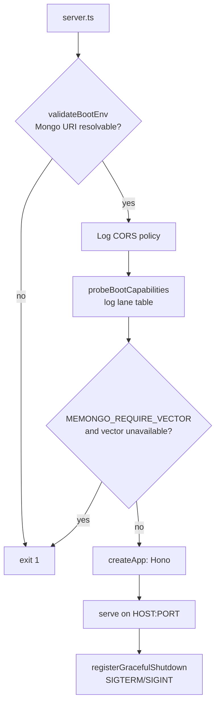
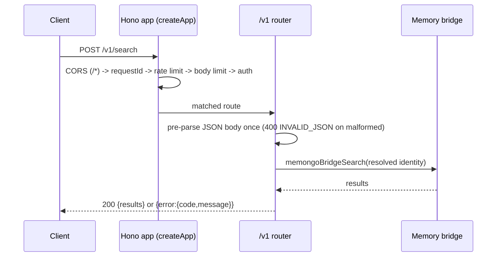

# HTTP API App (`@memongo/api`)

The Memongo HTTP API is a private Hono application in `apps/api/` that exposes the memory engine over REST. It is the network boundary of the platform: the [MCP server](../mcp/index.md), the [web console](../web/index.md), the [client SDK](../../packages/client.md), and any external agent all reach memory through this server. In-process it delegates everything to the [memory bridge](../../packages/memory-bridge.md) (`@memongo/memory-bridge`), never to the engine directly.

Key facts (from `apps/api/package.json`):

- Runtime entry: `apps/api/src/server.ts` via `node --import tsx` (`bun run start`, `bun run dev` with `--watch`).
- Dependencies: `hono` ^4.12, `@hono/node-server` ^1.19, `@memongo/memory-bridge`, `@memongo/lib`, `zod` ^3.25.
- Production build: `tsc` to `dist/`, run with plain Node (no tsx) — see `apps/api/Dockerfile`.
- Default bind: `127.0.0.1:3847` (`MEMONGO_API_HOST` / `MEMONGO_API_PORT` in `apps/api/src/server.ts`).

## How the server starts

`apps/api/src/server.ts` runs a strict boot sequence before it binds the port:

1. **Validate MongoDB config** — `validateBootEnv()` (`apps/api/src/lib/boot-env.ts`) resolves config through the bridge's `buildMemongoConfig` (env first, then `~/.memongo/memongo.json`). If no URI is resolvable it prints the engine's canonical message and `process.exit(1)` — the server never boots "healthy" while misconfigured.
2. **Log the CORS policy** — `resolveCorsPolicy()` reports whether origins come from `MEMONGO_CORS_ORIGINS` or the dev defaults, so operators can tell which mode is in effect.
3. **Probe search capabilities** — `probeBootCapabilities()` (`apps/api/src/lib/capabilities.ts`) calls `memongoBridgeCapabilities` and logs a lane table (hybrid / vector / keyword / text). This also warms the cached engine manager so the first real request is fast. A probe failure degrades the table instead of crashing boot.
4. **Strict vector mode** — when `MEMONGO_REQUIRE_VECTOR=1`, `enforceRequiredVector()` refuses to boot (exit 1) if the vector lane is unavailable, rather than silently degrading every query to `$text`.
5. **Build the app and serve** — `createApp()` from `apps/api/src/app.ts` constructs the Hono app; `@hono/node-server` binds it.
6. **Register graceful shutdown** — `registerGracefulShutdown()` (in `apps/api/src/app.ts`) listens for SIGTERM/SIGINT, stops accepting connections, closes the bridge (flushing the access tracker and Mongo clients), then exits 0 — or exits 1 if the 15-second timeout elapses first, so it never blocks a container runtime's kill window.

## Environment variables

| Variable | Default | Purpose |
|----------|---------|---------|
| `MEMONGO_MONGODB_URI` | — (required) | MongoDB connection string; validated at boot (`apps/api/src/lib/boot-env.ts`) |
| `MEMONGO_MONGODB_DATABASE` | `memongo` | Database name |
| `MEMONGO_FORCE_MONGODB_URI` | — | Override a file-configured URI (used by memongo-api/CI) |
| `MEMONGO_API_KEY` | — | Static bearer token for `/v1/*` |
| `MEMONGO_API_SCOPED_KEYS` | — | JSON array/object of scoped key policies (`agentIds` / `scopes` / `scopeRefs` allow-lists); see [routes and middleware](routes-and-middleware.md) |
| `MEMONGO_ALLOW_INSECURE_NO_AUTH` | off | Permit unauthenticated `/v1` for trusted local dev (logs a loud warning) |
| `MEMONGO_CORS_ORIGINS` | dev defaults | Comma-separated explicit origins; `*` is rejected (`parseCorsOrigins` in `apps/api/src/app.ts`) |
| `MEMONGO_API_RATE_LIMIT` | `600` | Requests per window per identity; `0` disables |
| `MEMONGO_API_RATE_WINDOW_MS` | `60000` | Rate-limit window |
| `MEMONGO_API_MAX_BODY_BYTES` | `1000000` | Body cap, enforced before JSON parsing; `0` disables |
| `MEMONGO_TRUST_PROXY` | off | Trust `X-Forwarded-For` for rate-limit identity |
| `MEMONGO_REQUIRE_VECTOR` | off | Refuse to boot without vector search (`apps/api/src/lib/capabilities.ts`) |
| `MEMONGO_API_PORT` | `3847` | Listen port |
| `MEMONGO_API_HOST` | `127.0.0.1` | Listen host (`0.0.0.0` in Docker) |

Auth is fail-closed: with no `MEMONGO_API_KEY`, no scoped keys, and no insecure override, every `/v1/*` request gets `401 AUTH_NOT_CONFIGURED` (`apps/api/src/app.ts`). Full auth detail is in [routes and middleware](routes-and-middleware.md); the security model as a whole is in [security](../../security.md).

## Health, readiness, and discovery endpoints

Three unauthenticated routes live outside `/v1` (`apps/api/src/app.ts`):

- **`GET /health`** — cheap liveness: `{ ok: true, service: "memongo-api" }`.
- **`GET /ready`** — deep readiness from `checkReadiness()` (`apps/api/src/lib/readiness.ts`). Three lanes, all required, probed in parallel: `mongo` (live round-trip through the bridge), `vector` (vector-search availability), `embedding` (embedding-provider availability). Returns 200 only when all lanes are up, 503 otherwise. Lane messages are sanitized — URI credentials are redacted (`mongodb://***@`) and messages capped at 300 chars — because the route is infra-facing and unauthenticated.
- **`GET /openapi.json`** — the full OpenAPI 3.0.3 document; see [openapi](openapi.md).

The Docker `HEALTHCHECK` in `apps/api/Dockerfile` polls `/ready`.

## Scope identity resolution

Tenant identity (`agentId`, `scope`, `scopeRef`, session identifiers) is resolved by `apps/api/src/scope-identity.ts`, which exists to fix the auth-vs-execution divergence class (issue #57): the auth layer and the route layer must derive identity from **the same merged input**, or a request could pass auth under one identity while executing under another.

- `resolveScopeInput(c)` merges query params with the JSON body (body wins), using Hono's cached `c.req.json()` so it is safe to call from both middleware and handlers.
- `resolveScopeField(input, field)` searches the top-level object plus the nested containers the API accepts (`handle`, `entry`, `memory`, `params`); the first non-empty trimmed string wins, top-level first.
- `resolveRequestAgentId(c)` is the authoritative agentId used for manager/partition selection.
- The canonical scope enum is re-exported from `@memongo/lib` (`MEMORY_SCOPE_VALUES`: `session, user, agent, workspace, tenant, global`), so auth policy validation, request resolution, the OpenAPI document, and MCP tool schemas all validate against one array.

## Containerization

`apps/api/Dockerfile` is a three-stage build: `turbo prune --docker @memongo/api` (Node slim) → install and build with Bun → a minimal `node:22-slim` runner running as the `node` user (UID 1001), `EXPOSE 3847`, `MEMONGO_API_HOST=0.0.0.0`, with a `HEALTHCHECK` hitting `/ready`. See [deployment](../../deployment.md) for compose stacks.

## Request pipeline at a glance

## Source map

| File | Role |
|------|------|
| `apps/api/src/server.ts` | Boot sequence, serve, graceful shutdown wiring |
| `apps/api/src/app.ts` | `createApp()`: CORS, request ID, rate limit, body limit, auth middleware, health routes |
| `apps/api/src/routes/v1.ts` | All 45 v1 route handlers |
| `apps/api/src/openapi-spec.ts` | OpenAPI 3.0.3 document (see [openapi](openapi.md)) |
| `apps/api/src/scope-identity.ts` | Shared scope/identity resolution (issue #57) |
| `apps/api/src/lib/errors.ts` | Error envelope, 500/503 classification |
| `apps/api/src/lib/readiness.ts` | `/ready` three-lane probe |
| `apps/api/src/lib/boot-env.ts` | Boot-time MongoDB URI validation |
| `apps/api/src/lib/capabilities.ts` | Search-lane capability table, strict vector mode |
| `apps/api/src/lib/validation.ts` | zod boundary schemas, `InvalidJsonError` |
| `apps/api/src/contract-conformance.test.ts` | CI gate: router vs OpenAPI vs contract table |
| `apps/api/Dockerfile` | Production image |

## Related pages

- [Routes and middleware](routes-and-middleware.md) — route catalog and middleware details
- [OpenAPI spec](openapi.md) — spec generation and contract conformance
- [API endpoint reference](../../api/index.md) — per-endpoint request/response reference
- [Client SDK](../../packages/client.md) — HTTP client that calls this API
- [Memory bridge](../../packages/memory-bridge.md) — in-process facade the API delegates to
- [Security](../../security.md) — auth model, SSRF, secrets handling
- [Deployment](../../deployment.md) — Docker and compose deployment

---
Active contributors: Rom Iluz (19 commits touching `apps/api/`).
