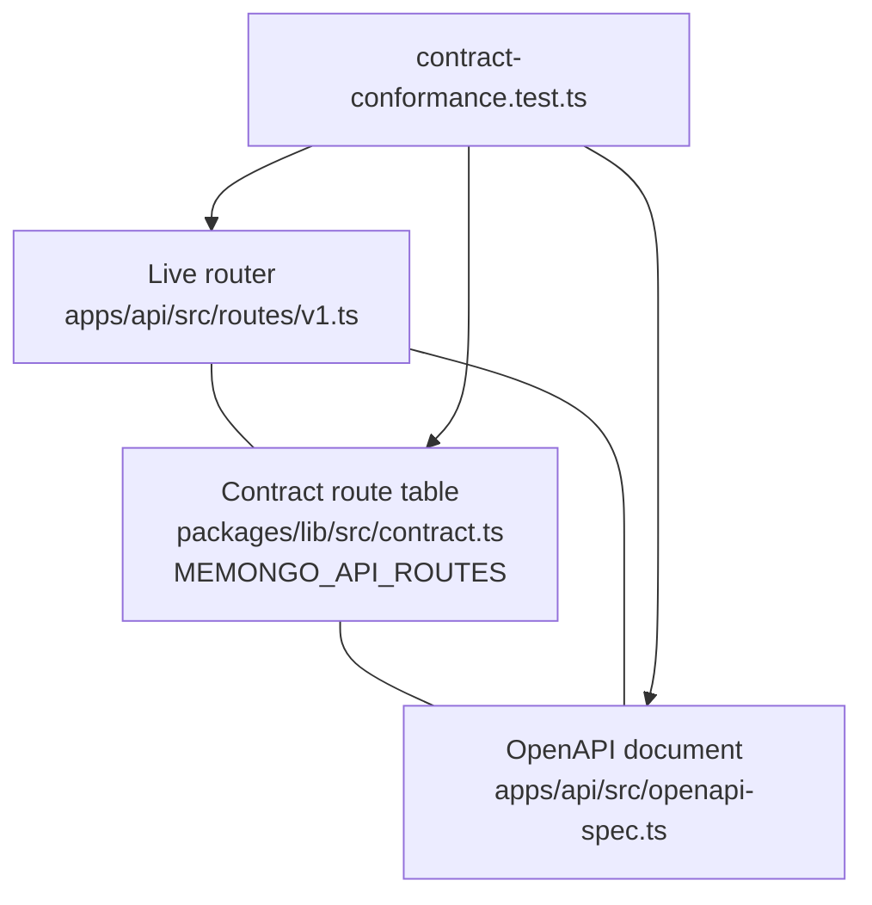

# OpenAPI Specification

The API's OpenAPI document is a **hand-written, contract-checked** OpenAPI 3.0.3 spec in `apps/api/src/openapi-spec.ts` (~3,000 LOC), served live at `GET /openapi.json` (unauthenticated, mounted in `apps/api/src/app.ts`). It is not generated from code annotations, and nothing is generated from it — its correctness is enforced by a CI conformance test against the real router instead.

Document header (`apps/api/src/openapi-spec.ts`):

- `openapi: "3.0.3"`, `info.title: "Memongo API"`, `info.version: "1.0.0"`.
- `servers: [{ url: "/" }]` — the spec is host-relative.
- Global `security: [{ bearerAuth: [] }]` with the `bearerAuth` HTTP bearer scheme defined in `components.securitySchemes`.
- `components.schemas.ApiError` — the single shared error envelope.

## What it covers

- **`/health`** and **`/openapi.json`** — the infra endpoints, documented alongside the v1 API.
- **Every `/v1/*` route** registered in `apps/api/src/routes/v1.ts` — all 45 of them; the conformance test fails if any registered route lacks a documented path + method.
- **Request bodies** for the search, write, lifecycle, and admin families, including:
  - The canonical scope enum (`session, user, agent, workspace, tenant, global`) applied to every `scope` field.
  - Deprecated compatibility aliases marked `deprecated: true` — `q` / `maxResults` / `containerTag` on `/v1/search` and similar — so consumers know the modern field names without breaking old clients.
  - Rich nested schemas for the benchmark family (`/v1/admin/relevance/benchmark`, `/v1/admin/benchmarks/ingest`): dataset contracts (`longmemeval`, `locomo`), quality thresholds, retrieval metric grids (`recallAny/All@1/3/5/10/30/50`, `ndcgAny/All@...`), and evaluator provenance (source repository, commit, eligibility policy, candidate projection, comparability).
- **Error responses**: every contract route's documented error statuses use the shared `ApiError` `$ref`, so no route can drift to its own error body shape.

## The single contract source

Shared fragments do not live in the spec file — they are imported from `@memongo/lib` (`packages/lib/src/contract.ts`), which is the one contract source for the whole platform:

| Fragment | Source in `@memongo/lib` | Used for |
|----------|--------------------------|----------|
| `MEMORY_SCOPE_VALUES` | canonical scope enum | spec `scope` enums, auth policy validation (`apps/api/src/app.ts`), request resolution (`apps/api/src/scope-identity.ts`), MCP zod tool schemas |
| `MEMONGO_API_ROUTES` | route table: method, path, required fields, `errorStatuses` | conformance test + error-response derivation |
| `API_ERROR_OPENAPI_SCHEMA` / `API_ERROR_OPENAPI_REF` | `{ error: { code, message } }` envelope | `components.schemas.ApiError` and every error response |
| `BEARER_SECURITY_SCHEME` / `BEARER_SECURITY_SCHEME_NAME` | HTTP bearer scheme | `components.securitySchemes` + global `security` |
| Field descriptions (`AGENT_ID_FIELD_DESCRIPTION`, `SCOPE_FIELD_DESCRIPTION`, `SCOPE_REF_FIELD_DESCRIPTION`) | shared doc strings | consistent field docs across operations |

Because auth, execution, the spec, and the MCP tools all validate scope strings against the same array, the authorization layer and the execution layer cannot disagree about which scopes are valid (the issue #57 divergence class).

## The derivation pass

`openApiSpec` is exported as `withContractConformance(openApiSpecDocument)` (`apps/api/src/openapi-spec.ts`). The pass walks `MEMONGO_API_ROUTES` and, for every documented operation, ensures each of the route's declared `errorStatuses` exists in `responses` with the `ApiError` `$ref` content — preserving any existing description, adding missing statuses with a default description ("Validation error", "Not found", "Request rejected", "Internal server error"). Hand-written 200 payloads stay hand-written; only the error envelope is derived, so error bodies cannot drift route-by-route.

## How it is kept honest: the conformance test

`apps/api/src/contract-conformance.test.ts` is the CI gate that makes "the spec matches the server" a tested invariant rather than a convention. It instantiates the **real v1 router** (`createV1Router()` — handlers are never invoked, so no bridge mock is needed) and cross-checks three artifacts:

The test fails on any of:

- A registered route with no documented operation (path + method).
- The contract table not covering exactly the registered route set.
- Missing required request fields in the spec's request-body schema.
- Undocumented error statuses, or error bodies not using the shared `ApiError` envelope.
- A missing bearer security scheme, or a divergent scope enum.

`apps/api/src/app.test.ts` additionally exercises `/openapi.json` end-to-end through the app.

## Maintenance workflow

Adding or changing a route touches three places, and CI refuses to let them diverge:

1. **Implement** the handler in `apps/api/src/routes/v1.ts`.
2. **Register** the route (method, path, required fields, error statuses) in `MEMONGO_API_ROUTES` in `packages/lib/src/contract.ts` — the `withContractConformance` pass then derives the error responses automatically.
3. **Document** the operation (summary, request schema, 200 response) in `apps/api/src/openapi-spec.ts`.

Because error envelopes and scope enums are derived/shared, step 3 is only ever about the route's own request and success shapes.

## Relationship to the client SDK

The [client SDK](../../packages/client.md) (`@memongo/client`) is **hand-written against the same contract**, not generated from this spec: `packages/client/src/client.ts` calls the same `/v1/*` paths, and `packages/client/src/types.ts` defines its own `MemongoScope` union mirroring the six canonical scope strings. The spec is the human/machine-readable reference for the API; the client is the typed consumer. Both are pinned to the same route set — the conformance test guards the server↔spec side, and the client's own tests (`packages/client/src/client.test.ts`) pin the request shapes it sends. The [MCP server](../mcp/index.md) reaches the API exclusively through that client, so spec, client, and MCP tool surface all describe the same 45 routes.

## Related pages

- [API app overview](index.md) — server boot, env, health endpoints
- [Routes and middleware](routes-and-middleware.md) — the route catalog this spec documents
- [API endpoint reference](../../api/index.md) — rendered per-endpoint reference
- [Client SDK](../../packages/client.md) — the typed consumer of this contract

---
Active contributors: Rom Iluz (19 commits touching `apps/api/`).
