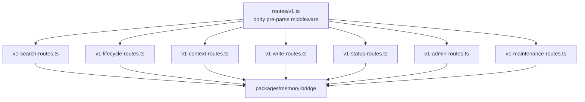

# Routes and middleware

Active contributors: Rom Iluz

This page details the middleware pipeline in `apps/api/src/app.ts`, the eight route families under `apps/api/src/routes/`, and how the OpenAPI document is assembled from the `apps/api/src/openapi-*.ts` files. See [API](index.md) for the app's overall shape and directory layout, and [Security](../../security.md) for the security rationale behind auth, CORS, and rate limiting.

## Middleware pipeline

`createApp()` in `apps/api/src/app.ts` builds the Hono app by registering middleware in a fixed order:

1. `secureHeaders()` on `*` — baseline hardening headers on every response, including `/health`.
2. `app.onError` — catches every error thrown anywhere below. A deliberate `HTTPException` returns its own response; anything else goes through `lib/errors.ts`'s `internalError`, which logs the raw error under a request id and returns a sanitized envelope.
3. `cors()` on `/*` — only if `MEMONGO_CORS_ORIGINS` resolves to a non-empty origin list. `resolveCorsPolicy` falls back to `DEV_DEFAULT_CORS_ORIGINS` (the web console's dev ports) when the env var is unset, and rejects a `*` wildcard outright.
4. `requestId()` on `/v1/*` — assigned before rate limiting or auth so every rejection downstream can be correlated in logs.
5. Rate limiter on `/v1/*` (skipped if `MEMONGO_API_RATE_LIMIT=0`) — a fixed-window, in-memory, per-app-instance limiter (`createRateLimiter`). The bucket key is a SHA-256 hash of a matched bearer credential, or the trusted-proxy `X-Forwarded-For` IP, or a single `anonymous` bucket — never the raw attacker-supplied token, and never an unbounded set of buckets (`RATE_LIMIT_MAX_BUCKETS` fails closed for new identities once saturated).
6. `bodyLimit()` on `/v1/*` (skipped if `MEMONGO_API_MAX_BODY_BYTES=0`, default 1,000,000 bytes) — runs before any JSON parsing so an oversized payload is rejected without being buffered.
7. Bearer auth on `/v1/*` — see "Auth resolution" below. If neither `MEMONGO_API_KEY` nor any scoped policy is configured, all `/v1/*` requests get `401 AUTH_NOT_CONFIGURED` unless `MEMONGO_ALLOW_INSECURE_NO_AUTH=1` is set (development only; logs a one-time warning).
8. `GET /health`, `GET /ready`, `GET /openapi.json` — registered after the `/v1/*` middleware but on different paths, so they are unauthenticated and unaffected by the rate limiter or body limit.
9. `app.route("/v1", createV1Router())` — mounts the route tree covered below.

### Auth resolution

Two credential shapes are accepted on `/v1/*`:

- **`MEMONGO_API_KEY`**: a single bearer token with unrestricted access to every route.
- **Scoped API keys** (`MEMONGO_API_SCOPED_KEYS`, JSON array or object of `{ token, agentIds?, scopeRefs?, scopes? }` policies): each policy must constrain at least one of `agentIds`/`scopes`/`scopeRefs` with a concrete (non-`"*"`) value (`requireValidScopedPolicies`), and any `scopes` value must be one of the canonical `MEMORY_SCOPE_VALUES` — a non-canonical scope in a policy would let a request pass auth for a scope value the execution layer silently drops, reopening the identity-divergence bug tracked as issue #57.

For a scoped key, `authorizeScopedApiKey` re-resolves `agentId`/`scope`/`scopeRef` from the request via `resolveScopeInput`/`resolveScopeField` (`apps/api/src/scope-identity.ts`) — the same helpers the route handlers use — so auth and execution can never disagree about identity. Three further checks apply only to scoped keys:

- `routePolicyError`: `/v1/search-kb` requires a concrete `scopeRefs` constraint.
- `ADMIN_ONLY_V1_PATHS` (`/v1/read-file`, `/v1/import/conversations`): always rejected for scoped keys — these read server-side files or bulk-import data and have no per-request tenant boundary to check.
- `AGENT_GLOBAL_V1_PATHS` and any `/v1/admin/*` or `/v1/jobs*` path: rejected for a scope-constrained key (one whose policy narrows `scopes` or `scopeRefs`, not just `agentIds`), because these routes operate across an agent's entire memory with no scope to filter by.

See [Multi-tenancy and scopes](../../features/multi-tenancy-and-scopes.md) for the scope model itself and [Security](../../security.md) for the threat this defends against.

## Route registration

`createV1Router()` (`apps/api/src/routes/v1.ts`) registers one middleware before any route family: for every non-GET/HEAD request it calls `parseJsonRequestBody` once (`apps/api/src/routes/v1-helpers.ts`), turning a non-empty unparseable body into a `400 INVALID_JSON` at this single point, and stashes the parsed body on the Hono context (`c.set("jsonBody", ...)`) so every downstream handler reads the same parse via `readJsonBody`. It then calls each family's `register*Routes(v1)` function in turn.

### Route families

Each family is one file exporting a `register*Routes(v1: Hono<V1RouterEnv>)` function. This lists the family and its purpose; see [API](../../api/index.md) for the full endpoint reference (paths, request/response shapes).

| Family | File | Purpose |
|---|---|---|
| Search | `apps/api/src/routes/v1-search-routes.ts` | `search`, `search-kb`, `recall-conversation`, `import/conversations`, `search-detailed` — the hybrid/vector/text retrieval surface |
| Context | `apps/api/src/routes/v1-context-routes.ts` | `hydrate-active-slate`, `discovery-projection`, `context-bundle`, `read-file` — assembling context payloads for an agent turn |
| Write | `apps/api/src/routes/v1-write-routes.ts` | `add`, `write-event(s)`, `extract`, `write-structured`, `write-procedure` — all memory ingestion paths |
| Lifecycle | `apps/api/src/routes/v1-lifecycle-routes.ts` | `lifecycle/get`, `lifecycle/update`, `lifecycle/delete`, `lifecycle/history`, `procedures/outcome`, `memory/feedback` — mutating or retiring existing memory items |
| Status | `apps/api/src/routes/v1-status-routes.ts` | `profile`, `state`, `status`, `status/detailed`, `stats`, `sync`, `probes/embedding`, `probes/vector` — operational and agent-identity endpoints |
| Admin | `apps/api/src/routes/v1-admin-routes.ts` | `admin/relevance/*`, `admin/access-trends`, `admin/access-summaries`, `admin/traces*`, `jobs*` — analytics, audit trails, and background job introspection |
| Maintenance | `apps/api/src/routes/v1-maintenance-routes.ts` | `chain-trace`, `novelty-scan`, `consolidate`, `self-edit` — background maintenance operations exposed for manual/administrative triggering |

`apps/api/src/routes/v1-helpers.ts` (693 lines) is the shared layer under all seven families: request-field readers (`readAgentId`, `readScope`, `readScopeRef`, `readSessionId`, `readLimit`, ...), idempotency-key handling, and constants like `MAX_LIST_LIMIT`, `MAX_HISTORY_LIMIT`, and `MAX_WRITE_EVENTS_BATCH` (caps a bulk write batch so one request cannot stage an unbounded `insertMany`).

Every route handler follows the same shape: read and validate fields from the pre-parsed body (via `v1-helpers.ts` readers and, for the write/search families, `apps/api/src/lib/validation.ts` Zod schemas), call one `memongoBridge*` function from `packages/memory-bridge`, and map the result or a thrown error to a JSON response via `apps/api/src/lib/errors.ts`'s `jsonError`/`internalError`.

## OpenAPI document assembly

`apps/api/src/openapi-spec.ts` builds the document served at `GET /openapi.json`:

- `info`, `servers`, `security`, and `components.securitySchemes` are hand-written, pulling the bearer scheme and `ApiError` schema from `packages/lib` (`BEARER_SECURITY_SCHEME`, `API_ERROR_OPENAPI_SCHEMA`).
- `paths` is a spread merge of seven `apps/api/src/openapi-paths-*.ts` files, one per route family (`openapi-paths-search.ts`, `-context.ts`, `-lifecycle.ts`, `-write.ts`, `-status.ts`, `-admin.ts`, `-maintenance.ts`), each hand-authoring its family's path items.
- `apps/api/src/openapi-schemas.ts` holds fragments shared across path files: the canonical scope enum (re-exported from `packages/lib`), idempotency-key wording and header parameter, and TTL (`expiresAt`) field description.
- `withContractConformance` is a derivation pass that runs after the document is assembled: for every route listed in `packages/lib`'s `MEMONGO_API_ROUTES` contract table, it fills in the `ApiError` `$ref` for each of that route's declared `errorStatuses`, so no hand-written path can drift to a bespoke error body shape.
- `apps/api/src/contract-conformance.test.ts` is the enforcement mechanism: it diffs the hand-written paths and the live `createV1Router()` route table and fails CI on any mismatch (missing path, extra path, or method mismatch).

`apps/api/src/version.ts`'s `MEMONGO_API_VERSION` feeds `info.version`; it must equal the root `package.json` version or `scripts/check-publishability.ts` fails the release gate.

## Key source files

| File | Role |
|---|---|
| `apps/api/src/app.ts` | Middleware pipeline, auth policy parsing and enforcement |
| `apps/api/src/routes/v1.ts` | Route tree entry point, body pre-parse |
| `apps/api/src/routes/v1-helpers.ts` | Shared field readers, limits, idempotency handling |
| `apps/api/src/routes/v1-search-routes.ts` | Search family |
| `apps/api/src/routes/v1-context-routes.ts` | Context family |
| `apps/api/src/routes/v1-write-routes.ts` | Write family |
| `apps/api/src/routes/v1-lifecycle-routes.ts` | Lifecycle family |
| `apps/api/src/routes/v1-status-routes.ts` | Status family |
| `apps/api/src/routes/v1-admin-routes.ts` | Admin family |
| `apps/api/src/routes/v1-maintenance-routes.ts` | Maintenance family |
| `apps/api/src/openapi-spec.ts` | OpenAPI document assembly and contract conformance derivation |
| `apps/api/src/openapi-schemas.ts` | Shared OpenAPI schema fragments |
| `apps/api/src/openapi-paths-*.ts` | Per-family OpenAPI path definitions |
| `apps/api/src/contract-conformance.test.ts` | Enforces hand-written OpenAPI paths match the live router |
