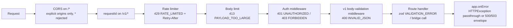
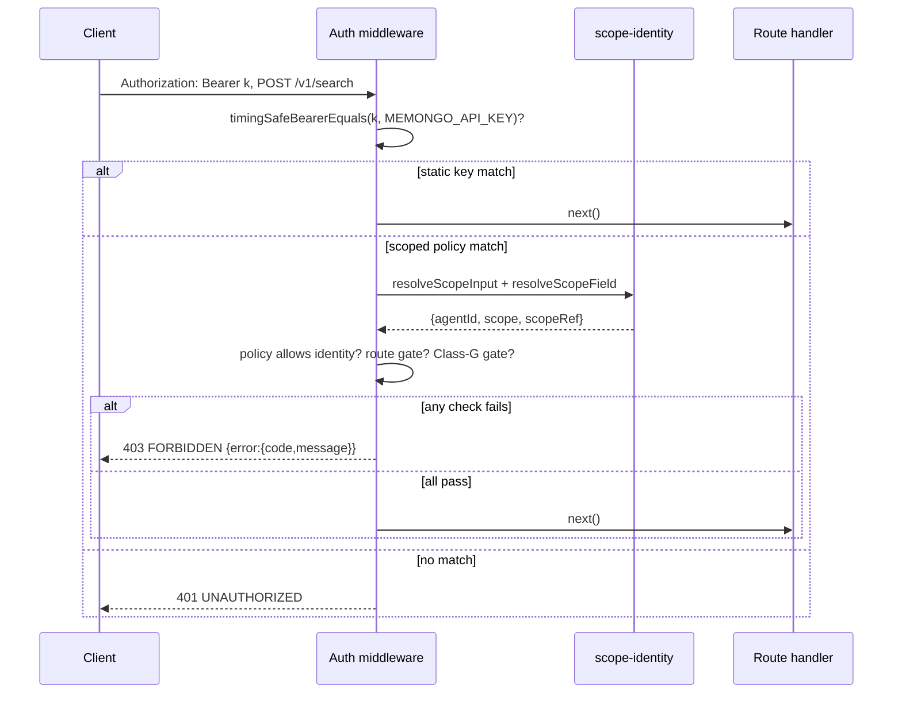

# API Routes and Middleware

All v1 routes are defined in `apps/api/src/routes/v1.ts` (45 handlers, ~2,500 LOC) and mounted by `createApp()` in `apps/api/src/app.ts` at `/v1`. Every handler is a thin adapter: it resolves the authorized identity, validates input, calls one `memongoBridge*` function from the [memory bridge](../../packages/memory-bridge.md), and maps failures into the shared error envelope. No route talks to the engine or MongoDB directly.

For the endpoint-by-endpoint request/response reference, see the [API reference](../../api/index.md). This page covers the route catalog by category and the middleware/auth machinery in front of it.

## Route catalog by category

### Search and retrieval

| Route | Bridge call | Purpose |
|-------|-------------|---------|
| `POST /v1/search` | `memongoBridgeSearch` | Hybrid memory search (`query` required; deprecated aliases `q`, `maxResults`, `containerTag` accepted) |
| `POST /v1/search-detailed` | `memongoBridgeSearchDetailed` | Advanced search: CRAG corrective retrieval, MMR diversity, constraint relaxation, multi-source fusion, `searchMode: auto|direct|agentic` |
| `POST /v1/search-kb` | `memongoBridgeSearchKB` | Knowledge-base search; scoped keys need a concrete `scopeRefs` constraint |
| `POST /v1/recall-conversation` | `memongoBridgeRecallConversation` | Recall a conversation window by session |
| `POST /v1/context-bundle` | `memongoBridgeBuildContextBundle` | Assemble a working-context bundle for a task |
| `POST /v1/hydrate-active-slate` | `memongoBridgeHydrateActiveSlate` | Hydrate the agent's active slate |
| `POST /v1/discovery-projection` | `memongoBridgeBuildDiscoveryProjection` | Build a discovery projection |
| `GET /v1/state` | `memongoBridgeGetState` | Current memory state |
| `POST /v1/profile` | `memongoBridgeProfile` | Agent profile read/update |
| `POST /v1/read-file` | `memongoBridgeReadFile` | Server-side file read (admin-only for scoped keys) |

### Write

| Route | Bridge call | Purpose |
|-------|-------------|---------|
| `POST /v1/add` | `memongoBridgeAdd` | Add a memory from free content |
| `POST /v1/write-event` | `memongoBridgeWriteConversationEvent` | Write one conversation event |
| `POST /v1/write-events` | `memongoBridgeWriteConversationEventsBatch` | Bulk event write, capped at 500 items per request (`MAX_WRITE_EVENTS_BATCH`) so one request cannot stage an unbounded `insertMany` |
| `POST /v1/extract` | `memongoBridgeExtractEvent` | Extract an event from raw text |
| `POST /v1/write-structured` | `memongoBridgeWriteStructuredMemory` | Write a typed structured memory (zod-validated entry: `type`, `key`, `value` required) |
| `POST /v1/write-procedure` | `memongoBridgeWriteProcedure` | Write a procedural memory (zod-validated) |
| `POST /v1/import/conversations` | `memongoBridgeImportConversations` | Bulk conversation import (admin-only for scoped keys) |
| `POST /v1/memory/feedback` | `memongoBridgeApplyMemoryFeedback` | Apply feedback to a memory |
| `POST /v1/procedures/outcome` | `memongoBridgeReportProcedureOutcome` | Report a procedure execution outcome |
| `POST /v1/self-edit` | `memongoBridgeSelfEdit` | Agent self-edit, gated by the injection screen (`SELF_EDIT_REJECTED`) |

### Lifecycle

Lifecycle routes take a full client-supplied stable handle. Because the bridge uses the handle's `agentId`/`scope`/`scopeRef` verbatim to select the manager and partition, `lifecycleHandleIdentityError()` (in `apps/api/src/routes/v1.ts`) requires the handle's tenant coordinates to exactly equal the identity the auth layer validated — failing closed so a scoped key cannot pass auth under a decoy identity while the handle points at another tenant's data (issue #57).

| Route | Bridge call | Purpose |
|-------|-------------|---------|
| `POST /v1/lifecycle/get` | `memongoBridgeGetLifecycleItem` | Fetch one item by stable handle |
| `POST /v1/lifecycle/update` | `memongoBridgeUpdateLifecycleItem` | Patch a structured/procedure item |
| `POST /v1/lifecycle/delete` | `memongoBridgeDeleteLifecycleItem` | Delete by handle |
| `POST /v1/lifecycle/history` | `memongoBridgeGetLifecycleHistory` | Bitemporal history for an item (limit capped at 200) |

### Maintenance, jobs, and consolidation

| Route | Bridge call | Purpose |
|-------|-------------|---------|
| `POST /v1/consolidate` | `memongoBridgeConsolidate` | Run the consolidation ("Dreamer") pipeline |
| `POST /v1/novelty-scan` | `memongoBridgeScanNovelty` | Novelty scan |
| `POST /v1/sync` | `memongoBridgeSync` | Sync (agent-global) |
| `POST /v1/chain-trace` | `memongoBridgeTraceChain` | Trace a provenance chain (agent-global) |
| `GET /v1/jobs` | `memongoBridgeListMemoryJobs` | List durable memory jobs (agent-global; limit capped at 100) |
| `GET /v1/jobs/:jobId` | `memongoBridgeGetMemoryJob` | Get one job (agent-global) |

### Status and probes

| Route | Bridge call | Purpose |
|-------|-------------|---------|
| `GET /v1/status` | `memongoBridgeStatus` | Operational status (agent-global) |
| `GET /v1/status/detailed` | `memongoBridgeGetDetailedStatus` | Detailed status (agent-global) |
| `GET /v1/stats` | `memongoBridgeStats` | Memory statistics (agent-global) |
| `GET /v1/probes/embedding` | `memongoBridgeProbeEmbedding` | Embedding-provider probe (agent-global) |
| `GET /v1/probes/vector` | `memongoBridgeProbeVector` | Vector-search probe (agent-global) |

### Admin

Everything under `/v1/admin/` is treated as agent-global: scope-restricted keys are rejected outright (Class-G, below).

| Route | Bridge call | Purpose |
|-------|-------------|---------|
| `POST /v1/admin/relevance/explain` | `memongoBridgeRelevanceExplain` | Explain a relevance decision |
| `POST /v1/admin/relevance/benchmark` | `memongoBridgeRelevanceBenchmark` | Run a relevance benchmark (dataset + quality-threshold contracts validated in the handler) |
| `POST /v1/admin/benchmarks/ingest` | `memongoBridgeBenchmarkIngest` | Ingest benchmark data |
| `GET /v1/admin/relevance/report` | `memongoBridgeRelevanceReport` | Relevance report |
| `GET /v1/admin/relevance/sample-rate` | `memongoBridgeRelevanceSampleRate` | Relevance sampling rate |
| `GET /v1/admin/access-trends` | `memongoBridgeAccessTrends` | Access trends analytics |
| `GET /v1/admin/access-summaries` | `memongoBridgeAccessSummaries` | Access summaries (collection filter: events, structured_mem, procedures, episodes, entities, relations) |
| `GET /v1/admin/traces` | `memongoBridgeListRecallTraces` | List recall traces |
| `GET /v1/admin/traces/:traceId` | `memongoBridgeGetRecallTrace` | Get one recall trace |

## Middleware pipeline

`createApp()` in `apps/api/src/app.ts` stacks middleware in a deliberate order — cheapest rejection first:

1. **CORS** (`/*`, only when origins are configured) — `resolveCorsPolicy()` returns an explicit `MEMONGO_CORS_ORIGINS` allowlist or the dev defaults (`http://127.0.0.1:3040`, `http://localhost:3040` for the web console). A wildcard in the env list throws at boot.
2. **Request ID** (`/v1/*`) — Hono's `requestId()`, first on the v1 chain so every downstream failure (rate limit, auth, route) can be correlated in server logs.
3. **Rate limiting** — below.
4. **Body limit** — Hono `bodyLimit`, default 1 MB (`MEMONGO_API_MAX_BODY_BYTES`), enforced *before* JSON parsing so an oversized payload is rejected without being buffered; `0` disables. Rejects with `413 PAYLOAD_TOO_LARGE`.
5. **Auth** — below.
6. **v1 body-validation middleware** (`apps/api/src/routes/v1.ts`) — for every non-GET/HEAD request it reads the raw body once: a genuinely empty body stays `{}` (bodiless POSTs rely on this), but a non-empty body that fails `JSON.parse` is a deliberate `400 INVALID_JSON` — previously it silently became `{}` and the request ran on defaults. The parsed body is stashed as `jsonBody` so auth, scope resolution, and handlers share one parse.

## Authentication and authorization

Auth is configured entirely by environment and is **fail-closed** in both directions (`apps/api/src/app.ts`):

- With `MEMONGO_API_KEY` and/or `MEMONGO_API_SCOPED_KEYS` set, `/v1/*` requires a matching bearer.
- With neither set and `MEMONGO_ALLOW_INSECURE_NO_AUTH` unset, every `/v1/*` request gets `401 AUTH_NOT_CONFIGURED` — the API refuses to run unauthenticated by default.
- The insecure override logs a single loud warning at boot and is intended only for trusted local development.

### Constant-time bearer comparison

`timingSafeBearerEquals()` hashes both inputs with SHA-256 before `crypto.timingSafeEqual` (so differing raw lengths cannot bypass the comparison) and rejects empty bearers. A plain `===` would short-circuit on the first mismatched byte and leak the token prefix through response timing.

### Scoped API keys

`MEMONGO_API_SCOPED_KEYS` is a JSON array (or token-keyed object) of policies `{ token, agentIds?, scopes?, scopeRefs? }`, parsed and validated by `parseScopedApiKeyPolicies()`. Validation is strict at config load:

- At least one policy, and every policy must constrain at least one dimension with a concrete value (`"*"` alone is not a constraint).
- `"*"` must be the only value when used.
- Every `scopes` value must be canonical (`session, user, agent, workspace, tenant, global` from `@memongo/lib`) — a policy authorizing a non-canonical scope would let execution silently drop it (issue #57), so the server refuses to boot with one.

At request time, `authorizeScopedApiKey()` resolves `agentId`, `scope`, and `scopeRef` from the **same merged input** the route layer uses (`apps/api/src/scope-identity.ts`) and returns a `403 FORBIDDEN` message when a required dimension is absent or not allowed. Two additional route-level gates apply to scoped keys:

- **Admin-only paths** (`/v1/read-file`, `/v1/import/conversations`): scoped keys are always rejected — these routes touch server files / bulk import.
- **Class-G agent-global paths**: routes that read or mutate across an agent's whole memory (`/v1/status*`, `/v1/stats`, `/v1/sync`, `/v1/probes/*`, `/v1/chain-trace`, `/v1/self-edit`, `/v1/read-file`, all `/v1/admin/*`, all `/v1/jobs*`) have no tenant boundary to enforce, so any *scope-constrained* key (concrete `scopes` or `scopeRefs`) is rejected with `403`. An agentId-only key is not scope-constrained and may still use them.
- **search-kb** additionally requires a concrete `scopeRefs` constraint (`routePolicyError`).

## Rate limiting

`createRateLimiter()` in `apps/api/src/app.ts` is a fixed-window in-memory limiter, state per app instance (single-process; a shared store is tracked with the durability work):

- **Identity**: a bearer participates in rate-limit identity only after it matches a configured credential — the bucket key is `credential:<sha256>`. Invalid or missing bearers share the trusted-proxy IP bucket (`X-Forwarded-For` first hop, only when `MEMONGO_TRUST_PROXY=1`) or one `anonymous` bucket, so attacker-chosen tokens can neither evade the limiter nor exhaust its bucket map.
- **Fail closed on saturation**: the bucket map is hard-capped at 100,000 identities; a *new* identity beyond that is rejected with 429 rather than growing memory without bound (defense against key-rotation exhaustion).
- **Amortized sweeping**: expired buckets are swept at most once per window.
- Rejection: `429 RATE_LIMITED` with a `Retry-After` header. `MEMONGO_API_RATE_LIMIT=0` disables the limiter entirely.

## Error handling

One canonical envelope everywhere: `{ error: { code, message } }` (`apiErrorJson` in `apps/api/src/lib/errors.ts`).

- `app.onError` (`apps/api/src/app.ts`): deliberate `HTTPException`s keep their own status/body; anything unexpected goes through `internalError()`.
- `internalError()` (`apps/api/src/lib/errors.ts`): logs the full error (name, message, stack) server-side under the request ID, then returns a sanitized body. `isDependencyUnavailableError()` walks the cause chain (bounded at 4) for the MongoDB driver's clear network-layer names — `MongoNetworkError`, `MongoNetworkTimeoutError`, `MongoServerSelectionError` — and maps those to `503 SERVICE_UNAVAILABLE` so client retry means something; everything else stays a generic `500`. Message matching was deliberately rejected as too fuzzy, so a generic 500 never becomes retriable noise.
- Route-level deliberate codes include `400 VALIDATION_ERROR` (zod, naming the first offending field), `400 INVALID_JSON`, `404 NOT_FOUND`, `422`-class rejections (e.g. `SELF_EDIT_REJECTED`), and handler-specific codes like `SEARCH_FAILED` on the 500 path.

## Input validation at the boundary

`apps/api/src/lib/validation.ts` holds the zod schemas for the write family (`structuredEntrySchema`, `procedureEntrySchema`, `kbFilterSchema`) and `validateMetadata()`, which rejects operator-shaped metadata keys (`$where`, dotted paths) before they reach stored documents. `validateWithSchema()` reports the first zod issue as `<fieldPrefix>.<path>: <message>` so the 400 names the offending field without leaking schema internals. Search-like routes clamp `limit`/`maxResults` to 100 (`MAX_LIST_LIMIT`) so a caller cannot force unbounded result sets through fusion/rerank.

## Related pages

- [API app overview](index.md) — boot sequence, env, health endpoints
- [OpenAPI spec](openapi.md) — the documented contract for these routes
- [API endpoint reference](../../api/index.md) — per-endpoint details
- [Security](../../security.md) — the wider auth/SSRF/secrets model
- [Memory bridge](../../packages/memory-bridge.md) — the facade every handler calls

---
Active contributors: Rom Iluz (19 commits touching `apps/api/`).
