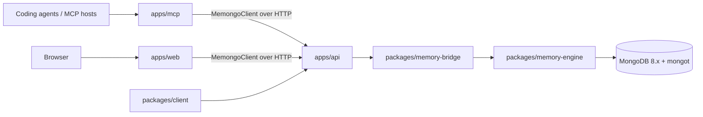

# Apps

Memongo ships four deployable applications under `apps/`. All four are private packages (never published to npm); they consume the published packages (`@memongo/memory-engine`, `@memongo/memory-bridge`, `@memongo/client`) through Bun workspaces.

| App | Package | Role | Default port |
|-----|---------|------|--------------|
| [API](api/index.md) | `@memongo/api` | Hono HTTP API — the product's front door | 3847 |
| [MCP server](mcp.md) | `@memongo/mcp` | Model Context Protocol server (stdio + Streamable HTTP) | 3110 (HTTP mode) |
| [Web console](web.md) | `@memongo/web` | Next.js console + landing page | 3040 |
| [Docs site](docs.md) | `@memongo/docs` | Mintlify documentation | 3003 |

## How they relate

The API is the only app that talks to the engine. The MCP server and the web console are thin clients: both construct a `MemongoClient` (`packages/client`) and call the HTTP API. This keeps one authentication, validation, and rate-limiting layer (`apps/api/src/app.ts`) in front of all memory access.

## Shared characteristics

- **TypeScript ESM, strict.** Built with `tsc` (api, mcp) or Next.js build (web); docs has no compile step — its `build` script runs a docs-integrity check (`apps/docs/package.json`).
- **Configured by environment.** Every app reads `MEMONGO_*` variables; none requires a config file to boot. See [Configuration](../reference/configuration.md).
- **Loopback-first networking.** The API binds `127.0.0.1` by default (`apps/api/src/server.ts`), the MCP HTTP transport binds `127.0.0.1:3110` (`apps/mcp/src/http-transport.ts:9`), and Docker compose files publish ports on `127.0.0.1` only (`docker/docker-compose.yml`).

## Where to go next

- [API app](api/index.md) — middleware stack, route surface, scoped API keys
- [MCP server](mcp.md) — tool catalog, transports, memory-policy instructions
- [Web console](web.md) — console tabs, static export, Cloudflare deployment
- [Docs site](docs.md) — Mintlify structure and integrity checks
- [REST API reference](../api/index.md) — the /v1 endpoint groups the API serves
- [Deployment](../deployment.md) — running the apps with Docker
