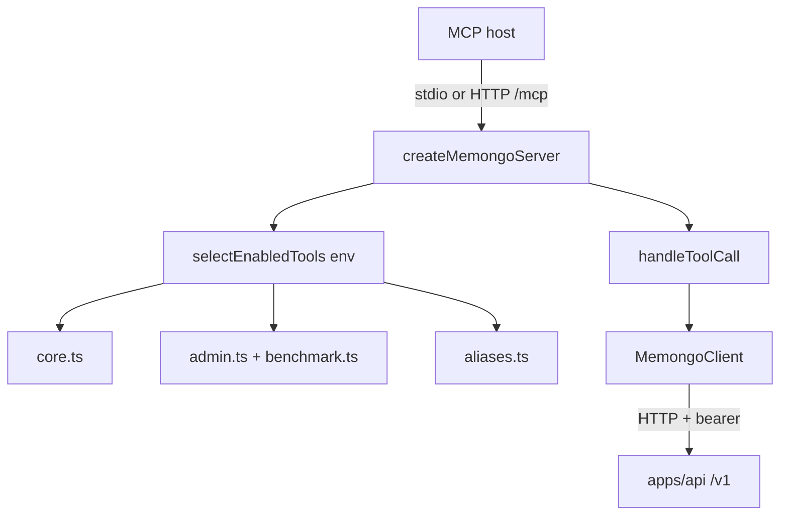

# MCP server (`apps/mcp`)

`@memongo/mcp` is a Model Context Protocol server that exposes Memongo memory to MCP hosts (coding agents, desktop assistants). It is a **thin client**: it holds no engine code and talks to the HTTP API through `MemongoClient` (`apps/mcp/src/server.ts:8`). The published binary is `memongo-mcp` (`apps/mcp/package.json`).

## Key files

- `apps/mcp/src/server.ts` (~1,055 LOC) — server factory, tool-call dispatch, transport selection
- `apps/mcp/src/tool-registry.ts` — tool catalog, category flags, wire conversion
- `apps/mcp/src/tools/core.ts` — always-on tools (search, write, lifecycle, import, jobs)
- `apps/mcp/src/tools/admin.ts` — operator tools (relevance, traces, access analytics)
- `apps/mcp/src/tools/benchmark.ts` — benchmark ingestion tool
- `apps/mcp/src/tools/aliases.ts` — semantic aliases of canonical tools
- `apps/mcp/src/http-transport.ts` — stateless Streamable HTTP transport

## Transports

Transport is selected by `MEMONGO_MCP_TRANSPORT` (`apps/mcp/src/server.ts:1033`):

- **`stdio` (default)** — `StdioServerTransport`; the host spawns `memongo-mcp` as a child process.
- **`http`** — Streamable HTTP (MCP spec 2025-03-26+) served at `POST /mcp` on `127.0.0.1:3110` by default (`MEMONGO_MCP_HTTP_HOST` / `MEMONGO_MCP_HTTP_PORT` override; see `apps/mcp/src/http-transport.ts:7-9`). The transport is **stateless**: each request gets a fresh MCP server + transport pair with `sessionIdGenerator: undefined`, so no session state lives between requests (`apps/mcp/src/http-transport.ts:41-56`).

## Tool registry and the surface diet

Tools are defined as data (`McpToolDefinition`) in the four `tools/*.ts` modules and concatenated into one `toolCatalog` (`apps/mcp/src/tool-registry.ts:36`). Each tool carries a `category`:

| Category | Gating | Rationale |
|----------|--------|-----------|
| `core` | always registered | the write/recall loop every host needs |
| `admin` | `MEMONGO_MCP_ADMIN=1` | operator/benchmark tooling |
| `alias` | `MEMONGO_MCP_ALIASES=1` | semantic duplicates of canonical tools |

`selectEnabledTools(process.env)` filters the catalog before the server registers handlers, so hosts only pay prompt tokens for the core loop by default (`apps/mcp/src/tool-registry.ts:66-74`). Calling a disabled tool returns a structured error explaining which env flag enables it (`apps/mcp/src/server.ts:121-130`).

The catalog holds **49 tools** (counted across the four `tools/*.ts` modules) spanning search (`memongo_search`, `memongo_search_kb`, `memongo_search_detailed`, `memongo_recall_conversation`, `memongo_build_context_bundle`, …), write (`memongo_add`, `memongo_write_event`, `memongo_write_structured`, `memongo_write_procedure`, `memongo_extract`, `memongo_import_conversations`, …), lifecycle (`memongo_lifecycle_get|update|delete|history`, `memongo_memory_feedback`, `memongo_self_edit`, `memongo_sync`), status (`memongo_status`, `memongo_stats`, `memongo_profile`, `memongo_state_unified`), jobs (`memongo_list_jobs`, `memongo_get_job`), probes (`memongo_probe_embedding`, `memongo_probe_vector`), and admin/benchmark tools (`memongo_relevance_*`, `memongo_admin_*`, `memongo_benchmark_ingest`).

## Memory-policy instructions

The server ships a memory policy in the MCP `initialize` response `instructions` field (`MEMONGO_SERVER_INSTRUCTIONS`, `apps/mcp/src/server.ts:58`): when to SAVE (durable facts, preferences, decisions), when to SEARCH (before answering about prior work, at every session start), and which tool to reach for. Because it rides the spec's `instructions` field, it works on any MCP host without prompt-primitive support.

## Request handling details

- **Scope validation.** `readScopeArg` validates raw `scope` arguments against the canonical six-value enum from `@memongo/lib` (`session|user|agent|workspace|tenant|global`) *before* they reach a typed position, so an invalid scope fails as a tool error instead of flowing to the API (`apps/mcp/src/server.ts:71-84`).
- **Structured results.** Every handler returns `jsonResult`, which emits both `content[0].text` (JSON string) and MCP `structuredContent` (`apps/mcp/src/server.ts:86-97`). Errors are returned as `{ error }` with `isError: true`, not thrown.
- **Configuration.** `MEMONGO_API_URL` and `MEMONGO_API_KEY` configure the underlying `MemongoClient` (`apps/mcp/src/server.ts:14-17`).

## Related pages

- [Apps overview](index.md)
- [REST API reference](../api/index.md) — the endpoints these tools call
- [Configuration](../reference/configuration.md) — all `MEMONGO_MCP_*` variables
- [Security](../security.md) — auth the API enforces on the MCP server's behalf
