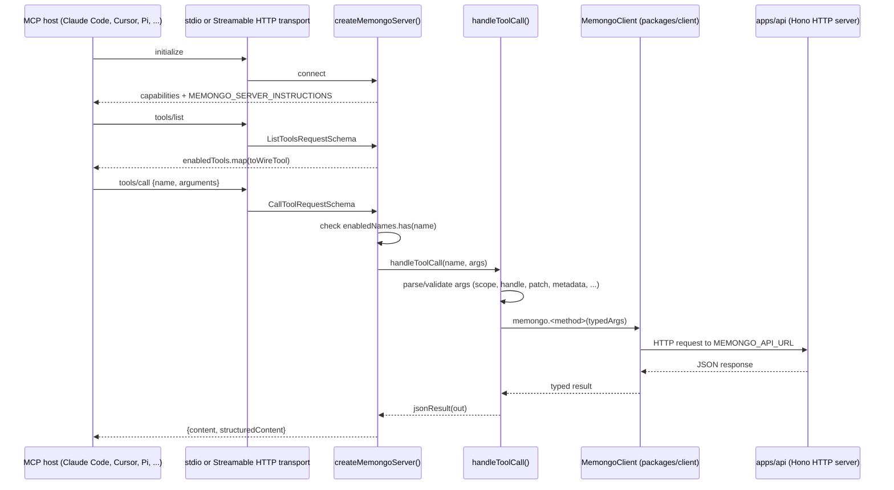

# MCP server

Active contributors: Rom Iluz

`apps/mcp` is the Model Context Protocol (MCP) server for Memongo. It exposes memory operations — recall, write, lifecycle management, import, jobs, and admin diagnostics — as MCP tools that any MCP-compatible host (Claude Code, Cursor, Pi, or a custom agent runtime) can call. It never touches MongoDB directly: every tool call is forwarded to the Memongo HTTP API (`apps/api`) through `packages/client`'s `MemongoClient`. See [Architecture](../../overview/architecture.md) for where this app sits among the other surfaces, and [MemongoClient](../../packages/client.md) for the SDK it wraps.

## Directory layout

| Path | Role |
| --- | --- |
| `apps/mcp/src/server.ts` | Server construction, `MEMONGO_SERVER_INSTRUCTIONS` memory policy, argument parsing/validation, and the `handleToolCall` dispatcher that maps a tool name to a `MemongoClient` call. |
| `apps/mcp/src/tool-registry.ts` | The tool catalog (`toolCatalog`), env-flag gating (`selectEnabledTools`), and the wire-format projection (`toWireTool`). |
| `apps/mcp/src/tools/core.ts` | The 12 always-on tools covering the write -> extract -> recall loop. |
| `apps/mcp/src/tools/admin.ts` | Operator/diagnostic tools gated behind `MEMONGO_MCP_ADMIN=1`. |
| `apps/mcp/src/tools/aliases.ts` | Semantic-alias tool definitions gated behind `MEMONGO_MCP_ALIASES=1`, kept for hosts already configured against the older names. |
| `apps/mcp/src/http-transport.ts` | Stateless MCP Streamable HTTP transport, an alternative to stdio. |
| `apps/mcp/src/version.ts` | `MEMONGO_SERVER_VERSION`, reported in the MCP handshake and checked against the root `package.json` version by the release gate. |
| `apps/mcp/src/mcp-contract-conformance.test.ts` | Asserts every tool's input schema field set matches `packages/lib/src/contract-mcp.ts`, the single source of truth for tool argument shapes — see [packages/lib](../../packages/lib.md). |
| `apps/mcp/README.md` | Install, run, and configuration reference for the published `@memongo/mcp` package. |

## Key source files

| File | Purpose |
| --- | --- |
| `apps/mcp/src/server.ts` | `createMemongoServer`, `handleToolCall`, argument readers (`readScopeArg`, `readLifecycleHandleArg`, `readPatchArg`, etc.), `MEMONGO_SERVER_INSTRUCTIONS`. |
| `apps/mcp/src/tool-registry.ts` | `toolCatalog`, `selectEnabledTools`, `parseMcpToolFlags`, `toWireTool`. |
| `apps/mcp/src/tools/core.ts` | Core tool definitions (input schemas + descriptions). |
| `apps/mcp/src/tools/admin.ts` | Admin tool definitions. |
| `apps/mcp/src/tools/aliases.ts` | Alias tool definitions. |
| `apps/mcp/src/http-transport.ts` | `startHttpTransport`, `handleMcpRequest`, port/host resolution. |
| `apps/mcp/src/version.ts` | `MEMONGO_SERVER_VERSION` constant. |

The full tool catalog — what each of the 47 tools does, grouped by category — is documented on [Tools](tools.md).

## How it works

### Transports

The server runs over one of two transports, chosen by `MEMONGO_MCP_TRANSPORT` (`apps/mcp/src/server.ts`):

- **stdio** (default) — `main()` calls `createMemongoServer().connect(new StdioServerTransport())`. This is the MCP spec's local, single-client transport, and how every documented host config (`npx -y @memongo/mcp`) launches the server.
- **http** — `main()` delegates to `startHttpTransport` (`apps/mcp/src/http-transport.ts`), which listens on `MEMONGO_MCP_HTTP_HOST:MEMONGO_MCP_HTTP_PORT` (default `127.0.0.1:3110`) and serves the MCP Streamable HTTP protocol (spec 2025-03-26+) at `/mcp`. Each HTTP request gets a fresh `createMcpServer()` + `StreamableHTTPServerTransport` pair (`sessionIdGenerator: undefined`), so the transport is stateless — no session state or SSE stream is held between requests. The legacy SSE transport is not supported. The HTTP transport performs no authentication of its own; binding a non-loopback host is only safe behind a trusted network boundary.

Both transports call the same `createMemongoServer()` and the same `handleToolCall`, so tool behavior is identical regardless of how a host connects.

### Tool surface gating

By default only the 12 `core` tools are advertised, so hosts pay prompt tokens only for the write -> extract -> recall loop. `selectEnabledTools` (`apps/mcp/src/tool-registry.ts`) reads two env flags at server construction time:

- `MEMONGO_MCP_ADMIN=1` adds `admin` tools (lifecycle CRUD, jobs, traces, relevance diagnostics, KB search, and more).
- `MEMONGO_MCP_ALIASES=1` adds `alias` tools (semantic duplicates like `memongo_recall_messages`, `memongo_memory_*`, kept for backward-compatible host configs).

A tool call for a name not in the enabled set is rejected with an explicit MCP tool error rather than falling through to `handleToolCall` — see the `enabledNames.has(request.params.name)` check in `createMemongoServer`.

### Memory policy instructions

`MEMONGO_SERVER_INSTRUCTIONS` (`apps/mcp/src/server.ts`) is sent as the MCP `initialize` response's `instructions` field. It tells any connected agent, in plain text, when to save (`memongo_write_event` / `memongo_write_structured`, followed by `memongo_extract`), when to search (before answering questions about prior work, and at every session start), and which tool to reach for (`memongo_search` for quick lookups, `memongo_search_detailed` for scored/provenance results, `memongo_recall_conversation` for exact past messages, `memongo_build_context_bundle` in `wake-up` mode or `memongo_profile` at session start). This works on any MCP host because it uses the spec's baseline `instructions` field rather than a prompt primitive that not every host implements.

### Argument validation at the MCP boundary

`server.ts` parses raw JSON arguments into typed client inputs before calling `MemongoClient`, rather than casting through `as any`. Notable validators:

- `readScopeArg` rejects any `scope` value outside the canonical `MemoryScopeValue` enum (`@memongo/lib`) before it reaches a typed position.
- `readLifecycleHandleArg` parses a `handle` object into a typed `MemongoStableHandle` (`structured` or `procedure` family), checking `id`, `agentId`, `scope`, `scopeRef`, `revision >= 1`, and `state`, instead of fabricating an empty handle on malformed input.
- `readPatchArg`, `readMetadataArg`, `readPrimitiveMetadataArg`, and `readKbFilterArg` enforce plain-object/primitive shapes at the boundary while leaving deeper field validation to the API, which is the authority on what a patch or metadata key may contain.

See [Multi-tenancy and scopes](../../features/multi-tenancy-and-scopes.md) for what `scope`/`scopeRef` mean across the system.

## Integration points

- **`packages/client`** — every tool handler ends in a call to a `MemongoClient` method (`memongo.search`, `memongo.writeEvent`, `memongo.getLifecycleItem`, ...). The MCP server holds one client instance, constructed from `MEMONGO_API_URL` and `MEMONGO_API_KEY`. See [MemongoClient](../../packages/client.md).
- **`apps/api`** — the HTTP API this server calls; MCP performs no MongoDB access, auth, or rate limiting of its own, all of that is enforced server-side by the API. See [apps/api](../api/index.md).
- **`packages/lib`** — supplies `MEMORY_SCOPE_VALUES`/`isMemoryScopeValue` (the scope enum) and `contract-mcp.ts` (the tool-schema source of truth checked by `mcp-contract-conformance.test.ts`). See [packages/lib](../../packages/lib.md).

## Adding a new tool

1. Add the tool definition (`name`, `description`, `inputSchema`, `category`) to `apps/mcp/src/tools/core.ts` or `apps/mcp/src/tools/admin.ts` depending on whether it belongs in the default surface.
2. Add a corresponding branch in `handleToolCall` (`apps/mcp/src/server.ts`) that parses `args` into the typed `MemongoClient` call and returns `jsonResult(out)`.
3. If the tool needs a new argument shape (a new handle variant, a new filter object), add a dedicated `read*Arg` validator rather than casting through `as any`.
4. Update `packages/lib/src/contract-mcp.ts` with the matching field set — `apps/mcp/src/mcp-contract-conformance.test.ts` fails the build if the tool's live input schema drifts from the contract.
5. If the tool is operator-only, set `category: "admin"`; if it is a backward-compatible rename of an existing tool, add it to `apps/mcp/src/tools/aliases.ts` with `category: "alias"` instead of changing the canonical tool's name.
