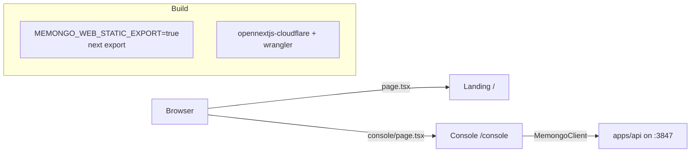

# Web console (`apps/web`)

`@memongo/web` is a minimal Next.js 15 (React 19) app with two routes: a marketing landing page and an operational console. It is a private package and talks to the API directly from the browser via `MemongoClient`.

## Key files

- `apps/web/app/page.tsx` (~351 LOC) — landing page: memory-layer narrative, capability grid, code sample; GSAP-driven scroll animation with a `prefers-reduced-motion` guard
- `apps/web/app/console/page.tsx` (~623 LOC) — the console itself
- `apps/web/app/layout.tsx` — metadata (title, OpenGraph, `metadataBase` pointing at the Cloudflare Workers deployment)
- `apps/web/next.config.ts` — static-export switch, monorepo tracing, webpack extension alias
- `apps/web/package.json` — scripts, including the OpenNext/Cloudflare deploy path
- `apps/web/wrangler.jsonc`, `apps/web/open-next.config.ts` — Cloudflare deployment config

## The console

`console/page.tsx` is a single client component with five tabs (`Tab = "overview" | "search" | "kb" | "profile" | "write"`, `apps/web/app/console/page.tsx:9`):

- **Overview** — hits `/health`, `/v1/status`, `/v1/stats`, and counts paths in `/openapi.json`
- **Search** — semantic search against `/v1/search`
- **KB** — knowledge-base search
- **Profile** — agent profile view
- **Write** — add a memory

The API base URL comes from `NEXT_PUBLIC_MEMONGO_API_URL`, defaulting to `http://127.0.0.1:3847` (`apps/web/app/console/page.tsx:7`). There is no server-side proxy: the browser calls the API directly, which is why the API's CORS dev defaults allow `http://localhost:3040` and `http://127.0.0.1:3040` (see `apps/api/src/app.ts:71-76` and [Security](../security.md)).

## Build and deployment

- **Dev/start on port 3040** (`apps/web/package.json` scripts).
- **Monorepo-aware build:** `outputFileTracingRoot` points at the repo root and `@memongo/client` is in `transpilePackages`; a webpack `extensionAlias` maps `.js` imports to `.ts/.tsx` sources so the client's ESM imports resolve (`apps/web/next.config.ts`).
- **Static export:** `MEMONGO_WEB_STATIC_EXPORT=true` flips `output: "export"` and unoptimizes images.
- **Cloudflare:** `preview`/`deploy` scripts run `opennextjs-cloudflare` + `wrangler`; the deployed site is the `metadataBase` in `apps/web/app/layout.tsx:8`.

## Related pages

- [Apps overview](index.md)
- [API app](api/index.md) — CORS policy that whitelists this console
- [Configuration](../reference/configuration.md) — `NEXT_PUBLIC_MEMONGO_API_URL`, `MEMONGO_WEB_STATIC_EXPORT`
