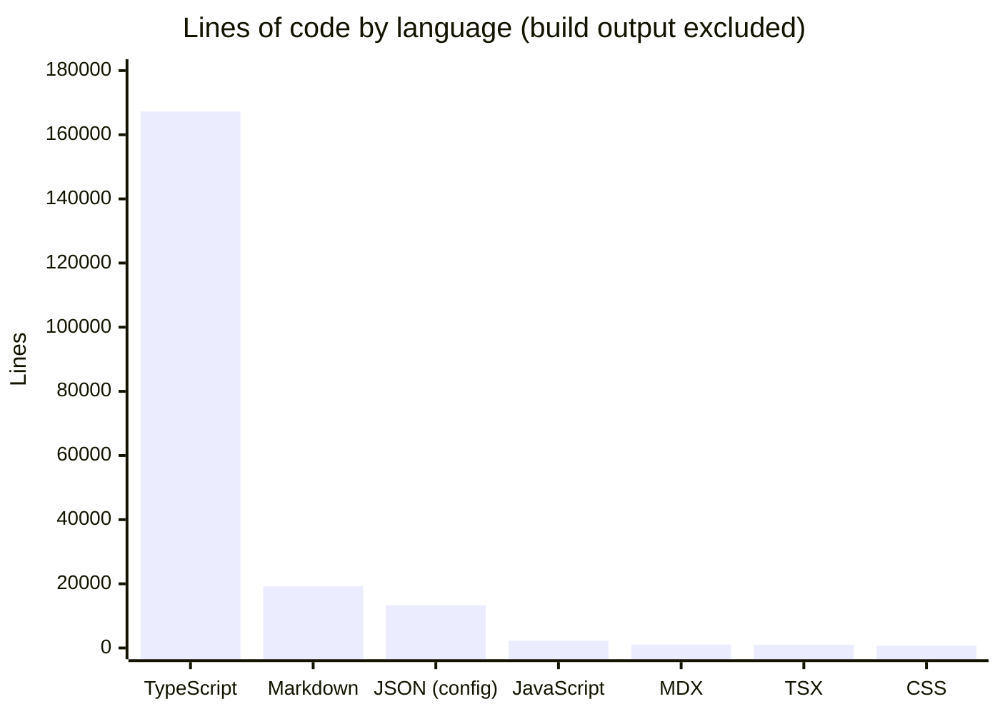
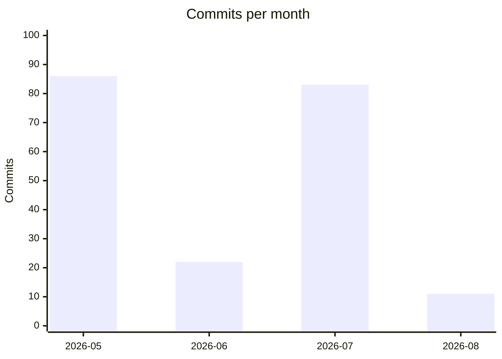

# Memongo by the Numbers

*Data collected on 2026-08-03.*

A quantitative snapshot of the Memongo codebase: size, activity, and complexity. All numbers come from live `git log`, `find`, and `wc` runs against the working tree (build output, `node_modules`, and `.git` excluded).

## Size

Memongo is a TypeScript monorepo through and through. TypeScript accounts for essentially all executable code.

JSON config excludes the benchmark dataset — `benchmarks/data/longmemeval_s_cleaned.json` alone is a 1,101,877-line file, roughly 87% of all lines on disk but none of the code.

| Metric | Count |
|---|---|
| TypeScript source files (`.ts`/`.tsx`, excl. tests) | 197 |
| Test files (`*.test.ts`, incl. e2e) | 147 |
| TypeScript source LOC | 85,591 |
| Test LOC | 82,813 |
| Test-to-source ratio | 0.97 : 1 |
| Packages (`packages/`) | 7 |
| Apps (`apps/`) | 4 |

Inside `@memongo/memory-engine` specifically, the ratio inverts: 125 test files (73,138 LOC) against 118 source files (60,673 LOC) — test code outweighs shipping code by 1.2 : 1.

## Activity

The repository was created on 2026-05-06 and has 202 commits. Work arrives in intense bursts separated by quiet gaps.

Most frequently changed files (commits touching the file):

| File | Commits touching it |
|---|---|
| packages/memory-engine/src/mongodb-manager.ts | 47 |
| packages/memory-engine/src/mongodb-schema.ts | 28 |
| packages/memory-engine/src/mongodb-manager.test.ts | 26 |
| packages/memory-engine/src/mongodb-schema.test.ts | 23 |
| packages/memory-engine/src/types.ts | 20 |
| scripts/run-longmemeval-canary.ts | 17 |
| packages/memory-engine/src/mongodb-consolidator.ts | 16 |
| packages/memory-bridge/src/memongo-bridge.ts | 16 |
| packages/memory-engine/src/mongodb-search.ts | 15 |
| packages/memory-engine/src/mongodb-benchmark-runner.test.ts | 15 |

## AI co-authorship

93 of 202 commits (46%) carry a `Co-authored-by` trailer from an AI coding assistant. The breakdown by trailer identity:

| Co-author trailer | Commits |
|---|---|
| Claude Opus 4.8 (incl. 1M-context variant) | 29 |
| Claude Opus 4.7 (1M context) | 23 |
| Claude Fable 5 | 21 |
| Claude Opus 5 (1M context) | 19 |
| factory-droid[bot] | 1 |

The remaining 109 commits (54%) have no co-author trailer.

## Complexity

### Largest files

The four largest non-test files are exactly the four load-bearing modules of the system: the manager, the schema, the OpenAPI spec, and the API router.

| File | LOC | Kind |
|---|---|---|
| packages/memory-engine/src/mongodb-manager.ts | 12,449 | Source |
| packages/memory-engine/src/mongodb-manager.test.ts | 9,307 | Test |
| apps/api/src/app.test.ts | 4,752 | Test |
| packages/memory-engine/src/mongodb-schema.ts | 4,591 | Source |
| packages/memory-engine/src/mongodb-schema.test.ts | 3,966 | Test |
| packages/memory-engine/src/production-readiness.e2e.test.ts | 3,681 | Test (e2e) |
| apps/api/src/openapi-spec.ts | 3,016 | Source |
| packages/memory-engine/src/real-e2e-v2.e2e.test.ts | 2,551 | Test (e2e) |
| apps/api/src/routes/v1.ts | 2,515 | Source |
| packages/memory-engine/src/mongodb-consolidator.test.ts | 2,487 | Test |

### Average file size by package

Source files only (tests excluded), in LOC per file:

| Package / app | Files | LOC | Avg LOC/file |
|---|---|---|---|
| packages/client | 3 | 2,580 | 860 |
| apps/api | 11 | 7,037 | 639 |
| packages/memory-engine | 119 | 60,714 | 510 |
| packages/pi-extension | 2 | 959 | 479 |
| packages/memory-bridge | 3 | 1,289 | 429 |
| apps/mcp | 7 | 2,536 | 362 |
| packages/tools | 6 | 1,231 | 205 |
| packages/lib | 15 | 1,797 | 119 |
| apps/web | 14 | 1,191 | 85 |
| packages/memongo-memory | 1 | 2 | 2 |

The repo's own convention is "keep files under ~500 LOC" — the engine average sits right at that line, held up almost entirely by `mongodb-manager.ts` (without it the engine average drops to roughly 410).

### Exported surface

Exported declarations (`export function/class/const/interface/type/enum`) per package, tests excluded:

| Package | Exported declarations |
|---|---|
| packages/memory-engine | 926 |
| packages/client | 91 |
| packages/lib | 83 |
| packages/memory-bridge | 64 |
| apps/api | 45 |
| apps/mcp | 22 |
| packages/tools | 20 |
| packages/pi-extension | 11 |
| apps/web | 4 |
| packages/memongo-memory | 0 (pure re-export) |
