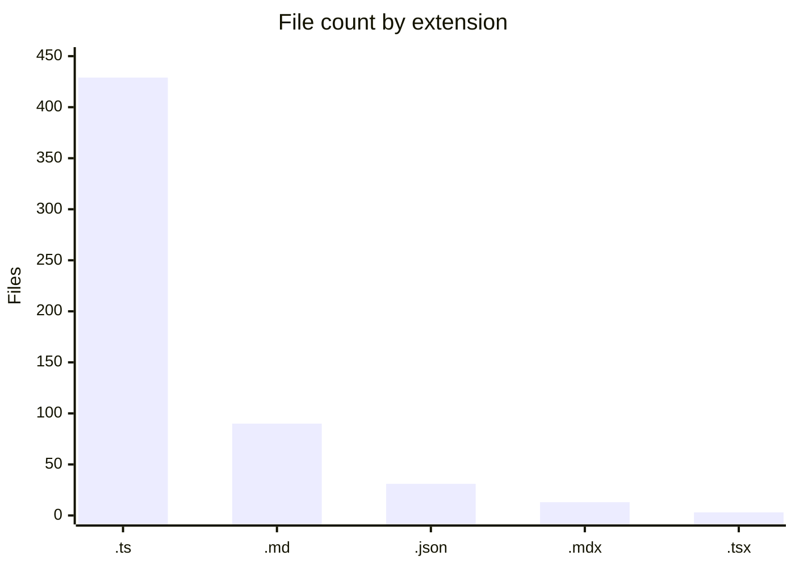
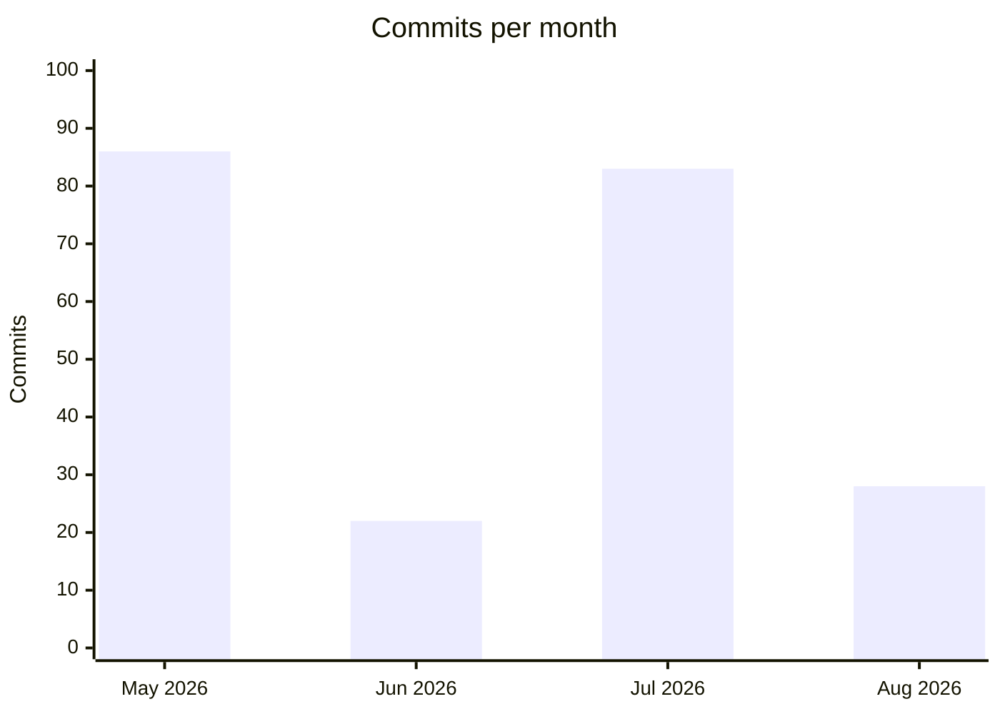

# By the numbers

Data collected on 2026-08-24.

## Size

- **~188,323 lines** of TypeScript/TSX across the repo (about 187,306 lines in pure `.ts` files, the rest in the 3 `.tsx` files).
- **429 `.ts` files**, of which **189 are test files** (`*.test.ts`) and **240 are non-test source files**.
- **90 `.md` files** and **13 `.mdx` files** (103 markdown/mdx files total) — documentation is a meaningful fraction of the repo, not an afterthought.
- **11 workspace members**: 7 packages (`memory-engine`, `memory-bridge`, `memongo-memory`, `client`, `tools`, `lib`, `pi-extension`) and 4 apps (`api`, `mcp`, `web`, `docs`).

## Activity

The project spans **219 commits** from 2026-05-06 to 2026-08-24 — a project age of about 4 months, all on `main`, all by a single contributor. May and July are the two commit-heavy months; August's count (28) is partial, only through the 24th.

Most actively changed files in the last 90 days (churn = number of commits touching the file):

| File | 90-day churn |
|---|---|
| `packages/memory-engine/src/mongodb-manager.ts` | 40 |
| `packages/memory-engine/src/mongodb-schema.ts` | 24 |
| `packages/memory-engine/src/mongodb-schema.test.ts` | 21 |
| `packages/memory-engine/src/mongodb-manager.test.ts` | 21 |
| `packages/lib/src/types.ts` | 17 |
| `package.json` | 16 |
| `packages/memory-bridge/src/memongo-bridge.ts` | 15 |
| `apps/api/src/app.test.ts` | 15 |
| `packages/memory-engine/src/mongodb-consolidator.ts` | 14 |
| `packages/memory-engine/src/mongodb-consolidator.test.ts` | 14 |
| `apps/api/src/routes/v1.ts` | 14 |

`mongodb-manager.ts` alone accounts for more churn than any other file by a wide margin — see [Cleanup opportunities](cleanup-opportunities.md) for what that concentration means for maintainability.

## AI-assisted development signal

12 of 219 commits (about 5.5%) carry a git `Co-authored-by` trailer naming a `[bot]` account. That is a lower bound, not a full picture: inline use of an AI coding assistant inside an editor leaves no trace in git history unless the author manually adds a co-author trailer. The single human author's own commit-message conventions — `scope-1:`, `scope-3:`, `scope-4:` prefixes, and task identifiers like `P2.8`, `Task 0.5`, `Task 1.9`, `B11a` — suggest a heavily agent-assisted, checkpoint-driven workflow well beyond what the 5.5% bot-co-author figure alone would imply. No stronger claim than that is supported by the data available in this repository.

## Complexity

Ten largest files by line count:

| File | Lines |
|---|---|
| `apps/api/src/production-readiness.e2e.test.ts` | 3,766 |
| `apps/api/src/real-e2e-v2.e2e.test.ts` | 2,551 |
| `apps/api/src/e2e-evaluation.e2e.test.ts` | 2,335 |
| `packages/memory-engine/src/mongodb-graph.ts` | 2,113 |
| `packages/memory-engine/src/mongodb-structured-memory.ts` | 2,015 |
| `packages/memory-engine/src/mongodb-search-executor.ts` | 1,945 |
| `packages/memory-engine/src/mongodb-manager.ts` | 1,855 |
| `packages/memory-engine/src/mongodb-procedures.ts` | 1,745 |
| `packages/lib/src/types.ts` | 1,737 |
| `packages/memory-engine/src/mongodb-search-v2.ts` | 1,691 |

Average file size across the 429 `.ts` files works out to roughly 188,323 / 429 ≈ 439 lines per file. `packages/memory-engine/src/` alone holds 130+ files, making it by far the largest single package — consistent with it being the churn hotspot above.

Six `TODO`/`FIXME`/`HACK` markers exist across the packages, apps, and scripts directories combined.

## See also

- [Cleanup opportunities](cleanup-opportunities.md) — what these hotspots mean for future work
- [Lore](lore.md) — how this activity breaks down into eras
- [Fun facts](fun-facts.md)
