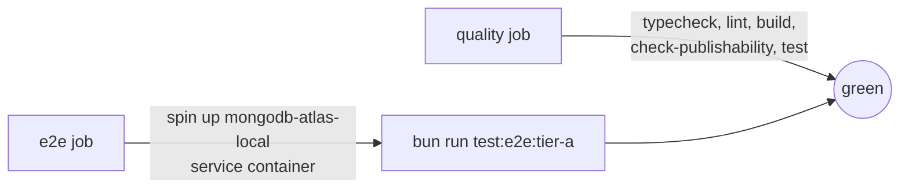

# Deployment

Active contributors: Rom Iluz

How Memongo runs locally, in CI, and in production — Docker Compose for development, a multi-stage Dockerfile for the API, GitHub Actions for quality/e2e gates and npm publishing, and Cloudflare Workers for the web console. For the app's internal request-handling architecture see [API app](apps/api/index.md); for the wire API see [API](api/index.md).

## Local development: Docker Compose

Two compose layouts exist for different purposes:

- **`docker/docker-compose.yml`** — the original one-command setup: a single `mongodb/mongodb-atlas-local:preview` container (mongod + mongot, Atlas Search + Vector Search, auto-embeddings via Voyage AI when `VOYAGE_API_KEY` is set), bound to `127.0.0.1` only. Run with `docker compose -f docker/docker-compose.yml up -d`.
- **`docker/compose.yaml`** + **`docker/compose.override.yaml`** — a split base/override pair. `compose.yaml` alone defines only the `api` service and is production-safe (no local database, expects an external `MEMONGO_MONGODB_URI`). Running plain `docker compose` from `docker/` auto-merges `compose.override.yaml`, which adds the local `mongodb` service (Atlas Local, pinned dated tag `8.2.6-20260715T144108Z`) and makes `api` wait on its healthcheck (`depends_on: condition: service_healthy`).

Both Mongo services publish `27017` on loopback only and use the Atlas Local image's built-in `runner healthcheck` command (verifies mongod and mongot together), never a plain `mongo:7` image — auto-embedding needs mongot.

`compose.yaml` fails closed on a missing admin token: `MEMONGO_API_KEY=${MEMONGO_API_KEY:?set MEMONGO_API_KEY}` aborts compose startup rather than booting an unauthenticated API.

## The API image

`apps/api/Dockerfile` is a three-stage build:

1. **`prepare`** (`node:22-slim` + `turbo prune --docker @memongo/api`) — extracts only `apps/api` and its workspace dependencies (`@memongo/memory-bridge`, `@memongo/memory-engine`, `@memongo/lib`) from the monorepo.
2. **`installer`** (`oven/bun:1-debian`) — `bun install --frozen-lockfile` against the pruned lockfile, then `bun run turbo build --filter=@memongo/api...`. The root `tsconfig.base.json` is copied explicitly because `turbo prune`'s `out/full/` omits root-level config files.
3. **`runner`** (`node:22-slim`) — copies only `dist/`, `package.json` files, `packages/`, and `node_modules/` into a non-root (`USER node`) runtime image, and runs the built JS directly with plain `node` (no `tsx`, no TypeScript at runtime).

The final image binds `MEMONGO_API_HOST=0.0.0.0` (required inside a container; the process defaults to loopback otherwise) and `MEMONGO_API_PORT=3847`, and declares a `HEALTHCHECK` that curls `/ready` via `node -e "fetch(...)"` — no extra `curl`/`wget` binary needed in the slim image. `apps/api/.dockerignore` excludes `apps/web`, `apps/docs`, `apps/mcp`, `benchmarks`, and markdown files from the build context to keep it small.

## CI pipeline

`.github/workflows/ci.yml` runs on every pull request and push to `main`, with two jobs:

- **`quality`** — `bun install --frozen-lockfile`, then `bun run check-types`, `bun run lint`, `bun run build`, `bun run check-publishability` (the same publish gate described in `docs/platform/publish.md`), and `bun run test`.
- **`e2e`** — starts a `mongodb/mongodb-atlas-local:preview` service container (same image as local dev), waits on its `runner healthcheck`, builds, then runs `bun run --filter @memongo/memory-engine test:e2e:tier-a` against `mongodb://127.0.0.1:27017/?directConnection=true`. Tier A is scoped to paths that need only MongoDB — transactions, indexes, tenant isolation, background jobs — so every PR is gated without requiring any secret.

## Nightly e2e (full suite)

`.github/workflows/e2e-nightly.yml` runs on a `0 3 * * *` cron (plus manual dispatch) and extends tier A with the paths that need external model access: the Mongo service container is given `VOYAGE_API_KEY` directly (auto-embeddings are served by mongot *inside* the container, so the key must be present there, not just in the test process), and the job runs `bun run --filter @memongo/memory-engine test:e2e` — the full suite, covering auto-embedding search quality and LLM-assisted extraction/enrichment (`MEMONGO_ENRICHMENT_MODEL`). A 60-minute timeout bounds the job.

## Publish workflow

`.github/workflows/publish.yml` triggers on a `v*` git tag push or manual dispatch. It installs with Bun, builds, runs the full test suite and `check-publishability` again (belt-and-suspenders with CI), then loops over the coordinated package list — `packages/lib`, `memory-engine`, `memory-bridge`, `memongo-memory`, `client`, `tools`, `pi-extension`, `apps/mcp` — publishing each with `npm publish --access public --provenance` using an `NPM_TOKEN` secret. A package marked `private: true` in this loop is treated as a hard failure (`exit 1`), not a silent skip. See `docs/platform/publish.md` for the full release checklist, version-sync rules across `apps/api/src/version.ts` / `apps/mcp/src/version.ts` / `packages/client/src/version.ts`, and the recommended dependency-ordered publish sequence.

## Wiki refresh

`.github/workflows/droid-wiki-refresh.yml` runs on every push to `main` (plus manual dispatch): it installs the Factory Droid CLI, configures a Grove-hosted Claude Sonnet model via `~/.factory/settings.json`, and runs `droid exec "/wiki"` to regenerate this wiki and commit it back to the repo.

## Web console: Cloudflare Workers via OpenNext

`apps/web` (Next.js) deploys to Cloudflare Workers through OpenNext:

- `apps/web/open-next.config.ts` uses `defineCloudflareConfig()` with no overrides — the default OpenNext-for-Cloudflare adapter behavior.
- `apps/web/wrangler.jsonc` points Workers at the OpenNext build output (`main: ".open-next/worker.js"`, static assets from `.open-next/assets`), enables `nodejs_compat` and `global_fetch_strictly_public` compatibility flags, binds a `WORKER_SELF_REFERENCE` service to itself (the standard OpenNext pattern for Cloudflare's incremental static regeneration/revalidation callbacks), and turns on Workers observability.

## Self-hosting

`docs/platform/self-host.md` is the canonical self-host runbook — read it in full before a production deployment. In summary: run MongoDB (managed Atlas cloud, or the Atlas Local Preview image for reproducibility), run `apps/api` as a stateless process or container behind your own TLS-terminating ingress, and optionally run `apps/web` and `apps/mcp`. Required/notable configuration: `MEMONGO_MONGODB_URI`, `MEMONGO_API_KEY` (mandatory on any untrusted network), `MEMONGO_API_SCOPED_KEYS` for narrower agent-facing tokens (see [Security](security.md) and [Multi-tenancy and scopes](features/multi-tenancy-and-scopes.md)), and `VOYAGE_API_KEY` for auto-embed/hybrid retrieval quality. Liveness/readiness/status checks are `GET /health`, `GET /ready`, and `GET /v1/status` respectively ([API](api/index.md) has the full route reference).
