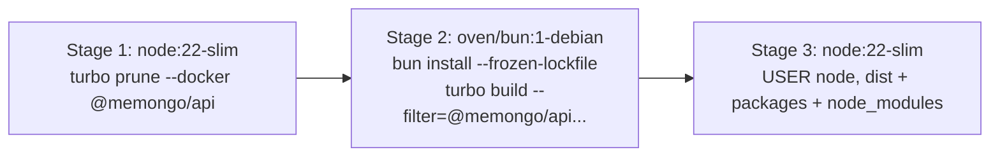

# Deployment

Memongo deploys as two pieces: a **MongoDB 8.x deployment with Atlas Search / Vector Search** (mongod + mongot) and the **API container**. Plain `mongo:7` does not work — Memongo requires `$vectorSearch`, Atlas Search indexes, and transactions, which a standalone `mongod` silently cannot serve (`docker/docker-compose.minimal.yml` header comment).

## The three compose files

All compose files pin the same image: `mongodb/mongodb-atlas-local:8.2.6-20260715T144108Z` — a single container bundling mongod (single-node replica set), mongot (community search engine), Atlas Search, and Vector Search.

| File | Contents | Use |
|------|----------|-----|
| `docker/docker-compose.yml` | MongoDB only, published on `127.0.0.1:27017` | One-command local database |
| `docker/docker-compose.full.yml` | API (always) + MongoDB (`--profile local`) | Full stack, or API-only against Atlas |
| `docker/docker-compose.minimal.yml` | MongoDB only | Run `apps/api` on the host against the container |

A fourth file, `docker/mongodb/docker-compose.preview.yml`, backs the preview script (`docker/mongodb/start-preview.sh`).

### Common MongoDB settings

- **Loopback-only publishing:** `127.0.0.1:${MONGODB_PORT:-27017}:27017`. Publishing on `0.0.0.0` would expose the database on every host interface; the full-stack compose file does not publish MongoDB at all — the API reaches it over the compose network (`docker/docker-compose.full.yml`).
- **Healthcheck:** the image's built-in `/usr/local/bin/runner healthcheck` verifies both mongod and mongot (10s interval, 10 retries, 30s start period).
- **Telemetry off:** `MONGODB_ATLAS_TELEMETRY_ENABLE=false`.
- **Named volumes** for `/data/db` and `/data/configdb`.
- **Auto-embeddings:** setting `VOYAGE_API_KEY` enables mongot-side auto-embedding through Voyage AI. The key must be an **Atlas Model API key** (`al-...` prefix); direct Voyage keys (`pa-...`) do not work because mongot routes through `ai.mongodb.com` (`docker/docker-compose.yml` header comment).

## The API container

`apps/api/Dockerfile` is a three-stage build:



1. **Prune** — `turbo prune --docker @memongo/api` extracts only the API and its workspace deps (`@memongo/memory-bridge`, `@memongo/memory-engine`, `@memongo/lib`).
2. **Install + build** — Bun installs from the pruned lockfile and builds to plain JS via `tsc`.
3. **Run** — `node:22-slim` running as the non-root `node` user; no `tsx` at runtime.

### Runtime environment

| Variable | Required | Notes |
|----------|----------|-------|
| `MEMONGO_API_KEY` | **yes** | Compose uses `${MEMONGO_API_KEY:?set MEMONGO_API_KEY}` — the container refuses to start without it (fail closed, no baked default) |
| `MEMONGO_MONGODB_URI` | yes | Atlas `mongodb+srv://...` or `mongodb://mongodb:27017/?directConnection=true` with the local profile |
| `MEMONGO_MONGODB_DATABASE` | no | Default `memongo` |
| `MEMONGO_API_PORT` / `MEMONGO_API_HOST` | no | Container listens on `0.0.0.0:3847`; published loopback-only as `127.0.0.1:3847` |
| `MEMONGO_AGENT_ID` | no | Default `main` |

The compose healthcheck hits `GET /health` every 30s; orchestrator readiness probes should target `/ready`, which returns 503 until the mongo, vector, and embedding lanes are all up (`apps/api/src/app.ts`). See [Debugging](how-to-contribute/debugging.md).

## Recipes

```bash
# Database only (host tooling reachable on localhost)
docker compose -f docker/docker-compose.yml up -d

# Full local stack (API + MongoDB + optional auto-embeddings)
MEMONGO_API_KEY="your-long-random-token" \
VOYAGE_API_KEY="al-your-atlas-model-api-key" \
docker compose -f docker/docker-compose.full.yml --profile local up -d

# API container against MongoDB Atlas
MEMONGO_MONGODB_URI="mongodb+srv://.../?appName=memongo" \
MEMONGO_API_KEY="your-long-random-token" \
docker compose -f docker/docker-compose.full.yml up -d

# Preview script equivalent
./docker/mongodb/start-preview.sh
```

## Helper scripts (`docker/mongodb/`)

- `start-preview.sh` — canonical one-command preview stack (start/stop)
- `start.sh`, `init-mongo.sh`, `rs-init.sh`, `setup-generator.sh` — replica-set init and the older non-preview path (`docker/mongodb/docker-compose.mongodb.yml`)
- `mongod.conf`, `mongot.conf` — daemon configs for the manual stack
- `README.md` — operator documentation for the stack

## Production notes

- **Graceful shutdown:** the API registers SIGTERM/SIGINT handlers that stop accepting connections, close the memory bridge (flushing the access tracker and Mongo clients), then exit — with a 15s force-exit deadline so the container runtime's kill window is never blocked (`apps/api/src/server.ts`, `apps/api/src/app.ts:432`).
- **Strict vector mode:** production deployments that cannot tolerate silent `$text`-only degradation set `MEMONGO_REQUIRE_VECTOR=1`; boot exits 1 when the vector lane is unavailable (`apps/api/src/server.ts:55-62`).
- **CI parity:** the e2e CI job runs the same pinned `mongodb-atlas-local` image as a service container (`.github/workflows/ci.yml`), so local Docker behavior matches CI.

## Related pages

- [API app](apps/api/index.md) — the containerized app
- [Security](security.md) — fail-closed auth and loopback networking posture
- [Configuration](reference/configuration.md) — every environment variable
