# Bitemporal memory

Every memory type in Memongo carries a validity window, so retrieval can answer "what was true at time T" — not just "what is true now". The enforcement lives in one module, `packages/memory-engine/src/mongodb-bitemporal.ts`, which is the durable surface every retrieval path (standard, semantic, hybrid) uses to enforce current-state and historical-time invariants.

## The validity model

A memory's validity window is defined by two dates:

- **`validAt`** — when the assertion became true (required on canonical writes)
- **`invalidAt`** — when it stopped being true (absent/null = still valid)

Retrieval at `queryTime = T` must only return memories satisfying:

```
validAt <= T  AND  (invalidAt IS NULL  OR  invalidAt > T)
```

Two field namings exist across memory types: conversation events and the bitemporal filter use `validAt`/`invalidAt`, while structured memories and search results expose `validFrom`/`validTo` (see `packages/memory-engine/src/mongodb-trust.ts` and the lifecycle handle schemas in `packages/tools/src/index.ts`). Writes accept both spellings — `memongoBridgeWriteConversationEvent` in `packages/memory-bridge/src/memongo-bridge.ts` takes `validAt`/`invalidAt` timestamps, and structured lifecycle patches take `validTo` (`packages/tools/src/index.ts`).

Legacy rows written before the bitemporal migration may lack `validAt`; those are treated as valid, so retrieval is monotonic across the migration.

## buildBitemporalFilter

`buildBitemporalFilter(queryTime)` in `packages/memory-engine/src/mongodb-bitemporal.ts` returns a MongoDB `$and`-composable `Document`:

```
$and:
  - $or: [ { validAt: { $exists: false } }, { validAt: { $lte: queryTime } } ]
  - $or: [ { invalidAt: { $exists: false } }, { invalidAt: null }, { invalidAt: { $gt: queryTime } } ]
```

Callers merge it into their existing filter via `$and`. The function throws if `queryTime` is not a valid `Date` — a bad clock would silently return the wrong slice of history, so it fails fast.

Three sibling functions keep the shape consistent across execution contexts:

| Function | Where it runs | Difference |
|----------|---------------|------------|
| `buildBitemporalFilter` | Ordinary MongoDB queries and post-search filters | Accepts `invalidAt: null` as "open window" |
| `buildVectorBitemporalFilter` | `$vectorSearch` prefilters | Omits the `{ invalidAt: null }` branch — Vector Search prefilters do not document BSON null as a supported filter value, so canonical event writes represent an open window by omitting `invalidAt` |
| `isMemoryValidAt` | Property tests and unit tests on in-memory arrays | Pure TypeScript predicate mirror of the MongoDB filter, kept in the same file so the two cannot drift |

## Point-in-time queries

Because the filter is parameterized by `queryTime`, callers choose the time slice per request:

- **Current-state retrieval (default):** pass `new Date()` — only memories whose window contains "now" survive.
- **Historical retrieval:** pass a past timestamp to reconstruct what the agent knew at that moment. The conversation-recall path exposes this as the `asOf` parameter (see the `recallConversationSchema` in `packages/tools/src/index.ts`).

```mermaid
gantt
    title Validity windows vs query time
    dateFormat X
    axisFormat %s
    section Memory A
    valid window (survives at T)     :a1, 0, 100
    section Memory B
    invalidated before T (filtered)  :a2, 0, 40
    section Memory C
    not yet valid at T (filtered)    :a3, 80, 140
```



Invalidation is soft: setting `invalidAt` (or `validTo`) closes the window without deleting the document, so history remains queryable and the lifecycle system can record *when* a memory stopped being true. Trust scoring then demotes invalidated and stale results independently (see [Trust scoring](./trust-scoring.md)).

## Key file

| File | Role |
|------|------|
| `packages/memory-engine/src/mongodb-bitemporal.ts` | `buildBitemporalFilter`, `buildVectorBitemporalFilter`, `isMemoryValidAt` |

## Related pages

- [Features overview](./index.md)
- [Trust scoring](./trust-scoring.md) — temporal validity and freshness dimensions consume the same fields
- [Multi-tenancy](./multi-tenancy.md) — the scope filter and the bitemporal filter compose under `$and`
- [The core engine](../packages/memory-engine/index.md)
