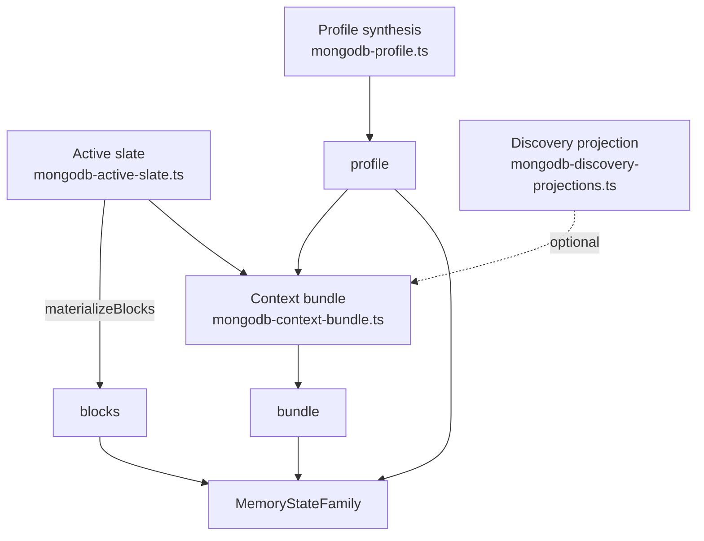

# Context bundles and state

Active contributors: Rom Iluz

Memongo assembles three coordinated views over the same underlying memory — the **State Family** — so that an app or agent can get durable state, hot session context, and a ready-to-send LLM prompt from one coherent set of reads. `MemoryStateFamily` (`packages/memory-engine/src/index.ts`) is the type that ties them together:

```ts
type MemoryStateFamily = {
  profile: ProfileSynthesis        // synthesized summary of structured memory
  blocks: MemoryBlocks             // always-loaded hot session context
  bundle: MemoryContextBundle      // token-budgeted assembly for LLM consumption
}
```



## Active slate: materializing hot session context

`hydrateActiveSlate()` in `packages/memory-engine/src/mongodb-active-slate.ts` pulls four candidate sources in parallel for a given `{ agentId, scope, scopeRef }` — critical/high-salience structured memory, active procedures, other durable structured memory (decisions, facts, projects), and recent conversation events — then interleaves them by source priority into a single deduplicated item list, capped at `maxItems` (default 5, hard ceiling 6). Each source query is wrapped in `settled()` so one failing collection degrades the slate (`metadata.partial: true`) instead of failing the whole hydration.

`materializeBlocks()` then groups those active-slate items into labeled **memory blocks** (`persona`, `user-profile`, `current-work`, `active-risks`, `procedure-hints`, `recent-context`, `custom`), each with a default token budget (e.g. 80 tokens for `user-profile`, 60 for `active-risks`). This is the `blocks` view of the State Family — memory that should always be loaded for the session regardless of what the caller searches for.

## Context bundles: token-budgeted assembly for LLM consumption

`buildContextBundle()` in `packages/memory-engine/src/mongodb-context-bundle.ts` composes a `MemoryContextBundle` from up to six candidate sections, each fetched concurrently and independently fault-tolerant (`settled()` again):

1. **Active slate** — reuses `hydrateActiveSlate()`.
2. **Query evidence** — if the request has a query and a `search` callback, results are split into "Direct Evidence" (explicit, user-stated — confidence >= 0.9 or no confidence field) and "Derived Insights" (agent-inferred), so inferred content never crowds out explicit facts in the same section.
3. **Episode summary** — the most recent matching episode (`episodesCollection`), preferring the shortest available summary tier (`shortTermSummary` -> `mediumTermSummary` -> `longTermSummary` -> `summary`).
4. **Recent events** — the latest events in the resolved identity (see below).
5. **Discovery projection** (opt-in via `request.includeDiscoveryProjection`).
6. **Profile** (opt-in via `request.includeProfile`, or always included in `wake-up` mode).

Each candidate section is rendered to markdown-ish text and packed into the bundle via `materializeSection()`, which adds items one at a time and stops (marking the section `truncated`) once the running token estimate (`~1 token per 4 characters`) would exceed the remaining budget out of a total `tokenBudget` (default 450, clamped between 128 and 4000; `wake-up` mode forces 250). This is what "token-budgeted" means in practice: sections are filled in priority order until the budget runs out, not truncated uniformly.

`wake-up` mode is a distinct request shape used for session-start hydration: it skips the query/evidence path entirely, forces a small token budget, and always includes the profile section — a lightweight "who is this and what's active" snapshot rather than a query-driven bundle.

### Session narrowing is one-way

`resolveRecentEventIdentity()` governs which events show up in the "recent events" section when a caller passes a `sessionId` alongside a broader scope. It only ever narrows the caller's already-authorized identity: a `session`-scoped caller can't be redirected to a different session at all, an `agent`-scoped caller can narrow into one of its own sessions, and every other scope (`user`, `workspace`, `tenant`, `global`) ignores the requested `sessionId` outright rather than risk resolving into a session that belongs to a different tenant.

## Discovery projections: browsing without full content

`buildDiscoveryProjection()` in `packages/memory-engine/src/mongodb-discovery-projections.ts` answers "what exists in this scope" without returning full memory content — a lightweight index rather than a search result set. Four projection kinds are supported:

| Kind | Answers | Requires a query |
|---|---|---|
| `entity-brief` | What do we know about this entity and its relations? | yes |
| `topic-brief` | What episodes/facts/procedures relate to this topic? | yes |
| `what-changed` | What structured facts, procedures, or relations changed in a time window? | no |
| `contradiction-report` | What memory is currently conflicted or invalidated? | no |

Each builder returns a title, summary, and a list of sections with evidence entries (`title`, `summary`, `path`, `source`, `canonicalId`, optional `sourceEventIds`) — enough to know a memory exists and where it points, without inlining its full value. `what-changed` additionally deduplicates to the latest revision per identity (`pickLatestDocuments()`) so a fact that changed multiple times in the window surfaces once. Every projection run is recorded via `recordProjectionRun()` regardless of outcome (`ok`, `partial`, or `failed`), which feeds operational visibility into projection health.

When a context bundle requests `includeDiscoveryProjection`, the projection's evidence is flattened into a `discovery-projection` section alongside the other candidate sections and competes for the same token budget.

## Key source files

| File | Role |
|---|---|
| `packages/memory-engine/src/mongodb-context-bundle.ts` | `buildContextBundle()` — assembles and token-budgets the `bundle` view |
| `packages/memory-engine/src/mongodb-active-slate.ts` | `hydrateActiveSlate()`, `materializeBlocks()` — the `blocks` view |
| `packages/memory-engine/src/mongodb-discovery-projections.ts` | `buildDiscoveryProjection()` — the four projection kinds |
| `packages/memory-engine/src/index.ts` | `MemoryStateFamily` type tying `profile`/`blocks`/`bundle` together |

See also [Memory taxonomy](memory-taxonomy.md) for how these views relate to the underlying memory types, [Multi-tenancy and scopes](multi-tenancy-and-scopes.md) for the `{ agentId, scope, scopeRef }` identity every one of these functions takes as input, and the [glossary](../overview/glossary.md) for the State Family term definitions.
