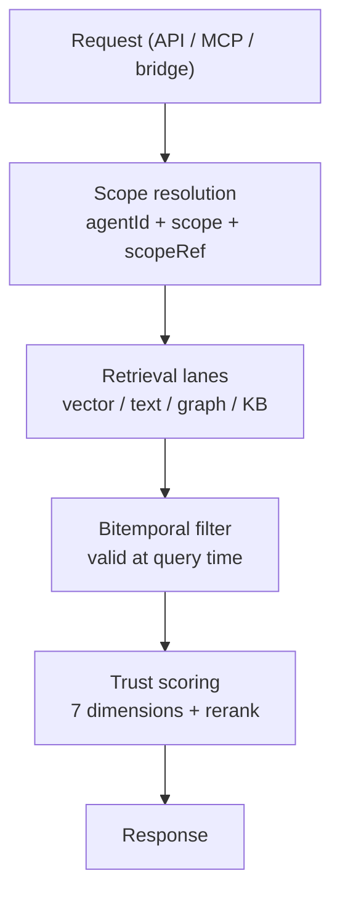

# Features

Memongo's cross-cutting features apply to every memory type and every access path (HTTP API, MCP, client SDK, bridge). They are implemented inside `@memongo/memory-engine` and `@memongo/lib`, and enforced identically no matter which surface a caller uses.

## Feature map

| Feature | What it provides | Key files |
|---------|------------------|-----------|
| [Multi-tenancy](./multi-tenancy.md) | Two tenancy modes: shared collections with an `agentId`/`scopeRef` discriminator (default), and per-agent collection prefixes. One canonical scope-resolution rule for reads and writes. | `packages/memory-engine/src/backend-config.ts`, `packages/memory-engine/src/mongodb-scope.ts`, `apps/api/src/scope-identity.ts` |
| [Bitemporal memory](./bitemporal-memory.md) | Validity windows (`validAt`/`invalidAt`, `validFrom`/`validTo`) on all memory types, with point-in-time retrieval enforced by a single filter builder. | `packages/memory-engine/src/mongodb-bitemporal.ts` |
| [Trust scoring](./trust-scoring.md) | 7-dimension trust annotation on search results, trust-aware reranking, and low-trust abstention. | `packages/memory-engine/src/mongodb-trust.ts` |
| [Knowledge base](./knowledge-base.md) | Document ingestion, markdown chunking, dedup, and hybrid KB search — separate from conversation memories. | `packages/memory-engine/src/mongodb-kb.ts`, `packages/memory-engine/src/mongodb-kb-search.ts`, `packages/memory-engine/src/mongodb-sync.ts` |

## How the features compose

Every read is confined to exactly one tenant partition (multi-tenancy), restricted to memories valid at the query time (bitemporal), and annotated with trust metadata before ranking is finalized (trust scoring). Writes carry the same three features forward: they land in the resolved partition with scope fields stamped, record their validity window, and accumulate the provenance that trust scoring later consumes.

## Related pages

- [The core engine](../packages/memory-engine/index.md) — where these features are implemented
- [Cross-cutting systems](../systems/index.md) — subsystem-level detail (search, jobs, graph, episodes)
- [REST API reference](../api/index.md) — how the features surface over HTTP
- [Auth and security](../security.md) — scoped API keys and authorization
