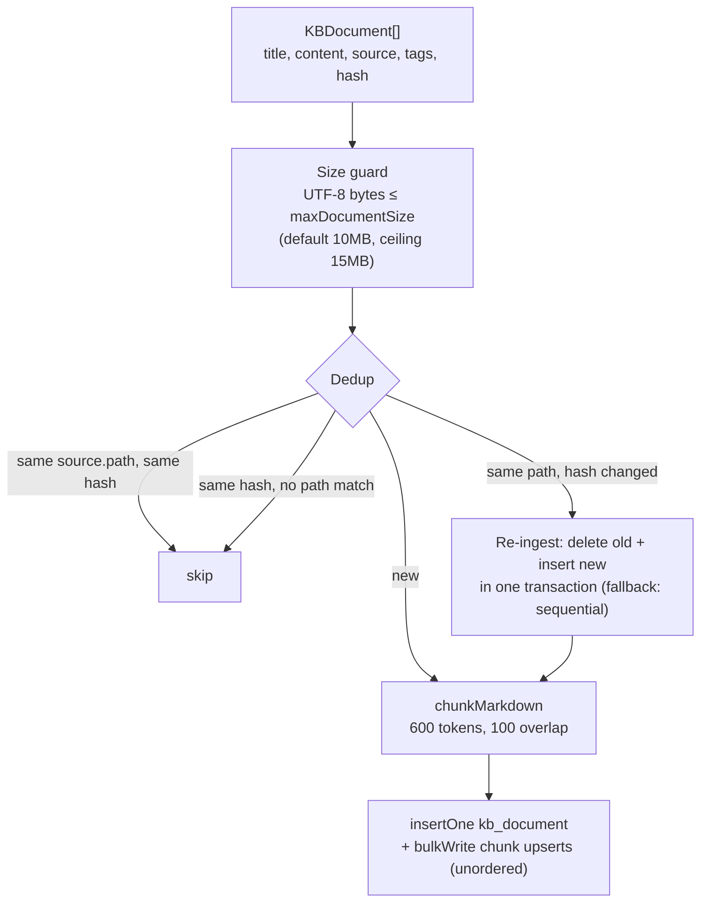

# Knowledge base

The knowledge base (KB) is Memongo's store for ingested reference documents — files, URLs, and manual content — kept **separate from conversation memories**. Conversation events, structured memories, and episodes capture what happened in dialogue; the KB holds durable reference material that agents search as the `reference` source. Implementation: `packages/memory-engine/src/mongodb-kb.ts` (ingestion + lifecycle) and `packages/memory-engine/src/mongodb-kb-search.ts` (search).

## Data model

Two collections per tenant prefix:

- **`{prefix}kb_documents`** — one document per ingested file: title, full content, `source` (`type`: file/url/manual/api, `importedBy`: wizard/cli/api/agent), tags, category, content `hash`, `chunkCount`.
- **`{prefix}kb_chunks`** — markdown-aware chunks with `docId`, `path`, `startLine`/`endLine`, per-chunk `hash`, the chunk `text`, and an `embeddingStatus` (chunks are written embedding-free — `"pending"` — and rely on MongoDB automatic embedding indexes at query time).

Every KB document and chunk is tagged with the caller's resolved `{agentId, scope, scopeRef}` (issue #27). `scopeRef` is the concrete isolation namespace every read/write/delete filters on, so tenants sharing one physical collection cannot observe or mutate each other's KB. Callers wanting a shared corpus use scope `global` or `tenant` (see [Multi-tenancy](./multi-tenancy.md)).

## Ingestion pipeline

`ingestToKB` in `packages/memory-engine/src/mongodb-kb.ts`:

Key behaviors:

- **Size enforcement** is measured in UTF-8 bytes (what BSON stores), not UTF-16 code units — `.length` undercounts non-ASCII content by up to 3x. The ceiling sits under the 16 MiB BSON document limit with headroom for metadata.
- **Dedup** checks `source.path` first, then content `hash` within the caller's `scopeRef`. Same path with a changed hash triggers re-ingestion; the delete-old + insert-new pair is wrapped in `withTransaction()` (majority write concern) with a sequential fallback on standalone topologies. A concurrent ingest that wins the `uq_kb_scope_hash` unique-index race between the dedup check and the insert counts as a successful dedup, not an error.
- **Chunk upserts** are keyed on `{scopeRef, path, startLine, endLine}` so re-ingestion updates in place rather than duplicating.
- **Force mode** (`force: true`) skips the dedup check and replaces by hash.
- A `progress` callback reports per-document completion for CLI/wizard UX.

Sibling entry points in the same file: `ingestFilesToKB` (read files from disk, then `ingestToKB`), `listKBDocuments`, `removeKBDocument` (document + its chunks), and `getKBStats`.

Configuration (resolved in `packages/memory-engine/src/backend-config.ts` under `memory.mongodb.kb`): `enabled` (default on), `chunking.tokens` (600), `chunking.overlap` (100), `autoImportPaths` (directories imported at startup), `maxDocumentSize` (10 MiB), `autoRefreshHours` (24 — the manager re-imports `autoImportPaths` once the refresh interval elapses, `packages/memory-engine/src/mongodb-manager.ts`).

## KB search

`searchKB` in `packages/memory-engine/src/mongodb-kb-search.ts` mirrors the general hybrid search waterfall:

1. `scopeRef` is **always** applied — it is the tenant isolation predicate.
2. Optional metadata filters (`tags` `$all`, `category`, `source.type`) are resolved against `kb_documents` first, bounding chunk search to matching `docId`s via `$in` (capped at 10,000 docs).
3. Server-side fusion of the vector lane and the Atlas Search text lane with fixed weights **0.7 vector / 0.3 text** (`KB_FUSION_VECTOR_WEIGHT`/`KB_FUSION_TEXT_WEIGHT`):
   - `scoreFusion` (MongoDB 8.3+) with `minMaxScaler` normalization — the only documented normalization yielding a comparable [0,1] fused score, so the caller's `minScore` applies directly;
   - `rankFusion` otherwise; `js-merge` skips server fusion entirely.
4. `numCandidates` defaults to `max(maxResults * 20, 100)`, hard-capped at MongoDB's maximum.

Results map to `MemorySearchResult` with `path` prefixed `kb:`, `source: "reference"`, a 700-character snippet cap, and the chunk's line range.

## File sync (reference source)

`syncToMongoDB` in `packages/memory-engine/src/mongodb-sync.ts` is the companion pipeline that syncs workspace memory files (markdown) into the `files`/`chunks` collections used by the `reference` retrieval lane. It namespaces every record as `source::agentId::scope::scopeRef::relPath`, tracks file hash/mtime/size for incremental sync, chunks with the same `chunkMarkdown` helper, and batches writes through transactions (`withTransactionBatched`). KB ingestion and file sync share chunking and bulk-write machinery but write to different collections: the KB is curated reference documents with metadata filters; synced files are the agent's own workspace notes.

## Key files

| File | Role |
|------|------|
| `packages/memory-engine/src/mongodb-kb.ts` | `ingestToKB`, `ingestFilesToKB`, `listKBDocuments`, `removeKBDocument`, `getKBStats` |
| `packages/memory-engine/src/mongodb-kb-search.ts` | `searchKB` — hybrid fusion over KB chunks with tenant-scoped filters |
| `packages/memory-engine/src/mongodb-sync.ts` | `syncToMongoDB` — incremental workspace-file sync into files/chunks |
| `packages/memory-engine/src/backend-config.ts` | `memory.mongodb.kb.*` config resolution |

## Related pages

- [Features overview](./index.md)
- [Multi-tenancy](./multi-tenancy.md) — `scopeRef` as the KB isolation predicate
- [Trust scoring](./trust-scoring.md) — KB results join trust annotation as the `reference` source
- [The core engine](../packages/memory-engine/index.md)
