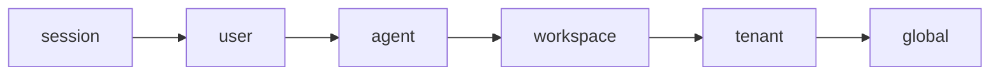
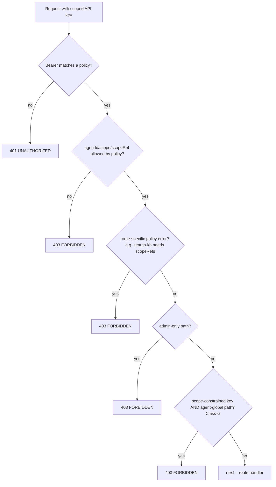

# Multi-tenancy and scopes

Active contributors: Rom Iluz

Every memory Memongo stores or retrieves is confined to an `{ agentId, scope, scopeRef }` identity (see [State model](../overview/glossary.md) for `scope`/`scopeRef` definitions). This page covers the scope enum, how a scoped API key restricts what a caller can touch, and the guard that keeps a scope-restricted key off routes that ignore scope entirely.

## The six scopes

The canonical scope enum lives in one place — `packages/lib/src/contract.ts` (`MEMORY_SCOPE_VALUES`) — and every other scope enum (OpenAPI, MCP tool schemas, zod schemas, scoped-API-key policy validation) derives from it, so the wire contract can never drift from what the engine accepts.

| Scope | Isolates | Typical `scopeRef` |
|---|---|---|
| `session` | One conversation or short-lived task | `session:<sessionId>` |
| `user` | One person's stable preferences | `user:<userId>` |
| `agent` | A named agent's durable working memory (default) | `agent:<agentId>` |
| `workspace` | One repo, app, or work area | `workspace:<hashed-path>` |
| `tenant` | An organization or customer | `tenant:<tenantId>` |
| `global` | Deliberate defaults shared by every caller | `global` |

The ordering above is roughly narrowest to broadest, not a strict subset hierarchy — each scope is still its own isolated partition (`scope` + `scopeRef` together select a partition), not a superset of the narrower ones. `resolveScopeRef()` in `packages/memory-engine/src/mongodb-scope.ts` derives a default `scopeRef` for each scope from the supplied identifiers (`sessionId`, `userId`, `tenantId`, a hashed `workspaceDir`, or the literal `"global"`), and throws if a scope's required identifier is missing (e.g. `tenant` scope requires `tenantId`).

## Auth-time and execution-time resolution share one function

Both the HTTP auth middleware and the route handlers that pick a manager/partition need to read the same `agentId`/`scope`/`scopeRef` off a request — if they used different logic, a request could pass authorization under one identity while writing under another. `apps/api/src/scope-identity.ts` fixes this with two shared helpers:

- `resolveScopeInput(c)` — merges query params with the JSON body (body wins), using Hono's cached `c.req.json()` so it is safe to call from both auth middleware and route handlers without disturbing the request stream.
- `resolveScopeField(input, field)` — reads a field from the merged input, checking the top-level object first and then the nested `handle`, `entry`, `memory`, and `params` containers, with the top-level value taking precedence.

`apps/api/src/app.ts` re-exports these as `readRequestScopeInput` / `firstStringField` and calls them from `authorizeScopedApiKey()`; route handlers that need the authoritative `agentId` call `resolveRequestAgentId(c)`, which is built on the identical resolution path. The code comments call this the "issue #57 divergence class" — the historical failure mode where a nested-only `agentId` that auth read but the route ignored could land a write in the default partition instead of the authorized one.

## Scoped API keys

`MEMONGO_API_SCOPED_KEYS` (parsed by `parseScopedApiKeyPolicies()` in `apps/api/src/app.ts`) defines bearer tokens that are restricted to specific `agentIds`, `scopes`, and/or `scopeRefs`, each either a concrete allow-list or the wildcard `"*"`. Policy validation is strict and fails closed at config load:

- A policy must constrain at least one of `agentIds`, `scopes`, or `scopeRefs` with a concrete (non-wildcard) value — an all-wildcard policy is rejected as effectively unauthenticated.
- `"*"` must be the only value in its list if used at all (no mixing wildcard with concrete values).
- Every `scopes` value must be a member of the canonical `MEMORY_SCOPE_VALUES` set — a non-canonical scope in a policy would authorize a request whose scope execution then silently drops (breaking write-forcing and letting a nested `entry.scope` smuggle survive), so this is rejected outright.

At request time, `authorizeScopedApiKey()` resolves the request's `agentId`, `scope`, and `scopeRef` (via the shared helpers above, plus `containerTag` as a `scopeRef` fallback) and checks each against the matched policy's allow-lists with `allowedByPolicy()`. Any mismatch — including a missing value the policy requires — returns 403.

`routePolicyError()` adds one route-specific rule: `/v1/search-kb` requires the policy to have a concrete `scopeRefs` constraint, because unscoped KB search would otherwise let a scoped key search across the entire knowledge base regardless of its stated scope restriction. See [Knowledge base](knowledge-base.md).

## Class-G: agent-global routes reject scope-constrained keys

Some `/v1` routes have no tenant scope to filter by at all — they read or mutate data across an agent's entire memory. `AGENT_GLOBAL_V1_PATHS` in `apps/api/src/app.ts` lists them explicitly (`/v1/status`, `/v1/status/detailed`, `/v1/stats`, `/v1/sync`, `/v1/probes/embedding`, `/v1/probes/vector`, `/v1/read-file`, `/v1/chain-trace`, `/v1/self-edit`), and `isAgentGlobalV1Path()` extends the set to every `/v1/admin/*` and `/v1/jobs*` path.

A scoped key that supplies its allowed scope satisfies the per-request `allowedByPolicy()` check even against these routes — the check only validates the fields present on the request, and agent-global routes may not read scope from the request at all. `policyIsScopeConstrained()` closes this gap: a policy is scope-constrained when it restricts `scopes` or `scopeRefs` to a concrete allow-list (an `agentIds`-only restriction is not scope-constrained, since agent scoping is orthogonal to the tenant boundary). If a scope-constrained key targets an agent-global path, the middleware rejects it with 403 regardless of what scope value the request supplied — there is no tenant boundary on that route for the policy to enforce.

`ADMIN_ONLY_V1_PATHS` (`/v1/read-file`, `/v1/import/conversations`) is a stricter, separate list: no scoped API key — scope-constrained or not — may reach these server-file routes at all.

## Key source files

| File | Role |
|---|---|
| `packages/lib/src/contract.ts` | `MEMORY_SCOPE_VALUES` — the single canonical scope enum every other layer derives from |
| `apps/api/src/scope-identity.ts` | `resolveScopeInput` / `resolveScopeField` — shared request-identity resolution used by both auth and routes |
| `apps/api/src/app.ts` | Scoped-API-key policy parsing/validation, `authorizeScopedApiKey`, `AGENT_GLOBAL_V1_PATHS`, `ADMIN_ONLY_V1_PATHS`, `policyIsScopeConstrained`, `routePolicyError` |
| `packages/memory-engine/src/mongodb-scope.ts` | `resolveScopeRef` / `resolveScopeIdentity` — derives a `scopeRef` for each scope and unifies read/write scope defaulting |

See also [Overview: architecture](../overview/architecture.md) and [Glossary](../overview/glossary.md).
