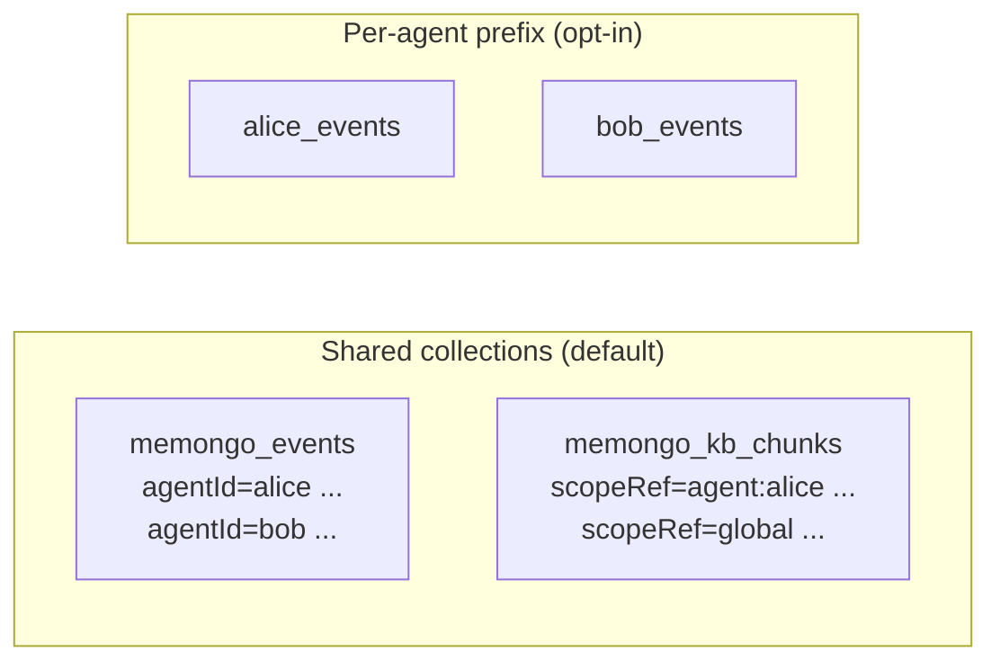
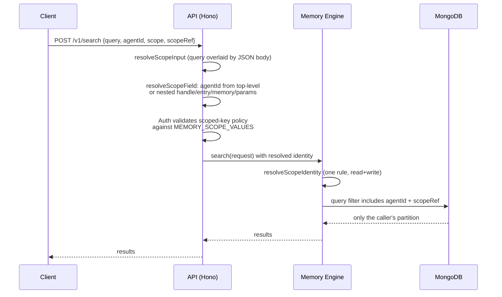

# Multi-tenancy

Memongo isolates every memory by tenant. Two physical layouts are supported, selected by configuration, and one logical identity model — `{ agentId, scope, scopeRef }` — applies on top of both.

## Tenancy modes

| Mode | Layout | How to enable |
|------|--------|---------------|
| **Shared collections (default)** | All agents share one physical collection set under the `memongo_` prefix. Isolation is logical: `agentId` and `scopeRef` lead every document, index, and query filter. | Default — `DEFAULT_MONGODB_COLLECTION_PREFIX = "memongo_"` in `packages/memory-engine/src/backend-config.ts` |
| **Per-agent prefix (opt-in)** | Each agent gets its own physical collection set (`{prefix}events`, `{prefix}kb_chunks`, ...). Isolation is physical. | Set `memory.mongodb.collectionPrefix` in config or `MEMONGO_MONGODB_COLLECTION_PREFIX` in the environment |

The shared mode is the MongoDB-recommended pattern for multi-tenant vector search: one connection pool, one set of Atlas Search/Vector indexes, with the tenant discriminator inside every index filter and query predicate. The env var `MEMONGO_MONGODB_COLLECTION_PREFIX` beats the config value; when neither is set, the shared `memongo_` prefix applies (resolution order in `resolveMemoryBackendConfig` in `packages/memory-engine/src/backend-config.ts`).

## The identity model: agentId, scope, scopeRef

Every read and write is confined to one partition described by three fields:

- **`agentId`** — the owning agent. Resolved at the API layer by `resolveRequestAgentId` in `apps/api/src/scope-identity.ts`; defaults to `MEMONGO_AGENT_ID` or `"main"` at the bridge (`packages/memory-bridge/src/memongo-bridge.ts`).
- **`scope`** — one of six canonical scopes: `session`, `user`, `agent`, `workspace`, `tenant`, `global`. The single definition lives in `MEMORY_SCOPE_VALUES` in `packages/lib/src/contract.ts`; the OpenAPI document, MCP tool schemas, zod schemas, and scoped-API-key policy validation all derive from it so the authorization and execution layers cannot disagree (issue #57 divergence class). The TypeScript type `MemoryScope` in `packages/lib/src/types.memory.ts` is derived from the same array.
- **`scopeRef`** — the concrete partition string, computed by `resolveScopeRef` in `packages/memory-engine/src/mongodb-scope.ts`:

| Scope | scopeRef form | Companion id required |
|-------|---------------|----------------------|
| `session` | `session:{sessionId}` | `sessionId` (throws if missing) |
| `user` | `user:{userId}` | `userId` (throws if missing) |
| `agent` | `agent:{agentId}` | — |
| `workspace` | `workspace:{sha256(realpath)[0:16]}` or `workspace:{agentId}` | `workspaceDir` (falls back to agentId) |
| `tenant` | `tenant:{tenantId}` | `tenantId` (throws if missing) |
| `global` | `global` | — |

An explicit caller-provided `scopeRef` always wins over the computed form.

## One resolution rule for reads and writes

`resolveScopeIdentity` in `packages/memory-engine/src/mongodb-scope.ts` applies the same rule in both directions so a write and the search meant to find it can never land in different partitions:

1. An explicit `scope` always wins.
2. Otherwise a present `sessionId` (writes) / `sessionKey` (reads) implies `scope: "session"`.
3. Otherwise the caller-provided `defaultScope` applies. Reads pass the `MEMONGO_SEARCH_DEFAULT_SCOPE`-resolved value (see `resolveSearchDefaultScope` in `packages/memory-engine/src/backend-config.ts`); writes omit it and fall through to `"agent"`.

`MEMONGO_SEARCH_DEFAULT_SCOPE` lets single-user deployments default search reads to `global` (or `user`) instead of the multi-tenant `agent` default, so memories written under broader scopes stop being invisible. An invalid value throws at startup — a typo'd scope would silently change retrieval behavior, so it fails fast. Scopes that require a reference (`session`/`user`/`tenant`) still need their companion id at the call site.

## Threading through the stack

Key properties:

- **Auth and execution resolve identity from the same input.** `resolveScopeInput` in `apps/api/src/scope-identity.ts` merges query params with the JSON body (body wins), and `resolveScopeField` searches the top level plus the nested containers `handle`, `entry`, `memory`, and `params`. Both the auth middleware and the route handlers call these helpers, so a request cannot pass authorization under one identity while writing under another (issue #57).
- **`scopeRef` is the isolation predicate.** Every read, write, and delete path filters on `scopeRef`. The KB search path states this explicitly: "`scopeRef` is ALWAYS applied — it is the tenant isolation predicate, so a search can never return another tenant's KB chunks" (`packages/memory-engine/src/mongodb-kb-search.ts`). Callers wanting a shared corpus use scope `global` or `tenant`.
- **Indexes lead with the discriminator.** Documents and search indexes carry `agentId`/`scopeRef` first, so tenant pruning happens inside the index, not as a post-filter (see `packages/memory-engine/src/mongodb-schema.ts`).

## Key files

| File | Role |
|------|------|
| `packages/memory-engine/src/backend-config.ts` | Prefix resolution (`MEMONGO_MONGODB_COLLECTION_PREFIX`, `DEFAULT_MONGODB_COLLECTION_PREFIX`), `resolveSearchDefaultScope` |
| `packages/memory-engine/src/mongodb-scope.ts` | `resolveScopeRef`, `resolveScopeIdentity` — the canonical read/write scope rule |
| `apps/api/src/scope-identity.ts` | Request-side identity resolution shared by auth and routes; re-exports the canonical scope values |
| `packages/lib/src/contract.ts` | `MEMORY_SCOPE_VALUES` — the single scope enum every layer validates against |
| `packages/lib/src/types.memory.ts` | `MemoryScope` type derived from the contract enum |

## Related pages

- [Features overview](./index.md)
- [Auth and security](../security.md) — scoped API-key policies validated against the same scope enum
- [The core engine](../packages/memory-engine/index.md)
- [Bitemporal memory](./bitemporal-memory.md)
