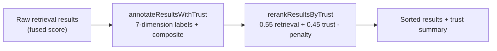

# Trust scoring

Every search result is annotated with a trust assessment before it is returned. Trust scoring lives in `packages/memory-engine/src/mongodb-trust.ts` and answers one question per result: how much should the agent rely on this memory?

## The 7 dimensions

`computeResultTrust` labels each result on seven dimensions, then combines them into one score in `[0, 1]`:

| Dimension | Labels | How it is resolved |
|-----------|--------|--------------------|
| `exactness` | `exact-id` (1.0), `exact-locator` (0.9), `approximate` (0.25) | A `canonicalId` means the result pins an exact memory id; a non-empty `path` is an exact locator |
| `contradiction` | `invalidated` (0), `conflicted` (0.25), `none` (1) | Derived from the result's lifecycle `state` |
| `scopeMatch` | `exact` (1), `partial` (0.8), `unknown` (0.6), `mismatch` (0.15) | Compares the request's `sessionKey`/`scopeRef`/`scope` against the result's — a `scopeRef` mismatch scores 0.15 |
| `freshness` | `fresh` (1), `aging` (0.8/0.6/0.45), `stale` (0.25/0.1), `timeless` (0.7), `unknown` (0.5) | Anchored on `lastConfirmedAt` (falling back to `timestamp`): ≤24h fresh, ≤7d/≤30d aging, older stale. A past `validTo` forces `stale` at 0.1; reference sources with no anchor are `timeless` |
| `provenance` | `dense` (1), `partial` (0.85/0.8), `sparse` (0.65), `none` (0.4) | Counts `sourceEventIds` (also looked up inside `provenance`): ≥2 dense, 1 partial; event/episode paths get partial credit |
| `confidence` | `high` (≥0.75), `medium` (≥0.5), `low` (<0.5) | The confidence band of the final composite score |
| `sourceDiversity` | `multi` (1), `single` (0.65) | `multi` when the result set spans more than one `source` (conversation/structured/reference) |

## Composite score

The composite is a weighted sum, multiplied by the memory's own stored `confidence` field when present:

```
score = ( exactness        * 0.20
        + scopeMatch       * 0.15
        + provenance       * 0.15
        + freshness        * 0.15
        + temporalValidity * 0.15
        + sourceReliability* 0.10   (conversation 0.88, structured 0.84, reference 0.72)
        + reinforcement    * 0.05   (log2(reinforcementCount + 1) / 3)
        + retrievalScore   * 0.03
        + sourceDiversity  * 0.02 ) * confidenceWeight
```

Hard caps then enforce non-negotiable states:

- `contradiction: invalidated` caps the score at **0.18**
- `contradiction: conflicted` caps it at **0.42**
- `scopeMatch: mismatch` caps it at **0.35**

A human-readable `factors` array (e.g. `exact-id`, `fresh`, `scope-mismatch`, `provenance-dense`, `multi-source-set`, `low-trust`) is attached so callers can explain *why* a result earned its score.

## How trust affects ranking

Two exported functions wire trust into the retrieval pipeline:

1. **`annotateResultsWithTrust(results, context)`** — computes per-result trust. `sourceDiversity` is computed once per result set (`multi` when more than one `source` is present) and passed to every result.
2. **`rerankResultsByTrust(results)`** — re-sorts by `normalizedRetrieval * 0.55 + trust * 0.45 - penalty`, where the penalty is 0.6 for `invalidated`, 0.25 for `conflicted`, and 0.1 for `stale` freshness. Retrieval score is min-max normalized within the result set first, so the two terms are comparable.



`summarizeTrust(results)` produces the aggregate `MemorySearchTrustSummary` returned with search responses: top score/confidence, average score, a high/medium/low distribution, contradiction/stale/exact counts, and source diversity.

## Abstention

`shouldAbstainForLowTrust` lets the search path decline to answer: when **no** result reaches medium or high confidence **and** the query is strict (`needExactEvidence` or a `direct`/`scoped` classification), it returns the abstention reason `"All surviving results were low-trust after applying the active constraints."` — an honest "I don't know" instead of a low-trust answer.

## Importance decay

The same module also owns `computeImportanceDecay(importance, createdAt, now, halfLifeDays = 7, temporalScope)`: exponential half-life decay on the stored `importance` field (1.0 → ~0.5 after one half-life). Memories with `temporalScope` `permanent` or `ongoing` — preferences, facts — never decay.

## Key file

| File | Role |
|------|------|
| `packages/memory-engine/src/mongodb-trust.ts` | `computeResultTrust`, `annotateResultsWithTrust`, `rerankResultsByTrust`, `summarizeTrust`, `computeImportanceDecay`, `shouldAbstainForLowTrust` |

## Related pages

- [Features overview](./index.md)
- [Bitemporal memory](./bitemporal-memory.md) — `validFrom`/`validTo` feed the freshness and temporal-validity inputs
- [Multi-tenancy](./multi-tenancy.md) — the scope/scopeRef match dimension
- [Cross-cutting systems](../systems/index.md) — the retrieval pipeline trust plugs into
