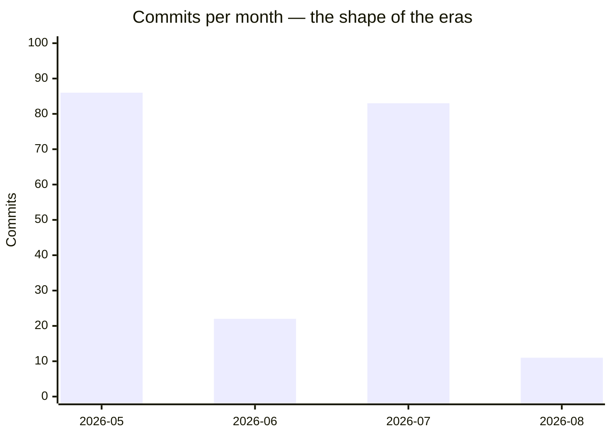

# Lore: The History of Memongo

Memongo's history is short and dense: 202 commits in under three months, from an initial release on May 6, 2026 to a gated, benchmark-driven memory platform by August. The git log reads in four distinct eras, each with its own cadence and obsession.

## Era 1 — Initial Release and the Gate Campaign (May 2026, 86 commits)

**May 6, 2026** — `65d193dbdf chore: initial Memongo release`. The full architecture lands in a single commit: the MongoDB engine with its central `MongoDBMemoryManager`, the HTTP API, the MCP server, and the benchmark harness skeleton.

**May 12** — the single most intense day in repo history. Work was organized into four parallel scopes, each merged through an explicit phase gate:

- **Scope 1 → Phase 1 Gate 1 (Harness Reliability).** Canary env-var contracts, benchmark envelope parity, a 9-class failure taxonomy, per-scenario progress emitters, forced-failure gate proofs, and `fast-check` property tests.
- **Scope 2 → Phase 2 Gate 2 (Retrieval & Ranking).** Bitemporal schema (`validAt`/`invalidAt`) with compound indexes, retrieval observability, an injection classifier with a `memory_quarantine` collection, and the access tracker. Two commits on this day even share an identical message — "scope-2 remfix: Dreamer scope integrity (HIGH-2 + CRIT-3)" — a remfix that had to be done twice.
- **Scope 3 (Docs & Benchmarks).** A MemPalace forensic audit, a MongoDB 8.3+ capability survey, and a held-out private split protocol for benchmark integrity.
- **Scope 4 (API Security).** Export canonicalization with HMAC-SHA256 signing, graceful shutdown, and timing-safe bearer comparison.

**May 12 evening** — Phase 3 Gate 3 becomes the first great debugging saga. A deterministic benchmark miss (case `00ca467f`) was root-caused to temporal recall, fixed with a `extractTemporalWindow` gauss-decay root fix injected into the text lane of `$rankFusion`, and closed with an "n=3 canary" sampling discipline: `bc8baae264 Phase 3 Gate 3 post-gauss n=3 SUCCESS — 00ca467f resolved`.

**May 18–27** — managed Atlas runtime checks, strict artifact gates, and the benchmark publication campaign. On May 27 the license switched to **BSL 1.1** (`5036ec09a3 license: switch Memongo to BSL 1.1`) and the MemPalace publication pack was assembled — including `47b98690aa docs: replace unproven benchmark claims`, a commit that quietly removed claims the evidence couldn't yet back.

## Era 2 — Stabilization and Open Source Launch (June 2026, 22 commits)

The quietest month, and the one that made the project public.

- **June 13–16** — benchmark hardening continues: a recovery campaign, a mem0 evidence proof pack, and rehydrated source evidence packs. Two of the repo's few merged pull requests (#15, #16) land here.
- **June 24–25** — the open-source launch sprint: `ef1d9e9b85 launch: prepare open source release`, an animated landing page for the web app, Cloudflare deployment config, and a "final OSS polish" pass adding the NOTICE file and dropping internal tags.
- **June 25** — first npm publication: `093477dce5 release: publish packages with npm`, followed immediately by idempotency fixes for the publish workflow.

## Era 3 — Feature Expansion and the Security Waves (July 2026, 83 commits)

July is the biggest feature month, opening with a burst of LLM-reasoning capabilities on **July 19–20**:

- LLM fact extraction for structured candidates (#30)
- LLM deduction/induction wired into consolidation (#31)
- Real bitemporal valid-time: LLM extraction, indexed "as of T" retrieval (#32)
- Contradiction-driven fact invalidation (#33)
- LLM typed semantic edge extraction for the graph (#34)
- An honest e2e QA answer+judge producer (Wave 4 / #24)

The same days carried a systematic **security campaign**: forced stored `agentId` to the authorized identity (#42), SSRF guard + body cap + rate limit (#28), retrieval-path prompt-injection defense (#29), and the promotion of `scope`/`scopeRef` to a hard tenant-isolation boundary across recall, KB search, novelty-scan, consolidate, extract, and import.

Mid-to-late July hardened everything:

- **July 23–24** — engine robustness batch (PR #60): change streams, transactions, correct MongoDB error codes, plus `storedSource` and `indexingMethod` options for MongoDB 8.3+.
- **July 26** — CI begins gating PRs on e2e tests against a real MongoDB (#61); two days later the nightly e2e job was discovered to have never actually run its tests (`f5409e7058 fix(ci): make the nightly e2e job actually run its tests`).
- **July 27–30** — a methodical fix train with its own ticket codes (S1, S2, C4, C8, V1): `$rankFusion` scores rescaled into [0,1], `$`-operator mistranslation fixed, job retries against an attempt budget, and vector index options that MongoDB 8.3 rejects removed.
- **July 29–30** — the benchmark became real: the actual LongMemEval dataset fetched and verified, a runnable benchmark entrypoint, the native lane made canonical (#65), concurrent retrieval paths (#66), ablation switches (#40), and the conversation-recall regression wired into the release gate (#70).
- **July 31** — `bdad0fbf28 release: bump all public packages to 2.0.0`.

## Era 4 — The Fix Plan Lands (August 2026, 11 commits)

- **August 1** — per-lane latency instrumentation, repeated benchmark measurement passes, and the birth of `@memongo/pi-extension`: `737b9fed6c pi-extension: add @memongo/pi-extension — Pi coding-agent memory bridge`.
- **August 1–2** — the API gets containerized (`aad1931cfb api: containerize`), and the pi-extension goes through rapid iteration: auto-detecting the project from cwd, baking local dev defaults so it works without shell env, bumping to 2.1.1, and switching to global-scope search by default for the single-user case.
- **August 3** — the latest commit: `45d4ea4b7f fix: land fix-plan phases P0-P2 across engine, api, mcp, client, docker` — a master fix plan touching every layer of the stack in one landing.

## Recurring motifs

- **Gates and remfixes.** The May campaign institutionalized a pattern that persists: land a scope, run a gate, fix the gate's findings in a dedicated "remfix" commit, then merge.
- **Honesty commits.** "docs: replace unproven benchmark claims", "honest e2eQa answer+judge producer", "fix(engine): delete dead embedding_cache collection and its lying stat (#13)" — the log repeatedly chooses accurate over flattering.
- **Ticket-coded fix trains.** July's S1/S2/C4/C8/V1 and P0–P2 phases show work driven by verified findings lists rather than ad-hoc patches.
- **The two identical commits.** `2b42508013` and `4926e4c3e9` both read "scope-2 remfix: Dreamer scope integrity (HIGH-2 + CRIT-3)", three minutes apart — even the Dreamer needed a second pass.
