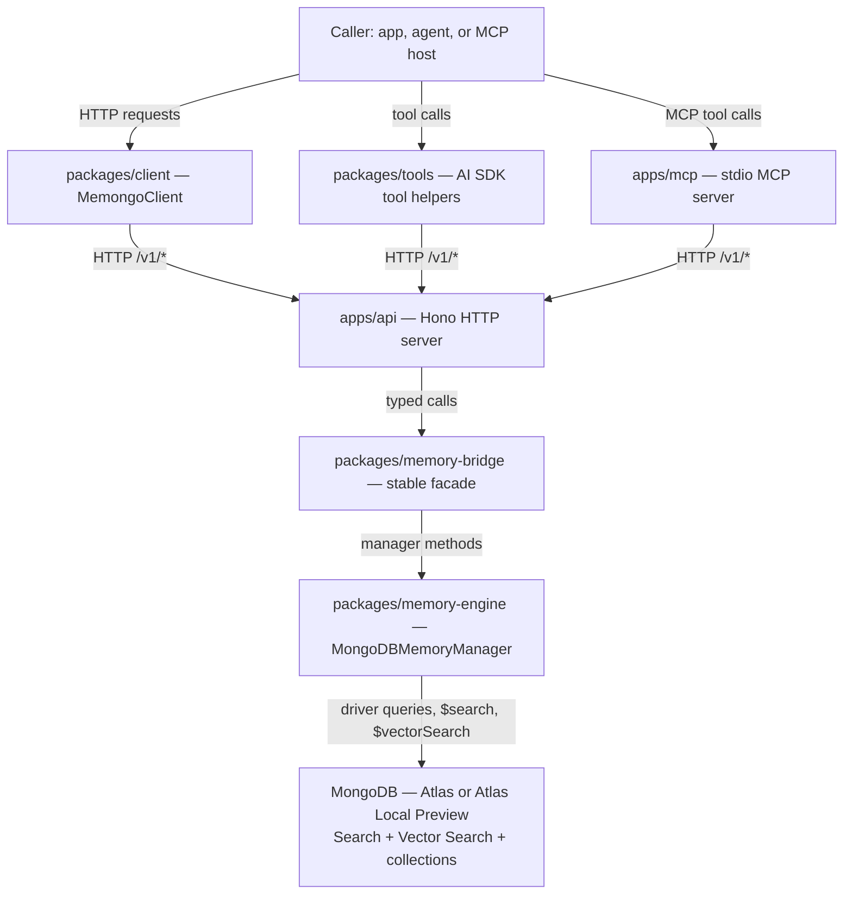
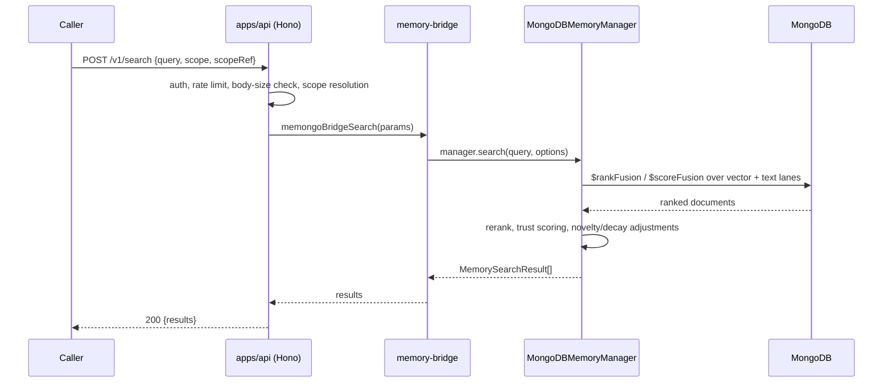
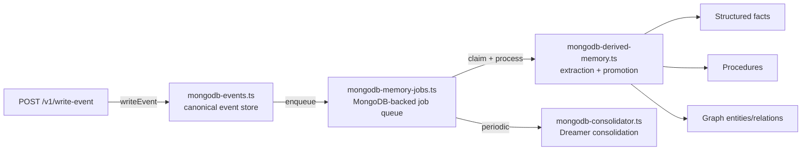
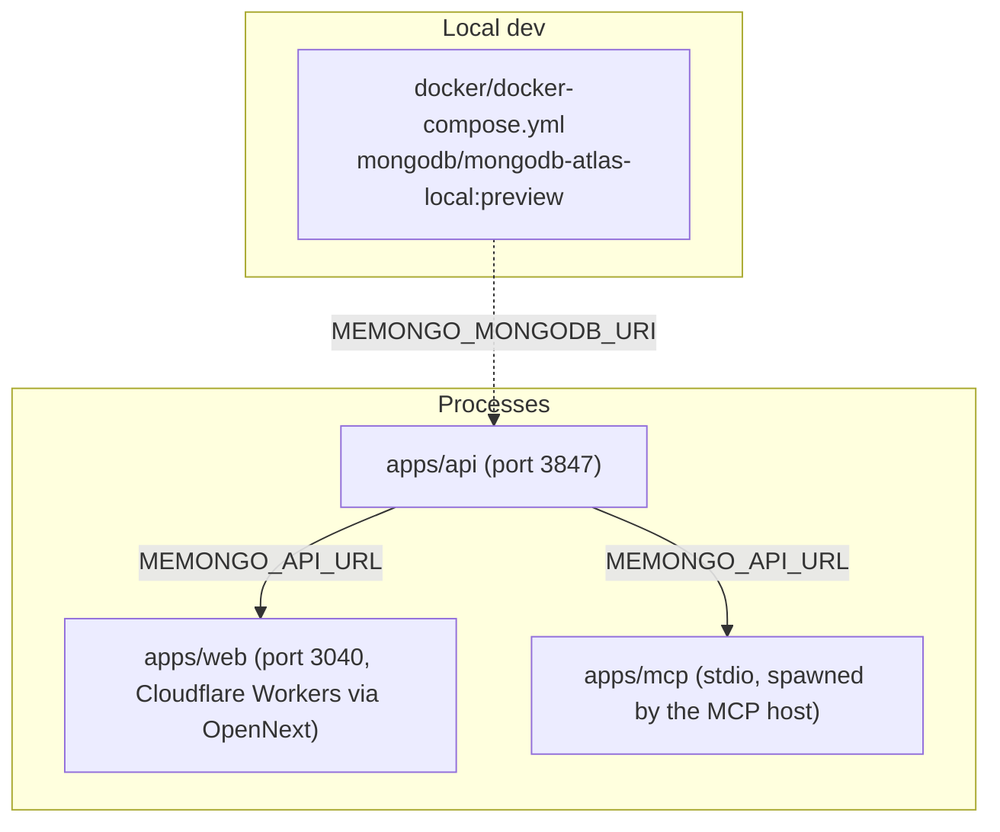

# Architecture

Memongo has four layers: product surfaces that talk to callers, a stable facade, a MongoDB-native engine, and MongoDB itself. Every surface eventually calls the same engine through the same facade, so behavior stays consistent whether a caller is an HTTP client, an MCP host, or an AI SDK tool.

## Layers

- `apps/api` (`apps/api/src/app.ts`) is the only process that talks to MongoDB in a standard deployment. It authenticates requests, enforces rate limits and body-size caps, and maps HTTP paths to typed calls into the bridge.
- `apps/mcp` (`apps/mcp/src/server.ts`) and `packages/tools` never touch MongoDB directly — they call the HTTP API through `packages/client`'s `MemongoClient`, so the API's auth and validation apply uniformly.
- `packages/memory-bridge` (`packages/memory-bridge/src/memongo-bridge.ts`) is the seam between the product surface and the engine. It resolves standalone config (`packages/memory-bridge/src/memory-config.ts`) and calls `getMemorySearchManager` to obtain a cached `MongoDBMemoryManager` per agent.
- `packages/memory-engine` (`packages/memory-engine/src/mongodb-manager.ts`) owns every MongoDB interaction: writes, reads, hybrid search, graph traversal, consolidation, and schema management. It is organized as one `MongoDBMemoryManager` class assembled from focused `mongodb-manager-*.ts` mixins (admin, read, write, search, sync, jobs, relevance, lifecycle, host).

## Request lifecycle: search

See [Retrieval and search](../systems/retrieval-and-search.md) for how the fusion lanes and reranker work, and [Multi-tenancy and scopes](../features/multi-tenancy-and-scopes.md) for how `scope`/`scopeRef` map onto MongoDB tenant partitioning.

## Write and background enrichment

Writing a conversation event is synchronous and cheap; deriving structured facts, procedures, and graph edges from it happens in a background job queue so the write path stays fast.

See [Structured memory and procedures](../systems/structured-memory-and-procedures.md), [Graph, episodes, and entities](../systems/graph-episodes-and-entities.md), and [Consolidation and novelty](../systems/consolidation-and-novelty.md).

## MongoDB as the substrate

Memongo's architecture bet is that a single MongoDB cluster — collections, Atlas Search, Atlas Vector Search, `$rankFusion`/`$scoreFusion`, `$graphLookup`, change streams, and transactions — can carry conversation memory, structured facts, a knowledge base, and a relationship graph without bolting on separate vector, graph, or search databases. `docs/adr/0001-substrate-claim-and-score-claim-are-separate.md` is explicit that this "substrate claim" is proven only by self-facts (verifiable properties of MongoDB and of Memongo's own code), kept separate from the "score claim" (beating competitors on a benchmark). See [Background](../background/index.md).

## Deployment shape

`apps/api` and `apps/mcp` are Node processes; `apps/web` builds with Next.js and deploys to Cloudflare Workers via OpenNext (`apps/web/wrangler.jsonc`, `apps/web/open-next.config.ts`). See [Deployment](../deployment.md).
