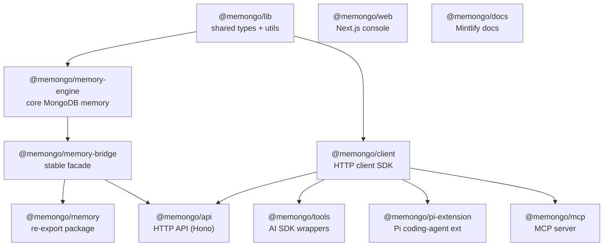
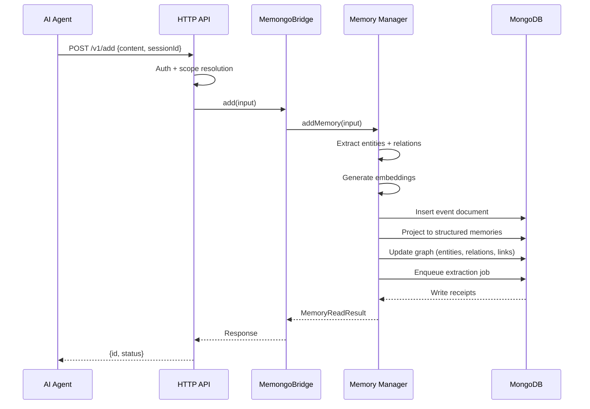
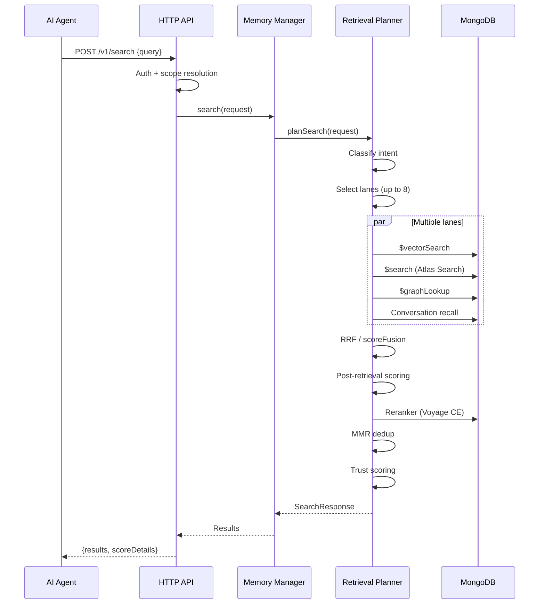

# Architecture

Memongo is a Turborepo/Bun monorepo with four apps and seven packages. The core memory engine sits at the center, wrapped by a bridge facade, an HTTP API, an MCP server, client SDK, AI SDK tools, and a Pi coding-agent extension.

## Package dependency graph

## Layering

The system has five layers, each with a clear responsibility:

1. **`@memongo/lib`** — shared types (`MemoryScope`, `MemoryScopeValue`), utilities (SSRF guard, redaction, retry, auth, env, errors, logger). No MongoDB dependency. Imported by every other package.

2. **`@memongo/memory-engine`** — the core. 118 source files implementing MongoDB connection management, schema/index definitions, search execution, embeddings (6 providers), graph extraction, episodes, consolidation, knowledge base, benchmark harness, and durable jobs. The central class is `MongoDBMemoryManager` in `packages/memory-engine/src/mongodb-manager.ts` (~12,400 LOC).

3. **`@memongo/memory-bridge`** — a stable facade (`MemongoBridge`) that loads config and delegates to the engine. Used by the API server for in-process access. 1,025 LOC in `packages/memory-bridge/src/memongo-bridge.ts`.

4. **`@memongo/client`** — HTTP client SDK (`MemongoClient`) that calls the API over HTTP. Used by the MCP server, AI SDK tools, and Pi extension. 1,131 LOC of types in `packages/client/src/types.ts`, implementation in `packages/client/src/client.ts`.

5. **Apps** — `@memongo/api` (Hono HTTP server), `@memongo/mcp` (MCP server calling the API via client SDK), `@memongo/web` (Next.js console), `@memongo/docs` (Mintlify documentation site).

## Data flow: write path

## Data flow: retrieval path

## Memory model

Memongo stores six primary memory types:

| Type | Collection prefix | Description |
|------|-------------------|-------------|
| Events | `events` | Raw conversation messages, immutable, time-series |
| Structured memories | `structured_mem` | Facts, preferences, decisions, procedures with lifecycle state |
| Episodes | `episodes` | Summarized conversation windows with trigger conditions |
| Graph entities | `entities` | People, places, concepts with typed relations |
| Graph relations | `relations` | Typed edges between entities (8 relation types) |
| Knowledge base | `kb_documents` + `kb_chunks` | Ingested documents, chunked and embedded |

All memory types carry:
- `agentId` — tenant discriminator
- Bitemporal fields (`validFrom`, `validTo`, `invalidAt`)
- Trust metadata (7 dimensions)
- Provenance (source event IDs, scope, scopeRef)

## Multi-tenancy model

Memongo supports two deployment modes:

- **Single-tenant (default):** each agent gets a collection prefix `memongo_{agentId}_`. Physical isolation.
- **Multi-tenant (shared):** all agents share `memongo_*` collections with `agentId` as a discriminator field in every index and query filter. One shared `MongoClient`, one set of search indexes.

The shared model is what MongoDB officially recommends for vector search multi-tenancy. Single-tenant is the simpler default for self-hosted single-agent deployments.

## Key source files

| File | Purpose |
|------|---------|
| `packages/memory-engine/src/mongodb-manager.ts` | Central memory manager (connection, search, write, jobs, shutdown) |
| `packages/memory-engine/src/mongodb-schema.ts` | Index definitions, JSON schema validators, collection setup |
| `packages/memory-engine/src/mongodb-search.ts` | Search execution, hybrid fusion, normalization |
| `packages/memory-engine/src/mongodb-retrieval-planner.ts` | 8-lane retrieval planning with intent classification |
| `packages/memory-engine/src/mongodb-consolidator.ts` | 5-phase consolidation ("Dreamer") pipeline |
| `packages/memory-engine/src/mongodb-graph.ts` | Entity extraction, relation extraction, graph traversal |
| `packages/memory-engine/src/backend-config.ts` | MongoDB config resolution, embedding mode, capability detection |
| `packages/memory-bridge/src/memongo-bridge.ts` | Stable facade delegating to the engine |
| `packages/client/src/client.ts` | HTTP client SDK implementation |
| `apps/api/src/app.ts` | Hono app setup, auth middleware, CORS, rate limiting |
| `apps/api/src/routes/v1.ts` | All v1 API route handlers |
| `apps/mcp/src/server.ts` | MCP server with tool registry |
| `packages/tools/src/index.ts` | AI SDK tool definitions (zod schemas) |
| `packages/tools/src/vercel/index.ts` | Vercel AI SDK middleware (auto-inject + capture) |
| `packages/pi-extension/extensions/index.ts` | Pi coding-agent extension entry |
