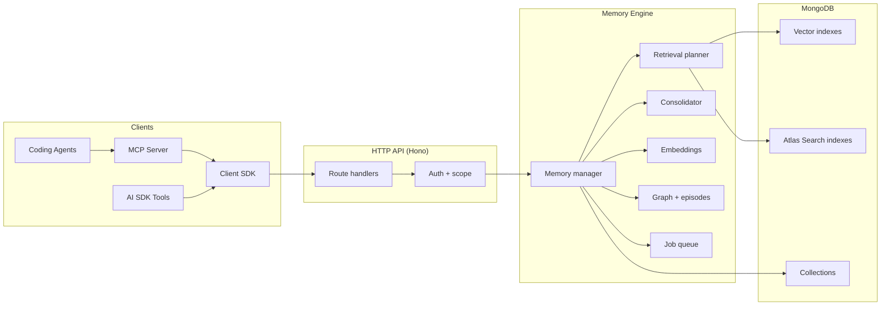

# Memongo overview

Memongo is a MongoDB-native long-term AI memory framework. It stores conversations, facts, procedures, knowledge-base chunks, episodes, and graph relationships in one MongoDB-backed memory engine, then retrieves context using vector search, full-text search, and hybrid ranking.

The system is designed for AI applications, coding agents, and teams that need durable, retrievable memory across sessions. It provides an HTTP API, an MCP server, a TypeScript client SDK, AI SDK tool wrappers, a web console, and a Pi coding-agent extension.

## What it does

- **Stores memories** as structured facts, conversation events, episodes, graph entities/relations, procedures, and knowledge-base documents
- **Retrieves context** through an 8-lane retrieval planner that combines vector search, Atlas Search, graph traversal, conversation recall, and active-slate assembly
- **Consolidates memories** through a 5-phase "Dreamer" pipeline that detects novelty, extracts patterns, runs LLM reasoning, and merges near-duplicates
- **Scores trust** across 7 dimensions: exactness, contradiction, scope match, freshness, provenance, confidence, and source diversity
- **Tracks time** with bitemporal validity (validFrom/validTo) on every memory type
- **Provides durable jobs** with leases, heartbeats, retries, and dead-letter handling

## Architecture at a glance

## Tech stack

- **Runtime:** Node.js 20+, Bun 1.2+ as package manager
- **Language:** TypeScript (ESM, strict)
- **Database:** MongoDB 8.x with Atlas Search / Vector Search (mongot)
- **API framework:** Hono
- **MCP:** Model Context Protocol SDK (stdio + Streamable HTTP)
- **Web:** Next.js
- **Build:** Turborepo + Biome
- **Test:** Vitest + V8 coverage

## Key links

- [Architecture](architecture.md) — system architecture and data flows
- [Getting started](getting-started.md) — prerequisites, install, build, test, run
- [Glossary](glossary.md) — project-specific terms and vocabulary
- [By the numbers](../by-the-numbers.md) — codebase statistics snapshot
- [History](../lore.md) — timeline and eras of the codebase
