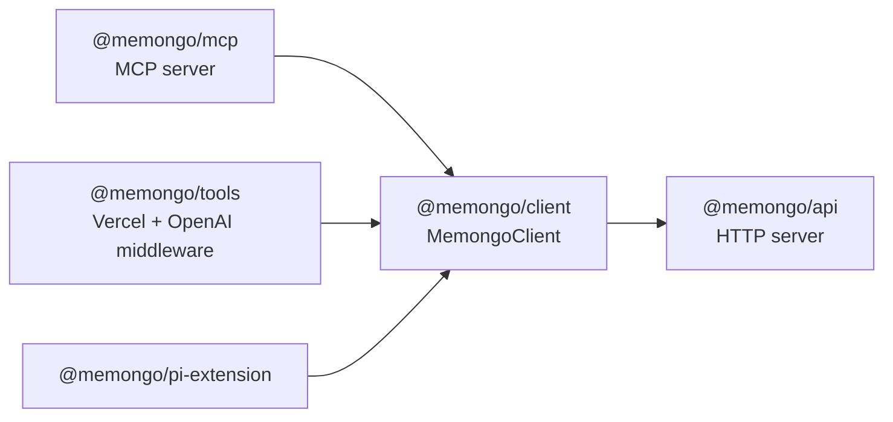

# @memongo/client

The TypeScript HTTP client SDK for the Memongo REST API. `MemongoClient` is a thin, dependency-free `fetch` wrapper used by the MCP server, the AI SDK tools, and the Pi extension — anything that talks to Memongo over HTTP goes through this package.

Source: `packages/client/src/client.ts` (implementation), `packages/client/src/types.ts` (request/response types), `packages/client/src/index.ts` (public exports).

## Construction

```typescript
const client = new MemongoClient({
  baseUrl: "http://127.0.0.1:3847", // or MEMONGO_API_URL
  apiKey: "...",                    // or MEMONGO_API_KEY
  maxRetries: 2,                    // for 429/503
  timeoutMs: 30_000,
  silent: false,
})
```

`MemongoClientOptions` (in `packages/client/src/client.ts`):

| Option | Default | Behavior |
|--------|---------|----------|
| `baseUrl` | `MEMONGO_API_URL` env, else `http://127.0.0.1:3847` | Trailing slash stripped. Env reads are guarded so browser/edge runtimes without `process.env` don't crash |
| `apiKey` | `MEMONGO_API_KEY` env | Sent as `Authorization: Bearer <key>` when present |
| `maxRetries` | `2` | Retries only on HTTP 429/503 |
| `timeoutMs` | `30_000` | Per-request `AbortSignal.timeout`, combined with any caller-supplied signal via `AbortSignal.any` |
| `silent` | `false` | When true, search/read calls resolve to a benign empty result instead of throwing on HTTP errors, timeouts, or network failures — so prompt middleware can inject "no memory" instead of breaking the host request. Strictly opt-in |

## Error handling

Non-OK responses throw `MemongoClientError`, which parses the API's `{error:{code,message}}` envelope (P0.8):

- `status` — HTTP status
- `code` — deliberate API error code (e.g. `"VALIDATION_ERROR"`), when the body is the envelope shape
- `apiMessage` — human-readable message from the envelope
- `body` — raw response text (also handles plain-text/proxy/older-server bodies that aren't envelopes)

The retry policy honors the server's `Retry-After` header (seconds or HTTP-date per RFC 9110) but caps it at **10 seconds** (`MAX_RETRY_DELAY_MS`) so a hostile or buggy server cannot park the client for minutes; without the header it uses linear backoff (`200ms * attempt`).

## Method surface

The methods mirror the [REST API](../api/index.md) route groups (~50 methods):

| Group | Methods |
|-------|---------|
| Search | `search`, `searchDetailed`, `searchKB`, `recallConversation`, `readFile` |
| Write | `add`, `writeEvent`, `writeEvents` (batch), `writeStructured`, `writeProcedure`, `extract` |
| Lifecycle | `getLifecycleItem`, `updateLifecycleItem`, `deleteLifecycleItem`, `getLifecycleHistory`, `reportProcedureOutcome`, `applyMemoryFeedback` |
| Context | `profile`, `hydrateActiveSlate`, `state`, `buildDiscoveryProjection`, `buildContextBundle` |
| Ops | `status`, `getDetailedStatus`, `stats`, `sync`, `probeEmbedding`, `probeVector` |
| Relevance | `relevanceExplain`, `relevanceBenchmark`, `benchmarkIngest`, `relevanceReport`, `relevanceSampleRate` |
| Analytics | `accessTrends`, `accessSummaries`, `listRecallTraces`, `getRecallTrace`, `traceChain` |
| Jobs & maintenance | `listJobs`, `getJob`, `scanNovelty`, `consolidate`, `selfEdit`, `importConversations` |

Request and response types live in `packages/client/src/types.ts` (`MemongoSearchInput`, `MemongoSearchResponse`, `MemongoLifecycleItem`, `MemongoStableHandle`, ...); `packages/client/src/index.ts` re-exports the client, the error class, and the full type surface.

## Consumers



## Key files

| File | Role |
|------|------|
| `packages/client/src/client.ts` | `MemongoClient`, `MemongoClientError`, retry/timeout/envelope handling |
| `packages/client/src/types.ts` | Request/response types for the whole API surface |
| `packages/client/src/index.ts` | Public exports |

**Top contributors:** Rom Iluz (13 commits).

## Related pages

- [Packages overview](./index.md)
- [REST API reference](../api/index.md)
- [@memongo/tools](./tools.md) and [@memongo/pi-extension](./pi-extension.md) — built on this client
- [Auth and security](../security.md) — the bearer token flow
