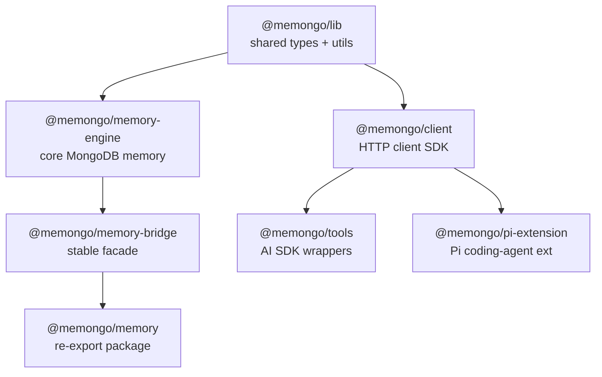

# Packages

Seven published and internal packages make up the Memongo library surface. They layer strictly: `@memongo/lib` has no MongoDB dependency and is imported by everything else; the engine sits above it; the bridge, client, tools, and extension build on those.

## The packages

| Package | Directory | Role | Page |
|---------|-----------|------|------|
| `@memongo/lib` | `packages/lib` | Shared types and utilities: canonical scope contract, SSRF guard, redaction, retry, auth helpers, env, errors, logger, concurrency, paths, mime, secrets. Private. | [lib](./lib.md) |
| `@memongo/memory-engine` | `packages/memory-engine` | The core engine: connection management, schema/indexes, hybrid search, embeddings, graph, episodes, consolidation, KB, trust, bitemporal, jobs, benchmarks. | [memory-engine](./memory-engine/index.md) |
| `@memongo/memory-bridge` | `packages/memory-bridge` | Stable facade (`MemongoBridge`): loads standalone config and delegates to the engine. Used by the API server for in-process access. | [memory-bridge](./memory-bridge.md) |
| `@memongo/memory` | `packages/memongo-memory` | Two-line published re-export of bridge + engine — the simple npm install surface. | [memongo-memory](./memongo-memory.md) |
| `@memongo/client` | `packages/client` | HTTP client SDK (`MemongoClient`) for the REST API. Used by MCP, tools, and the Pi extension. | [client](./client.md) |
| `@memongo/tools` | `packages/tools` | AI SDK integrations: Vercel middleware (`withMemongo`), OpenAI middleware (`createOpenAIMiddleware`), and tool definitions with zod schemas. | [tools](./tools.md) |
| `@memongo/pi-extension` | `packages/pi-extension` | Pi coding-agent extension: additive memory tools plus session-start injection and turn-end capture lifecycle hooks. | [pi-extension](./pi-extension.md) |

## Choosing an entry point

- **In-process (same Node process as MongoDB access):** `@memongo/memory` (or `@memongo/memory-bridge` directly) — you get the engine with config file/env loading.
- **Over HTTP:** `@memongo/client` against a running `@memongo/api` server.
- **Inside an LLM call:** `@memongo/tools` middleware injects memory context and captures turns automatically.
- **Inside the Pi coding agent:** `@memongo/pi-extension`.

## Contributor activity

Active contributors per package (all-time commit counts, top 3):

| Package | Top contributors |
|---------|------------------|
| `packages/memory-engine` | Rom Iluz (125) |
| `packages/memory-bridge` | Rom Iluz (24) |
| `packages/client` | Rom Iluz (13) |
| `packages/lib` | Rom Iluz (11) |
| `packages/tools` | Rom Iluz (11) |
| `packages/memongo-memory` | Rom Iluz (8) |
| `packages/pi-extension` | Rom Iluz (7) |

## Related pages

- [Architecture](../overview/architecture.md) — how the packages fit with the four apps
- [Features](../features/index.md) — cross-cutting capabilities implemented in the engine
- [REST API reference](../api/index.md) — the HTTP surface `@memongo/client` speaks to
