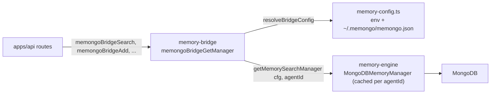

# Memory bridge

Active contributors: Rom Iluz

`@memongo/memory-bridge` is the stable seam between the product surface (`apps/api`) and `@memongo/memory-engine`. Every function it exports is a thin, typed wrapper: resolve config, get a cached `MongoDBMemoryManager` for an agent, call one manager method, return the result. The engine's internal types and manager surface can evolve underneath this seam without breaking `apps/api`'s imports — the bridge is the only place that pins the exact shape the HTTP layer relies on. See [Architecture](../overview/architecture.md) for where the bridge sits between `apps/api` and the engine.

## Key source files

| File | Role |
| --- | --- |
| `packages/memory-bridge/src/memongo-bridge.ts` | Every `memongoBridge*` function: search, writes, lifecycle, recall, status, analytics, and shutdown. |
| `packages/memory-bridge/src/memory-config.ts` | Standalone config resolution (`buildMemongoConfig`, `resolveBridgeConfig`) — env vars merged with `~/.memongo/memongo.json`. |
| `packages/memory-bridge/src/memongo-export.ts` | Signed, canonical JSON export bundles (HMAC-SHA256) for the memory-export feature. |
| `packages/memory-bridge/src/memongo-bridge-identity.test.ts` | Tests that the bridge forces the authorized `agentId`/`scope`/`scopeRef` onto writes, ignoring any caller-supplied smuggle in the entry body (issue #42). |
| `packages/memory-bridge/src/memongo-bridge-wiring.test.ts` | Tests that each bridge function forwards to the right manager method with the right params. |
| `packages/memory-bridge/src/memory-config.test.ts` | Tests for config precedence (env vs. file vs. force-override). |
| `packages/memory-bridge/src/memongo-export.test.ts` | Tests for canonicalization, signing, and constant-time verification. |

## How apps/api reaches MongoDB through the bridge

## Manager access and identity

`memongoBridgeGetManager(agentId?)` (`packages/memory-bridge/src/memongo-bridge.ts`) is the entry point every other bridge function calls first. It resolves the effective agent id — the explicit argument, else `MEMONGO_AGENT_ID`, else `"main"` (`resolveAgentId`) — resolves config via `resolveBridgeConfig()`, and calls the engine's `getMemorySearchManager` to get a manager cached per agent id. All other `memongoBridge*` functions are one-liners on top of this: get the manager, call one method, forward the result.

Because the manager selects its collection prefix from the resolved agent identity, several write paths (`memongoBridgeWriteStructuredMemory`, `memongoBridgeWriteProcedure`) force `agentId`, `scope`, and `scopeRef` from the *authorized* caller values onto the entry before writing, overriding anything a caller-supplied entry object might carry — a nested `entry.agentId` or `entry.scope` can never smuggle a write across a tenant boundary (issue #42, covered by `memongo-bridge-identity.test.ts`). The same tenant-isolation forwarding pattern runs through `memongoBridgeSearchKB`, `memongoBridgeRecallConversation`, `memongoBridgeImportConversations`, `memongoBridgeScanNovelty`, and `memongoBridgeConsolidate`: each forwards the caller's authorized `scopeRef` rather than letting the manager default to "every scopeRef under the agent."

## Key exported functions

| Function | What it does |
| --- | --- |
| `memongoBridgeGetManager(agentId?)` | Resolves config and returns the cached `MongoDBMemoryManager` for an agent. |
| `memongoBridgeSearch(params)` | Wraps `manager.search()` — the primary hybrid search call. |
| `memongoBridgeSearchDetailed(params)` | Wraps `manager.searchDetailed()` (agentic multi-pass search with plan/metadata); throws if the manager doesn't support it. |
| `memongoBridgeSearchKB(params)` | Wraps `manager.searchKB()` for knowledge-base search, forwarding the caller's scope. |
| `memongoBridgeReadFile(params)` | Wraps `manager.readFile()` for reading a stored source chunk by path/range. |
| `memongoBridgeAdd(params)` | Legacy alias: appends a user-role event via `memongoBridgeWriteConversationEvent`. |
| `memongoBridgeWriteConversationEvent(params)` | Writes one conversation event (any role), converting ISO date strings to `Date`. |
| `memongoBridgeWriteConversationEventsBatch(params)` | Batch write for an array of events through the engine's amortized `insertMany`/`bulkWrite` path; a failed item never fails its siblings. |
| `memongoBridgeExtractEvent(params)` | Schedules background extraction of structured facts/procedures from one event. |
| `memongoBridgeWriteStructuredMemory(params)` / `memongoBridgeWriteProcedure(params)` | Force the authorized identity/scope onto the entry, then upsert it. |
| `memongoBridgeProfile(params)` | Wraps `manager.synthesizeProfile()`. |
| `memongoBridgeHydrateActiveSlate(params)` | Wraps `manager.hydrateActiveSlate()`. |
| `memongoBridgeBuildDiscoveryProjection(params)` | Wraps `manager.buildDiscoveryProjection()`, narrowing the HTTP `timeRange.preset: string` to the engine's preset union. |
| `memongoBridgeBuildContextBundle(params)` | Wraps `manager.buildContextBundle()`, same `timeRange` narrowing. |
| `memongoBridgeRecallConversation(params)` | Wraps `manager.recallConversation()`, converting `asOf` to `Date`. |
| `memongoBridgeGetLifecycleItem` / `UpdateLifecycleItem` / `DeleteLifecycleItem` / `GetLifecycleHistory` | Lifecycle CRUD keyed by a `MemoryStableHandle`. |
| `memongoBridgeReportProcedureOutcome(params)` | Records a procedure success/failure outcome. |
| `memongoBridgeApplyMemoryFeedback(params)` | Applies a confirm/correct/irrelevant feedback signal to a structured memory. |
| `memongoBridgeStatus` / `GetDetailedStatus` / `Stats` | Provider status, detailed health, and stats reads. |
| `memongoBridgeSync(params)` | Triggers a manual sync of workspace/knowledge sources. |
| `memongoBridgeProbeEmbedding` / `ProbeVector` | Capability probes computed at manager creation time. |
| `memongoBridgeCapabilities(params)` | Reads the manager's already-detected `DetectedCapabilities` (vectorSearch/textSearch flags) without re-probing. |
| `memongoBridgePingMongo(params)` | Forces a live, bounded round-trip (`listMemoryJobs({ limit: 1 })`) so a `/ready` endpoint can detect a Mongo that died after boot — the capability probes above can't catch that. |
| `memongoBridgeRelevanceExplain` / `RelevanceReport` / `RelevanceSampleRate` | Relevance/observability endpoints. |
| `memongoBridgeImportConversations(params)` | Bulk-imports a conversation dataset, forcing the authorized `scopeRef`. |
| `memongoBridgeAccessTrends` / `AccessSummaries` | Access-pattern analytics for memory items. |
| `memongoBridgeTraceChain(params)` | Wraps `manager.traceChain()` for reasoning-chain traversal. |
| `memongoBridgeScanNovelty(params)` | Wraps `manager.scanNovelty()`, forwarding the authorized `scopeRef`. |
| `memongoBridgeConsolidate(params)` | Triggers consolidation, forwarding the authorized `scopeRef`. |
| `memongoBridgeSelfEdit(params)` | Wraps `manager.selfEditBlock()` for editing self-context blocks (user/persona/instructions). |
| `memongoBridgeGetState(params)` | Fans out `Promise.allSettled` over profile, active-slate hydration, and context-bundle build; returns `partial: true` if any settle rejected, so one failing source doesn't fail the whole state read. |
| `memongoBridgeListRecallTraces` / `GetRecallTrace` | Recall-trace observability reads. |
| `memongoBridgeListMemoryJobs` / `GetMemoryJob` | Background job queue reads. |
| `memongoBridgeShutdown()` | Graceful shutdown: calls `closeAllMemorySearchManagers()`, which flushes the access tracker and closes every cached Mongo client, swallowing per-manager errors so one failing manager doesn't block the rest. |
| `buildMemongoConfig` (re-exported from `memory-config.ts`) | Exposed so deploy targets (`apps/api` boot validation) can resolve the effective config exactly the way the bridge does, instead of duplicating the merge rules. |

## Config resolution

`resolveBridgeConfig()` (`packages/memory-bridge/src/memory-config.ts`) builds a `MemongoConfig` by merging, in order:

1. `~/.memongo/memongo.json` (or `MEMONGO_CONFIG_PATH` if set) — read once via `readMemongoJsonFile`, tolerant of a missing or malformed file (returns `undefined` rather than throwing).
2. Plain env vars (`MEMONGO_MONGODB_URI`, `MEMONGO_MONGODB_DATABASE`, `MEMONGO_MONGODB_COLLECTION_PREFIX`) — win over the file's values when set.
3. `MEMONGO_FORCE_MONGODB_URI` — applied last via `applyMongoDbForceUriOverride` (`@memongo/lib`), the single shared precedence rule so the bridge and the engine agree on which URI wins when both a normal and a force override are present.

The standalone workspace directory (`resolveMemongoStandaloneWorkspaceDir`) defaults to `~/.memongo/workspace`, overridable with `MEMONGO_WORKSPACE_DIR`.

## Export bundles

`packages/memory-bridge/src/memongo-export.ts` implements the exportable-memory guarantee: every memory scoped to an `agentId` can be exported as a signed JSON bundle. `canonicalizeExportBundle` deep-sorts object keys and normalizes non-JSON values (`Date` to ISO string, `Buffer`/`Uint8Array` to a tagged base64 object, `Map`/`Set` to tagged, key-sorted structures) so two exports of the same `scopeRef` with no intervening writes are byte-identical. `signExportBundle` HMAC-SHA256-signs the canonical bytes with `MEMONGO_EXPORT_SIGNING_KEY` and throws if the key is empty; `verifyExportBundle` checks a signature in constant time with `crypto.timingSafeEqual` and never throws on a mismatch, only on a malformed signature string.

## Integration points

- `apps/api` is the sole consumer in a standard deployment: its route handlers call `memongoBridge*` functions directly instead of importing the engine.
- `@memongo/memory` (`packages/memongo-memory`) re-exports the entire bridge alongside the engine for external consumers who want one import — see [Memongo memory](memongo-memory.md).
- The bridge depends on `@memongo/memory-engine` and `@memongo/lib`; it has no HTTP or MCP concerns of its own.
