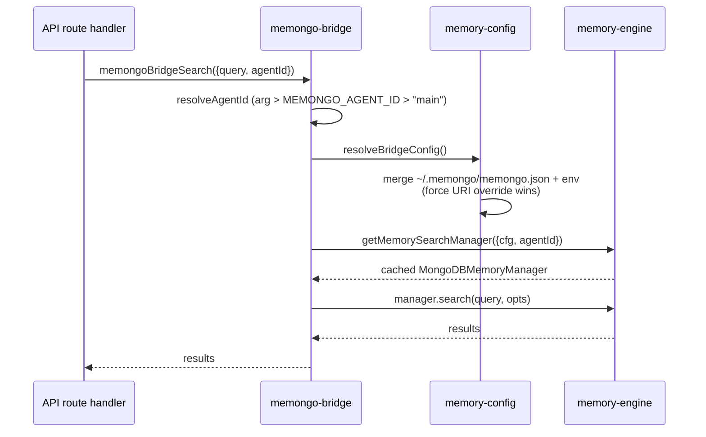

# @memongo/memory-bridge

The memory bridge is the **stable facade** between the HTTP product layer and the core engine. It loads standalone config, resolves the agent identity, and delegates every operation to the MongoDB memory manager. The API server uses it for in-process access; external callers should use [`@memongo/client`](./client.md) over HTTP instead.

Source: `packages/memory-bridge/src/` (facade in `memongo-bridge.ts`, ~1,025 LOC).

## Why a facade exists

The engine's `MongoDBMemoryManager` is a large, fast-moving surface. The bridge gives the product layer a narrow, stable contract:

1. **Config loading is centralized.** `resolveBridgeConfig` in `packages/memory-bridge/src/memory-config.ts` merges `~/.memongo/memongo.json` (override path via `MEMONGO_CONFIG_PATH`) with environment variables, so the API never constructs engine config by hand.
2. **Manager lifecycle is cached.** `memongoBridgeGetManager` goes through the engine's `getMemorySearchManager({ cfg, agentId })`, which caches one manager per `(cfg, agentId)`; `memongoBridgeShutdown` closes them all via `closeAllMemorySearchManagers`.
3. **Identity has one default.** `resolveAgentId` in `packages/memory-bridge/src/memongo-bridge.ts` resolves the explicit argument, then `MEMONGO_AGENT_ID`, then `"main"`.

## Config resolution

`buildMemongoConfig` in `packages/memory-bridge/src/memory-config.ts`:

- **URI precedence (P2.6):** one rule shared with the engine via `applyMongoDbForceUriOverride` from `@memongo/lib` — `MEMONGO_FORCE_MONGODB_URI` beats every other URI source in every layer. Among non-force sources the bridge is env-first: `MEMONGO_MONGODB_URI` beats the file's `memory.mongodb.uri`. (The engine's own resolver inverts the non-force order — explicit config URI beats the plain env fallback — so the force override is the one value guaranteed identical everywhere.)
- **Env overlays:** `MEMONGO_MONGODB_DATABASE` and `MEMONGO_MONGODB_COLLECTION_PREFIX` override the corresponding file fields.
- **Workspace:** `MEMONGO_WORKSPACE_DIR`, else `~/.memongo/workspace`.

## Delegation surface

Every exported function follows the same pattern: resolve the manager, forward the call with camelCase params, convert ISO date strings to `Date` where needed. The surface covers:

- **Search:** `memongoBridgeSearch`, `memongoBridgeSearchKB`, `memongoBridgeWaitForBenchmarkSearchReadiness`
- **Writes:** `memongoBridgeAdd` (legacy alias for a user event), `memongoBridgeWriteConversationEvent`, `memongoBridgeWriteConversationEventsBatch` (P3.9 batch write with per-item receipts), structured/procedure writes, extraction
- **Reads:** `memongoBridgeReadFile`, profile, status, stats, conversation recall
- **Lifecycle, jobs, relevance, benchmarks, traces, export** — the full engine surface, one thin function each

Since P2.2, the engine's `MemorySearchManager` interface declares every method as non-optional (one backend exists), so the bridge calls the manager directly — the thirteen `*CapableManager` intersection types that used to paper over optional methods were deleted in favor of the real engine types.

## Exportable memory

`packages/memory-bridge/src/memongo-export.ts` implements the exportable-memory guarantee: every memory scoped to an `agentId` can be exported as a **signed JSON bundle** (`ExportBundle` with `events`, `episodes`, `kb`).

- **Determinism (Provable Property 14):** two exports of the same `scopeRef` with no intervening writes produce byte-identical bundles, via deep key-sorted canonical JSON (`canonicalizeExportBundle`). Non-JSON values are normalized first: `Date` to ISO-8601, `Buffer`/`Uint8Array` to `{__type:"Buffer", base64}`, `Map` to key-sorted entries, `Set` to sorted values.
- **Integrity:** `signExportBundle` HMAC-SHA256 signs the canonical bytes with `MEMONGO_EXPORT_SIGNING_KEY` (throws when the key is empty — strict mode refuses to produce an unsigned-masquerading-as-signed artifact). `verifyExportBundle` compares with `timingSafeEqual` and never throws on mismatch.

## Key files

| File | Role |
|------|------|
| `packages/memory-bridge/src/memongo-bridge.ts` | Facade: manager resolution + delegation functions (~1,025 LOC) |
| `packages/memory-bridge/src/memory-config.ts` | Standalone config loading (`~/.memongo/memongo.json` + env merge) |
| `packages/memory-bridge/src/memongo-export.ts` | Deterministic signed memory export bundles |

**Top contributors:** Rom Iluz (24 commits).

## Related pages

- [Packages overview](./index.md)
- [The core engine](./memory-engine/index.md) — what the bridge delegates to
- [@memongo/memory](./memongo-memory.md) — the published package that re-exports this facade
- [REST API reference](../api/index.md) — the primary consumer
