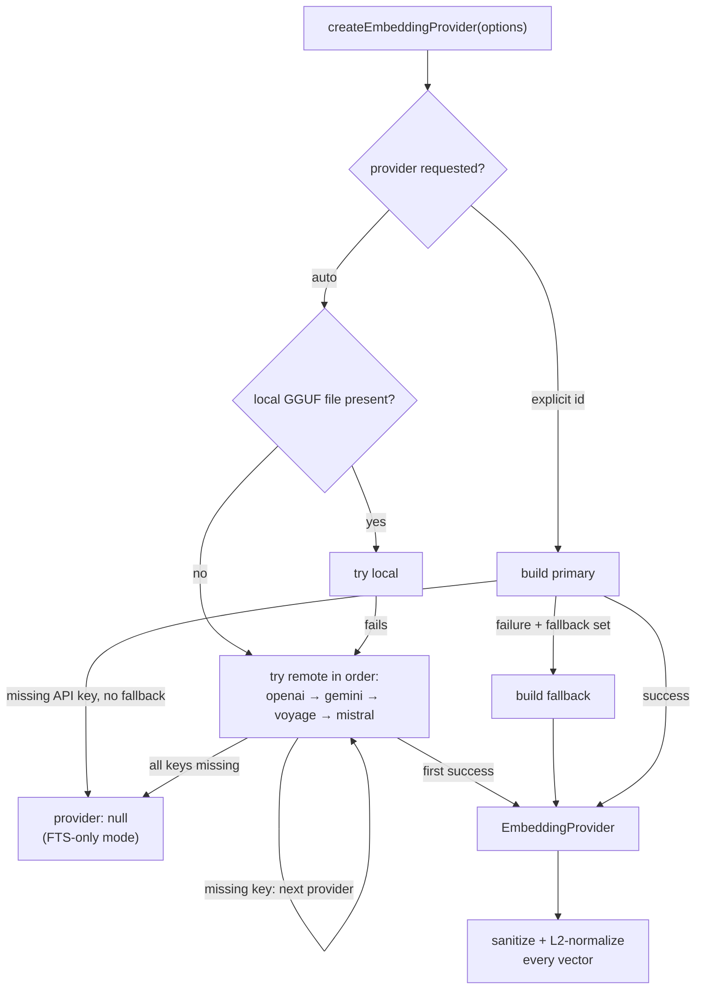
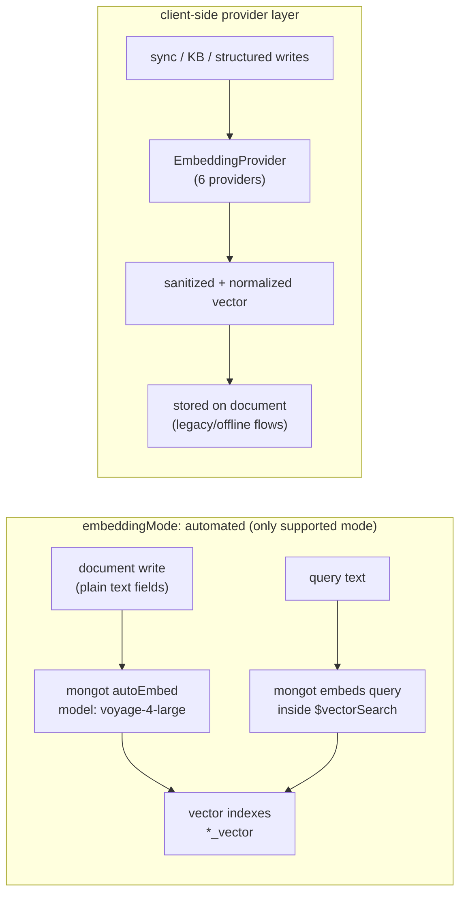

# Embedding providers

The engine's embedding layer lives in `packages/memory-engine/src/embeddings.ts` plus one file per provider. It abstracts six provider integrations behind a single `EmbeddingProvider` interface, with shared remote plumbing, batch support, retry, and input-length enforcement.

> **Context:** in the default MongoDB deployment (`embeddingMode: "automated"`, the only mode `backend-config.ts` accepts), the serving vector indexes are **autoEmbed** — mongot embeds with `voyage-4-large` server-side (`autoEmbedVectorField` in `mongodb-schema.ts:3261`). The client-side provider layer described here still matters for offline/batch flows, sync/KB/structured-memory writes, the local-embedding fallback, and non-Atlas deployments.

## The provider abstraction

`packages/memory-engine/src/embeddings.ts:37` defines the contract:

```typescript
type EmbeddingProvider = {
	id: string
	model: string
	maxInputTokens?: number
	embedQuery: (text: string) => Promise<number[]>
	embedBatch: (texts: string[]) => Promise<number[][]>
	embedBatchInputs?: (inputs: EmbeddingInput[]) => Promise<number[][]>
}
```

- `embedQuery` embeds a single query text; `embedBatch` embeds document texts in one call.
- `embedBatchInputs` (Gemini only, today) accepts multimodal `EmbeddingInput` parts (text + inline data).
- Every returned vector passes through `sanitizeAndNormalizeEmbedding` (`embedding-vectors.ts`): non-finite values are zeroed and the vector is L2-normalized, so a NaN or Infinity from a provider can never reach a stored document or a `$vectorSearch` query.

Provider ids (`EmbeddingProviderId`): `"openai" | "local" | "gemini" | "voyage" | "mistral" | "ollama"`.

### Selection: `createEmbeddingProvider`

`createEmbeddingProvider(options)` (`embeddings.ts:174`) resolves a provider from config:

1. **Explicit provider** — build it; on failure, try the configured `fallback` provider.
2. **`"auto"`** — if a local GGUF model file exists on disk (`canAutoSelectLocal`), try `local` first; otherwise iterate the remote ids in order **openai → gemini → voyage → mistral** (`REMOTE_EMBEDDING_PROVIDER_IDS`). Ollama is deliberately excluded from auto-selection so `"auto"` never implicitly assumes a local Ollama instance.
3. **Graceful degradation** — if every candidate failed with a missing-API-key error, return `{ provider: null, providerUnavailableReason }` and the engine runs FTS-only. Non-auth errors (network, etc.) stay fatal.
4. **`local`** — lazy-loads the optional `node-llama-cpp` dependency, resolves a GGUF model (default `embeddinggemma-300m-qat-q8_0`), and embeds through a llama embedding context with a single-flight init promise.



## The six providers

| Provider | File | Default model | Endpoint default | Notes |
|----------|------|---------------|------------------|-------|
| OpenAI | `embeddings-openai.ts` | `text-embedding-3-small` | `https://api.openai.com/v1` | Thin wrapper over the shared remote provider |
| Voyage | `embeddings-voyage.ts` | `voyage-4-large` | `https://api.voyageai.com/v1` | `al-...` Atlas Model API keys reroute to `https://ai.mongodb.com/v1` (`resolveVoyageBaseUrlForKey`) — the same key works for embeddings and the reranker; sends `input_type: query/document` |
| Gemini | `embeddings-gemini.ts` | `gemini-embedding-001` | `https://generativelanguage.googleapis.com/v1beta` | Auth via `x-goog-api-key` header or JSON `{token}` bearer; supports task types (`RETRIEVAL_QUERY`/`RETRIEVAL_DOCUMENT`/…); `gemini-embedding-2-preview` adds `outputDimensionality` (768/1536/3072, default 3072) and multimodal `embedBatchInputs` |
| Mistral | `embeddings-mistral.ts` | `mistral-embed` | `https://api.mistral.ai/v1` | Thin wrapper over the shared remote provider |
| Ollama | `embeddings-ollama.ts` | `nomic-embed-text` | `http://127.0.0.1:11434` | `/api/embeddings` takes one prompt per request, so `embedBatch` fans out with `Promise.all`; optional bearer key; strips a trailing `/v1` from the base URL |
| Local (GGUF) | `embeddings.ts` (`createLocalEmbeddingProvider`) | `embeddinggemma-300m-qat-q8_0` | — | Optional `node-llama-cpp` dependency; missing-dependency errors produce a long remediation message |

### Shared remote plumbing ("remote-fetch")

OpenAI, Voyage, and Mistral share one HTTP stack rather than re-implementing it:

- `embeddings-remote-client.ts` — `resolveRemoteEmbeddingBearerClient`: API-key resolution (`remote.apiKey` > `requireApiKey(provider)`), base-URL precedence (remote override > provider config > key-dependent default > static default), header merging, and an SSRF policy built from the final URL (`buildRemoteBaseUrlPolicy`).
- `embeddings-remote-fetch.ts` — `fetchRemoteEmbeddingVectors`: POSTs the OpenAI-style `{model, input}` body via `post-json.ts` with a 30 s timeout, parses `data[].embedding`, sanitizes/normalizes, and wraps everything in `retryAsync` from `@memongo/lib`.
- `embeddings-remote-provider.ts` — `createRemoteEmbeddingProvider`: adapts that stack to the `EmbeddingProvider` interface (`embedQuery` = first row of `embed([text])`).

Gemini and Ollama use the same `remote-http.ts` primitives (`withRemoteHttpResponse`) directly because their request/response shapes differ.

## Batch embedding

Two distinct "batch" layers exist:

1. **Inline `embedBatch`** on every provider — one API call per document set (or per-prompt fan-out for Ollama/local). Used by the write pipelines.
2. **Provider Batch API** (`batch-voyage.ts`, `batch-embedding-common.ts`, `batch-http.ts`, `batch-runner.ts`, `batch-status.ts`, `batch-output.ts`, `batch-upload.ts`) — offline bulk embedding through the Voyage Batch API: JSONL upload (`uploadBatchJsonlFile`), batch creation with a 12 h completion window and a 50,000-request cap, status polling, and output-line application. Deps (clock, sleep, HTTP) are injectable for testing.

## Retry logic

Two complementary mechanisms:

- **Transport retry** (`embeddings-remote-fetch.ts`): `retryAsync` with 3 attempts, 300 ms–2 s delay, 0.2 jitter. Retries only HTTP 429, HTTP 5xx, and `TimeoutError` (from the 30 s `AbortSignal.timeout`) — 4xx errors fail immediately.
- **Pipeline retry** (`mongodb-embedding-retry.ts`): `retryEmbedding(embedFn, texts, maxAttempts = 3, backoffBaseMs = 1000)` with exponential backoff (1 s/2 s/4 s), used by `mongodb-sync.ts`, `mongodb-kb.ts`, and `mongodb-structured-memory.ts`. On final failure the chunk is still stored with `embeddingStatus: "failed"` (the `EmbeddingStatus` tri-state: `success | failed | pending`), and `EmbeddingStatusCoverage` metrics feed `getMemoryStats`/doctor reporting so coverage gaps are visible and re-attemptable.

## Input length limits

Enforcement is conservative and byte-based (`embedding-input-limits.ts`):

- **Estimate with UTF-8 bytes, not tokens** — a token contains at least one byte, so `token_count <= utf8_byte_length`; `estimateUtf8Bytes` is a safe upper bound without shipping a tokenizer.
- **Split on overflow** — `splitTextToUtf8ByteLimit` binary-searches split points and backs off UTF-16 surrogate pairs so no character is torn.
- **Per-model ceilings** — `embedding-model-limits.ts` resolves `maxInputTokens`: the provider's own declaration wins, then a known-model table (OpenAI 8,192; Voyage 16k–32k; Gemini 2,048 / 8,192 for embedding-2), then conservative provider fallbacks (Gemini 2,048; local 2,048; default 8,192).

## Auto-embed vs client-side embedding

> **Preview:** MongoDB Automated Embedding is an upstream Preview feature that
> MongoDB says not to use in production. The current auto-embed mode is suitable
> for evaluation and controlled preview deployments.



- **Auto-embed (server-side, the default and only accepted `embeddingMode`).** `ensureSearchIndexes` builds every `*_vector` index with `{ type: "autoEmbed", model: "voyage-4-large" }`. Neither writes nor queries carry client-computed vectors; Atlas/Voyage fix the dimensions server-side, which is why `numDimensions` is a documented dead knob (setting it logs an error, `backend-config.ts`). Quantization on autoEmbed definitions is probe-adopted through the capability registry.
- **Client-side (this provider layer).** Used where a process must produce vectors itself: sync/KB/structured-memory write paths with their retry + `embeddingStatus` bookkeeping, offline batch jobs, and local-embedding deployments. The `EmbeddingProvider` abstraction keeps all of those call sites provider-agnostic.

## Related pages

- [Memory engine overview](index.md) — package role and layout
- [Manager and schema](manager-and-schema.md) — autoEmbed index definitions and capability gating
- [Retrieval pipeline](../systems/retrieval-pipeline.md) — how `$vectorSearch` consumes these indexes
- [Data models](../reference/data-models.md) — index definitions per collection
