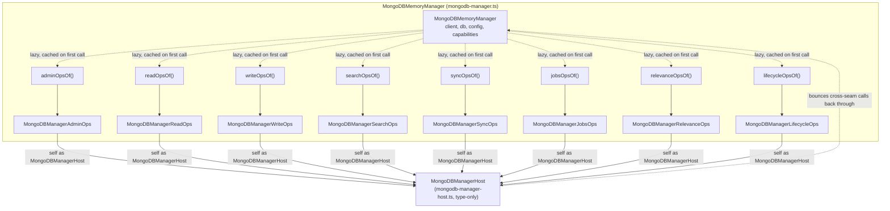
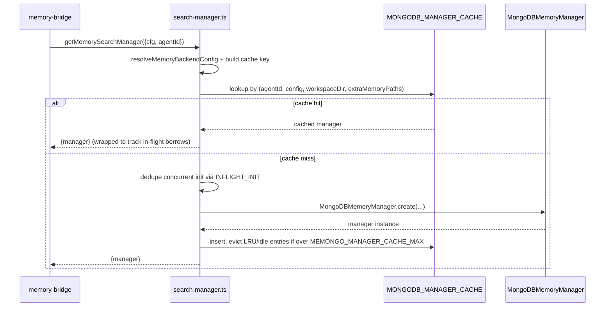

# Memory engine

Active contributors: Rom Iluz

`packages/memory-engine` (`@memongo/memory-engine`, currently v2.0.1) is the only package in the repo that talks to MongoDB. Every write, read, search, graph traversal, consolidation pass, and schema migration in Memongo funnels through this package. `packages/memory-bridge` and, indirectly, `apps/api` are the callers; nothing above them touches a MongoDB driver directly. See [Architecture](../../overview/architecture.md) for how this package fits into the four-layer stack.

## Key source files

| File | Role |
|---|---|
| `packages/memory-engine/src/index.ts` | Public barrel: the manager, `MemoryStateFamily`, and ~50 request/response types. The stable, SemVer-covered surface. |
| `packages/memory-engine/src/internal-barrel.ts` | Backs the `@memongo/memory-engine/internal` subpath; every symbol trimmed from the main barrel in the P4.1 cleanup, kept for a deprecation window. |
| `packages/memory-engine/src/mongodb-manager.ts` | The `MongoDBMemoryManager` class (1855 lines): connection lifecycle, request normalization, and the composition point for all manager collaborators. |
| `packages/memory-engine/src/mongodb-manager-*.ts` | Nine collaborator modules (admin, host, jobs, lifecycle, read, relevance, search, sync, write) that each own one slice of manager behavior. |
| `packages/memory-engine/src/search-manager.ts` | `getMemorySearchManager` / `closeAllMemorySearchManagers` — creates, caches, and evicts one manager per agent+config. |
| `packages/memory-engine/src/agent-config.ts` | Resolves an agent's workspace directory and extra memory-search paths from `MemongoConfig.agents`. |
| `packages/memory-engine/src/backend-config.ts` | Resolves the full MongoDB backend config (URI, recall profile, fusion method, search budget, TTL, and more) from config plus `MEMONGO_*` env vars. |
| `packages/memory-engine/src/types.ts` | The type module backing the public API (1737 lines). See [Data models](../../reference/data-models.md) for the catalog. |
| `packages/memory-engine/src/internal.ts` | Low-level file/hash helpers (`isDuplicateKeyError`, `hashText`, `normalizeExtraMemoryPaths`, markdown chunking) shared across a dozen `mongodb-*.ts` modules. Not the `/internal` public subpath — that is `internal-barrel.ts`. |

## Directory layout

The package holds roughly 130 source files under `packages/memory-engine/src/`, almost all named `mongodb-<concern>.ts` with a colocated `mongodb-<concern>.test.ts`. This is a deliberate convention (see [Patterns and conventions](../../how-to-contribute/patterns-and-conventions.md)): one file, one narrow MongoDB responsibility — `mongodb-graph.ts` only does entity/relation upserts and `$graphLookup` traversal, `mongodb-trust.ts` only computes trust scores and decay, `mongodb-schema.ts` only defines collections and indexes. There is no subdirectory nesting; the flat namespace plus the `mongodb-` prefix is the organizing principle, and files are kept under ~500 lines by splitting a growing concern into a new sibling file (e.g. `mongodb-manager-search.part2.test.ts`) rather than letting one file grow indefinitely.

The two largest files break that norm on purpose:
- `mongodb-manager.ts` (1855 lines) is the composition root — see below.
- `types.ts` (1737 lines) is the type module for the whole package's public API; splitting it would scatter types that describe one coherent request/response contract. It is documented separately in [Data models](../../reference/data-models.md), not enumerated here.

Deep dives into what specific subsystems do (retrieval fusion, consolidation, the graph, embeddings, schema/indexes, trust/provenance, bitemporal, structured memory/procedures, jobs/telemetry/sync) live under [Systems](../../systems/index.md); this page stays at the package level.

## Key abstractions: the manager and its collaborators

`MongoDBMemoryManager` (`packages/memory-engine/src/mongodb-manager.ts:474`) implements `MemorySearchManager` and is the single object every caller holds. Rather than being one 10,000-line class, it keeps its own state (client, db, config, capabilities, watchers) as private instance fields and lazily delegates whole method groups to nine collaborator classes, one per `mongodb-manager-*.ts` file:

| Collaborator | File | Owns |
|---|---|---|
| `MongoDBManagerAdminOps` | `mongodb-manager-admin.ts` | V2 health/status classification, `getV2Status`, access-summary helpers. |
| `MongoDBManagerReadOps` | `mongodb-manager-read.ts` | Locator-based reads across structured memory, entities, procedures, events, episodes, relations, KB, and conversation/bridge reads. |
| `MongoDBManagerWriteOps` | `mongodb-manager-write.ts` | `writeConversationEvent` and the canonical event write + derived-memory projection path. |
| `MongoDBManagerSearchOps` | `mongodb-manager-search.ts` | `search`, `searchDetailed`, `searchKB` orchestration. |
| `MongoDBManagerSyncOps` | `mongodb-manager-sync.ts` | Filesystem/session `sync`, startup repair, file watchers, change-stream resume tokens, KB auto-refresh. |
| `MongoDBManagerJobsOps` | `mongodb-manager-jobs.ts` | Memory-job worker concurrency/sweep resolution and the claim/process loop. |
| `MongoDBManagerRelevanceOps` | `mongodb-manager-relevance.ts` | `relevanceExplain` diagnostics (reaches search internals through the host). |
| `MongoDBManagerLifecycleOps` | `mongodb-manager-lifecycle.ts` | Structured/procedure lifecycle writes and patches, self-edit, profile/slate/bundle builders, conversation recall, reasoning-chain/novelty/consolidation wrappers, recall traces, job listing. |
| `MongoDBManagerHost` (type only) | `mongodb-manager-host.ts` | The structural interface each collaborator receives instead of the concrete manager — see below. |

This is not classic mixin inheritance. `mongodb-manager-host.ts` defines `MongoDBManagerHost`, a type-only structural interface listing every private field and method a collaborator might need. Each `MongoDBMemoryManager` method that delegates does so through a small `*OpsOf(self)` helper (`mongodb-manager.ts:1769-1855`) that lazily constructs the collaborator once, caches it on a private `_searchOps`/`_writeOps`/etc. field, and casts `self` to `MongoDBManagerHost` when passing it in. The manager's fields stay direct own-properties (not inherited via prototype mixing) because the test suite builds fakes with `Object.create` + `Object.assign`, and that pattern only works if state lives on the instance itself.

## How it works

`search-manager.ts` is the only supported way to obtain a manager. It keys a `Map` cache on a stable serialization of `agentId`, the resolved MongoDB config, the workspace directory, and extra memory paths, so two calls with identical config for the same agent share one manager (and one MongoDB connection pool). When the shared-client runtime is on (`isSharedMongoClientEnabled()`), the cache is LRU-bounded by `MEMONGO_MANAGER_CACHE_MAX` (default 50) and idle entries older than `MEMONGO_MANAGER_CACHE_IDLE_TTL_MS` (default 10 minutes) are swept and closed. A `Proxy`-based borrow tracker (`trackManagerBorrows`) defers closing an evicted manager until its last in-flight call settles, so eviction never kills a call mid-flight. `closeAllMemorySearchManagers` (used by `apps/api` shutdown and tests) waits out in-flight initializations and borrows before closing every shared `MongoClient`.

## Configuration

Two modules resolve config, applied in order:

- `agent-config.ts` resolves per-agent settings from `MemongoConfig.agents` (`defaults` and a `list` keyed by `id`): the agent's workspace directory (`~/.memongo/agents/<agentId>` if unset) and `memorySearch.extraPaths`.
- `backend-config.ts` (`resolveMemoryBackendConfig`, 944 lines) resolves everything else into a `ResolvedMongoDBConfig`: connection URI (`memory.mongodb.uri` config or `MEMONGO_MONGODB_URI` env, with `MEMONGO_FORCE_MONGODB_URI` taking precedence for tests/CI), database and collection prefix, deployment profile, embedding mode and query embedding model, `conversationEvidenceMode`, `fusionMethod` (`scoreFusion` default, `rankFusion`, or `js-merge`), `recallProfile` (`latency` / `balanced` default / `proof`), quantization, connection pool sizing, search budget (`maxAggregations`, `maxEmbeds`), TTL, and per-subsystem toggles for KB, relevance telemetry, episodes, graph, query rewriting, and reranking.

Config detail (env var names, recall-profile tradeoffs, fusion-method semantics) belongs to the subsystems that consume it — see [Retrieval and search](../../systems/retrieval-and-search.md) for fusion/recall profile behavior and [Schema, migrations, and indexes](../../systems/schema-migrations-and-indexes.md) for how `backend-config.ts` output drives index provisioning. This page does not maintain a separate configuration sub-page: the config surface is one function (`resolveMemoryBackendConfig`) with a single well-documented output type, and splitting it out would duplicate rather than clarify.

## Public surface

`src/index.ts` is deliberately small (the "P4.1 trim"): `MongoDBMemoryManager`, the `MemoryStateFamily` type (`profile` + `blocks` + `bundle`, see [Context bundles and state](../../features/context-bundles-and-state.md)), `getMemorySearchManager`/`closeAllMemorySearchManagers`, and the request/response types of the memory API — roughly 50 symbols. Everything else that used to be exported from the root — module-level helpers like `writeEvent`, `upsertEntity`, `consolidateMemory`, collection accessors like `queryCacheCollection`, and advanced types like `ConversationRecallRequest` — moved to `internal-barrel.ts` behind the `@memongo/memory-engine/internal` subpath (`package.json`'s `exports["./internal"]`). That subpath is explicitly `@deprecated`: nothing in it carries a SemVer guarantee, and the guidance in both `internal-barrel.ts` and the package README is to use the main barrel or migrate to `@memongo/memory-bridge` instead.

## Integration points

- [Memory bridge](../memory-bridge.md) is the only in-repo consumer that calls `getMemorySearchManager` directly; it re-exports a stable facade over the manager for `apps/api`.
- The package depends on `@memongo/lib` for shared config types (`MemongoConfig`), logging (`createSubsystemLogger`), and path/URI helpers (`resolveUserPath`, `applyMongoDbForceUriOverride`).
- `mongodb` (driver, `^7.5.0`) and `chokidar` (file watching for filesystem-backed memory) are its two runtime dependencies; `node-llama-cpp` is optional, used only when a local embedding path is configured.
- Subsystem behavior owned by other files in this package — retrieval/fusion, consolidation, the entity/relation graph, bitemporal validity, structured memory and procedures, schema/index management, embeddings, trust/provenance, and jobs/telemetry/sync — is documented under [Systems](../../systems/index.md), not here.
- Cross-cutting product concepts that this package implements but doesn't define — multi-tenancy scopes, the memory taxonomy (conversation event / episode / structured memory / procedure), and the State Family (profile/blocks/bundle) — are documented under [Multi-tenancy and scopes](../../features/multi-tenancy-and-scopes.md), [Memory taxonomy](../../features/memory-taxonomy.md), and [Context bundles and state](../../features/context-bundles-and-state.md).

## Entry points for modification

To add a new manager-level operation:

1. Pick the collaborator whose concern it matches (read/write/search/sync/jobs/relevance/lifecycle/admin), or add a new `mongodb-manager-<concern>.ts` file if it doesn't fit any existing one.
2. Add the method to that collaborator class, taking `MongoDBManagerHost` (from `mongodb-manager-host.ts`) as its constructor dependency if it needs manager state — extend the host interface if the new method needs a field or method not already exposed there.
3. Add a thin public method on `MongoDBMemoryManager` in `mongodb-manager.ts` that calls the collaborator through its `*OpsOf(self)` accessor (follow the pattern at `mongodb-manager.ts:1769-1855`), so the collaborator stays lazily constructed and cached.
4. If the method belongs on the stable public surface, export its request/response types from `types.ts` and re-export them from `src/index.ts`; otherwise leave it reachable only through `internal-barrel.ts` or as a manager method with no barrel export.
5. Add a colocated `<file>.test.ts` next to the new or modified source file — the package convention is one test file per source file, not a shared test suite.
