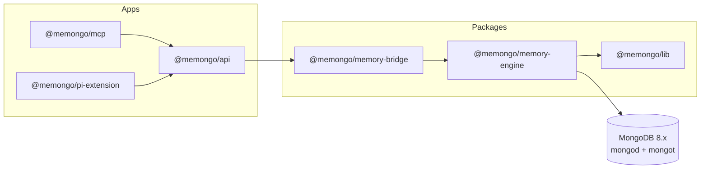

# Memory engine

`@memongo/memory-engine` (`packages/memory-engine/`) is the core of Memongo: a MongoDB-native memory engine that owns embeddings, graph, episodes, hybrid search, the knowledge base, reasoning chains, novelty detection, consolidation, and analytics. Every other package in the monorepo either wraps it (`@memongo/memory-bridge`), re-exports it (`@memongo/memory`), or talks to it over HTTP (`@memongo/api`, `@memongo/mcp`, `@memongo/client`).

- npm name: `@memongo/memory-engine`, version 2.0.1, Apache-2.0 (`packages/memory-engine/package.json`)
- Runtime deps: `mongodb@7.2.0`, `@memongo/lib`, `chokidar`; `node-llama-cpp` is an optional dependency for local embeddings
- Scale: 118 non-test TypeScript files in `packages/memory-engine/src/`, plus 125 colocated test files (21 of them `*.e2e.test.ts`)

## Role in the architecture

The engine is the only package that talks to MongoDB. It owns:

1. **Connection and schema bootstrap** — collections, JSON-schema validators, standard indexes, and Atlas Search/Vector indexes (`packages/memory-engine/src/mongodb-schema.ts`).
2. **The memory manager** — `MongoDBMemoryManager` in `packages/memory-engine/src/mongodb-manager.ts`, the central class that everything else funnels through.
3. **Retrieval** — the `searchV2` funnel, retrieval planner, hybrid fusion, reranking, query cache, and trust scoring.
4. **Write pipelines** — events, structured memories, procedures, episodes, graph entities/relations, KB ingestion, file sync.
5. **Background work** — the durable memory job queue, consolidation ("Dreamer"), change-stream watching, novelty scans.



## Key exports

`packages/memory-engine/src/index.ts` is a pure barrel file (~470 LOC) that re-exports roughly 360 symbols from the internal modules. The most important ones:

| Export | Source module | Purpose |
|--------|---------------|---------|
| `MongoDBMemoryManager` | `mongodb-manager.ts` | Central manager class (see [manager and schema](manager-and-schema.md)) |
| `searchV2`-adjacent executor helpers (`buildExecutorPasses`, `applySearchConfig`, `executeMongoSearchPlan`, …) | `mongodb-search-executor.ts` | Programmatic search planning/execution |
| `writeEvent`, `writeEventsBatch`, `projectChunksFromEvents`, … | `mongodb-events.ts` | Canonical event write/projection pipeline |
| `upsertEntity`, `upsertRelation`, `expandGraph`, … | `mongodb-graph.ts` | Graph write/traversal |
| `materializeEpisode`, `searchEpisodes`, … | `mongodb-episodes.ts` | Episode lifecycle |
| `writeProcedure`, `searchProcedures`, `evolveProcedure`, … | `mongodb-procedures.ts` | Procedural memory |
| `planRetrieval`, `classifyRetrievalQuery` | `mongodb-retrieval-planner.ts` | 8-lane retrieval planning |
| `consolidateMemory` | `mongodb-consolidator.ts` | Dreamer consolidation entry point |
| `createMemoryJob`, `listMemoryJobs`, … | `mongodb-memory-jobs.ts` | Durable job queue |
| Collection helpers (`queryCacheCollection`, `sessionChunksCollection`, …) | `mongodb-schema.ts` | Typed collection accessors |
| Capability registry (`CAPABILITY_GATES`, `isCapabilityEnabled`, `recordCapabilityProbe`, …) | `mongodb-capability-registry.ts` | Version-gated MongoDB features |
| `rerankResults`, `crossEncoderRerank` | `mongodb-manager.ts`, `mongodb-reranker.ts` | Post-retrieval ranking |
| `MemoryStateFamily` type | `index.ts` itself | Unified view over profile + blocks + context bundle |

Notably, the embedding provider modules (`embeddings.ts`, `embeddings-*.ts`) are **not** re-exported from the barrel — they are internal to the engine. See [embedding providers](embedding-providers.md).

## Directory layout

Everything lives flat in `packages/memory-engine/src/`, but the file names form clear clusters:

### `mongodb-*.ts` — the engine body (~90 files)

The dominant cluster, named after the only supported backend. Sub-clusters by suffix:

- **Manager/schema**: `mongodb-manager.ts`, `mongodb-schema.ts` — see [manager and schema](manager-and-schema.md)
- **Search**: `mongodb-search.ts`, `mongodb-search-executor.ts`, `mongodb-search-budget.ts`, `mongodb-hybrid.ts`, `mongodb-retrieval-planner.ts`, `mongodb-query-rewriter.ts`, `mongodb-query-decomposition.ts`, `mongodb-query-cache.ts`, `mongodb-query-cache-invalidation.ts`, `mongodb-reranker.ts`, `mongodb-post-retrieval-scoring.ts`
- **Memory types**: `mongodb-events.ts`, `mongodb-episodes.ts`, `mongodb-graph.ts`, `mongodb-structured-memory.ts`, `mongodb-procedures.ts`, `mongodb-kb.ts`, `mongodb-kb-search.ts`, `mongodb-derived-memory.ts`
- **Consolidation/intelligence**: `mongodb-consolidator.ts`, `mongodb-consolidation-reasoning.ts`, `mongodb-novelty.ts`, `mongodb-reasoning-chain.ts`, `mongodb-contradiction.ts`, `mongodb-llm-enrichment.ts`, `mongodb-entity-extractor.ts`, `mongodb-relation-extraction.ts`, `mongodb-temporal-extraction.ts`
- **State family**: `mongodb-profile.ts`, `mongodb-active-slate.ts`, `mongodb-context-bundle.ts`, `mongodb-discovery-projections.ts`
- **Infrastructure**: `mongodb-memory-jobs.ts`, `mongodb-change-stream.ts`, `mongodb-client-registry.ts`, `mongodb-transactions.ts`, `mongodb-telemetry.ts`, `mongodb-mutations.ts`, `mongodb-capability-registry.ts`, `mongodb-scope.ts`, `mongodb-single-flight.ts`
- **Quality/ops**: `mongodb-relevance.ts`, `mongodb-benchmark-*.ts`, `mongodb-access-tracker.ts`, `mongodb-analytics.ts`, `mongodb-ops.ts`, `mongodb-e2e-qa.ts`, `mongodb-lane-coverage.ts`, `mongodb-recall-traces.ts`, `mongodb-migration.ts`

### `embeddings-*.ts` / `embedding-*.ts` — embedding providers

Provider abstraction and the six provider implementations plus shared remote plumbing — see [embedding providers](embedding-providers.md).

### `batch-*.ts` — provider batch APIs

Offline batch embedding against provider batch endpoints (Voyage Batch API): `batch-voyage.ts`, `batch-embedding-common.ts`, `batch-http.ts`, `batch-runner.ts`, `batch-status.ts`, `batch-output.ts`, `batch-upload.ts`, `batch-error-utils.ts`, `batch-utils.ts`, `batch-provider-common.ts`.

### `benchmark-*.ts` — benchmark support

`benchmark-failure-taxonomy.ts`, `benchmark-parity-envelope.ts`, `benchmark-quality-contracts.ts` (the benchmark runner itself is `mongodb-benchmark-runner.ts`).

### Root-level utilities

`backend-config.ts` (config resolution), `internal.ts` (shared internals), `types.ts` (shared engine types, ~44 KB), `remote-http.ts`, `post-json.ts`, `secret-input.ts`, `agent-config.ts`, `fs-utils.ts`, `session-files.ts`, `search-utils.ts`, `search-manager.ts`, `multimodal.ts`, `node-llama.ts`, `fact-extraction-eval.ts`, `index.ts` (barrel).

### `test-helpers/`

Shared test infrastructure: `fetch-mock.ts`, `model-auth-mock.ts`, `preview-env.ts`, `ssrf.ts`, `memory-eval-fixtures.ts` — used by the colocated unit tests and the 21 e2e suites.

## Build and test

From `packages/memory-engine/package.json`:

```bash
bun run build         # tsc -p tsconfig.json
bun run test          # vitest run (excludes *.e2e.test.ts)
bun run test:e2e      # vitest run --no-file-parallelism e2e.test.ts
```

E2E tests require a running MongoDB with mongot (Atlas Local Preview) — see `docker/docker-compose.yml`.

## Related pages

- [Manager and schema](manager-and-schema.md) — the god module and the schema layer
- [Embedding providers](embedding-providers.md) — provider abstraction and the six providers
- [Retrieval pipeline](../systems/retrieval-pipeline.md) — how search works end-to-end
- [Consolidation](../systems/consolidation.md) — the Dreamer pipeline
- [Memory model](../systems/memory-model.md) — structured memory, episodes, graph
- [Memory bridge](../packages/memory-bridge.md) — the stable facade over this engine
- [Data models](../reference/data-models.md) — collection schemas and index definitions

## Contributors

Top contributor: Rom Iluz (125 commits on `packages/memory-engine/`).
