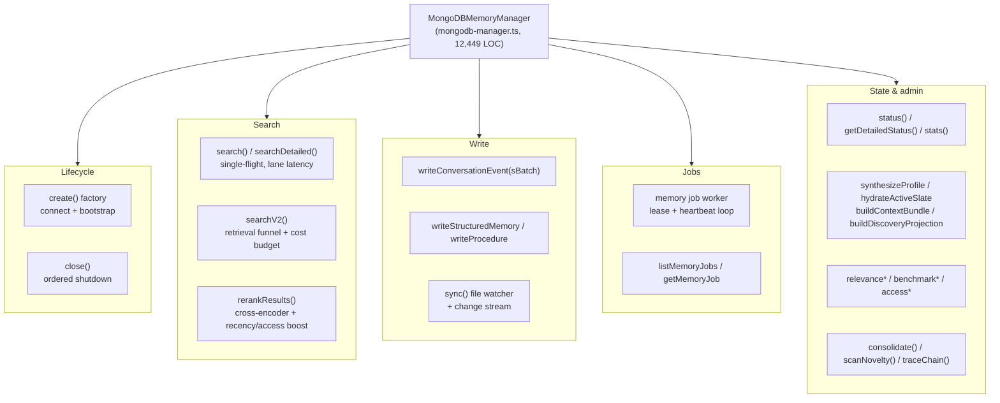

# Manager and schema

Two files dominate `packages/memory-engine/src/`:

- `packages/memory-engine/src/mongodb-manager.ts` — **12,449 LOC**. Home of `MongoDBMemoryManager`, the class every memory operation funnels through.
- `packages/memory-engine/src/mongodb-schema.ts` — **4,591 LOC**. Collection setup, JSON-schema validators, standard indexes, Atlas Search/Vector index definitions, and capability detection.

Both far exceed the repo's ~500 LOC guideline (`mongodb-manager.ts` is the codebase's flagship violation) — treat them as "god modules" and navigate by section, not sequentially.

## MongoDBMemoryManager

Defined at `packages/memory-engine/src/mongodb-manager.ts:2335` as `class MongoDBMemoryManager implements MemorySearchManager`. Construction is private; instances come from the static factory `MongoDBMemoryManager.create(...)` (`mongodb-manager.ts:2417`), which:

1. Builds (or adopts a shared) `MongoClient`, connects, and pings (`mongodb-manager.ts:2456-2479`).
2. Runs `ensureCollections` → `isSearchIndexManagementAvailable` → `ensureStandardIndexes` (BSON `$text` fallback indexes are only created when Search Index Management is absent).
3. Runs `detectCapabilities` against the `chunks` collection, then `ensureSearchIndexes` when mongot is reachable, folding probe outcomes (e.g. quantization rejection) back into capabilities via `applyCapabilityProbeResult`.

### What the manager owns



**Connection.** The manager holds `client`, `db`, `prefix`, `agentId`, resolved scope refs (`agentScopeRef`, `workspaceScopeRef`), `capabilities`, and the resolved config (`mongodb-manager.ts:2336-2376`). When built on a shared client (`MEMONGO_SHARED_CLIENT`, via `mongodb-client-registry.ts`), `ownsClient` is false and `close()` leaves the client open.

**Search.** `search()` (`mongodb-manager.ts:3194`) is the public entry: it trims the query, resolves scope identity (explicit scope > `sessionKey` > `MEMONGO_SEARCH_DEFAULT_SCOPE` > `"agent"`), coalesces concurrent identical searches through `runSingleFlight` (stampede protection, benchmark runs bypass), and delegates to the standalone `searchV2()` funnel (`mongodb-manager.ts:10788`). `searchV2` opens the per-request cost budget (`mongodb-search-budget.ts`: max aggregations, max embeds) and fans out into retrieval lanes. The legacy path survives only as an opt-in fallback (`legacySearchFallback`, off by default — "empty ≠ error", `backend-config.ts`). `searchDetailed()`, `relevanceExplain()`, `recallConversation()`, and `searchKB()` are neighboring entry points.

**Write.** `writeConversationEvent()` / `writeConversationEventsBatch()` (`mongodb-manager.ts:9363`, `:9695`) append canonical events and stage extraction jobs; `extractEvent()`, `writeStructuredMemory()`, `writeProcedure()` cover the other memory types. `sync()` drives file-watching ingestion with a debounced timer; a `MongoDBChangeStreamWatcher` with persisted resume tokens handles cross-process invalidation. All writes serialize through internal promise queues (`writeQueue`, `derivationSchedulingQueue`, `derivationQueue`).

**Jobs.** The manager runs the durable job worker over the `memory_jobs` collection: a per-process worker id (`${process.pid}:${randomUUID()}`), lease/heartbeat claiming, wake-on-write (`memoryJobWakeRequested`), and benchmark run-context tracking (`memoryJobRunContexts`). Worker concurrency is resolved by the exported `resolveMemoryJobWorkerConcurrency()` (`mongodb-manager.ts:2289`). Queue functions themselves live in `mongodb-memory-jobs.ts`.

**Shutdown.** `close()` (`mongodb-manager.ts:10137`) is carefully ordered: set `closed` (intake stops — `sync()` no-ops and `writeConversationEvent` throws), clear the watch timer, await in-flight sync, drain `writeQueue` → `derivationSchedulingQueue` → `derivationQueue`, stop the job worker, drop stale run contexts, close the file watcher, persist the change-stream resume token and close the watcher, flush the access tracker (failures logged, not swallowed), close the client only when owned, and finally invoke the `onClosed` hook. Every step is idempotent and error-tolerant so `close()` can be called twice.

## mongodb-schema.ts — the schema layer

### Collections and validators

The module exposes a typed accessor per collection (`chunksCollection`, `eventsCollection`, `entitiesCollection`, `structuredMemCollection`, `memoryJobsCollection`, `sessionChunksCollection`, `memoryEvidenceCollection`, …) that applies the configured prefix (`packages/memory-engine/src/mongodb-schema.ts:64-295`).

`ensureCollections()` (`mongodb-schema.ts:1481`) creates any missing collections; `ensureSchemaValidation()` (`mongodb-schema.ts:1578`) applies `$jsonSchema` validators from `VALIDATED_COLLECTIONS` — 23 collections including `chunks`, `knowledge_base`, `kb_chunks`, `structured_mem(+_revisions)`, `procedures(+_revisions)`, `events`, `entities`, `relations`, `entity_links`, `episodes`, `query_cache`, `memory_jobs`, `memory_evidence`, and `files`. Validation runs at `validationLevel: "moderate"`, with `validationAction` upgraded to `"errorAndLog"` on MongoDB 8.1+. Missing collections are skipped; other failures are aggregated into one error-level log line so a deployment running with zero validation is visible.

`ensureStandardIndexes()` (`mongodb-schema.ts:1664`) builds the edition-independent indexes (unique scope/tenant floors, TTL indexes). A duplicate-key (E11000) failure on a unique index **aborts bootstrap** — continuing would leave the constraint permanently unenforced.

### Atlas Search / Vector indexes

`getExpectedSearchIndexTargets()` (`mongodb-schema.ts:3104`) declares the serving surface. In the default profile the engine plans **15 search indexes** (17 when the evidence mirror is enabled) across 9 collections:

| Collection | Indexes |
|------------|---------|
| `chunks` | `_text`, `_vector` |
| `kb_chunks` | `_text`, `_vector` |
| `structured_mem` | `_text`, `_vector` |
| `procedures` | `_text`, `_vector` |
| `events` | `_text`, `_vector` |
| `session_chunks` | `_text`, `_vector` |
| `memory_evidence` (mirror mode) | `_text`, `_vector` |
| `query_cache` | `_vector` |
| `entities` / `episodes` | `entity_autocomplete`, `episode_autocomplete` |

`assertIndexBudget()` (`mongodb-schema.ts:4325`) enforces the deployment profile's index budget; when over budget the plan degrades to just the `chunks` pair (or nothing). Benchmark profiles (`MEMONGO_BENCHMARK_SEARCH_INDEX_PROFILE=longmemeval|raw-session`) deliberately shrink the target set.

All vector indexes are **autoEmbed** definitions: `autoEmbedVectorField()` (`mongodb-schema.ts:3261`) emits `{ type: "autoEmbed", modality: "text", path, model: "voyage-4-large" }` — mongot generates the embeddings server-side, so no client-side vector ever touches these indexes. `MEMONGO_VECTOR_INDEXING_METHOD=flat` opts into exact indexing (accepted on Atlas 8.3.7+, verified live). `ensureSearchIndexes()` (`mongodb-schema.ts:3600`) creates/reconciles definitions, waits for queryability (`waitForSearchIndexesQueryable`), and ships configured quantization in the definition — a server rejection is caught, recorded in the capability registry, and retried with the server default.

`VECTOR_STORED_SOURCE_INCLUDE` (`mongodb-schema.ts:3302`) holds per-collection stored-source include lists (issue #66 field-usage map) so `returnStoredSource: true` queries never silently drop a field a mapper reads. Events and query_cache are deliberately excluded.

### Capability detection

`detectCapabilities()` (`mongodb-schema.ts:4417`) returns `DetectedCapabilities` (`mongodb-schema.ts:23`):

```typescript
type DetectedCapabilities = {
	vectorSearch: boolean   // probe collection's *_vector index is queryable
	textSearch: boolean     // probe collection's *_text index is queryable
	rankFusion: boolean     // $rankFusion — serverVersionAtLeast(buildInfo, 8, 1)
	scoreFusion: boolean    // $scoreFusion — serverVersionAtLeast(buildInfo, 8, 3)
	storedSource: boolean   // serving index was BUILT with stored source + gate open
	vectorIndexMethod: boolean
	capabilityGates?: Record<string, boolean>
}
```

Fusion stages are gated on the `buildInfo` `versionArray` — `$rankFusion` requires MongoDB 8.1+, `$scoreFusion` 8.3+ — with a stage-probe fallback only when `buildInfo` is unavailable. Search capabilities are **not** version-based: they require the named serving indexes to exist and be queryable (`isSearchIndexQueryable`, `isSearchIndexTypeCompatible`). `storedSource` reflects what the index was actually built with, never the server version, and additionally requires the `vector-stored-source` registry gate.

`waitForSearchCapabilities()` (`mongodb-schema.ts:4555`) polls detection until the required lanes are queryable or a 60 s deadline passes — used at bootstrap so startup doesn't race index builds.

### The capability re-enable registry

`packages/memory-engine/src/mongodb-capability-registry.ts` is the single surface where gated MongoDB features declare their unblock condition. Five gates are registered:

| Gate | Unblocks at |
|------|-------------|
| `vector-stored-source` | MongoDB 8.3.7+ (`MEMONGO_VECTOR_STORED_SOURCE` overrides) |
| `autoembed-quantization` | Probe-adopt: optimistic until the server rejects the definition |
| `rerank-stage` ($rerank) | Disabled — Atlas Search Preview, await GA |
| `lexical-prefilters` | Disabled — Atlas Search Preview, await GA |
| `flat-indexes` | 8.3.7+ **and** `MEMONGO_VECTOR_INDEXING_METHOD=flat` opt-in |

`isCapabilityEnabled()` evaluates the static gate, overridden by any recorded probe rejection (`recordCapabilityProbe`). `detectCapabilities` evaluates every gate into `capabilityGates`, and `logDisabledCapabilityGates` prints one info line per disabled gate with its blocker and tracked TODO — so a server upgrade flips features on without a code change.

## Configuration and the barrel

`packages/memory-engine/src/backend-config.ts` resolves `ResolvedMemoryBackendConfig` from `MemongoConfig` + env vars: URI precedence (`MEMONGO_FORCE_MONGODB_URI` > config `memory.mongodb.uri` > `MEMONGO_MONGODB_URI`), deployment profile (`atlas-local-preview` default, `atlas-managed` when the URI contains `.mongodb.net`), the shared `memongo_` collection prefix default, connection-pool tuning, and every subsystem knob (kb, relevance, episodes, graph, reranking, cache). Only `embeddingMode: "automated"` is supported — anything else throws (see [embedding providers](embedding-providers.md)).

`packages/memory-engine/src/index.ts` re-exports ~360 symbols from these modules — the manager, `rerankResults`, `resolveMemoryJobWorkerConcurrency`, the schema collection helpers, `DetectedCapabilities`, and the full capability-registry API — giving consumers one import surface while the internals stay module-scoped.

## Related pages

- [Memory engine overview](index.md) — package role and directory layout
- [Embedding providers](embedding-providers.md) — the provider layer the manager uses
- [Retrieval pipeline](../systems/retrieval-pipeline.md) — searchV2 lanes end-to-end
- [Data models](../reference/data-models.md) — field-level collection schemas
- [Memory bridge](../packages/memory-bridge.md) — the facade that wraps `MongoDBMemoryManager`
