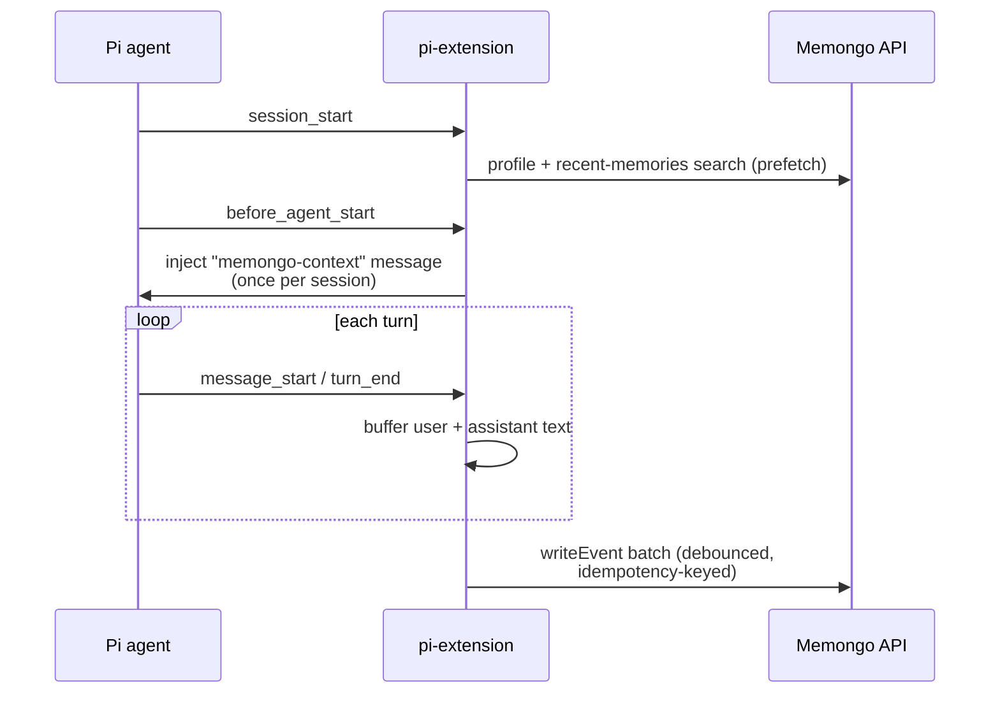

# @memongo/pi-extension

A [Pi coding agent](https://github.com/earendil-works/pi-coding-agent) extension that gives Pi durable, cross-project memory backed by Memongo. It is **additive**: it sits alongside Pi's built-in `pi-hermes-memory` (local SQLite FTS5 keyword search) and exposes Memongo's hybrid vector + full-text + graph retrieval as *new* tools — it does not replace any existing Pi memory tool.

Source: `packages/pi-extension/extensions/` (`index.ts`, `lifecycle.ts`).

## Tools

Three tools are registered from `packages/pi-extension/extensions/index.ts`:

| Tool | Purpose |
|------|---------|
| `memongo_search` | Semantic/cross-project search over durable memory via hybrid retrieval. The prompt guidelines steer the agent to use it when local keyword FTS5 can't find something, and to fall back (not retry) when Memongo is unavailable |
| `memongo_save` | Persist a durable structured fact/decision/preference |
| `memongo_status` | Probe Memongo API + vector search availability |

Result formatting includes score, scope/scopeRef, lifecycle state, and timestamp with a 400-character snippet cap. The extension probes the API at load (`client.status(agentId)`) and tracks availability so a down API degrades gracefully instead of failing tool calls.

Project identity is detected from the git repo root basename (worktree-aware, so linked worktrees share one identity), falling back to the cwd basename outside Git, and `null` for home/root.

## Lifecycle hooks

The LLM almost never calls memory tools on its own, so the extension also nudges at the prompt layer via hooks in `packages/pi-extension/extensions/lifecycle.ts` (P1.4):

- **Session-start injection:** on `session_start`, prefetch the agent profile plus a bounded recent-memories search (generic query: "recent project context, decisions, preferences, and open problems"); inject the rendered context once per session via `before_agent_start` as a persistent `customType: "memongo-context"` message. Renders at most 3 profile items per type and 5 recent memories; returns nothing when both are empty so noise is never injected. The prefetch is time-boxed (default 3s).
- **Turn-end auto-capture:** buffer user/assistant turn text and write it as conversation events with idempotency keys `pi-{sessionId}-r{agentRunIndex}-t{turnIndex}-{role}` (Pi resets `turnIndex` per agent run, so the run index is part of the stable identity — P0.1). Flushes are batched/debounced (default every 4 turns or 5s) so a long session doesn't fire per-turn HTTP; `session_shutdown` flushes the remainder.
- **Fail-silent everywhere:** a down Memongo API must never break the Pi session — every failure degrades to a single warn log. Hooks are registered before tools so a slow API never delays tool availability.

## Configuration

Environment variables (defaults are baked in for loopback so the extension works even when Pi doesn't inherit shell env vars):

| Variable | Default | Purpose |
|----------|---------|---------|
| `MEMONGO_API_URL` | `http://127.0.0.1:3847` | HTTP API base |
| `MEMONGO_API_KEY` | `local-dev-secret` **(loopback only)** | Bearer token. `resolveApiKey` refuses to use the baked default against any non-loopback URL — a shared baked credential must never authenticate to a remote |
| `MEMONGO_AGENT_ID` | `pi` | Agent identity |
| `MEMONGO_PI_MEMORY_SCOPE` | `global` | One scope knob (P2.3) driving **every** direction — injection and capture, save and search — so a default-scope save is always findable by a default-scope search |
| `MEMONGO_PI_AUTO_CAPTURE` | on (`0`/`false` disables) | Turn-end capture |
| `MEMONGO_PI_SESSION_INJECTION` | on (`0`/`false` disables) | Session-start injection |

## Key files

| File | Role |
|------|------|
| `packages/pi-extension/extensions/index.ts` | Extension entry: API key resolution, project detection, tool registration |
| `packages/pi-extension/extensions/lifecycle.ts` | Session-start injection + turn-end capture hooks |

**Top contributors:** Rom Iluz (7 commits).

## Related pages

- [Packages overview](./index.md)
- [@memongo/client](./client.md) — the transport (`MemongoClient`, `MemongoClientError`)
- [Multi-tenancy](../features/multi-tenancy.md) — the scope model `MEMONGO_PI_MEMORY_SCOPE` selects from
- [REST API reference](../api/index.md)
