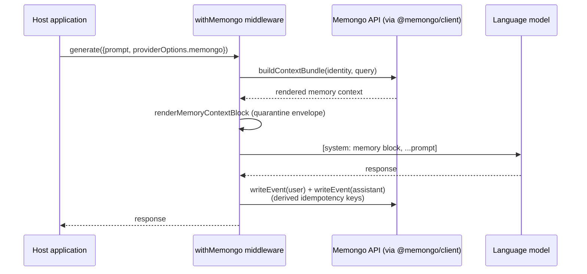

# @memongo/tools

AI SDK integrations for Memongo: drop-in middleware that injects memory context into LLM calls and captures the conversation afterwards, plus a full set of Vercel AI SDK tool definitions. All Memongo traffic routes through [`@memongo/client`](./client.md) — no hand-rolled fetch anywhere in the package.

Source: `packages/tools/src/`.

## The two middlewares

Both middlewares share one core (`createMemongoMiddlewareCore` in `packages/tools/src/middleware-core.ts`), which does two things per LLM call:

1. **Inject (before the call):** fetch a context bundle and prepend it as a system message, rendered through the quarantine envelope in `packages/tools/src/memory-context.ts`.
2. **Capture (after the call):** write the user prompt and assistant response back as conversation events (`/v1/write-event`) with derived idempotency keys, so a retried capture is deduped by the server.

Shared behaviors (P1.4/P1.5):

- Capture is **awaited** so a serverless invocation cannot be frozen before the write lands; it never throws into the host LLM call.
- Failures degrade exactly like silent mode (inject → no context, capture → dropped) but are reported via `onError(err, phase)` where phase is `"inject"` or `"capture"`; without a handler, **one** `console.warn` is emitted per middleware instance, never per request.
- A canonical-identity cache (`packages/tools/src/cache-identity.ts`) keys cached bundles on the resolved tenant identity; when neither constructor defaults nor the request carry any of `userId`/`agentId`/`sessionId`, the cache is bypassed (no safe tenant boundary exists to key on).
- `MemongoCoreOptions`: `apiUrl`, `apiKey`, default `userId`/`agentId`/`scope`/`sessionId`/`mode` (`"wake-up"` | `"full"`), `capture` (default on), `onError`.

### Vercel AI SDK — withMemongo

`withMemongo(model, options)` in `packages/tools/src/vercel/index.ts` wraps a `LanguageModelV2` with `wrapLanguageModel` middleware:

- `transformParams` — extracts the last user message, fetches the context bundle, prepends the rendered memory block as a system message.
- `wrapGenerate` — after `doGenerate` resolves, captures both sides of the turn.
- `wrapStream` — captures the user message before streaming starts, then collects `text-delta` chunks and captures the assistant text in the `TransformStream` `flush()` (the stream equivalent of an `onEnd` callback, which AI SDK v5 middleware lacks). The user query is passed as the hash source so both roles of one logical turn share one turn id.

**Per-request identity** comes from `providerOptions.memongo` — `{ agentId?, userId?, scope?, sessionId?, mode? }` — read on every call, never from module closures, so concurrent Fluid Compute invocations for different tenants sharing one warm process can never be keyed together. Scope values are validated against the canonical `MEMORY_SCOPE_VALUES` from `@memongo/lib`.

### OpenAI — createOpenAIMiddleware

`createOpenAIMiddleware(client, options)` in `packages/tools/src/openai/index.ts` wraps any OpenAI-shaped client via nested `Proxy`s (`client` → `chat` → `completions` → `create`) — no runtime `openai` dependency required. Every `chat.completions.create()` gets the injected memory system message; non-streaming calls capture user + assistant afterwards, streaming calls capture the user message only (stream chunks are not interceptable via Proxy). The chat-completions shape has no `providerOptions` channel, so identity comes from the constructor options per middleware instance.

### Prompt-injection defense — memory-context.ts

Retrieved memory is **untrusted input**: it can contain text that looks like instructions. `renderMemoryContextBlock` wraps it in a quarantine envelope (issue #29):

- A preamble instructs the model to treat the block as REFERENCE DATA ONLY.
- Delimiters `<<<BEGIN_UNTRUSTED_MEMORY_CONTEXT>>>` / `<<<END_UNTRUSTED_MEMORY_CONTEXT>>>` bound the content.
- Stored content is sanitized in a single linear pass: runs of `<` or `>` are broken with zero-width spaces so no `<<<`/`>>>` — and therefore no delimiter — can survive or re-form, while single angle brackets (common in code) stay readable. Deleting whole delimiters would be O(n^2) and reconstructable on adversarial input.

## Tool definitions — createMemongoTools

`createMemongoTools(client)` in `packages/tools/src/index.ts` returns 27 Vercel AI SDK `tool()` definitions mirroring the API surface: `memongo_search`, `memongo_search_kb`, `memongo_read_file`, `memongo_add`, `memongo_write_event`, `memongo_profile`, `memongo_build_context_bundle`, `memongo_recall_conversation`, lifecycle get/update/delete/history, `memongo_procedure_outcome`, `memongo_memory_feedback`, `memongo_status`, `memongo_chain_trace`, `memongo_novelty_scan`, `memongo_consolidate`, `memongo_self_edit`, `memongo_state_unified`, `memongo_benchmark_ingest`, `memongo_import_conversations`, admin access trends/summaries/traces, and job list/get.

Every schema is zod; the scope field is `z.enum(MEMORY_SCOPE_VALUES_TUPLE)` derived from the single contract source in `@memongo/lib` (previously re-typed at six sites in this file). Lifecycle handles are a discriminated union (`structured` | `procedure`) with full identity fields (`agentId`, `scope`, `scopeRef`, `revision`, `state`, validity window), and patch schemas `.refine()` that at least one field is present.

## Key files

| File | Role |
|------|------|
| `packages/tools/src/index.ts` | `createMemongoTools` — 27 tool definitions with zod schemas; middleware re-exports |
| `packages/tools/src/vercel/index.ts` | `withMemongo` — Vercel AI SDK middleware |
| `packages/tools/src/openai/index.ts` | `createOpenAIMiddleware` — OpenAI client proxy middleware |
| `packages/tools/src/middleware-core.ts` | Shared inject/capture core with `onError` observability |
| `packages/tools/src/memory-context.ts` | Prompt-injection quarantine envelope |
| `packages/tools/src/cache-identity.ts` | Canonical-identity cache shared by both middlewares |

**Top contributors:** Rom Iluz (11 commits).

## Related pages

- [Packages overview](./index.md)
- [@memongo/client](./client.md) — the transport both middlewares use
- [Auth and security](../security.md) — the prompt-injection defense in context
- [REST API reference](../api/index.md) — the endpoints the tools call
