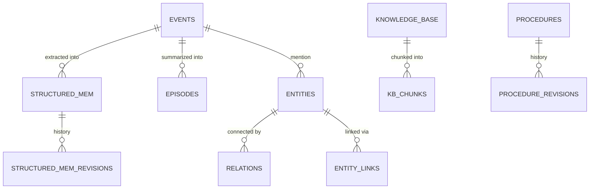

# Data models

Memongo stores everything in one MongoDB database (default name `memongo`). Collection creation, indexes, Atlas Search/Vector Search index definitions, and `$jsonSchema` validators all live in `packages/memory-engine/src/mongodb-schema.ts` (~4,591 LOC).

## Collections

The full collection set (`mongodb-schema.ts:1490`), each name prefixed with the configured collection prefix:

| Collection | Contents |
|------------|----------|
| `chunks` | Conversation/session chunks (polymorphic validator, `mongodb-schema.ts:686`) |
| `session_chunks` | Raw session window chunks |
| `files` | File metadata for the KB file path |
| `meta` | Store metadata |
| `knowledge_base` | KB documents |
| `kb_chunks` | KB chunks (per-doc via `docId`) |
| `structured_mem` | Structured memories (current revision) |
| `structured_mem_revisions` | Structured-memory revision history |
| `procedures` | Procedural memories |
| `procedure_revisions` | Procedure revision history |
| `events` | Conversation/memory events |
| `entities` | Graph entities |
| `relations` | Graph relations (8 relation types) |
| `entity_links` | Entity↔memory links |
| `episodes` | Conversation-window summaries |
| `ingest_runs` / `projection_runs` | Ingest and projection run bookkeeping |
| `query_cache` | Cached query results |
| `memory_mutations` | Mutation audit trail |
| `lane_coverage` | Per-lane coverage telemetry (drives planner lane-skipping) |
| `consolidation_runs` | Dreamer pipeline run records |
| `recall_traces` | Recall traces (surfaced via `/v1/admin/traces`) |
| `memory_jobs` | Durable job queue (leases, heartbeats, dead-letter) |
| `memory_quarantine` | Quarantined memories |
| `memory_evidence` | Optional evidence mirror (only when evidence-mirror mode is enabled) |
| `relevance_runs` / `relevance_artifacts` / `relevance_regressions` | Relevance telemetry and benchmark results |

Time-series collections are created separately because they do not support `$jsonSchema` (`mongodb-schema.ts:1548`).

## Validators and indexes

- **Validators:** `VALIDATED_COLLECTIONS` (`mongodb-schema.ts:1442`) maps base names to `$jsonSchema` validators applied at creation with `validationLevel: "moderate"`. On MongoDB ≥ 8.1 the action is `errorAndLog` (rejections also recorded in the mongod log); older servers use plain `error`.
- **Indexes:** ~90 standard indexes across events, entities, relations, structured memory, KB, and relevance collections (compound shapes for agentId+scope+time access patterns, TTL on `updatedAt`, text indexes as fallback), plus up to 14 Atlas Search/Vector Search indexes. Index shapes are version-gated through the capability registry — see [Configuration](configuration.md#capability-detection-and-version-gating).

## The six memory types

1. **Events** (`events`) — the append-only substrate: conversations, tool calls, documents, agent actions. Carry `role`, body, timestamps, scope, provenance, metadata.
2. **Structured memories** (`structured_mem` + revisions) — typed `type`+`key` facts (e.g. `fact`, `preference`, `decision`) with revision semantics; current value and full history.
3. **Episodes** (`episodes`) — summaries over conversation windows, built when trigger thresholds fire (`packages/memory-engine/src/mongodb-episodes.ts`).
4. **Graph entities** (`entities` + `entity_links`) — extracted entities linked back to source memories.
5. **Graph relations** (`relations`) — typed edges between entities (8 relation types; degrade to `mentioned_with` co-occurrence at weight 0.2 when no enrichment provider is configured — see `docs/adr/0001-*.md`).
6. **KB documents and chunks** (`knowledge_base` + `kb_chunks`) — ingested documents with token-bounded chunking and overlap.

## Fields every memory carries

- **`agentId`** — partition key; present on every memory type
- **Bitemporal fields** — `validAt` (required going forward) and `invalidAt` (omitted = still valid); see [Background](../background/index.md#why-bitemporal) and `packages/memory-engine/src/mongodb-bitemporal.ts`
- **Trust metadata** — confidence and provenance (source event IDs), consumed by `packages/memory-engine/src/mongodb-trust.ts`
- **Scope** — one of the six canonical scopes below

## Scopes

`MEMORY_SCOPE_VALUES` in `packages/lib/src/contract.ts:23` is the single contract source; the API auth layer, route validation, OpenAPI document, and MCP/zod schemas all validate against this one array so the layers cannot disagree (issue #57):

```
session · user · agent · workspace · tenant · global
```

## Multi-tenancy layout

Two modes, controlled by `MEMONGO_MONGODB_COLLECTION_PREFIX` (see [Configuration](configuration.md)):

- **Per-agent collection prefix (default)** — physical isolation: each agent gets its own prefixed copy of the collection set.
- **Shared collections** — one collection set with `agentId` as the discriminator (the MongoDB-recommended multi-tenant pattern), selected by leaving the prefix empty.



## Related pages

- [Configuration](configuration.md)
- [Background](../background/index.md) — why bitemporal, why the lane model
- [REST API](../api/index.md) — how these models surface over HTTP
