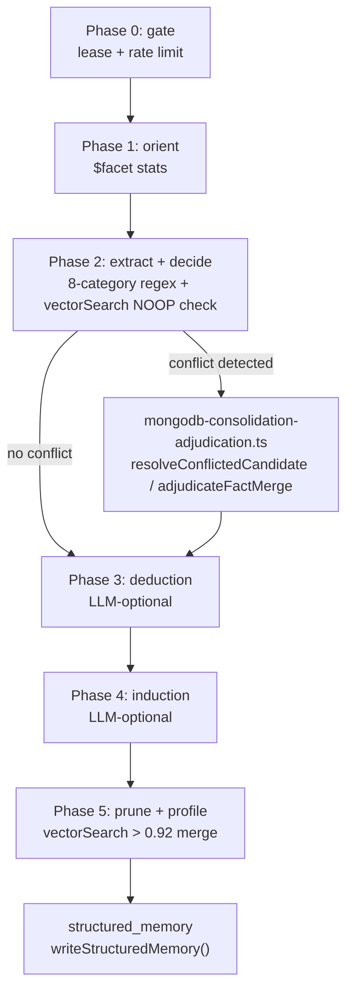

# Consolidation and novelty

Active contributors: Rom Iluz

Two offline processes turn raw conversation events into durable memory: the "Dreamer" consolidation agent, which merges, promotes, and invalidates facts, and the novelty scanner, which flags which stored events were surprising. Both run outside the write path described in [Architecture](../overview/architecture.md), triggered by the [job queue](jobs-telemetry-and-sync.md) rather than by a caller waiting on a response. See [Glossary](../overview/glossary.md) for the one-line definitions of "consolidation (Dreamer)" and "novelty detection."

## Key source files

| File | Role |
|---|---|
| `packages/memory-engine/src/mongodb-consolidator.ts` | The Dreamer's 5-phase pipeline, pattern-based fact extraction, gate/lease logic |
| `packages/memory-engine/src/mongodb-consolidation-adjudication.ts` | LLM-assisted conflict resolution and near-duplicate merge adjudication |
| `packages/memory-engine/src/mongodb-consolidation-reasoning.ts` | Deduction and induction over existing facts (LLM-optional) |
| `packages/memory-engine/src/mongodb-novelty.ts` | Per-observation k-NN surprisal scoring via `$vectorSearch` |
| `packages/memory-engine/src/mongodb-contradiction.ts` | LLM contradiction detection between a new fact and existing facts |
| `packages/memory-engine/src/mongodb-derived-memory.ts` | Extraction and promotion of structured-memory/procedure candidates straight from events |

## The Dreamer: a 5-phase pipeline

`consolidateMemory()` in `packages/memory-engine/src/mongodb-consolidator.ts` runs the whole pipeline for one `(agentId, scope, scopeRef)` identity and is exposed as `POST /v1/consolidate` (per `docs/platform/PLATFORM-README.md`):

- **Phase 0 — Gate**: an atomic lease claim (mirrors `claimMemoryJob` in `packages/memory-engine/src/mongodb-memory-jobs.ts`) plus a rate limiter (`minIntervalMs`, default 1 hour), so two replicas never run consolidation for the same identity concurrently and runs don't fire more often than needed.
- **Phase 1 — Orient**: a single `$facet` aggregation gathers unprocessed-event counts, role breakdown, and top scopes to size the run.
- **Phase 2 — Extract + Decide**: each unprocessed event is matched against 8 regex categories (`decision`, `preference`, `fact`, `contact`, `todo`, `milestone`, `problem`, `emotional` — see `matchPatterns()`), then an `$vectorSearch` NOOP check (similarity > 0.85) skips promoting a near-duplicate of an already-stored fact.
- **Phase 3 — Deduction**: `deduceFactsFromMemories()` in `mongodb-consolidation-reasoning.ts` asks an LLM which new facts strictly follow from existing ones. Stub (returns nothing) when no enrichment provider is configured.
- **Phase 4 — Induction**: `induceFactsFromMemories()`, same file, asks for generalizations supported by two or more facts. Same LLM-optional stub behavior.
- **Phase 5 — Prune + Profile**: a stricter `$vectorSearch` pass (similarity > 0.92) merges near-duplicate structured-memory entries, folding `sourceEventIds` via `foldSourceEventIds()` so the merged fact keeps every source event as provenance.

Promoted facts are written through `writeStructuredMemory()` (owned by [Structured memory and procedures](structured-memory-and-procedures.md) — this page does not re-explain the lifecycle states). Processed events are marked with `dreamerProcessedAt` + `dreamerRunId` via `markEventsDreamerProcessed()`, a separate marker from episode consolidation's `markEventsConsolidated()` because Dreamer runs are not tied to an `episodeId`.

### Rule-based extraction, not an LLM parser

The 8 category patterns in `CATEGORY_PATTERNS` (`packages/memory-engine/src/mongodb-consolidator.ts`) are conservative regexes tuned so false negatives are acceptable but false positives are not — for example the `decision` pattern matches both singular and first-person-plural phrasing (`"I decided"` / `"we decided"`) because the plural form showed up far more often in practice. A companion `DERIVABLE_PATTERNS` quality filter (`isDerivableFromContext()`) throws out candidates that just restate agent-visible context (`"uses TypeScript"`, `"runs on Node 20"`) rather than genuine memory.

Weighting: candidates are scored by a mix of novelty and importance (`DEFAULT_NOVELTY_WEIGHT = 0.4`, `DEFAULT_IMPORTANCE_WEIGHT = 0.6`, access weight defaulted to 0 because access counts are structurally near-zero at write time) against a `DEFAULT_MIN_COMBINED_SCORE` floor of 0.15. That floor is explicitly a quality gate, not a recency filter — decay belongs in retrieval ranking (see [Retrieval and search](retrieval-and-search.md)), not write eligibility.

## Conflict resolution and adjudication

`mongodb-consolidation-adjudication.ts` covers two LLM-assisted seams inside Phase 2:

- **`resolveConflictedCandidate()`**: when a promotion candidate conflicts with an existing fact, this resolves instead of silently skipping — it calls `detectContradictions()` (below), invalidates the losing side via `invalidateContradictedFacts()`, and returns whether the caller should re-evaluate the candidate.
- **`adjudicateFactMerge()`**: for fact pairs whose similarity falls in the band `[0.75, 0.92]` (between the NOOP gate and the hard prune threshold), asks the LLM for a `MERGE`/`NO_MERGE` verdict and, on merge, a synthesized union statement that must not drop information from either side.

Both functions degrade to the conservative outcome (unresolved / `NO_MERGE`) on any LLM failure or malformed JSON — a missing or misbehaving enrichment provider never breaks a consolidation run.

## Contradiction detection

`packages/memory-engine/src/mongodb-contradiction.ts` handles the case same-key overwrite can't: two facts under *different* keys that are mutually exclusive (`"lives in Berlin"` vs. `"lives in London"`). `detectContradictions()` sends a new fact plus up to 40 existing active facts (same tenant only) to the LLM and asks which existing keys the new fact makes false — never flags facts that merely differ or add detail. `invalidateContradictedFacts()` then expires the losing facts through `invalidateStructuredMemoryByHandle()` (state flip, `validTo` close, revision bump, `invalidatedBy` provenance).

## Novelty (surprisal) scoring

`scanNovelty()` in `packages/memory-engine/src/mongodb-novelty.ts` is exposed as `POST /v1/novelty-scan`. Despite `docs/platform/PLATFORM-README.md` describing it as "centroid distance scoring," the actual implementation is per-observation k-NN surprisal, not a single centroid comparison:

1. Fetch up to 30 candidate events for the agent (most recent first).
2. For each candidate, run `$vectorSearch` using that event's own body as the query, requesting its k nearest neighbors (default k = 5).
3. Exclude the candidate from its own neighbor list (self-exclusion).
4. Average the `vectorSearchScore` of the k non-self neighbors → `avgSimilarity`.
5. `surprisal = 1 - avgSimilarity` — an event whose neighbors are all dissimilar (isolated in embedding space) scores highest.
6. Sort descending, return the top `limit`.

`computeCentroid()` still exists in the file as a general-purpose helper for external callers but is not used by the k-NN novelty path itself. The scan degrades gracefully when `mongot` is unavailable, returning `{ events: [], scannedCount: 0, error: "mongot_unavailable" }` instead of throwing.

## Derived memory: promoting raw events

`packages/memory-engine/src/mongodb-derived-memory.ts` is the extraction layer that runs per-event (not batched like the Dreamer) as part of the background-enrichment pipeline in [Architecture](../overview/architecture.md#write-and-background-enrichment):

- `extractStructuredCandidatesFromEvent()` — regex/heuristic extraction of structured-memory candidates from a single event body, tagged with a `StructuredPromotionPolicy` of either `"immediate"` or `"requires-reinforcement"`.
- `extractLlmStructuredCandidates()` — the LLM-backed counterpart, used when an enrichment provider is configured.
- `extractProcedureCandidatesFromEvent()` — pulls out reusable multi-step procedure candidates.
- `resolveStructuredCandidatesForPromotion()` — applies temporal refinement (`refineCandidatesValidTime()`, see [Temporal and bitemporal](temporal-and-bitemporal.md)) and contradiction checks (`invalidateContradictedFacts()`) before a candidate is actually written.
- `promoteDerivedMemoryFromEvent()` — the entry point the job queue calls: extracts, resolves, and writes both structured facts and procedures for one event, recording a projection run via `recordProjectionRun()` for observability.

This is the mechanism that feeds structured memory before the Dreamer ever runs — the Dreamer's Phase 2 pattern matching operates on events that per-event derivation may have already skipped or already promoted, which is why its NOOP/prune vector-search checks exist: to avoid re-promoting the same fact twice. For what happens to a promoted candidate afterward (lifecycle states, reinforcement, revision history), see [Structured memory and procedures](structured-memory-and-procedures.md).
