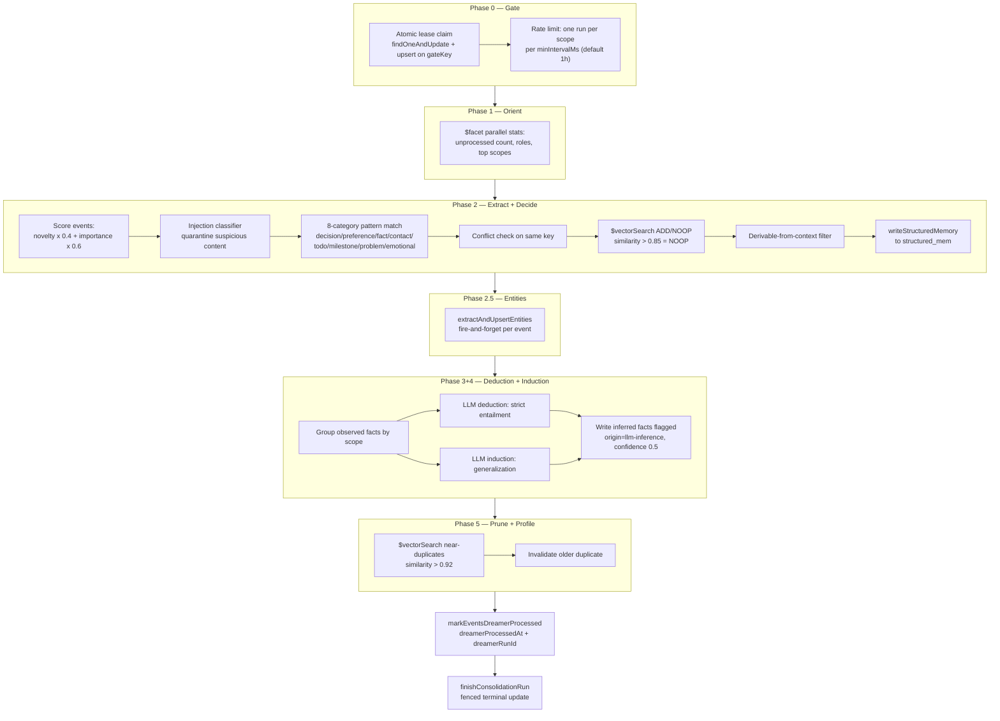

# Consolidation (the Dreamer)

The consolidation pipeline — internally called the **Dreamer** — is the offline process that turns raw conversation events into durable structured memory. It runs as a background, lease-gated job: it scans unprocessed events, scores them for novelty and importance, extracts candidate facts with conservative pattern matching, checks each candidate against existing memory with vector similarity, optionally derives new facts with LLM reasoning, and prunes near-duplicates. The entry point is `consolidateMemory` (`packages/memory-engine/src/mongodb-consolidator.ts:331`).

## The five phases

## Phase 0 — the TOCTOU gate

Consolidation must never run twice concurrently for the same scope, and must not re-run more often than `minIntervalMs` (default 1 hour). Both invariants are enforced atomically in MongoDB — the classic time-of-check/time-of-use race is closed by making the check and the claim one operation:

- One gate document per `(agentId, scope, scopeRef)` triple, keyed by a deterministic `gateKey` (`packages/memory-engine/src/mongodb-consolidator.ts:289`).
- The claim is a single `findOneAndUpdate` with `upsert: true`, matching only gate docs that are completed/failed beyond the rate-limit window or running with an expired lease. Two replicas racing the claim collide on the unique gate index (E11000); the loser reads the gate and returns an empty result.
- Lease timestamps use server time (`$$NOW`) inside an aggregation-pipeline update so cross-replica clock skew cannot shorten or stretch a lease. Default lease is 15 minutes (`DEFAULT_CONSOLIDATION_LEASE_MS`), sized to exceed the worst-case run.
- A crashed run self-heals: its lease expires and the next claim succeeds. Legacy pre-lease run documents are invisible to the gate, and every phase is idempotent, so one extra run after upgrade is harmless.
- **Fenced completion** — `finishConsolidationRun` (`packages/memory-engine/src/mongodb-consolidator.ts:303`) writes the terminal state only if the update still matches the run's `runId`, `leaseToken`, and an unexpired lease. A stale runner whose lease was re-claimed matches zero documents and cannot overwrite its successor's gate state.

## Phase 1 — Orient

A single `$facet` aggregation computes unprocessed-event count, event counts by role, and top scopes by last activity — bounded to the timestamp window of the current batch so the scan does not grow linearly with history. Stats are observability-only; failure degrades to running without them.

## Scoring — novelty and importance

Before extraction, each event gets a combined score:

- **Novelty** — `scanNovelty` (`packages/memory-engine/src/mongodb-novelty.ts:83`) computes per-observation k-NN surprisal: for each candidate event, `$vectorSearch` finds its k nearest neighbors (default 5, max 30 candidates), excludes the event itself, and sets `surprisal = 1 - avgSimilarity`. Isolated events score highest. It degrades gracefully to an empty report when mongot is unavailable; unscored events are treated as novelty 0.5 (`UNSCORED_NOVELTY`), never zero, so a capped scan cannot silently discard events.
- **Importance** — the event's own `importance` field clamped to [0,1] (default 0.5). An explicit importance of 0 is a caller veto: the event is never promoted.
- **Combined score** — `0.4 * novelty + 0.6 * importance` (access weight defaults to 0 because batch-relative access carries no signal at write time). Events below `minCombinedScore` (default 0.15) are dropped. Age is deliberately not a gate: decay belongs to retrieval ranking, not write eligibility.

## Phase 2 — Extract and decide

For each surviving candidate:

1. **Injection defense** — `classifyInjection` screens the content; injection-likely candidates are written to the `memory_quarantine` collection with `status: "pending-review"` and skipped before any extraction or write.
2. **Pattern match** — `matchPatterns` (`packages/memory-engine/src/mongodb-consolidator.ts:159`) checks 8 conservative category regexes (decision, preference, fact, contact, todo, milestone, problem, emotional). The rule is false-negatives-OK, false-positives-not-OK. No match means no promotion.
3. **Conflict check** — an existing structured memory with the same type/key blocks promotion and increments `conflictsResolved`.
4. **ADD/NOOP decision** — a `$vectorSearch` against `structured_mem_vector` (same-scope filter) finds similar memories; a top score above 0.85 (`SIMILARITY_THRESHOLD_NOOP`) makes the candidate a NOOP. Search failure degrades to ADD.
5. **Quality filter** — `isDerivableFromContext` (`packages/memory-engine/src/mongodb-consolidator.ts:193`) drops facts derivable from the repo itself ("uses TypeScript", "is a monorepo").
6. **Promotion** — survivors are written through `writeStructuredMemory` with confidence `agent_extracted`, the candidate event's own scope (never the caller's), and the source event ID as provenance. Scope mismatches between options and candidate are skipped (or thrown in benchmark-strict mode) to prevent cross-scope writes.

Phase 2.5 then runs `extractAndUpsertEntities` for every processed event, fire-and-forget: entity extraction failures never block consolidation.

## Phases 3 and 4 — LLM deduction and induction

When an enrichment LLM provider is configured (`resolveEnrichmentProvider`), the Dreamer derives new facts from existing observed facts (`packages/memory-engine/src/mongodb-consolidation-reasoning.ts`):

- **Deduction** (`deduceFactsFromMemories`, line 139) — strict entailment only: facts that must be true given the inputs.
- **Induction** (`induceFactsFromMemories`, line 151) — probable generalizations supported by at least two facts.
- Facts are grouped by `(scope, scopeRef)` and reasoning happens strictly within a group, so an inference derived from one tenant's data can never surface in another's. Prior inferences are excluded from inputs to prevent inference-on-inference compounding.
- Candidates that restate an observed fact (substring check either way) are dropped.
- Survivors are written via `buildInferredMemoryEntry` (line 178) flagged as unreinforced inference: `provenance.origin: "llm-inference"`, confidence 0.5 (below the observed-fact floor), `reinforcementCount: 0`, and tags `["inferred", kind]`. Future observed evidence raises their standing through normal reinforcement.
- With no LLM configured, both phases log a skip — the historical behavior. Every LLM failure degrades to an empty result rather than breaking the run. Input is capped at 40 facts (`REASONING_MAX_FACTS`) to bound token cost.

A companion module, `detectContradictions` (`packages/memory-engine/src/mongodb-contradiction.ts:63`), asks the LLM which existing facts a new fact makes false (Graphiti/mem0-style invalidation of mutually exclusive facts under different keys); it is used by the derived-memory write path rather than the Dreamer loop itself.

## Phase 5 — Prune near-duplicates

The 50 most recently updated facts in scope are pairwise-checked with `$vectorSearch`; any pair scoring above 0.92 (`SIMILARITY_THRESHOLD_PRUNE`) keeps the newer document and sets the older one's `state` to `invalidated`. The filter and a belt-and-suspenders recheck both pin the comparison to the fact's own scope, so a master-key run can never invalidate another tenant's fact.

## Acknowledgment and run records

- Only events whose candidate processing completed durably are acknowledged: `markEventsDreamerProcessed` (`packages/memory-engine/src/mongodb-consolidator.ts:207`) sets `dreamerProcessedAt` and `dreamerRunId` on them. Failed events stay unprocessed and are retried by the next run. (This is distinct from `markEventsConsolidated`, which is the episode-consolidation path and requires an episode ID.)
- The run document in `consolidation_runs` records `eventsProcessed`, `factsPromoted`, `factsInferred`, `factsPruned`, `conflictsResolved`, and duration. If any candidate failed, the run is marked `failed` with the first error, and the error is rethrown.

## How it is triggered

Consolidation is invoked through the API (`/v1/consolidate`) and can be scheduled as a `consolidation`-type [memory job](job-queue.md). The manager's background worker pattern (claim, heartbeat, fenced completion) and the Dreamer's Phase-0 gate share the same lease protocol built on `$$NOW` and durable majority writes.

## Related modules

- `packages/memory-engine/src/mongodb-novelty.ts` — surprisal-based novelty scan
- `packages/memory-engine/src/mongodb-consolidation-reasoning.ts` — deduction/induction prompts and inferred-entry builder
- `packages/memory-engine/src/mongodb-contradiction.ts` — LLM contradiction detection for the write path
- `packages/memory-engine/src/mongodb-contiguous-merge.ts` — same-session chunk merge (retrieval-side complement)
- `packages/memory-engine/src/mongodb-tiered-summary.ts` — 3-tier summary prompts used by episode consolidation
- `packages/memory-engine/src/mongodb-structured-memory.ts` — `writeStructuredMemory`, the canonical write target

## Related pages

- [Systems overview](index.md)
- [Memory model](memory-model.md) — the structured memories the Dreamer produces
- [Job queue](job-queue.md) — the lease protocol the gate mirrors
- [Retrieval pipeline](retrieval-pipeline.md) — where consolidated facts are read back
- [Core engine package](../packages/memory-engine/index.md)
