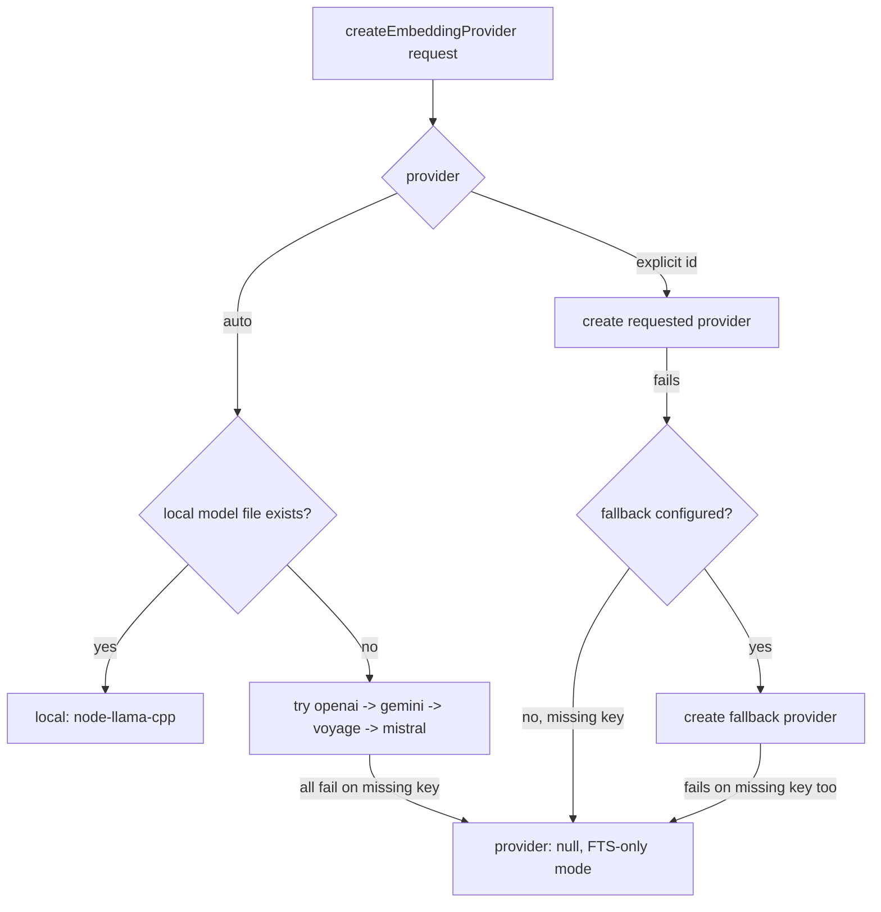

# Embeddings and providers

Active contributors: Rom Iluz

Memongo turns text (and, for one provider, images) into vectors through a pluggable embedding abstraction, so the product is not locked to a single vendor. `packages/memory-engine/src/embeddings.ts` defines the `EmbeddingProvider` interface and `createEmbeddingProvider()` factory; every concrete provider (OpenAI, Voyage, Gemini, Mistral, Ollama, and a fully local option) implements the same shape and is selected by config or auto-detection.

## The `EmbeddingProvider` contract

`packages/memory-engine/src/embeddings.ts` defines:

```ts
type EmbeddingProvider = {
  id: string
  model: string
  maxInputTokens?: number
  embedQuery: (text: string) => Promise<number[]>
  embedBatch: (texts: string[]) => Promise<number[][]>
  embedBatchInputs?: (inputs: EmbeddingInput[]) => Promise<number[][]>
}
```

`createEmbeddingProvider()` accepts an `EmbeddingProviderRequest` (`"openai" | "local" | "gemini" | "voyage" | "mistral" | "ollama" | "auto"`) plus a `fallback` provider. In `"auto"` mode it tries a local `.gguf` model first (only if `local.modelPath` points at an existing file, since `hf:`/`http(s):` paths are never auto-selected), then walks `openai`, `gemini`, `voyage`, `mistral` in that order — Ollama is deliberately excluded from auto-selection because it assumes a local server is running. If every remote provider fails only due to a missing API key, `createEmbeddingProvider()` returns `{ provider: null, providerUnavailableReason }` rather than throwing, which lets the caller degrade to full-text-search-only mode instead of hard-failing.

For an explicit (non-`"auto"`) request, a configured `fallback` provider is tried if the primary fails; if both fail on a missing API key the result again degrades to `provider: null` instead of throwing.

## Provider comparison

| Provider | Source file | Auth / env | Default model | Notes |
|---|---|---|---|---|
| OpenAI | `packages/memory-engine/src/embeddings-openai.ts` | Bearer key via `resolveRemoteEmbeddingBearerClient` (`OPENAI_API_KEY` or config) | `text-embedding-3-small` | Per-model token caps (`text-embedding-3-small`/`-large`: 8192, `ada-002`: 8191); batches in one HTTP call via the shared remote provider. |
| Voyage | `packages/memory-engine/src/embeddings-voyage.ts` | Bearer key; base URL depends on key shape | `voyage-4-large` | An Atlas Model API key (prefix `al-`) is routed to `https://ai.mongodb.com/v1` instead of Voyage's own API, because Voyage's endpoint rejects MongoDB-issued keys with 403 (`resolveVoyageBaseUrlForKey`). Sends `input_type: "query"` or `"document"` depending on call site. |
| Gemini | `packages/memory-engine/src/embeddings-gemini.ts` | `x-goog-api-key` header (or a bearer token if the configured "key" is a JSON blob with a `token` field) | `gemini-embedding-001` | Only provider with true batch embedding (`batchEmbedContents`) and multimodal input (inline image/audio parts). The `gemini-embedding-2-preview` model additionally accepts `outputDimensionality` (768/1536/3072) and extended task types (`RETRIEVAL_QUERY`, `CLASSIFICATION`, etc.). |
| Mistral | `packages/memory-engine/src/embeddings-mistral.ts` | Bearer key (`MISTRAL_API_KEY` or config) | `mistral-embed` | Thin wrapper around the shared remote provider; no per-model token cap table. |
| Ollama | `packages/memory-engine/src/embeddings-ollama.ts` | Optional bearer token; defaults to unauthenticated local server at `http://127.0.0.1:11434` | `nomic-embed-text` | `/api/embeddings` accepts one prompt per call, so `embedBatch` issues one HTTP request per text via `Promise.all` rather than a true batch request. Excluded from `"auto"` provider selection. |
| Local (`node-llama-cpp`) | `packages/memory-engine/src/node-llama.ts`, local-provider code in `embeddings.ts` | None — runs in-process | `hf:ggml-org/embeddinggemma-300m-qat-q8_0-GGUF/...` (`DEFAULT_LOCAL_MODEL`) | Lazy-imports the optional `node-llama-cpp` dependency so startup stays light when local embeddings are unused; loads the model and an embedding context once and reuses it. If the dependency is missing, `formatLocalSetupError()` returns actionable remediation text (Node version, reinstall, `pnpm approve-builds`, or switch to a remote provider). |

All model name overrides accept a provider-prefixed form (e.g. `openai/text-embedding-3-large`, `voyage/voyage-3`) that `packages/memory-engine/src/embeddings-model-normalize.ts`'s `normalizeEmbeddingModelWithPrefixes()` strips before use.

## Shared remote-provider plumbing

OpenAI, Voyage, and Mistral all funnel through the same helpers instead of duplicating HTTP logic:

- `packages/memory-engine/src/embeddings-remote-client.ts` — `resolveRemoteEmbeddingBearerClient()` resolves the API key (explicit `remote.apiKey` config wins over the provider's own env var), base URL, and SSRF policy shared across bearer-auth providers.
- `packages/memory-engine/src/embeddings-remote-provider.ts` — `createRemoteEmbeddingProvider()` builds the `EmbeddingProvider` object (`embedQuery`/`embedBatch`) around a single `POST {baseUrl}/embeddings` call.
- `packages/memory-engine/src/embeddings-remote-fetch.ts` — `fetchRemoteEmbeddingVectors()` performs the HTTP call and retry. Gemini and Ollama implement their own request shapes directly (batch endpoint, single-prompt endpoint) but still normalize vectors the same way.

Gemini and Voyage each have their own request builders (`buildGeminiEmbeddingRequest`, the Voyage `embed()` closure) because their payload shapes and auth headers differ enough that sharing wouldn't simplify anything.

## Input limits, retries, and vector hygiene

- `packages/memory-engine/src/embedding-input-limits.ts` estimates UTF-8 byte length as a conservative proxy for token count (`token_count <= utf8_byte_length` always holds) and provides `splitTextToUtf8ByteLimit()`, a binary-search splitter that respects surrogate pairs, for chunking oversized inputs before they hit a provider's `maxInputTokens`.
- `packages/memory-engine/src/embedding-inputs.ts` defines the `EmbeddingInput` shape (`text` plus optional `parts` for multimodal inline data) shared by every provider that accepts structured input.
- `packages/memory-engine/src/embedding-vectors.ts`'s `sanitizeAndNormalizeEmbedding()` replaces non-finite values with 0 and L2-normalizes every vector before it is stored or compared, so a NaN/Infinity from any provider never reaches a stored document or a `$vectorSearch` query.
- Retries for remote embedding calls (429/5xx/timeout) go through the shared retry helper described in `how-to-contribute/patterns-and-conventions.md` (`packages/lib/src/retry.ts`), wired up in `packages/memory-engine/src/embeddings-remote-fetch.ts` (`fetchRemoteEmbeddingVectors`, 3 attempts, 300–2000 ms backoff with jitter). A separate, simpler exponential-backoff retry lives in `packages/memory-engine/src/mongodb-embedding-retry.ts` (`retryEmbedding()`, 3 attempts, 1 s/2 s/4 s) used by the sync, KB, and structured-memory write paths — it also defines the `EmbeddingStatus` (`success`/`failed`/`pending`) tracked for doctor/coverage reporting.
- `packages/memory-engine/src/embeddings-debug.ts` gates verbose request/response logging behind `MEMONGO_DEBUG_EMBEDDINGS`.

## MongoDB auto-embed vs. calling a provider directly

There are two distinct lanes for getting a vector into MongoDB, and they use different keys:

1. **Direct provider call** — Memongo's own code calls `createEmbeddingProvider()` and sends text straight to OpenAI/Voyage/Gemini/Mistral/Ollama using a normal vendor API key (e.g. a Voyage key prefixed `pa-`).
2. **MongoDB auto-embed** — `mongot` (the search process, see [Glossary](../overview/glossary.md)) calls Voyage on Memongo's behalf using a MongoDB-issued **Atlas Model API key** (`al-...` prefix). `README.md` documents this: set `VOYAGE_API_KEY` to an `al-...` key to enable MongoDB auto-embeddings in the local Docker stack; without it, only paths that don't require auto-embed work, and semantic search returns empty results until the key is set.

`resolveVoyageBaseUrlForKey()` in `packages/memory-engine/src/embeddings-voyage.ts` is what makes the direct-call lane also work with an Atlas Model API key: because `al-...` keys are only valid against MongoDB's endpoint (`https://ai.mongodb.com/v1`) and return 403 against Voyage's own API, the client auto-routes based on the key prefix. This means the same `al-...` key configured for `mongot`'s auto-embed lane also works if Memongo needs to call Voyage directly (for example, the query embedding used before `$vectorSearch`).



## Multimodal input

`packages/memory-engine/src/multimodal.ts` defines which file types Memongo will treat as memory content beyond plain text: images (`.jpg`, `.jpeg`, `.png`, `.webp`, `.gif`, `.heic`, `.heif`) and audio (`.mp3`, `.wav`, `.ogg`, `.opus`, `.m4a`, `.aac`, `.flac`), gated by a `MemoryMultimodalSettings.enabled` flag and a `maxFileBytes` cap (default 10 MiB). `supportsMemoryMultimodalEmbeddings()` restricts actual multimodal embedding to the `gemini-embedding-2-preview` model — every other provider/model combination is text-only, even if a file is classified as image/audio for storage purposes. When multimodal embedding is supported, `embedding-inputs.ts`'s `EmbeddingInputInlineDataPart` (`mimeType` + base64 `data`) carries the binary content into Gemini's `embedBatchInputs`/`embedQuery` request builders in `embeddings-gemini.ts`.

## Local / offline embeddings

`packages/memory-engine/src/node-llama.ts` is a one-line lazy import wrapper (`importNodeLlamaCpp()`) around the optional `node-llama-cpp` dependency. The local provider (built inline in `embeddings.ts`'s `createLocalEmbeddingProvider()`) loads a GGUF model file, creates one shared `LlamaEmbeddingContext`, and reuses it for every `embedQuery`/`embedBatch` call — no network calls, no API key, works fully offline once the model file is downloaded/cached. `canAutoSelectLocal()` only lets `"auto"` mode pick this path when `local.modelPath` is a real file on disk (not an `hf:`/`http(s):` reference that would need to be fetched first).

## Key source files

| File | Role |
|---|---|
| `packages/memory-engine/src/embeddings.ts` | `EmbeddingProvider` type, `createEmbeddingProvider()` factory, auto/fallback selection logic, local provider implementation |
| `packages/memory-engine/src/embeddings-openai.ts` | OpenAI provider and model normalization |
| `packages/memory-engine/src/embeddings-voyage.ts` | Voyage provider, Atlas Model API key routing (`resolveVoyageBaseUrlForKey`) |
| `packages/memory-engine/src/embeddings-gemini.ts` | Gemini provider, batch + multimodal request building, `gemini-embedding-2` dimensionality/task-type support |
| `packages/memory-engine/src/embeddings-mistral.ts` | Mistral provider |
| `packages/memory-engine/src/embeddings-ollama.ts` | Ollama provider, per-prompt HTTP calls |
| `packages/memory-engine/src/embeddings-model-normalize.ts` | Strips provider-prefix forms (`openai/...`) from model names |
| `packages/memory-engine/src/embedding-input-limits.ts` | UTF-8 byte-length estimation and safe text splitting |
| `packages/memory-engine/src/embedding-inputs.ts` | `EmbeddingInput` / `EmbeddingInputPart` types |
| `packages/memory-engine/src/embedding-vectors.ts` | `sanitizeAndNormalizeEmbedding()` |
| `packages/memory-engine/src/embeddings-remote-client.ts` | Shared bearer-auth client resolution (OpenAI/Voyage/Mistral) |
| `packages/memory-engine/src/embeddings-remote-fetch.ts` | Shared HTTP call + retry for bearer-auth providers |
| `packages/memory-engine/src/embeddings-remote-provider.ts` | Shared `EmbeddingProvider` builder for bearer-auth providers |
| `packages/memory-engine/src/embeddings-debug.ts` | `MEMONGO_DEBUG_EMBEDDINGS` logging gate |
| `packages/memory-engine/src/mongodb-embedding-retry.ts` | `retryEmbedding()` and `EmbeddingStatus` for sync/KB/structured-memory write paths |
| `packages/memory-engine/src/node-llama.ts` | Lazy import of the optional `node-llama-cpp` dependency |
| `packages/memory-engine/src/multimodal.ts` | Multimodal file classification, size limits, and Gemini-only multimodal embedding gate |

## Related pages

- [Architecture](../overview/architecture.md) and [Glossary](../overview/glossary.md) for how embeddings fit into the wider system and for the Atlas Model API key / mongot definitions
- [Retrieval and search](retrieval-and-search.md) for how the resulting vectors are consumed by `$vectorSearch` and fused with lexical results
- [Dependencies](../reference/dependencies.md) for the external embedding provider SDKs/APIs as dependencies
- [Memory engine](../packages/memory-engine/index.md) for where embeddings sit among the rest of the engine
