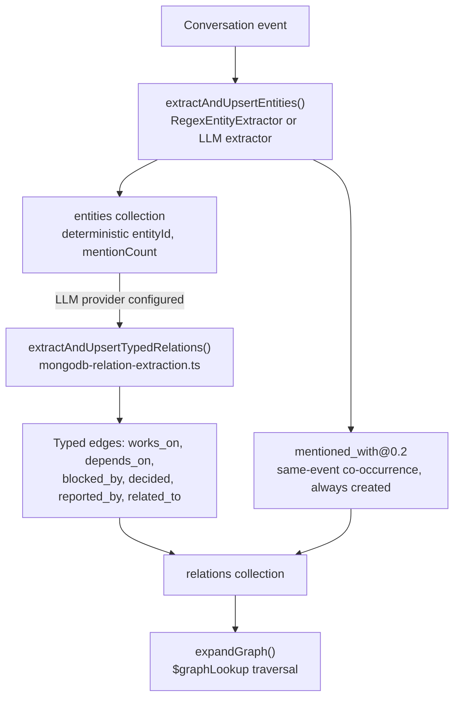

# Graph, episodes, and entities

Active contributors: Rom Iluz

Memongo builds a lightweight knowledge graph (entities and relations) and a summarization layer (episodes) on top of raw conversation events, both stored as plain MongoDB collections. Traversal uses `$graphLookup`; typed edges are LLM-derived and fall back to a co-occurrence heuristic when no LLM is configured. See [Architecture](../overview/architecture.md#write-and-background-enrichment) for where this sits in the background-enrichment pipeline, and [Glossary](../overview/glossary.md) for "episode."

## Key source files

| File | Role |
|---|---|
| `packages/memory-engine/src/mongodb-graph.ts` | Entity/relation types, upsert, `$graphLookup` traversal, LLM typed-relation wiring — the largest engine file at ~2,113 lines |
| `packages/memory-engine/src/mongodb-episodes.ts` | Episode materialization, summarization, and auto-episode triggers |
| `packages/memory-engine/src/mongodb-entity-extractor.ts` | Regex-based entity extraction and LLM extraction prompt/response helpers |
| `packages/memory-engine/src/mongodb-relation-extraction.ts` | LLM typed-relation extraction between already-extracted entities |
| `packages/memory-engine/src/mongodb-context-expansion.ts` | Expands search results with neighboring events from the same session |

## Key abstractions

| Abstraction | Definition | Source |
|---|---|---|
| **Entity** | A named thing (`person`, `org`, `project`, `topic`, `feature`, `issue`, `document`, `location`, `system`, `concept`, `custom`) with aliases, mention count, and a `confidenceSource` of `onboarding`/`learned`/`inferred` | `mongodb-graph.ts:59` (`Entity` type) |
| **RelationType** | The edge vocabulary: `works_on`, `owns`, `depends_on`, `blocked_by`, `decided`, `mentioned_with`, `reported_by`, `related_to` | `mongodb-graph.ts:76` |
| **Relation** | A directed edge between two entities with `weight`, `confidence`, lifecycle `state` (`active`/`invalidated`/`conflicted`), `sourceEventIds`, and temporal fields (`validFrom`, `validTo`, `reviewAt`) | `mongodb-graph.ts:88` |
| **EntityLink** | A same-entity or related-mention link between two entity records (`confirmed_same`, `candidate_same`, `related_mention`), used for entity resolution | `mongodb-graph.ts:112` |
| **Episode** | A summarized group of related conversation events, typed `daily`/`weekly`/`thread`/`topic`/`decision`, with short/medium/long-term summary variants | `mongodb-episodes.ts:25` |

## Entity and relation extraction

`extractAndUpsertEntities()` (`packages/memory-engine/src/mongodb-graph.ts:1500`) is the entry point called from the background enrichment job for each event:

1. Runs an `EntityExtractor` — `RegexEntityExtractor` by default (`packages/memory-engine/src/mongodb-entity-extractor.ts`), or an LLM-backed extractor when an enrichment provider is configured.
2. Computes a deterministic `entityId` per extracted name+type+agent+scope so repeated mentions upsert the same entity document rather than duplicating it.
3. Batch-upserts entities via `bulkWrite`, accumulating `sourceEventIds` and `mentionCount`, and flagging ambiguous person names (`isAmbiguousPersonName()`) for later resolution.
4. Emits `entity-extraction` telemetry and records a projection run (see [Jobs, telemetry, and sync](jobs-telemetry-and-sync.md)) either way.

Entities extracted from the same event are automatically linked with `mentioned_with` edges at a fixed low `weight: 0.2` — a same-message co-occurrence, not an asserted relationship. This is the ceiling the ADR referenced below calls out: without LLM enrichment, `mentioned_with@0.2` is the *only* edge type the graph will ever create automatically.

When an enrichment provider is available, `extractAndUpsertTypedRelations()` (`mongodb-graph.ts:1898`) calls `extractTypedRelations()` (`packages/memory-engine/src/mongodb-relation-extraction.ts`) to ask the LLM for real semantic edges among the event's entities — `works_on`, `depends_on`, `blocked_by`, `decided`, `reported_by`, `related_to`. Two types are deliberately excluded from LLM extraction: `mentioned_with` (the co-occurrence default) and `owns` (writes to `owns` apply destructive write-side exclusivity — a new `owns` edge invalidates every other live `owns` edge to the same target, so it stays a manual/API-only edge to avoid a probabilistic LLM call silently overwriting curated ownership). Extracted edges below `MIN_CONFIDENCE` (0.5) are dropped rather than written as noise.

### The LLM-enrichment-optional design

`docs/adr/0001-substrate-claim-and-score-claim-are-separate.md` states this precisely: "`$graphLookup` is claimable for traversal only. Typed edges come from an LLM (`mongodb-graph.ts:1842`), not from MongoDB, and degrade to `mentioned_with@0.2` co-occurrence when no enrichment provider is configured." In other words, MongoDB provides the graph *substrate* (storage, indexes, traversal); the *semantics* of what an edge means is an LLM feature that degrades gracefully, never a hard dependency. See [Background](../background/index.md) for the fuller ADR context on this substrate/score claim split.

## Graph traversal: `expandGraph()`

`expandGraph()` (`mongodb-graph.ts:951`) walks outward from a root entity using `$graphLookup`:

- Direct relations (depth 0) come from a straight `$match` on `fromEntityId`/`toEntityId`.
- Transitive relations come from `$graphLookup` with `maxDepth` set to `requestedDepth - 1` (since the direct hop already counts as depth 1) and an optional `restrictSearchWithMatch` that keeps traversal inside the same `(agentId, scope, scopeRef)` tenant and respects `asOf` for point-in-time queries (see [Temporal and bitemporal](temporal-and-bitemporal.md)).
- Bidirectional expansion runs the forward and reverse traversals as two *separate* aggregations rather than one `$facet` — `$facet` has a 100MB per-branch memory limit with no disk spill, and a large graph can exceed that and abort the whole aggregation, whereas separate aggregations can each spill to disk independently.
- Results are deduplicated by `(fromEntityId, toEntityId, type)` and annotated with the traversal depth at which they were first reached.

## Episodes

`packages/memory-engine/src/mongodb-episodes.ts` groups raw events into summarized episodes:

- `materializeEpisode()` writes an `Episode` document with a `title`/`summary` from an injected `EpisodeSummarizer` function (LLM in production, a fixed-output mock in tests) plus optional short/medium/long-term summary variants and extracted `topics`.
- The summarizer receives the episode `type` (`daily`, `weekly`, `thread`, `topic`, `decision`) as a parameter so the same event window produces a different summary lens depending on why the episode was created — without it, episodes of different types over the same window would be byte-identical clones crowding out distinct search results.
- `checkAutoEpisodeTriggers()` decides when to auto-materialize an episode without blocking the write path (it must be async since the summarizer is an LLM call). Three triggers: a **session gap** exceeding `sessionGapMinutes` (default 30) between consecutive events, an **event count** exceeding `maxEventsWithoutEpisode` (default 50), or an **explicit** `force: true` call. A best-effort cooldown (`rateLimitMinutes`, default 60) skips the check entirely if an episode was written recently for that scope.
- Episodes mark their source events consolidated via `markEventsConsolidated()` (distinct from the Dreamer's own `dreamerProcessedAt` marker — see [Consolidation and novelty](consolidation-and-novelty.md)).

## Context expansion

`expandSearchContext()` (`packages/memory-engine/src/mongodb-context-expansion.ts`) is a search-time helper, not a graph or episode structure: given ranked search results, it pulls in neighboring events (N-1, N+1 by timestamp within the same session) so a matched chunk arrives with surrounding conversational context. Neighbors are scored at `parentScore * 0.95` and deduplicated by path. It queries the events collection directly (not chunks) because events carry `sessionId` natively and the `idx_events_agent_session_ts` index supports efficient neighbor lookups; the tenant scope (`scope`/`scopeRef`) is required precisely because this direct re-query would otherwise leak neighbors across scopes that share a `sessionId`. See [Retrieval and search](retrieval-and-search.md) for where this fits into the fusion/rerank pipeline.

For the package-level overview of where this file sits among the rest of the engine, see `packages/memory-engine/index.md`.
