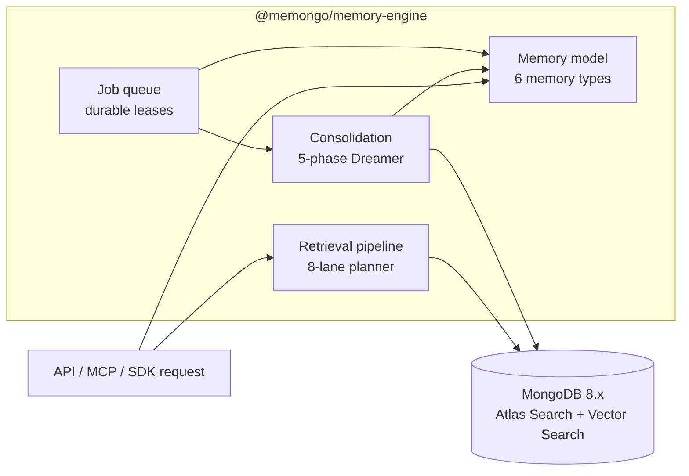

# Engine systems

The memory engine is built from a set of cross-cutting systems that every API call flows through. Each system owns one concern — retrieval, consolidation, storage shape, or background work — and they compose inside `MongoDBMemoryManager` (`packages/memory-engine/src/mongodb-manager.ts`).

## The systems

| System | What it owns | Detail page |
|--------|--------------|-------------|
| Retrieval pipeline | Query intent classification, 8-lane plan, vector + Atlas Search execution, hybrid fusion, reranking, MMR, trust scoring, context bundles | [Retrieval pipeline](retrieval-pipeline.md) |
| Consolidation | The 5-phase "Dreamer": novelty detection, pattern extraction, LLM deduction/induction, near-duplicate merge, run gating | [Consolidation](consolidation.md) |
| Memory model | Six memory types (events, structured memories, episodes, graph entities/relations, KB), salience, temporal scope, bitemporal validity | [Memory model](memory-model.md) |
| Job queue | Durable background jobs with leases, heartbeats, `$$NOW` server time, retries, dead-letter, outbox repair | [Job queue](job-queue.md) |

## How they interact

- **Writes** land as events (memory model), stamp an `extractionJobPendingAt` outbox marker, and the **job queue** drains extraction work (entities, derived memories, typed relations) in the background.
- **Consolidation** reads unprocessed events from the memory model, promotes durable facts into structured memory, and is itself rate-limited by a lease-gated run document that mirrors the job queue's claim protocol.
- **Retrieval** reads across every memory type through a single planner, then fuses, reranks, dedupes, and trust-scores results before returning them or assembling a token-budgeted context bundle.

## Related pages

- [Core engine package](../packages/memory-engine/index.md) — package-level overview of `@memongo/memory-engine`
- [Architecture](../overview/architecture.md) — monorepo layering and data flows
- [Bitemporal memory](../features/bitemporal-memory.md) — the validity model enforced by the memory model
- [Trust scoring](../features/trust-scoring.md) — the 7-dimension scoring applied at the end of retrieval
- [Knowledge base](../features/knowledge-base.md) — KB ingestion and search behind the `kb` retrieval lane
