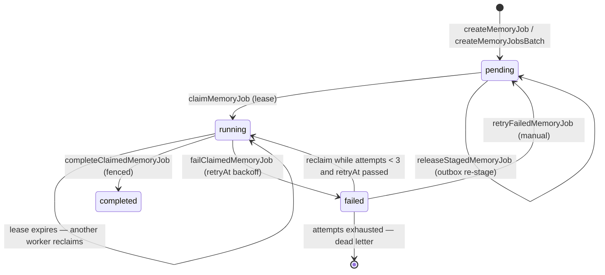

# Job queue

Memongo runs background work — extraction, consolidation, imports — through a durable job queue stored in MongoDB itself (`memory_jobs` collection). There is no external broker: jobs are documents, workers claim them with an atomic lease protocol, and every write uses a durable majority write concern (`w: "majority"`, 5s timeout — `DURABLE_JOB_WRITE_CONCERN`, `packages/memory-engine/src/mongodb-memory-jobs.ts:16`). The primitives live in `packages/memory-engine/src/mongodb-memory-jobs.ts`; the worker loop lives in `MongoDBMemoryManager` (`packages/memory-engine/src/mongodb-manager.ts`).

## Job lifecycle

Statuses: `pending`, `running`, `completed`, `failed`, `cancelled`. The five job types (`MemoryJobType` in `packages/memory-engine/src/types.ts`) are `consolidation`, `extraction`, `import`, `materialization`, and `enrichment`; the extraction type is the one driven continuously by the manager's background worker.

## The claim protocol

`claimMemoryJob` (`packages/memory-engine/src/mongodb-memory-jobs.ts:139`) is a single `findOneAndUpdate` that atomically finds a claimable job and takes ownership. A job is claimable when it is:

- `pending` and not staged, or
- `running` with an expired (or missing) lease — self-healing after a worker crash, or
- `failed` with `attempts < MEMORY_JOB_MAX_ATTEMPTS` (3) and `retryAt` in the past — the retry path.

The update runs as an aggregation-pipeline update so lease fields are stamped with **server time (`$$NOW`)**: `startedAt`, `heartbeatAt`, and `leaseExpiresAt = $$NOW + leaseMs` all come from the MongoDB server clock, so cross-worker clock skew cannot shorten or stretch a lease. The filter comparisons still use the client clock (an `$expr` would defeat the claim index's bounds), which assumes NTP-synced workers within the lease slack. The claim also increments `attempts` and clears terminal fields. Claim order is FIFO by `(createdAt, jobId)`.

The claimed job carries a unique `leaseToken` (UUID). Every subsequent operation — heartbeat renewal, completion, failure — must match `jobId + agentId + status:"running" + leaseOwner + leaseToken + unexpired lease`. This is **lease fencing**: a worker that lost its lease (heartbeat renewal returned false) matches zero documents and cannot commit terminal state over its successor. The manager additionally fences *before every side-effecting stage* of the extraction job, not just at completion.

Defaults in the manager (`packages/memory-engine/src/mongodb-manager.ts`): lease 60s (`MEMORY_JOB_LEASE_MS`), heartbeat every 20s (`MEMORY_JOB_HEARTBEAT_MS`).

## Retries and dead-letter

- `attempts` is incremented on every claim. A failed job becomes claimable again only while `attempts < 3` (`MEMORY_JOB_MAX_ATTEMPTS`, `packages/memory-engine/src/mongodb-memory-jobs.ts:30`).
- `failClaimedMemoryJob` sets `retryAt = now + memoryJobRetryDelayMs(attempts)` — exponential backoff of `1min * 4^(attempts-1)`, capped at 1 hour (`packages/memory-engine/src/mongodb-memory-jobs.ts:33`). Claiming enforces the budget; `retryAt` only spaces retries so a persistently failing job does not spin.
- A job that exhausts its attempt budget stays `failed` as an **explicit dead letter** — inspectable via `listMemoryJobs`, and re-queueable with `retryFailedMemoryJob`, which resets it to `pending` and clears all lease/terminal fields.
- Before the attempt budget existed, a single transient extraction failure dropped an event's memories permanently and silently; the budget plus the outbox repair pass closed that hole.

## The worker loop and the extraction outbox

`MongoDBMemoryManager` runs a single-flight worker per agent (`startMemoryJobWorker`, `wakeMemoryJobWorker`, `drainMemoryJobQueue` in `packages/memory-engine/src/mongodb-manager.ts`):

1. **Wake** — on write and on a periodic sweep timer (`resolveMemoryJobSweepMs`). Concurrent wake requests coalesce; a wake during an active drain sets a flag that re-wakes when the drain finishes.
2. **Outbox repair first** — `repairExtractionOutbox` re-stages events whose `extractionJobPendingAt` marker is still set: it creates the deterministic job `extraction-<eventId>` (duplicate-key tolerant), projects the event chunk, then releases the staged job with `releaseStagedMemoryJob` so it becomes claimable. Staging (`stagedAt`) separates "being repaired" jobs from the claimable pool.
3. **Drain** — repeatedly `claimMemoryJob(jobType: "extraction")` and run `runClaimedBackgroundExtractionJob` until no jobs remain.

The extraction job itself (`packages/memory-engine/src/mongodb-manager.ts:8790`) reads the event scoped to the caller's tenant identity, then, fenced by the lease at each stage: entity extraction (`extractAndUpsertEntities`), derived-memory promotion (`promoteDerivedMemoryFromEvent`, which includes LLM fact extraction and contradiction handling), and typed relation extraction (`extractAndUpsertTypedRelations`, LLM-only). Completion records `durationMs`, `inputCount`, and `outputCount` (structured + procedures created). Idempotency comes from event receipts (`hasProcessedSourceEvents`), so a re-run after lease loss produces no duplicate side effects.

Writes stamp `extractionJobPendingAt` on the event as an outbox marker; scheduling after `close()` is refused so a draining shutdown stages work for the next boot's repair pass instead of reviving a stopped worker mid-close.

## Change streams

`MongoDBChangeStreamWatcher` (`packages/memory-engine/src/mongodb-change-stream.ts`) watches the chunks collection for insert/update/replace/delete and invokes a debounced callback (default 1s window) with the affected paths:

- **Resume tokens** — the last token is exposed for external persistence; `start(resumeAfter)` resumes from it. A stale token (oplog rotated) re-opens from now and signals a `gapDetected` so callers can run a bounded resync. Mid-stream errors similarly reopen with bounded attempts (`MAX_REOPEN_ATTEMPTS = 3`).
- **Graceful degradation** — on standalone topologies (no replica set) the watcher simply does not open; change streams require a replica set, same as transactions.
- With no `resumeAfter`, the driver auto-captures `operationTime` from the initial aggregate rather than passing a JS Date (a BSON type error on the wire).

## File sync

`syncToMongoDB` (`packages/memory-engine/src/mongodb-sync.ts:431`) is the batch counterpart to the job queue: it reconciles on-disk memory files (workspace + extra paths) and session files into the `files` and `chunks` collections. It hashes files to detect changes (only re-indexing new/changed files unless `force` is set), chunks markdown (default 400 tokens, 80 overlap), bulk-writes chunks, removes orphaned chunks for deleted files, and wraps phases in majority-concern transactions when a client session is available (degrading gracefully on standalone). Progress callbacks report each phase for the API's sync endpoint.

## Key files

| File | Role |
|------|------|
| `packages/memory-engine/src/mongodb-memory-jobs.ts` | Job CRUD, claim/renew/complete/fail, retry backoff, dead-letter policy |
| `packages/memory-engine/src/mongodb-manager.ts` | Worker loop, outbox repair, extraction job execution, lease fencing |
| `packages/memory-engine/src/mongodb-consolidator.ts` | Consolidation gate — same lease protocol for run documents |
| `packages/memory-engine/src/mongodb-procedures.ts` | Procedure writes that extraction jobs can produce |
| `packages/memory-engine/src/mongodb-sync.ts` | File/session batch sync into chunks |
| `packages/memory-engine/src/mongodb-change-stream.ts` | Debounced change watcher with resume tokens and gap detection |
| `packages/memory-engine/src/types.ts` | `MemoryJob`, `ClaimedMemoryJob`, `MemoryJobType`, `MemoryJobStatus` |

## Related pages

- [Systems overview](index.md)
- [Consolidation](consolidation.md) — the Dreamer's lease gate mirrors this protocol
- [Memory model](memory-model.md) — events and the extraction outbox marker
- [Core engine package](../packages/memory-engine/index.md)
