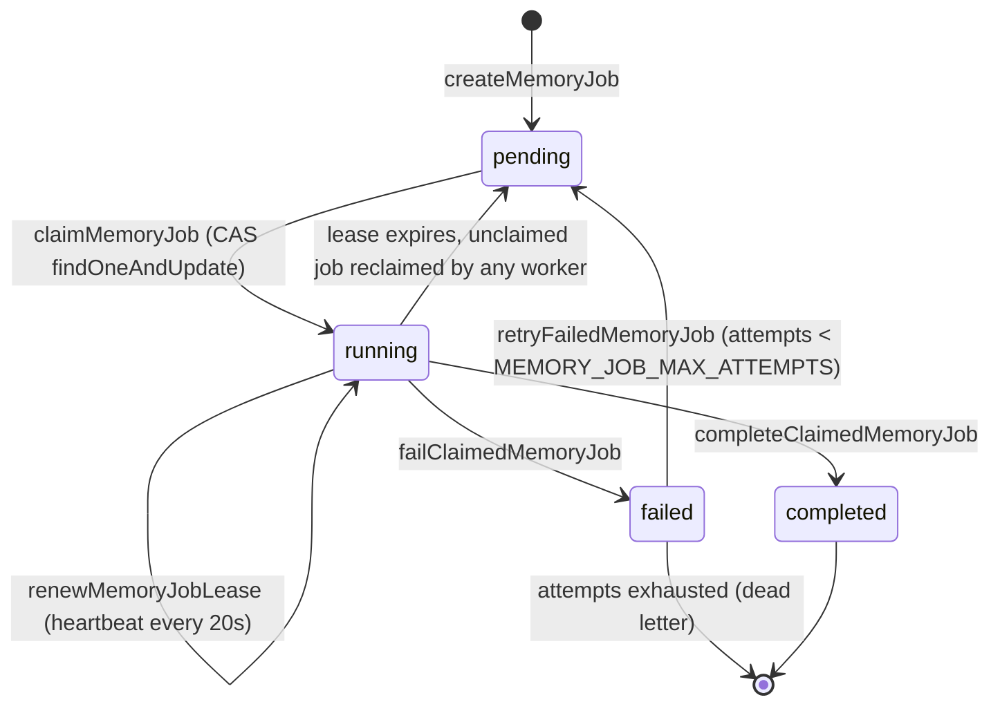

# Jobs, telemetry, and sync

Active contributors: Rom Iluz

The engine's background-enrichment pipeline (see [Architecture](../overview/architecture.md)) needs somewhere to run its work, something to invalidate stale reads when data changes underneath a running process, and a way to prove what happened after the fact. This page covers that machinery: the durable job queue that extraction and consolidation run on, the change-stream watcher that keeps caches honest, and the telemetry/analytics/accounting surfaces used for observability and cost tracking. See the [glossary](../overview/glossary.md) for short definitions of **job queue**, **change stream watcher**, and **idempotency fingerprint**.

## Key source files

| File | Role |
|---|---|
| `packages/memory-engine/src/mongodb-memory-jobs.ts` | Job queue primitives: create, claim (CAS lease), renew, complete, fail, retry, list |
| `packages/memory-engine/src/mongodb-manager-jobs.ts` | Worker loop: drains the queue, runs extraction jobs, schedules post-write derivations |
| `packages/memory-engine/src/mongodb-sync.ts` | File/session sync into `chunks`/`files` collections, transactional where possible |
| `packages/memory-engine/src/mongodb-change-stream.ts` | `MongoDBChangeStreamWatcher` — change-stream subscription with debounce, resume, and gap detection |
| `packages/memory-engine/src/mongodb-telemetry.ts` | Fire-and-forget telemetry emission and latency/cache/operation-distribution aggregations |
| `packages/memory-engine/src/mongodb-analytics.ts` | `getMemoryStats` — per-source file/chunk counts and sync freshness |
| `packages/memory-engine/src/mongodb-operation-accounting.ts` | `OperationRunContext` — per-run attempt/success/failure accounting for provider calls |
| `packages/memory-engine/src/mongodb-idempotency-fingerprint.ts` | `computeIdempotencyFingerprint` — canonical hash over every immutable field of an event write |
| `packages/memory-engine/src/mongodb-ops.ts` | `recordIngestRun`, `recordProjectionRun`, `getProjectionLag` — ingest/projection run ledger |
| `packages/memory-engine/src/mongodb-transactions.ts` | `MAJORITY_TRANSACTION_OPTIONS`, `isTransactionUnsupported`, `withTransactionBatched` |

## Key abstractions

| Abstraction | What it is | Where |
|---|---|---|
| Job lifecycle state | `pending → running → completed \| failed → (pending on retry)`, tracked per document in the `memory_jobs` collection | `mongodb-memory-jobs.ts` |
| Lease / lease fencing | A `leaseOwner` + `leaseToken` pair with a `leaseExpiresAt` deadline; every side-effecting stage inside a job re-checks the lease before writing | `mongodb-memory-jobs.ts` (`renewMemoryJobLease`), `mongodb-manager-jobs.ts` (`leaseFence`) |
| Worker drain loop | Claims up to `MEMONGO_JOB_WORKER_CONCURRENCY` jobs per round, prefetches session-batched LLM facts, then runs each claimed job | `mongodb-manager-jobs.ts` (`drainMemoryJobQueue`) |
| Change-stream watcher | Subscribes to the `chunks` collection, debounces bursts, and signals a full re-scan gap when a resume token goes stale or the stream is invalidated | `mongodb-change-stream.ts` (`MongoDBChangeStreamWatcher`) |
| Telemetry document | A fire-and-forget time-series record (`operation`, `durationMs`, `ok`, plus operation-specific fields) written to `memory_telemetry` | `mongodb-telemetry.ts` (`emitTelemetry`) |
| Ingest/projection run | A ledger entry recording one pass of a background pipeline (source, status, item counts, duration), used to compute projection lag | `mongodb-ops.ts` (`recordIngestRun`, `recordProjectionRun`, `getProjectionLag`) |
| Operation run context | Per-run accounting of attempted/succeeded/failed calls to LLM providers, keyed by operation + provider + model, with a frozen configuration hash for consistency checks | `mongodb-operation-accounting.ts` (`OperationRunContext`) |
| Idempotency fingerprint | SHA-256 over every immutable field of an event write (role, body, scope, timestamps, metadata, expiry), used to detect a retried write is identical to one already stored | `mongodb-idempotency-fingerprint.ts` |

## How it works: job lifecycle

Extraction jobs are created with a deterministic id (`extraction-<eventId>`), so scheduling the same event twice while a job is still pending or running is a no-op rather than a duplicate. `claimMemoryJob` uses a single `findOneAndUpdate` with an aggregation-pipeline update (`$$NOW`) so lease timestamps are server time, immune to cross-worker clock skew, and the CAS semantics make concurrent claiming across workers safe without an external lock.

A running job's lease expires after `MEMORY_JOB_LEASE_MS` (60s) unless renewed by a heartbeat every `MEMORY_JOB_HEARTBEAT_MS` (20s); an expired lease makes the job claimable again by any worker, which is how a crashed worker's job gets picked back up. A failed job is retried with exponential backoff (`memoryJobRetryDelayMs`: 1min, 4min, ... capped at 60min) until `MEMORY_JOB_MAX_ATTEMPTS` (3) is exhausted, after which it stays `failed` as an explicit dead letter rather than disappearing silently.

Inside a claimed job, `leaseFence()` in `packages/memory-engine/src/mongodb-manager-jobs.ts` is checked before every side-effecting stage (entity extraction, lane-availability write, derived-memory promotion, typed relation extraction), not just before the terminal write — a worker that lost its lease mid-job must not commit any of those writes, because a new owner will re-run the job from scratch. Event-receipt idempotency inside `promoteDerivedMemoryFromEvent` keeps that re-execution from duplicating side effects. What the extraction and consolidation jobs actually do to memory once claimed is covered in [Consolidation and novelty](consolidation-and-novelty.md) and [Structured memory and procedures](structured-memory-and-procedures.md); this page only covers the queue mechanics around them.

The worker loop (`drainMemoryJobQueue`) claims up to `MEMONGO_JOB_WORKER_CONCURRENCY` (default 3, max 16) jobs per round and runs them concurrently, after a read-only prefetch batches LLM fact extraction per session so events sharing a session don't each trigger their own provider call.

## Change streams and sync

`MongoDBChangeStreamWatcher` (`packages/memory-engine/src/mongodb-change-stream.ts`) watches the `chunks` collection for insert/update/replace/delete and calls back at most once per debounce window (default 1000ms), batching the changed paths. It requires a replica set — the same requirement as transactions — and degrades gracefully by simply not opening a stream on a standalone topology (`isChangeStreamNotSupported`). A stale or invalid resume token (codes 136/260/286, or a `ChangeStreamInvalidated` at 346) triggers `reopenFromNow`, which opens a fresh token-free stream and emits a `gap_detected` signal so the caller can trigger a full re-scan; re-open attempts are capped at 3 to avoid a crash loop, and the counter only resets once a real change event proves the new stream is alive.

`packages/memory-engine/src/mongodb-sync.ts` syncs on-disk memory files and session transcripts into the `chunks`/`files` collections. It hashes each file, only re-chunks files whose hash changed (or on `force`), and writes file metadata only after chunk writes succeed — a partial chunk-write failure keeps the old metadata hash so the next sync retries that file rather than silently treating it as synced.

## Transactions and standalone fallback

`MAJORITY_TRANSACTION_OPTIONS` (`packages/memory-engine/src/mongodb-transactions.ts`) sets `w: "majority"` with a 5000ms `wtimeoutMS` so a commit can't block indefinitely if a secondary is down. `isTransactionUnsupported` detects MongoDB error code 20 ("Transaction numbers are only allowed on a replica set member or mongos") — the standalone-topology case. Sync (`syncFileAtomically`, `syncSessionFileAtomically`) tries a transactional delete-then-upsert first; on `isTransactionUnsupported` it falls back to the same operations without a session and flips a `disableTransactions` flag so the rest of that sync run skips the transactional path instead of retrying it per file. `withTransactionBatched` separately handles `TransactionTooLargeForCache` (code 388) by halving the batch and retrying each half transactionally — a retry strategy, not a degrade, since every op still runs inside a transaction.

## Telemetry, analytics, and accounting

- **Telemetry** (`mongodb-telemetry.ts`): `emitTelemetry` fires an insert into `memory_telemetry` and swallows any error so observability writes never fail the caller. `getLatencyStats` uses server-side `$percentile` (MongoDB 7.0+) for p50/p95/p99; `getCacheHitRate` and `getOperationDistribution` aggregate over a rolling time window.
- **Ingest/projection runs** (`mongodb-ops.ts`): `recordIngestRun` and `recordProjectionRun` write ledger entries per background pass; `recordProjectionRun` also emits a telemetry document. `getProjectionLag` returns seconds since the last `status: "ok"` run of a given projection type, which is how staleness of a background pipeline (e.g. relation extraction) becomes an observable number instead of a guess.
- **Analytics** (`mongodb-analytics.ts`): `getMemoryStats` aggregates per-source file and chunk counts plus last-sync timestamps from the `files`/`chunks` collections — the dataset-shape view used by dashboards and readiness checks.
- **Operation accounting** (`mongodb-operation-accounting.ts`): `OperationRunContext` tracks attempted/succeeded/failed calls per provider operation (rerank, enrichment, extraction, judging) for one run, with a `configurationHash` that `assertOperationRunConfiguration` can check hasn't drifted mid-run. `instrumentOperationProvider` wraps an `EnrichmentProvider` so every `chatCompletion` call updates the run's accounting automatically. This is diagnostic/benchmark accounting (attempts, not cost), not the durable telemetry stream.
- **Idempotency fingerprint** (`mongodb-idempotency-fingerprint.ts`): `computeIdempotencyFingerprint` hashes every immutable field of an event write (role, body, resolved scope/scopeRef, timestamp, validAt, invalidAt, metadata, expiresAt) with recursively sorted keys, so a retried write with the same idempotency key but a genuinely different payload is detected as a fingerprint mismatch rather than silently accepted as a duplicate.

## Integration points

`apps/api`'s `/v1/jobs` routes and its `/ready` readiness check surface this machinery to operators — job status/list endpoints read from `mongodb-memory-jobs.ts`, and readiness checks report change-stream and transaction support alongside projection lag. See [apps/api](../apps/api/index.md) for the route-level detail, and [How to monitor](../how-to-monitor.md) for the operational view of the telemetry and analytics surfaces documented above.

## Entry points for modification

- **New job type**: add a case to the `MemoryJobType` union (`packages/memory-engine/src/types.ts`), then a runner analogous to `runClaimedBackgroundExtractionJob` in `packages/memory-engine/src/mongodb-manager-jobs.ts`.
- **Change lease/backoff timing**: `MEMORY_JOB_LEASE_MS`, `MEMORY_JOB_HEARTBEAT_MS` in `mongodb-manager-jobs.ts`; `MEMORY_JOB_MAX_ATTEMPTS`, `memoryJobRetryDelayMs` in `mongodb-memory-jobs.ts`.
- **New telemetry operation**: extend `TelemetryOperation` in `mongodb-telemetry.ts` and call `emitTelemetry` at the call site.
- **New projection type**: extend `ProjectionType` in `mongodb-ops.ts` and call `recordProjectionRun` from the pipeline that produces it.
- **Change stream target collection or debounce**: `MongoDBChangeStreamWatcher` constructor in `mongodb-change-stream.ts` takes the collection and `debounceMs` as parameters — callers decide what to watch.

## Related pages

- [Architecture](../overview/architecture.md) — background-enrichment pipeline diagram
- [Glossary](../overview/glossary.md) — job queue, change stream watcher, idempotency fingerprint definitions
- [Systems overview](index.md)
- [Consolidation and novelty](consolidation-and-novelty.md) — what consolidation jobs do once claimed
- [Structured memory and procedures](structured-memory-and-procedures.md) — what extraction jobs promote into
- [packages/memory-engine](../packages/memory-engine/index.md)
- [apps/api](../apps/api/index.md) — `/v1/jobs` routes, `/ready` readiness check
- [How to monitor](../how-to-monitor.md)
