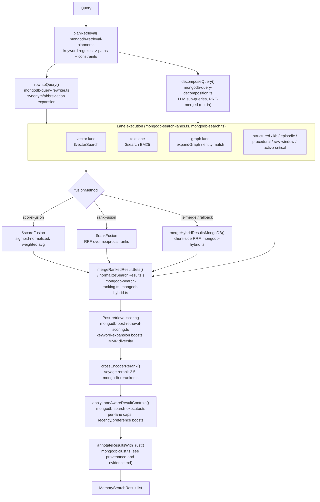
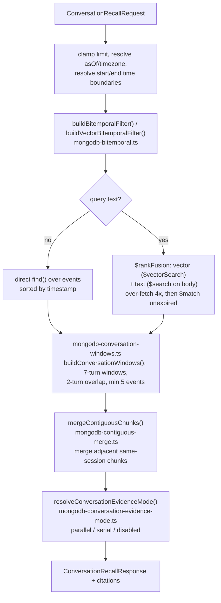

# Retrieval and search

Active contributors: Rom Iluz

This page covers how a search query becomes a ranked, trustworthy result set: query planning and rewriting, per-lane execution, fusion, reranking, and the conversation-recall path used for exact excerpt lookup. For the top-level request lifecycle (API -> bridge -> manager -> MongoDB), see [Architecture](../overview/architecture.md). Vocabulary (lane, hybrid search, fusion method, recall profile, reranker, trust score) is defined in the [Glossary](../overview/glossary.md) — this page does not redefine it.

Trust scoring and provenance are owned by [Provenance and evidence](provenance-and-evidence.md). Embedding generation and providers are owned by [Embeddings and providers](embeddings-and-providers.md). Graph lane internals (entity expansion, relation traversal) are owned by [Graph, episodes, and entities](graph-episodes-and-entities.md). Manager/package composition is covered in `packages/memory-engine/index.md`.

## Directory layout

All files live in `packages/memory-engine/src/`, one narrow concern per file:

| Area | Files |
|---|---|
| Legacy single-pass search + fusion primitives | `mongodb-search.ts` |
| Multi-lane orchestration (searchV2) | `mongodb-search-v2.ts` |
| Recipe/config resolution, plan passes, lane-aware controls | `mongodb-search-executor.ts` |
| Lane query builders (conversation, temporal-coverage, graph candidates) | `mongodb-search-lanes.ts` |
| Merge/dedupe/boost helpers, result normalization | `mongodb-search-ranking.ts` |
| RRF and cross-source score normalization | `mongodb-hybrid.ts` |
| Per-request cost ledger | `mongodb-search-budget.ts` |
| Temporal-coverage query detection | `mongodb-search-temporal.ts` |
| Query rewriting (synonym expansion) | `mongodb-query-rewriter.ts` |
| LLM query decomposition + RRF multi-query merge | `mongodb-query-decomposition.ts` |
| Intent classification and lane selection | `mongodb-retrieval-planner.ts` |
| Cross-encoder reranking (Voyage) | `mongodb-reranker.ts` |
| Post-fusion, pre-rerank score boosts | `mongodb-post-retrieval-scoring.ts` |
| Relevance monitoring (explain capture, regression sampling) | `mongodb-relevance.ts` |
| Per-agent lane availability tracking | `mongodb-lane-coverage.ts` |
| Concurrent-identical-query coalescing | `mongodb-single-flight.ts` |
| Result cache (exact + semantic tiers) | `mongodb-query-cache.ts`, `mongodb-query-cache-invalidation.ts` |
| Exact-excerpt conversation recall | `mongodb-conversation-recall.ts` |
| Session windowing for conversation recall | `mongodb-conversation-windows.ts` |
| Conversation evidence lane mode | `mongodb-conversation-evidence-mode.ts` |
| Adjacent-chunk merging | `mongodb-contiguous-merge.ts` |
| 3-tier episode summary generation | `mongodb-tiered-summary.ts` |
| Manager cache (per-agent, LRU-bounded) | `search-manager.ts` |
| Shared sort/serialization helper | `search-utils.ts` |

## Key abstractions

| Concept | Values | Where resolved |
|---|---|---|
| Fusion method | `scoreFusion` (native `$scoreFusion`, default), `rankFusion` (`$rankFusion`), `js-merge` (client-side RRF) | `MEMONGO_MONGODB_FUSION_METHOD`; dispatched in `mongoSearch()` in `packages/memory-engine/src/mongodb-search.ts` |
| Recall profile | `latency`, `balanced` (default), `proof` | `MEMONGO_MONGODB_RECALL_PROFILE`; `resolveProfileNumCandidates()` in `packages/memory-engine/src/mongodb-search-executor.ts` forces a `proof`-profile floor on `numCandidates` |
| Recipe | `fast`, `hybrid`, `deep`, `temporal`, `chain-of-thought` | `recipeDefaults()` in `packages/memory-engine/src/mongodb-search-executor.ts` seeds `maxPasses`, `hybridMode`, `sourcePreference` per recipe |
| Retrieval path (lane) | `active-critical`, `structured`, `raw-window`, `graph`, `hybrid`, `kb`, `episodic`, `procedural` | `RetrievalPath` in `packages/memory-engine/src/mongodb-retrieval-planner.ts` |
| Search mode | `direct`, `auto`, `agentic` | Controls how many query-rewrite/follow-up passes run |

## How it works: the pipeline

### Query planning and rewriting

`planRetrieval()` in `packages/memory-engine/src/mongodb-retrieval-planner.ts` classifies a raw query against pre-compiled word-boundary regex lists (structured, time, KB, episodic, active-critical keywords) and produces a `RetrievalPlan`: which `RetrievalPath`s to run, a confidence level, and hard/soft `RetrievalConstraints` (e.g. a time-range constraint from "yesterday", an entity constraint from a matched name). The plan always sees the **original** query — `rewriteQuery()` in `packages/memory-engine/src/mongodb-query-rewriter.ts` runs after planning and only affects the text sent to the lanes, using deterministic synonym/abbreviation expansion (`expandSynonyms()`) capped at 3x the original word count. LLM-based rewrite methods (`llm`, `hyde`) are declared in the type but throw if selected — only `synonym-expansion` is implemented.

`mongodb-query-decomposition.ts` is a separate, opt-in path (`MEMONGO_QUERY_DECOMPOSITION_MODE=enabled`) that asks an LLM to split a query into 2-4 sub-queries targeting different aspects (what the user owns, does, prefers), searches each, and merges results with the same RRF scheme as `mongodb-hybrid.ts` (`rrfScore()`, `1/(k+rank)`, `k=60`).

### Lane execution and fusion

Each lane in `mongodb-search-lanes.ts` builds its own MongoDB query (event filters, temporal-coverage session expansion, graph candidate queries, raw-window scoring). The vector+text hybrid lane is built and dispatched in `packages/memory-engine/src/mongodb-search.ts`'s `mongoSearch()`, which walks a fallback ladder driven by `fusionMethod` and detected server `capabilities`:

1. `scoreFusion` requested and supported -> `hybridSearchScoreFusion()`: single `$scoreFusion` aggregation with `vector`/`text` sub-pipelines, `normalization: "sigmoid"`, `combination.method: "avg"` over `{vector, text}` weights (default 0.7/0.3).
2. Falls back to `rankFusion` -> `hybridSearchRankFusion()`: single `$rankFusion` aggregation, same sub-pipelines, weighted reciprocal-rank combination (no sigmoid normalization step — the driver applies its own RRF).
3. Falls back to `js-merge` -> `hybridSearchJSFallback()`, which calls `mergeHybridResultsMongoDB()` in `mongodb-hybrid.ts`: runs vector and keyword searches separately, computes `rrfScore(rank)` per list scaled by `vectorWeight`/`textWeight`, sums scores for results in both lists, and normalizes against the theoretical maximum RRF sum.

An empty lane result is a valid answer, not a failure — `mongoSearch()` never re-runs the same query through the next ladder stage just because a stage returned zero results ("empty ≠ error", enforced by `mongodb-search-budget.ts`); only exceptions trigger the fallback to the next method. `MEMONGO_BENCHMARK_STRICT=1` (or `strictNoFallback`) disables the ladder entirely and throws instead of falling back, for benchmark reproducibility.

Non-hybrid lanes (structured, kb, episodic, procedural, raw-window, graph) each report a score on their own scale; `normalizeSearchResults()` in `mongodb-hybrid.ts` rescales by search method (`vector`/`structured`/`kb` clamp to `[0,1]`, `text` applies a BM25 sigmoid `score/(score+k)`, `hybrid` outputs are already normalized at the source and are only clamped) before `mergeRankedResultSets()` in `mongodb-search-ranking.ts` combines everything into one candidate list.

### Post-retrieval scoring, reranking, lane controls

`mongodb-post-retrieval-scoring.ts` applies ranking-only adjustments between fusion and the cross-encoder pass — keyword-expansion boosts (a domain table like `accessories -> case, pouch, battery, charger, strap, tripod`) and stop-word-aware term matching. It never retrieves new documents, only re-scores and re-sorts the existing candidate set. `applyMMRReranking()` in `mongodb-search-executor.ts` optionally diversifies results with Maximal Marginal Relevance, using a lambda tuned per `MemorySearchClassification` (0.3 for `family` queries needing spread, 0.7 for `direct`/`temporal`/`scoped` queries needing precision).

`crossEncoderRerank()` in `mongodb-reranker.ts` sends the top `topN` candidates above `minScore` to Voyage's `rerank-2.5` cross-encoder (routed to `ai.mongodb.com` for Atlas Model API keys, `api.voyageai.com` for direct Voyage keys). It splits input into candidates / overflow (above minScore, beyond topN) / below (under minScore), reranks only the candidates, and reassembles `[reranked, empty-snippet candidates, overflow, below]` so no result is ever dropped. Any error — network, non-OK status, bad JSON, out-of-bounds index — falls back to the pre-rerank order and logs a warning (or throws under `MEMONGO_RERANK_STRICT=1`); the reranker never crashes the pipeline.

`applyLaneAwareResultControls()` in `mongodb-search-executor.ts` runs last: it caps how many results one lane can contribute (so one dominant lane cannot crowd out others), applies recency/access-count boosts, and demotes stale session-summary provenance. Trust annotation (`annotateResultsWithTrust()`) then runs as the final step — see [Provenance and evidence](provenance-and-evidence.md) for the trust-score composite.

### Recall profiles and recipes

`recipeDefaults()` in `mongodb-search-executor.ts` seeds a full `SearchConfig` per named recipe (`fast`: 1 pass, vector-only, `numCandidates: 20`; `deep`/`chain-of-thought`: 3-4 passes, hybrid, `numCandidates: 200`). `resolveProfileNumCandidates()` layers the `recallProfile` on top: `proof` forces `numCandidates` up to at least `resolveNumCandidates(maxResults)` (an ANN-recall floor), regardless of what the recipe or caller requested, trading latency for recall completeness.

## Conversation recall: exact excerpts, not semantic search

Conversation recall answers "what did I say in the last conversation" — a request for exact, time-bounded excerpts — differently from the fused multi-lane search above. `recallConversation()` in `packages/memory-engine/src/mongodb-conversation-recall.ts` queries the events collection directly with `sessionId`/`role`/time-range filters and a bitemporal `asOf` cutoff (see [Temporal and bitemporal](temporal-and-bitemporal.md)), rather than routing through `planRetrieval()`/searchV2's lane fan-out.

Key differences from the main search pipeline:

- **Vector over-fetch for validity filtering**: before the serving vector index supports validity-field prefiltering, `resolveVectorFetchPlan()` over-fetches by `VECTOR_VALIDITY_OVERFETCH_FACTOR` (4x) so the post-`$vectorSearch` `$match` on bitemporal validity still leaves enough valid candidates to fill `limit`.
- **Windowing, not chunk-per-message**: `mongodb-conversation-windows.ts`'s `buildConversationWindows()` is a pure function that groups session events into overlapping windows (default 7 turns, 2-turn overlap, stride `windowSize - overlap`) so a recalled excerpt has surrounding context instead of a single isolated message. Sessions under 5 events produce no windows.
- **Contiguous merge**: `mergeContiguousChunks()` in `mongodb-contiguous-merge.ts` collapses consecutive same-session result chunks (adjacency = consecutive in the sorted-by-timestamp *returned* results, not necessarily consecutive turns) into one block, taking `max(scores)` and concatenating snippets, so recall does not return the same conversation fragmented into repeats.
- **Evidence mode**: `resolveConversationEvidenceMode()` reads `MEMONGO_CONVERSATION_EVIDENCE_MODE` (`parallel` default, `serial`, or `disabled`) — this controls whether the conversation-evidence lane runs alongside the main search fan-out or is turned off, and throws on an invalid value rather than silently defaulting.
- **Tiered summaries**: `mongodb-tiered-summary.ts` is a separate enrichment used by the episode summarizer (`packages/memory-engine/src/mongodb-episodes.ts`), not by recall itself — it wraps a base `EpisodeSummarizer` with an LLM call that produces `short_term`/`medium_term`/`long_term` summaries plus topic tags, falling back to the base summary on any parse or provider failure.

## Caching and deduplication

- **Single-flight** (`mongodb-single-flight.ts`): `runSingleFlight(owner, key, execute)` coalesces concurrent identical-key calls per owner (a manager instance) into one execution — same-tick callers share the leader's promise, including its rejection. It is not a cache: the entry is removed as soon as the leader settles, so sequential calls always re-execute.
- **Query cache** (`mongodb-query-cache.ts`): two-tier lookup keyed by a normalized-query hash plus a `keySuffix` fingerprint of resolved search parameters (maxResults, minScore, timeRange, fusion method, reranker config) so differently-configured requests for the same text never collide. Tier 1 is an exact hash match; tier 2 is a semantic probe (embeds the query server-side, capped at `SEMANTIC_PROBE_MAX_TIME_MS` = 1500ms) that only fires under the same `keySuffix`. TTL defaults: 300s for conversation scope, 3600s for KB scope; similarity threshold 0.95.
- **Invalidation** (`mongodb-query-cache-invalidation.ts`): `invalidateQueryCache()` deletes all cached entries for one `(agentId, scope, scopeRef)`. Because per-write eager invalidation drove hit rate toward zero under write load, `QueryCacheInvalidationCoalescer` debounces bursts (`QUERY_CACHE_INVALIDATION_DEBOUNCE_MS` = 250ms): the first write in a quiet namespace fires immediately (leading edge), repeats within the window coalesce into one trailing fire, bounding a continuous write stream to one invalidation per window.
- **Search budget** (`mongodb-search-budget.ts`): an `AsyncLocalStorage`-scoped per-request ledger (`DEFAULT_SEARCH_BUDGET`: 12 aggregations, 5 embeds) that every aggregation and every server-side `$vectorSearch` auto-embed consumes from. A recursive hybrid backstop re-entering `searchV2` shares the same budget instead of opening a new one. Exhaustion degrades the remaining lane to an empty result rather than throwing — the same "empty ≠ error" principle as the fusion fallback ladder.
- **Lane coverage** (`mongodb-lane-coverage.ts`): per-agent counters (`updateLaneCoverage()`, `getLaneCoverage()`) tracking which of the eight `RetrievalPath`s have ever produced data, so `planRetrieval()` can skip lanes known to be empty for an agent instead of querying them speculatively every time.

## Relevance monitoring

`mongodb-relevance.ts` is a separate concern from ranking: it captures `explain()` output from search aggregations (`searchExplain`, `vectorExplain`, `fusionExplain`, `scoreDetails` artifact types), samples runs at a configurable rate, and persists run/regression records (`relevanceRunsCollection`, `relevanceRegressionsCollection`, `relevanceArtifactsCollection` in `packages/memory-engine/src/mongodb-schema.ts`) used to detect relevance regressions over time — it does not affect the score of any individual search.

## Integration points and entry points for modification

- **Manager composition**: `packages/memory-engine/src/mongodb-manager.ts` mixes in the search surface; `search-manager.ts` caches one `MongoDBMemoryManager` per agent (LRU-bounded when `MEMONGO_SHARED_CLIENT` is on) so repeated searches for the same agent reuse the same client, budget context, and caches. See `packages/memory-engine/index.md`.
- **To add a new lane**: add a `RetrievalPath` variant in `mongodb-retrieval-planner.ts`, a query builder in `mongodb-search-lanes.ts`, a branch in `searchV2()` (`mongodb-search-v2.ts`) to execute and merge it, and register it in `mongodb-lane-coverage.ts`'s `ALL_LANES`.
- **To add a fusion method**: extend `MemoryMongoDBFusionMethod` in `@memongo/lib`, add a branch to the `mongoSearch()` ladder in `mongodb-search.ts`, and add a corresponding normalizer in `mongodb-hybrid.ts`'s `getNormalizer()`.
- **To change reranking**: `mongodb-reranker.ts`'s `RerankConfig` (model, topN, minScore, recency/access/temporal-proximity boost weights) is resolved per request and threaded through `crossEncoderRerank()`; changing the model or boost weights does not require touching the fusion or lane code.
- **To change recall behavior for a recipe**: edit `recipeDefaults()` in `mongodb-search-executor.ts` — this is the single seed point for `maxPasses`, `hybridMode`, `numCandidates`, and `sourcePreference` per named recipe.
- Related: [Memory taxonomy](../features/memory-taxonomy.md) for how conversation/structured/procedural/graph memory types map onto `sourcePreference`; [Context bundles and state](../features/context-bundles-and-state.md) for how search results feed into token-budgeted context assembly; [Systems overview](index.md) for how this subsystem relates to the rest of the engine.

## Key source files

| File | Role |
|---|---|
| `packages/memory-engine/src/mongodb-search.ts` | Fusion pipeline builders (`hybridSearchScoreFusion`, `hybridSearchRankFusion`, `hybridSearchJSFallback`), `mongoSearch()` dispatcher/fallback ladder |
| `packages/memory-engine/src/mongodb-search-v2.ts` | `searchV2()` multi-lane orchestration entry point |
| `packages/memory-engine/src/mongodb-search-executor.ts` | Recipe/recall-profile config resolution, plan passes, MMR, lane-aware result controls |
| `packages/memory-engine/src/mongodb-search-lanes.ts` | Per-lane query builders (conversation, temporal-coverage, graph candidates, raw-window scoring) |
| `packages/memory-engine/src/mongodb-search-ranking.ts` | Merge/dedupe/boost helpers, request normalization, reranking helpers |
| `packages/memory-engine/src/mongodb-hybrid.ts` | `rrfScore()`, `normalizeSearchResults()`, `mergeHybridResultsMongoDB()`, OR-join FTS query builder |
| `packages/memory-engine/src/mongodb-search-budget.ts` | Per-request aggregation/embed cost ledger |
| `packages/memory-engine/src/mongodb-search-temporal.ts` | Temporal-coverage query detection and term extraction |
| `packages/memory-engine/src/mongodb-query-rewriter.ts` | Deterministic synonym/abbreviation query expansion |
| `packages/memory-engine/src/mongodb-query-decomposition.ts` | LLM query decomposition + RRF multi-query merge |
| `packages/memory-engine/src/mongodb-retrieval-planner.ts` | Query classification, lane selection, constraint extraction |
| `packages/memory-engine/src/mongodb-reranker.ts` | Voyage `rerank-2.5` cross-encoder pass |
| `packages/memory-engine/src/mongodb-post-retrieval-scoring.ts` | Keyword-expansion boosts between fusion and reranking |
| `packages/memory-engine/src/mongodb-relevance.ts` | Explain capture, sampling, regression tracking |
| `packages/memory-engine/src/mongodb-lane-coverage.ts` | Per-agent lane data-availability tracking |
| `packages/memory-engine/src/mongodb-single-flight.ts` | Concurrent identical-search coalescing |
| `packages/memory-engine/src/mongodb-query-cache.ts` | Exact + semantic two-tier result cache |
| `packages/memory-engine/src/mongodb-query-cache-invalidation.ts` | Immediate delete + burst-debounced cache invalidation |
| `packages/memory-engine/src/mongodb-conversation-recall.ts` | Exact-excerpt recall over the events collection |
| `packages/memory-engine/src/mongodb-conversation-windows.ts` | Overlapping session windowing for recall |
| `packages/memory-engine/src/mongodb-conversation-evidence-mode.ts` | Conversation evidence lane mode resolution |
| `packages/memory-engine/src/mongodb-contiguous-merge.ts` | Adjacent same-session chunk merging |
| `packages/memory-engine/src/mongodb-tiered-summary.ts` | 3-tier LLM episode summary generation |
| `packages/memory-engine/src/search-manager.ts` | Per-agent manager cache (LRU-bounded) |
| `packages/memory-engine/src/search-utils.ts` | Deterministic object-key sorting for cache/signature hashing |
