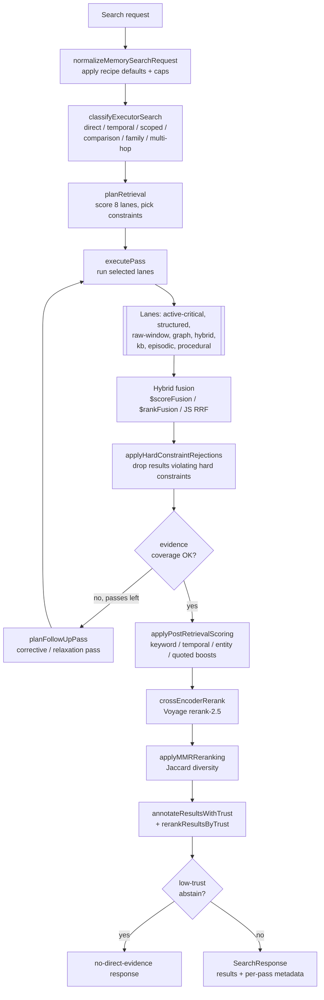

# Retrieval pipeline

The retrieval pipeline turns a natural-language query into a ranked, trust-annotated result set. It plans across eight retrieval lanes, executes them against MongoDB Atlas Search / Vector Search, fuses the streams, then applies layered re-scoring: post-retrieval boosts, a Voyage cross-encoder rerank, MMR diversification, and trust ranking. The whole flow lives in `packages/memory-engine/src/` and is orchestrated by `executeMongoSearchPlan` (`packages/memory-engine/src/mongodb-search-executor.ts:1586`).

## Full query-to-result path

## Stage 1 — Planning (8 lanes)

`planRetrieval` (`packages/memory-engine/src/mongodb-retrieval-planner.ts:814`) scores each lane with word-boundary keyword regexes, explicit intent scopes, and lane-coverage freshness, then sorts lanes by score with a deterministic priority tie-break.

The eight lanes (`RetrievalPath` union):

| Lane | Reads | Trigger signals |
|------|-------|-----------------|
| `active-critical` | Current critical/high-salience structured memory | "right now", "blocker", "status", active scope |
| `structured` | Structured memories (facts, preferences, decisions, todos) | "prefer", "decision", "remember that", structured scope |
| `raw-window` | Raw conversation events in a time window | "today", "yesterday", "last week", time range |
| `graph` | Entity/relation traversal (`$graphLookup`) | known entity names, "who", "relationship" |
| `hybrid` | Vector + Atlas Search over chunks (backstop, always +1) | conversation-evidence phrases, comparison/family queries |
| `kb` | Knowledge-base documents and chunks | "docs", "how to", reference scope |
| `episodic` | Episode summaries | "summarize", "recap", "what happened" |
| `procedural` | Stored procedures/runbooks | "workflow", "runbook", "steps", procedural scope |

Planning details:

- **Intent classification** — `classifyRetrievalQuery` (`packages/memory-engine/src/mongodb-retrieval-planner.ts:1072`) buckets the query into `direct`, `temporal`, `scoped`, `comparison`, `family`, or `multi-hop`. The classification steers lane boosts (e.g. multi-hop boosts `graph` and `episodic`) and later controls the MMR lambda and stop conditions.
- **Constraints** — hard constraints (time range presets, structured type, KB source/category, entity names) are extracted alongside scores and enforced after execution by `applyHardConstraintRejections` (`packages/memory-engine/src/mongodb-search-executor.ts:739`). Presets resolve through `resolveTimeRangePreset` (`packages/memory-engine/src/mongodb-retrieval-planner.ts:312`).
- **Temporal windows** — `extractTemporalWindow` (`packages/memory-engine/src/mongodb-retrieval-planner.ts:447`) parses dates, months, years, and relative phrases ("this week", "last month") into an origin + decay scale that feeds the Atlas Search `near` operator in conversation recall.
- **Lane skipping** — lanes with no data (per `laneCoverage`) are excluded and reported in `skippedLanes`; `hybrid`, `raw-window`, and `kb` are never skipped. Stale lanes (untouched for 7+ days) are deprioritized for freshness-sensitive queries.
- **Multi-pass** — `normalizeMemorySearchRequest` caps passes by mode (`direct`: 1, `auto`: 2, `agentic`: 3, hard max 4). `planFollowUpPass` schedules additional passes, and CRAG-style corrective passes widen time ranges or relax exact-evidence requirements when coverage is poor.

## Stage 2 — Lane execution and hybrid fusion

Search primitives live in `packages/memory-engine/src/mongodb-search.ts`:

- **`vectorSearch`** (`packages/memory-engine/src/mongodb-search.ts:620`) — `$vectorSearch` with `numCandidates` resolved by `resolveNumCandidates` (`packages/memory-engine/src/mongodb-retrieval-planner.ts:1126`): a discrete table (limit 5/10/20/30 → 200/200/400/600) with a 20x-limit, 200-floor rule, capped by `MONGODB_MAX_NUM_CANDIDATES` (10,000).
- **`keywordSearch`** (`packages/memory-engine/src/mongodb-search.ts:707`) — Atlas Search `$search` with a compound query; quoted phrases become `phrase` clauses, remaining tokens become `text` should-clauses.
- **`hybridSearchScoreFusion`** (`packages/memory-engine/src/mongodb-search.ts:796`) — MongoDB 8.3+ `$scoreFusion` with sigmoid normalization and configurable vector/text weights.
- **`hybridSearchRankFusion`** (`packages/memory-engine/src/mongodb-search.ts:929`) — MongoDB 8.0+ `$rankFusion`, with output divided by `sum(weights)/61` at the source so scores land in ~[0,1].
- **`hybridSearchJSFallback`** (`packages/memory-engine/src/mongodb-search.ts:1057`) — application-side merge via `mergeHybridResultsMongoDB` (`packages/memory-engine/src/mongodb-hybrid.ts:138`), which implements Reciprocal Rank Fusion (`1/(k+rank)`, k=60) with optional vector/text weights so the fallback matches server-side fusion ranking.

The hybrid module also fixes two upstream bugs: `buildOrJoinFtsQuery` (`packages/memory-engine/src/mongodb-hybrid.ts:33`) OR-joins FTS tokens instead of AND-joining (recall ~95% vs ~40%), and `normalizeSearchResults` maps each method's raw score scale onto [0,1] (BM25 via `score/(score+5)`, vector via clamp). Results merge by canonical identity (`canonicalId` or `event:{id}` derived from the path), preserving provenance, trust, and source-event metadata from both streams.

## Stage 3 — Post-retrieval scoring

`applyPostRetrievalScoring` (`packages/memory-engine/src/mongodb-post-retrieval-scoring.ts:336`) re-scores the fused candidate set without retrieving new documents. Four additive boosts, each proportional to the original score:

| Boost | Default weight | Signal |
|-------|---------------|--------|
| `keywordOverlapBoost` | 0.3 | Non-stop-word query keywords found in the snippet, with a small synonym expansion table |
| `temporalProximityBoost` | 0.4 max | Linear falloff between question date and result timestamp inside a detected window ("a week ago" → 7 days) |
| `entityNameBoost` | 0.4 | Capitalized proper nouns from the query appearing in the snippet |
| `quotedPhraseBoost` | 0.6 | Exact double-quoted phrases appearing in the snippet |

## Stage 4 — Cross-encoder reranking

`crossEncoderRerank` (`packages/memory-engine/src/mongodb-reranker.ts:67`) sends the top candidates to the Voyage `rerank-2.5` (or `rerank-2.5-lite`) API:

- Candidates are split into three buckets: top-N above `minScore` go to the reranker, overflow keeps its order, and below-threshold results trail.
- Candidates with empty snippets (possible from graph relations) are excluded from the API call but preserved.
- The endpoint auto-routes by API key prefix: `al-` (Atlas) to `ai.mongodb.com/v1/rerank`, `pa-` (direct) to `api.voyageai.com`. A 2-second timeout bounds latency.
- Any error falls back to input order and never crashes the pipeline; `MEMONGO_RERANK_STRICT=1` (or benchmark strict mode) turns failures into throws instead.
- Rerank latency and outcomes are emitted to telemetry (`emitTelemetry`).

## Stage 5 — MMR diversification and trust

- **MMR** — `applyMMRReranking` (`packages/memory-engine/src/mongodb-search-executor.ts:1116`) greedily re-orders results using `lambda * score - (1-lambda) * maxJaccardSimilarity` on snippet token sets, so near-duplicate snippets are pushed down. The `classification-mmr` ablation flag disables it for benchmarks.
- **Contiguous merge** — `mergeContiguousChunks` (`packages/memory-engine/src/mongodb-contiguous-merge.ts:24`) merges same-session event chunks into single blocks (max score, concatenated snippets) so one conversation does not crowd the result set.
- **Trust** — results are annotated with 7-dimension trust metadata and re-ranked by `rerankResultsByTrust`; `shouldAbstainForLowTrust` can convert a weak result set into an explicit no-direct-evidence response rather than returning untrustworthy hits. See [Trust scoring](../features/trust-scoring.md).

## Stage 6 — Context assembly

Two consumers sit on top of the pipeline:

- **Context bundle** — `packages/memory-engine/src/mongodb-context-bundle.ts` assembles a token-budgeted bundle (default 450 tokens, clamped to [128, 4000]) with sections: `active-slate`, `query-evidence`, `summary`, `recent-events`, `discovery-projection`, and `profile`. The active slate itself is hydrated by `packages/memory-engine/src/mongodb-active-slate.ts`, which ranks current critical/high-salience structured memories and procedures (max 6 items, salience-first ordering with active-context projections preferred).
- **Context expansion** — `expandSearchContext` (`packages/memory-engine/src/mongodb-context-expansion.ts:30`) fetches timestamp neighbors (N-1, N+1 by default) of event hits from the same session, scored at `parentScore * 0.95`, always inside the caller's authorized scope.

## Manager caching

`getMemorySearchManager` (`packages/memory-engine/src/search-manager.ts`) caches one `MongoDBMemoryManager` per agent+config cache key, dedupes concurrent initialization with an in-flight promise map, and — when the shared-client runtime is enabled — bounds the cache with LRU eviction (default 50 managers, 10-minute idle TTL). A close-generation counter prevents managers that finish initializing during shutdown from leaking into the cache.

## Key files

| File | Role |
|------|------|
| `packages/memory-engine/src/mongodb-retrieval-planner.ts` | 8-lane planning, intent classification, temporal windows, `numCandidates` table |
| `packages/memory-engine/src/mongodb-search-executor.ts` | Multi-pass orchestration, hard-constraint rejection, follow-up/corrective passes, MMR, lane-aware caps |
| `packages/memory-engine/src/mongodb-search.ts` | `$vectorSearch`, `$search`, `$scoreFusion`, `$rankFusion` pipeline builders and execution |
| `packages/memory-engine/src/mongodb-hybrid.ts` | OR-join FTS, JS RRF fallback, cross-method score normalization |
| `packages/memory-engine/src/mongodb-reranker.ts` | Voyage cross-encoder rerank with graceful fallback |
| `packages/memory-engine/src/mongodb-post-retrieval-scoring.ts` | Keyword/temporal/entity/quoted-phrase boosts |
| `packages/memory-engine/src/mongodb-context-bundle.ts` | Token-budgeted context bundle assembly |
| `packages/memory-engine/src/mongodb-context-expansion.ts` | Same-session neighbor expansion |
| `packages/memory-engine/src/mongodb-active-slate.ts` | Active-critical slate hydration |
| `packages/memory-engine/src/mongodb-contiguous-merge.ts` | Same-session chunk merging |
| `packages/memory-engine/src/search-manager.ts` | Manager cache, init dedup, LRU eviction |

## Related pages

- [Systems overview](index.md)
- [Memory model](memory-model.md) — what each lane reads
- [Trust scoring](../features/trust-scoring.md) — final-stage ranking signal
- [Knowledge base](../features/knowledge-base.md) — the `kb` lane's data source
- [Core engine package](../packages/memory-engine/index.md)
