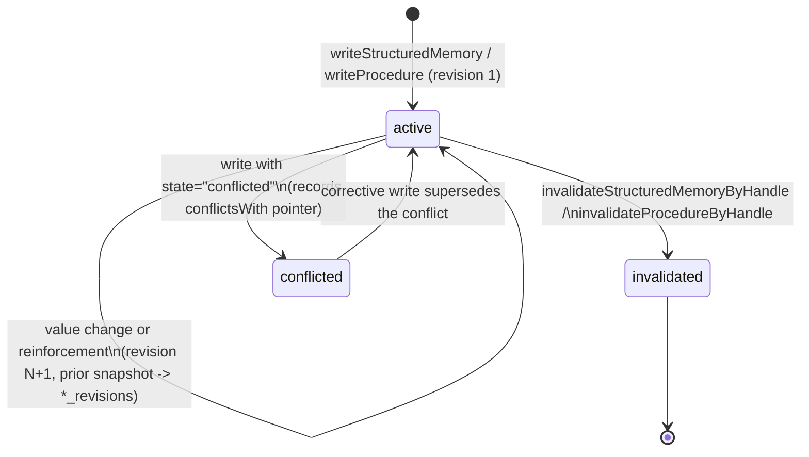

# Structured memory and procedures

Active contributors: Rom Iluz

Structured memory and procedures are the two "typed fact" families in Memongo's memory model, distinct from the raw, append-only [conversation event](../overview/glossary.md) log. Both are addressed through the [stable handle](../overview/glossary.md) pattern and share the same active/invalidated/conflicted lifecycle and revision-history mechanics, implemented independently in their own files because their record shapes and search paths differ.

## Key source files

| File | Role |
|---|---|
| `packages/memory-engine/src/mongodb-structured-memory.ts` | `type + key` facts: write, lifecycle (get/update/invalidate/feedback/history), search |
| `packages/memory-engine/src/mongodb-procedures.ts` | Stored playbooks: write, lifecycle, evolution, outcome tracking, exact-match + hybrid search |
| `packages/memory-engine/src/mongodb-self-edit.ts` | Agent self-editing of its own identity/config blocks, built on top of structured memory |

## Structured facts vs. procedures

A **structured memory** entry (`StructuredMemoryEntry` in `packages/memory-engine/src/mongodb-structured-memory.ts:158`) is a single typed fact identified by `type + key` (e.g. `preference:core:user`, `decision:2024-q3-migration`). It carries a `value`, salience, temporal scope, confidence, and provenance, and is the record family used for both derived facts (extracted from conversation) and self-edited agent identity blocks.

A **procedure** (`ProcedureEntry` in `packages/memory-engine/src/mongodb-procedures.ts:80`) is a reusable multi-step action pattern: a `name`, `intentTags`, `triggerQueries`, an ordered `steps` array, and `successSignals`. Procedures track outcome counters (`successCount`/`failCount`, `lastSuccessAt`/`lastFailureAt` via `recordProcedureOutcome` at `packages/memory-engine/src/mongodb-procedures.ts:1133`) and an `evolutionHistory` of prior step revisions (`evolveProcedure` at `packages/memory-engine/src/mongodb-procedures.ts:1260`), because a procedure's value comes from being refined over repeated use, not just superseded like a fact.

Both families store a parallel `*_revisions` collection (`structured_mem_revisions`, `procedure_revisions`) via `packages/memory-engine/src/mongodb-schema-collections.ts`, and both go through the same optimistic-concurrency write pattern.

## The stable-handle addressing pattern, applied

The [stable handle](../overview/glossary.md) (`family`, `id`, `agentId`, `scope`, `scopeRef`, `revision`, `state`) is how a caller re-references a specific structured memory or procedure across lifecycle calls without racing another writer. Concretely:

- `MemoryStructuredStableHandle` and `MemoryProcedureStableHandle` (`packages/memory-engine/src/types.ts`) pin `agentId`, `scope`, `scopeRef`, and the family-specific identity (`type` + `key` for structured memory, `procedureId` for procedures), plus the `revision` and `state` last observed by the caller.
- Every lifecycle function derives a MongoDB filter from the handle (`structuredFilterFromHandle` at `packages/memory-engine/src/mongodb-structured-memory.ts:632`) and re-validates freshness against the current document (`enforceStructuredHandleFreshness`) before applying an update.
- A handle whose `revision` no longer matches the current document raises a permanent `MemoryLifecycleConflictError` (`packages/memory-engine/src/mongodb-structured-memory.ts:83`) — the caller read a stale snapshot and must re-fetch, not retry blindly.
- A handle that targets an already-`invalidated` record is rejected the same way for update calls (`rejectInvalidated: true` in `updateStructuredMemoryByHandle` at `packages/memory-engine/src/mongodb-structured-memory.ts:1322`), but invalidation itself is idempotent against an already-invalidated record.

This is distinct from the *transient* `StructuredMemoryRevisionConflictError` (`packages/memory-engine/src/mongodb-structured-memory.ts:66`), which fires when two writers race between read and write at the same revision; it carries the driver's `TransientTransactionError` label so `withTransaction` retries the whole callback, and sessionless callers retry internally via `withRevisionCasRetry` (`packages/memory-engine/src/mongodb-structured-memory.ts:126`, capped at `MAX_REVISION_CAS_ATTEMPTS = 3`).

## Lifecycle transitions

Every state-changing write inserts a snapshot of the pre-update document into the revisions collection first (`insertRevisionSnapshot`, tolerant of a duplicate `_id` from a retried CAS attempt — see `packages/memory-engine/src/mongodb-structured-memory.ts:604`), then applies the update with `revision: currentRevision` as the compare-and-swap filter. This means the revisions collection is a strict append-only ledger of everything a record used to be, and `getStructuredMemoryHistoryByHandle` (`packages/memory-engine/src/mongodb-structured-memory.ts:1613`) / `getProcedureHistoryByHandle` reconstruct the full timeline by merging the revisions collection with the current document.

A same-value re-mention (e.g. the same fact extracted again from a new event) is treated as **reinforcement**, not a value change: it bumps `reinforcementCount` and `lastConfirmedAt` in place without opening a new revision, keeping the revision history meaningful (`hasStructuredValueChanged` at `packages/memory-engine/src/mongodb-structured-memory.ts:400`). A genuine value change opens a new bitemporal validity window — see [Temporal and bitemporal](temporal-and-bitemporal.md) for how `validFrom`/`validTo` interact with revision boundaries.

`conflicted` is a state a write can set explicitly (carrying a `conflictsWith` pointer to the record it disagrees with) rather than a state the engine infers automatically; downstream consumers (consolidation, trust scoring) use it as a signal — see [Consolidation and novelty](consolidation-and-novelty.md) and [Provenance and evidence](provenance-and-evidence.md).

## Self-edit

`packages/memory-engine/src/mongodb-self-edit.ts` lets an agent directly rewrite its own core memory blocks — `user` (preferences), `persona` (identity), and `instructions` (task instructions) — by mapping each block to a fixed structured-memory `type:key` pair (`BLOCK_MAP`, e.g. `persona -> identity:core:persona`) and calling `writeStructuredMemory` underneath. `replace`/`append`/`prepend` actions are supported; append/prepend read-modify-write inside a transaction when a `MongoClient` is available, so a concurrent self-edit cannot silently drop the other's content.

Because `persona` and `instructions` define the agent's own behavior, `selfEditBlock` screens the FINAL merged value (not just the incoming delta, so an injection cannot be smuggled in across several small append calls) through `classifyInjection` before persisting, and throws `SelfEditRejectedError` on an injection-shaped match. `user` (preferences) is ordinary user data and is not screened. See `security.md` for `mongodb-injection-classifier.ts` itself.

## Search

Both families expose a hybrid search path (`searchStructuredMemory` at `packages/memory-engine/src/mongodb-structured-memory.ts:1747`, `searchProcedures` at `packages/memory-engine/src/mongodb-procedures.ts:1511`) that follows the same vector/text fusion mechanics as the rest of the engine — see [Retrieval and search](retrieval-and-search.md). Procedures additionally support `findExactProcedureMatches` (`packages/memory-engine/src/mongodb-procedures.ts:1429`), a case-insensitive exact match against a procedure's `name` or `triggerQueries`, used to short-circuit to a known playbook before falling back to fuzzy hybrid search.
