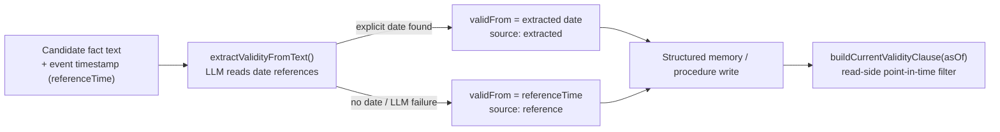

# Temporal and bitemporal

Active contributors: Rom Iluz

Memongo tracks two independent clocks for every fact: when it was true in the world (valid-time) and when Memongo learned it (transaction-time). Keeping them separate is what "bitemporal" means in this codebase — see [Glossary](../overview/glossary.md) for the one-line definition. This page covers the bitemporal filter, valid-time extraction from text, and bulk conversation-history import, which reuses the same valid-time machinery to backfill history that was recorded long after it happened.

## Key source files

| File | Role |
|---|---|
| `packages/memory-engine/src/mongodb-bitemporal.ts` | The `validAt`/`invalidAt` filter every retrieval path composes to enforce point-in-time correctness |
| `packages/memory-engine/src/mongodb-temporal.ts` | The `validFrom`/`validTo` window clause used by structured memory, procedures, and graph relations, plus TTL expiration helpers |
| `packages/memory-engine/src/mongodb-temporal-extraction.ts` | LLM extraction of a fact's valid-time window from its own text |
| `packages/memory-engine/src/mongodb-conversation-import.ts` | Replays a conversation dataset into Memongo as historical events |
| `packages/memory-engine/src/mongodb-conversation-dataset.ts` | Loads and validates `.json`/`.jsonl` conversation dataset files |

## Two temporal filter shapes, one invariant

Memongo actually has two parallel implementations of the same idea, covering different collections:

- **`mongodb-bitemporal.ts`** — `buildBitemporalFilter(queryTime)` enforces `validAt <= queryTime AND (invalidAt IS NULL OR invalidAt > queryTime)` on documents that use `validAt`/`invalidAt` fields. A vector-search variant, `buildVectorBitemporalFilter()`, omits the `invalidAt: null` branch because Atlas Vector Search prefilters don't document BSON `null` as a supported filter value — canonical writes represent an open validity window by omitting the field entirely rather than setting it to `null`. `isMemoryValidAt()` is a pure-function mirror of the same predicate for unit and property tests, kept in the same file so the MongoDB filter and the TypeScript predicate cannot drift apart.
- **`mongodb-temporal.ts`** — `buildCurrentValidityClause(asOf)` enforces the equivalent window using `validFrom`/`validTo` fields, the naming used by structured memory, procedures, and graph relations (see [Structured memory and procedures](structured-memory-and-procedures.md) and [Graph, episodes, and entities](graph-episodes-and-entities.md)). It composes with `buildLiveStateClause()` (filters by lifecycle `state`, e.g. excluding `invalidated`) and `mergeQueryClauses()` (flattens multiple `$and` clauses into one) to build the full read-side predicate.

Both treat a missing valid-time field as legacy data that reads as valid — retrieval must stay monotonic across the migration that introduced these fields, so a pre-migration document is never silently hidden.

`mongodb-temporal.ts` also owns `buildUnexpiredClause()`, the read-side guard for the optional per-write TTL: since MongoDB's TTL background sweep runs only about every 60 seconds, an expired document can still be physically present and must be excluded from every read explicitly rather than relying on the sweep's timing.

## Extracting valid-time from text

The write path historically stamped `validFrom = new Date()` — the moment of ingestion — which is wrong whenever a conversation is imported or replayed after the fact: an "as of T" query would then believe a fact only became true when Memongo happened to read it, not when it was actually said.

`extractValidityFromText()` (`packages/memory-engine/src/mongodb-temporal-extraction.ts`) fixes this by asking the LLM to read the fact's own text for date references ("since 2021", "until last March") and resolve them against a `referenceTime` — the source event's own timestamp, not the write clock:

- If the text gives an explicit start date, `validFrom` is that date and `source: "extracted"`.
- If the text gives no date, `validFrom` falls back explicitly to `referenceTime` and `source: "reference"` — never silently to the write clock.
- An extracted `validTo` that precedes `validFrom` is dropped as an impossible window.
- Any LLM failure or malformed JSON degrades to the reference-time fallback; the function never throws.

`refineCandidatesValidTime()` applies this per-candidate for up to `DEFAULT_MAX_EXTRACTIONS` (12) candidates from one event — each fact in an event can carry a different validity window, so extraction is per-candidate rather than per-event, and it fans out one LLM call per candidate up to the cap. Beyond the cap, remaining candidates keep the event-time baseline (`validTimeSource: "event"`) rather than skipping temporal tagging entirely. This is the function [Consolidation and novelty](consolidation-and-novelty.md#derived-memory-promoting-raw-events) calls before writing a promoted candidate, so promoted facts carry accurate valid-time even when consolidation runs long after the underlying conversation happened.

## Bulk conversation import

`packages/memory-engine/src/mongodb-conversation-dataset.ts` loads a `.json`/`.jsonl` dataset file (`loadConversationDataset()`), validating each turn's `role` against the four allowed values and rejecting conversations with no valid turns. `resolveConversationDatasetPath()` guards against path traversal and restricts loading to an allow-listed root directory when one is configured.

`packages/memory-engine/src/mongodb-conversation-import.ts` replays a loaded dataset as conversation events via `importConversationDataset()`:

- Each turn gets a deterministic idempotency key (`buildReplayIdempotencyKey()`) derived from the dataset path, tenant scope, turn ordinal, role, body, and timestamp — re-running the same import reproduces the same keys instead of duplicating events, and a content change under an existing key surfaces as an idempotency conflict rather than a silent wrong replay.
- Turns are written in batches of up to `IMPORT_WRITE_BATCH_SIZE` (500), matching the cap the `/v1/write-events` route enforces, so an import never submits a batch the canonical write API would reject.
- A per-turn `timestamp` in the dataset (when present) becomes the event's own timestamp rather than the import's wall-clock time — this is what lets the temporal-extraction machinery above anchor valid-time to when the conversation actually happened, not when it was imported.

This is the path used to bulk-load prior chat history into Memongo — for example seeding an agent's memory from an export of a previous conversation tool — while preserving the original timeline for point-in-time queries.
